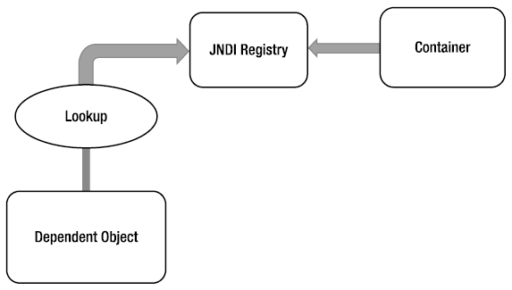
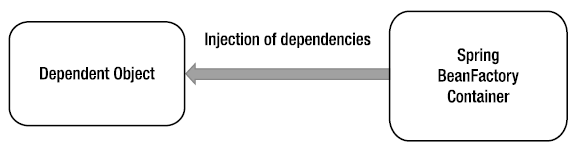

第3章 Spring中的IoC和DI
=
在第2章中我们涉及了反转控制（IoC）和依赖注入（DI）的基本原理。虽然这两个概念在使用的时候经常可以互换，但实际上DI是IoC的一种特殊形式。本章我们会更详细的讨论它们的细节，细化它们之间的关系并通过图片分析Spring是如何使用它们的大量细节。

在定义和分析Spring中这两个概念的关系之后，我们将探讨依赖注入在Spring中的实现，这个概念至关重要。本章只涉及Spring中DI实现的基础知识，更高级的依赖注入特性将在第4章中讨论。更具体地说，本章涵盖了以下主题。

- 反转控制概念：这部分我们会讨论几种类型的IoC，包括依赖注入和依赖查找。并且介绍了IoC的不同方式之间的差异及优缺点。
- Spring中的反转控制：本节着眼于Spring中IoC的功能以及它们是如何实现的。特别是你还会看到Spring提供的依赖注入方式，包括构造器、setter和方法注入。
- Spring的依赖注入：本节介绍Spring的IoC容器的实现。出于Bean定义和依赖注入需要，BeanFactory接口作为与应用程序进行交互的主要接口。但在本章中除了开始的几个例子以外的剩余示例代码，重点会使用Spring提供的ApplicationContext接口，这是一个BeanFactory的子接口，提供了更强大的功能。在后面的部分中我们会分析BeanFactory和ApplicationContext之间的区别。
- 配置Spring应用程序上下文：本章的最后一部分着重于使用XML和注解方法对ApplicationContext进行配置。使用Groovy和Java的配置方式将在第4章中讨论。本节首先讨论DI的配置，然后是BeanFactory提供的额外服务，如Bean的继承，生命周期的管理和自动注入。

3.1 反转控制和依赖注入
-
反转控制和依赖注入的核心旨在提供一种简单的机制来配置组件依赖关系（通常称为一个对象的合作者），并通过它们的生命周期来管理这些依赖。需要确定依赖关系的组件通常被称为依赖对象或在IoC中被称为目标。一般情况下IoC可以被分解成两个子类型：依赖注入和依赖查找。这两个子类型会在IoC服务的具体实现部分进一步深入分析。从这一定义你可以清晰的了解到，当详细讨论DI时我们总是提及IoC，而当我们谈论IoC时不总是提及DI（如依赖查找也是IoC的一种形式）。

3.2 反转控制的类型
-
您可能想知道为什么会有两种反转控制的类型，以及为什么这些类型被进一步分割成不同的实现。这个问题几乎没有明确的答案，当然，不同的类型提供的灵活性级别也不尽相同，但对于我们来说，IoC看起来更像一种新旧思路的杂糅，这两种IoC类型就代表着思想上的交织。

依赖查找是更加传统的一种方式，粗粗看来，它更为Java程序员所熟悉。依赖注入虽然最初看起来有些违反直觉，而实际上比依赖查找更灵活、更有用。

使用依赖查找的IoC方式，每一个组件都必须获得一个引用依赖，而使用依赖注入，依赖是通过IoC容器被注入到组件中的。依赖查找有两种类型：依赖拖拽和基于上下文的依赖查找（CDL）。依赖注入也有两种常见的方式：构造器和Setter方式的依赖注入。

>注意：在这部分的讨论中，我们不关心虚拟的IoC容器如何来知道所有不同的依赖关系，在某种程度上它为每一个机制执行行为描述。

###3.2.1 依赖拖拽
对于Java开发者来说依赖拖拽是最熟悉的IoC类型。在依赖拖拽中，当需要时依赖关系是从注册器里拖拽出来的。任何曾经写过代码来访问EJB（2.1或更老版本）的人都已经使用过依赖拖拽了（即通过jndi的api查找ejb组件）。图3-1通过查找机制展示了使用依赖拖拽的场景。

**图3-1 通过JNDI查找进行依赖拖拽**
Spring也提供依赖拖拽，作为检索被框架管理的组件的机制；正如你在第2章中看到的。代码3-1展示了一个基于Spring的应用程序的依赖拖拽查询。

	代码3-1 Spring的依赖拖拽
	package com.apress.prospring4.ch3;
	import org.springframework.context.ApplicationContext;
	import org.springframework.context.support.ClassPathXmlApplicationContext;
	public class DependencyPull {
	    public static void main(String[] args) {
	        ApplicationContext ctx = new ClassPathXmlApplicationContext ("META-INF/spring/app-context.xml"); 
	        MessageRenderer mr = ctx.getBean("renderer", MessageRenderer.class);
	        mr.render();
	    }
	}
这类型的IoC不仅普遍存在于基于JEE的应用程序中（使用EJB2.1或更早版本），使得大量JNDI查找被使用，以便从注册机中获取依赖项，而且在很多环境中可以使用Spring共同完成工作。

###3.2.2 基于上下文的依赖查找
对于基于上下文的依赖查找（CDL）是比较熟悉的，在某些方面CDL不像依赖拖拽，不是从中央注册器中进行查找，而是通过管理资源的容器进行查找的，它通常在某些设置点被执行。图3-2展示了CDL的机制。

**图3-2 CDL**
CDL的工作类似于代码3-2，组件需要实现一个接口。

	代码3-2 CDL的组件接口
	package com.apress.prospring4.ch3;
	public interface ManagedComponent {
	    void performLookup(Container container);
	}
通过实现这个接口组件会向容器发送一个它想要获得一个依赖项的信号。

容器通常是由底层应用程序服务器或应用服务器框架提供（如Tomcat或JBoss），也可以由框架提供（如Spring）。代码3-3展示了一个简单的Container容器接口，它提供依赖查询服务。

	代码3-3 一个简单的容器接口
	package com.apress.prospring4.ch3;
	public interface Container {
	    Object getDependency(String key);
	}
当容器准备将依赖传递给组件时，它会依次调用每一个组件的performLookup()方法。组件可以通过使用Container接口查找其依赖关系，如代码3-4所展示。

	代码3-4 在CDL中获得依赖
	package com.apress.prospring4.ch3;
	public class ContextualizedDependencyLookup implements ManagedComponent {
	    private Dependency dependency;
	    @Override
	    public void performLookup(Container container) {
	        this.dependency = (Dependency) container.getDependency("myDependency");
	    }
	    @Override
	    public String toString() {
	        return dependency.toString();
	    }
	}
>注意：在代码3-4中Dependency是一个空类。

###3.2.3 构造器依赖注入
当一个组件的依赖项是通过它的构造器提供给自己的时候会使用构造器依赖注入。

组件声明一个构造器或一组构造器，把依赖作为构造器的参数，当实例化时IoC容器把依赖传递给组件。如代码3-5所示。

	代码3-5 构造器依赖注入
	package com.apress.prospring4.ch3;
	public class ConstructorInjection {
	    private Dependency dependency;
	    public ConstructorInjection(Dependency dependency) {
	        this.dependency = dependency;
	    }
	    @Override
	    public String toString() {
	        return dependency.toString();
	    }
	}
###3.2.4 Setter依赖注入
在Setter依赖注入中，IoC容器通过JavaBean风格的setter方法注入组件的依赖关系。组件的setter方法暴露出IoC容器可以管理的依赖关系。代码3-6展示了典型的Setter依赖注入。

	代码3-6 Setter依赖注入
	package com.apress.prospring4.ch3;
	public class SetterInjection {
	    private Dependency dependency;
	    public void setDependency(Dependency dependency) {
	        this.dependency = dependency;
	    }
	    @Override
	    public String toString() {
	        return dependency.toString();
	    }
	}
在容器中依赖需要通过JavaBeans风格名字的setDependency()方法暴露出来——dependency。在实践中Setter注入是被广泛使用的注入机制，它是IoC机制最简单的实现。

###3.2.5 注入与查找的比较
到底在注入或查找之间选择使用哪种风格的IoC通常不是很难决定的。在大多数情况下所使用的IoC类型是委托给你使用的容器的。例如你使用EJB2.1或更早版本，则必须通过查找风格的IoC（JNDI）从JEE容器中获取EJB。使用Spring，除了从初始化Bean中查找还可以使用注入风格的IoC把你的组件及它们之间的依赖关系编织在一起。

注意：当使用Spring时，可以访问EJB资源而不需要执行明确的的查找。Spring可以担当查找和注入两种IoC系统之间的适配器，所以允许通过使用注入来管理所有资源。

真正的问题在于应该考虑选择使用查找或注入哪种方法。答案一定是注入。如果你看了代码3-4和3-5，可以清晰的看到使用注入对你组件的代码没有任何影响。换句话说，依赖拖拽代码为了注册必须主动去获取引用，为了获得依赖关系也要与它进行交互；使用CDL注册你的类必须实现特定接口并且手动查找所有依赖。当使用注入时，你的类最多也就是被要求允许依赖可以通过使用构造器或setter方法进行注入。

使用注入方式，你可以自由使用你的类，它们与容器完全解耦，而在查找方式中，类总是依赖于由容器定义的类和接口的。查找的另一个缺点是当它独立于容器时，类将变得难以测试。而在使用注入时测试组件是非常轻松的。因为你可以很简单的通过使用适当的构造器或setter来提供你自己的依赖关系。

>注意：有关使用Spring和依赖注入测试的更完整的讨论将在第13章中进行。

基于查找的解决方案不可避免的要比基于注入的解决方案更加复杂。虽然对于复杂性没必要过于恐惧，问题在于在应用程序中的依赖管理的有效性中添加了以没必要的复杂性为中心的工作。

撇开所有这些因素，最关键的原因是使用注入替换查找可以让你的工作更加轻松。当使用注入时可以大大减少你的代码量，写出的代码可以很简单，一般情况下可以由一个优秀的IDE自动完成。你会发现所有使用注入的代码例子都是被动的，因为它不会试图主动的去完成某项任务。最另人兴奋的事是把注入的对象保存在另一个对象的属性上；不会出现从任何注册机或容器中获得依赖的代码。因此代码会更简洁，也不易出错。被动的代码比主动的代码更容易维护，因为出错的可能性较小。考虑一下代码3-4中的部分：

	public void performLookup(Container container) {
	    this.dependency = (Dependency) container.getDependency("myDependency");
	}
这段代码很有可能出错：依赖的名字可以改变，container对象可能是null，返回的依赖可能是不正确的类型。我们提供的这段代码有很多不稳定的部分，因为存在大量的意外可以破坏它。使用依赖查找应该让你应用程序中的组件解耦，但它在应用程序代码中为了执行任何必要的任务需要把几个组件组合在一起，这样就增加了复杂性。

###3.2.6 Setter注入与构造器注入的比较
现在我们已经确定了哪种IoC的方式更好，下面就是要在使用Setter和构造器注入二者中选择需要使用哪个。当你的组件被使用之前必须有一个依赖类的实例时，构造器的注入是特别有用的。Spring会嵌入到很多容器中，Setter注入方式是为了确保所有依赖项都被定义而提供的一种机制，但通过使用构造器注入，你需要坚持依赖与容器无关的原则。 构造器注入也可以帮助实现不可变对象的使用。

在很多情况下Setter注入方式很有用。如果组件把它的依赖暴露给容器，而又提供了依赖的默认值，要做到这些Setter注入通常是最好的办法。Setter注入的另一个好处是它允许依赖在一个接口中被声明，尽管这不像你首先想到的那么有用。考虑一个典型的持有一个业务方法的业务接口，defineMeaningOfLife()。如果除了这个方法还提供了一个Setter注入方法setEncylopedia()，你要求所有实现都要使用或至少意识到使用依赖。

然而你不需要在业务接口中定义setEncylopedia()方法。相反，你可以在实现业务接口的类中定义它。而以这种方式编程，在包含Spring的最近的IoC容器中可以使用该组件的业务接口，但仍然要提供实现类的依赖关系。有一个例子可能会简略的把这个问题澄清一些。理解一下代码3-7中的业务接口：

	代码3-7 Oracle接口
	package com.apress.prospring4.ch3;
	public interface Oracle {
	    String defineMeaningOfLife();
	}

>注意，这个业务接口没有定义任何依赖注入的Setter方法。对它的实现如代码3-8中所示：

	代码 3-8 Oracle接口的实现
	package com.apress.prospring4.ch3;
	public class BookwormOracle implements Oracle {
	    private Encyclopedia encyclopedia;
	    public void setEncyclopedia(Encyclopedia encyclopedia) {
	        this.encyclopedia = encyclopedia;
	    }
	    @Override
	    public String defineMeaningOfLife() {
	        return "Encyclopedias are a waste of money - use the Internet";
	    }
	}
正如你所看到的，BookwormOracle类不只实现了Oracle接口，同时还加入了一个用于依赖注入的Setter方法。像这种结构使得Spring在处理上会非常轻松，绝对没有必要在业务接口中定义依赖。使用接口定义依赖关系的能力在Setter注入的优点方面经常被提及，但实际上应该极力保持Setter不被使用在接口注入中。除非你绝对确保所有特定业务接口的实现必须要有一个特定的依赖，让每一个实现类定义它自己的依赖，同时也实现所有业务接口中的方法。

虽然你不应该总是把依赖的Setter放在业务接口中，为配置参数把getter和setter放在业务接口中是一个很好的方法，使setter注入成为一个很有价值的工具。我们认为配置参数是依赖的一个特例。当然，你的组件依赖于配置数据，但是配置数据与到目前为止你所看到的所有依赖类型有着明显不同。我们会很快讨论这些不同，但现在先看一下代码3-9中的业务接口。

	代码3-9 NewsletterSender接口
	package com.apress.prospring4.ch3;
	public interface NewsletterSender {
	    void setSmtpServer(String smtpServer);
	    String getSmtpServer();
	    void setFromAddress(String fromAddress);
	    String getFromAddress();
	    void send();
	}
类通过实现NewsletterSender接口可以使用email发送一组消息。send()方法是唯一的业务方法，但请注意我们在业务接口中定义了两个JavaBeans的属性。我们说不应该在业务接口中定义依赖关系，但为什么这段代码还要这么做呢？原因是SMTP服务器的地址和发信人的邮件地址不依赖于真实的感观，但它们是影响所有NewsletterSender接口功能实现的配置细节，这是非常有价值的。问题是这样的：在配置参数和其它任何类型的依赖之间有什么不同？大多数情况下，你可以清楚地看到依赖是否应该归类为一个配置参数，但如果你不确定可以通过以下三个特点判断是否是配置参数：

- 配置参数是被动的。在代码3-8的NewsletterSender例子中SMTP服务器参数就是一个被动依赖的例子。被动的依赖关系不用于直接执行某个动作，相反，他们在内部使用或由另一个依赖执行他们的行为。想想第2章中的MessageRenderer的例子，MessageProvider依赖不是被动的，为了MessageRanderer能完成它的任务MessageProvider要执行必要的功能。
- 配置参数通常是一些信息，而不是组件。意思是说配置参数通常是为某些组件完成工作而提供的它们所需要的信息。显然SMTP服务器是NewsletterSender所需要的信息，而MessageProvider是为MessageRenderer组件提供所需要的正确功能。
- 配置参数通常是简单的值或是装有简单值的容器。这正是前两个特点附带产生的结果，但配置参数通常是简单的值。在Java中，这意味着他们是一个原始的数据类型（或是其包装类型）或String以及这些类型的容器对象。简单的值通常是被动的。这意味着不能使用String做太多的数据操作。你几乎总是以使用这些值提供的信息为目的，例如一个int类型的值代表网络套接字的监听端口号，或一个String类型的值代表一个电子邮件程序发送消息所需要的SMTP服务器。

在考虑是否在业务接口定义配置选项时，也应该考虑配置参数是适用于业务接口的所有实现还是只适用于其中一种。例如在实现NewsletterSender的情况下，当发送电子邮件时很明显所有实现都需要知道应该使用哪个SMTP服务器。然而对于是否成功发送了邮件的标记数据，我们可能会选择放弃配置选项，因为不是所有电子邮件的API都有能力做到这一点，并且许多实现根本没必要考虑安全的问题也是一个正确的假设。

>注意：回顾第2章，我们在商业用途中选择定义依赖关系。这是出于说明的目的，并不是最佳实践。

在不创建新的父组件实现情况下Setter注入也允许你为不同的实现交换依赖。Spring对JMX的支持使这成为可能。也许Setter注入的最大的优点是在不同的注入机制中它的影响最小。

一般来说应该根据你的实际情况来选择注入类型。基于Setter的注入允许在不创建新的对象的情况下交换依赖关系，也可以让你的类选择使用一个合适的默认值而强制必须显式的注入一个对象。当你想要确保依赖一定被传入组件时或使用被设计为不可变的对象时，构造器注入是较好的选择。请牢记当使用构造器注入时会保证所有依赖被注入到组件中去，大多数容器提供某种机制来确保这一点，但这可能会导致代码耦合到某个框架上。

3.3 Spring中的反转控制
-
如前所述反转控制是Spring中的重要功能。尽管Spring也提供依赖查询功能，但Spring的实现核心是基于依赖注入的。当Spring自动化的为依赖对象提供合作对象时它使用的就是依赖注入。在基于Spring的应用程序中把合作者传递给依赖对象时使用依赖注入比依赖查找更好。图3-3展示了Spring的依赖注入机制（依赖查找请参考图3-2）。

**图3-3 Spring的依赖注入机制**

尽管依赖注入是把合作对象和依赖对象组合在一起的首选机制，你也需要依赖查找来访问依赖的对象。在很多环境中，Spring不能使用依赖注入自动组装应用程序中的很多组件，必须使用依赖查找来访问初始组件。例如在独立的Java应用程序中需要使用main()方法来启动Spring的容器并以编程方式来处理获取依赖（通过ApplicationContext接口）。然而在你使用Spring的MVC支持来构建Web应用程序时，Spring会自动的把你的应用程序粘合在一起而避免了以上情况的发生。只通过Spring使用依赖注入是可行的，你就应该这么做；否则需要使用依赖查找功能。在本章的例子中你可以了解这些，当它们第一次出现时我们会做出说明。

Spring的IoC容器有一个有趣的特性，它有能力在依赖查找容器和依赖注入容器之间充当一个适配器的角色。本章稍后会讨论到这一点。

Spring提供Setter和构造器注入，并支持标准的IoC特性集合和大量附加功能，使开发工作变得轻松。

本章的其余部分通过大量实例介绍Spring中DI容器的基本知识。

3.4 Spring中的依赖注入
-
Spring全面支持依赖注入，第4章中将详细介绍，这超出了目前我们讨论的标准IoC特性集合。本章的其余部分会涉及Spring依赖注入容器的基础知识，包括Setter、构造器和方法注入，然后看一下在Spring中如何配置依赖注入的细节。

###3.4.1 Bean和Bean工厂
Spring的依赖注入容器的核心是BeanFactory接口。BeanFactory负责管理组件，包括它们的依赖关系以及它们的生命周期。在Spring里，Bean这个单词是指由容器管理的任何组件。通常情况下你的Bean在某种程度上遵守着JavaBeans的规范，但这不被强制要求，特别是在你计划使用构造器注入方式来把bean组织到一起的时候。

如果你的应用程序只需要DI支持，可以通过BeanFactory接口与Spring的DI容器进行交互。这种情况下，应用程序必须创建一个实现了BeanFactory接口的类的实例，并且配置bean和依赖关系的信息。完成这些工作以后应用程序通过BeanFactory接口可以访问Bean，进而进行后继的处理。某些情况下，这些设置工作全部是自动化处理的（例如在Web应用程序中，Spring的ApplicationContext在应用程序启动期间将通过Web容器被启动，这是通过声明在web.xml部署描述符文件中的Spring提供的ContextLoaderListener类支持的）。但很多情况下需要亲自对代码进行配置。本间中的所有例子需要手动设置BeanFactory实现。

尽管BeanFactory可以以编程方式进行配置，但更常见的配置形式是使用某种外部配置文件。在内部，bean配置是由实现了BeanDefinition接口的类的实例来表示的。Bean配置存储信息不仅只涉及Bean自己，还要与它所依赖的其它Bean相关。对于任何BeanFactory的实现类，也同时实现了BeanDefinitionReader接口，可以从配置文件中读取BeanDefinition的数据，不是使用PropertiesBeanDefinitionReader就是XmlBeanDefinitionReader接口。PropertiesBeanDefinitionReader从属性文件中读取Bean定义，而XmlBeanDefinitionReader是从XML文件中获得Bean的定义。

所以可以在BeanFactory中确定你的Bean，每个bean都可以分配一个ID或名字或是二者皆有。一个Bean也可以既没有ID又没有名字（匿名Bean），或作为另一个Bean中的内部Bean。每个bean都有至少一个名字但也可以有多个名字（多个名字之间用逗号隔开），第一个名字之后的其它名字都被视为此Bean的别名。从BeanFactory中使用bean的id或名称来查询bean，同时创建依赖关系，也就是说BeanX依赖于BeanY。

###3.4.2 BeanFactory的实现
对BeanFactory接口的描述可能会显得过于复杂，但在实践中并非如此。看一个简单的例子。

假设你有一个实现，模拟一个可以告诉你生命意义的神谕。代码3-10和3-11分别定义了接口和一个简单的实现。

	代码3-10 Oracle接口
	package com.apress.prospring4.ch3;
	public interface Oracle {
	    String defineMeaningOfLife();
	}

	代码3-11 Oracle接口的简单实现
	package com.apress.prospring4.ch3;
	public class BookwormOracle implements Oracle {
	    @Override
	    public String defineMeaningOfLife() {
	        return "Encyclopedias are a waste of money - use the Internet";
	    }
	}
现在让我们看看在一个独立的Java程序中如何初始化Spring的BeanFactory并获得Oracle这个Bean来进行处理（代码3-12）。

	代码3-12 使用BeanFactory
	package com.apress.prospring4.ch3;
	import org.springframework.beans.factory.support.DefaultListableBeanFactory;
	import org.springframework.beans.factory.xml.XmlBeanDefinitionReader;
	import org.springframework.core.io.ClassPathResource;
	public class XmlConfigWithBeanFactory {
	    public static void main(String[] args) {
	        DefaultListableBeanFactory factory = new DefaultListableBeanFactory();
	        XmlBeanDefinitionReader rdr = new XmlBeanDefinitionReader(factory);
	        rdr.loadBeanDefinitions(new  ClassPathResource("META-INF/spring/xml-bean-factory-config.xml")); 
	        Oracle oracle = (Oracle) factory.getBean("oracle");
	        System.out.println(oracle.defineMeaningOfLife());
	    }
	}
在代码3-12中你可以看到我们使用了DefaultListableBeanFactory，是Spring中两个主要的BeanFactory实现之一，后面使用XmlBeanDefinitionReader来从XML文件中加载BeanDefinition的信息。一旦BeanFactory的实现被创建和配置完成，我们通过Oracle这个Bean的名字"oracle"来获得这个Bean，这是被定义在XML配置文件中的。代码3-13是使用XML配置文件的内容来启动Spring的BeanFactory的（xml-bean-factory-config.xml）。

	代码3-13 简单的Spring的XML配置
	<?xml version="1.0" encoding="UTF-8"?> 
	<beans xmlns="http://www.springframework.org/schema/beans" 
	    xmlns:xsi="http://www.w3.org/2001/XMLSchema-instance" 
	    xsi:schemaLocation="http://www.springframework.org/schema/beans 
	                                    http://www.springframework.org/schema/beans/spring-beans.xsd"> 
	    <bean id="oracle" name="wiseworm" class="com.apress.prospring4.ch3.BookwormOracle"/> 
	</beans>
>注意：当声明Spring的XSD位置时不包含版本号是一个最佳实践。这一决议已经通过Spring的XSD文件所进行的版本控制帮你处理的，具体是使用文件spring.schemas中的一个指针进行处理的。该文件被保存在spring-beans模块中，你应该在自己的项目中引用此模块。这可以在项目今后引用新的Spring版本时，不用再来修改Spring的配置文件。

前面的文件声明了一个Spring的bean，id是"oracle"，name是"wiseworm"，并通知Spring这个Bean的类型是"com.apress.prospring4.ch3.BookwormOracle"。不要过于担心现在的配置，后面的部分会讨论其细节。

已经配置了定义，运行代码3-12中的程序，你将会看到defineMeaningOfLife()方法返回的内容输出到控制台上。

除XmlBeanDefinitionReader之外，Spring还提供了PropertiesBeanDefinitionReader，允许你通过使用类的属性而不是XML来管理bean配置。虽然属性适合小且简单的应用程序，但当你处理大量的bean时它们很快就会成为麻烦。出于这个原因，即便是最简单的应用程序也最好使用XML配置格式。

当然你可以自由定义BeanFactory的实现，尽管意识到这样做是很复杂的；你需要实现BeanFactory接口和它以外的更多接口来完成已有的BeanFactory接口实现的相同功能。如果你想定义一个新的配置机制就要开发一个扩展了DefaultListableBeanFactory的定义读入器类，它已经实现了BeanFactory接口。

###3.4.3 ApplicationContext
Spring中ApplicationContext接口继承了BeanFactory接口。除了依赖注入服务ApplicationContext还提供其它一些功能，比如事务和AOP服务，国际化的消息来源，应用程序事件处理等。

基于Spring开发的应用程序中推荐使用ApplicationContext接口与你的程序进行交互。

Spring支持以手动编程方式来启动ApplicationContext（手动的实例化它并加载适当的配置），也可以通过Web容器环境中的ContextLoaderListener来启动ApplicationContext。从这里开始本书中的所有示例代码都将使用ApplicationContext。

3.5 配置ApplicationContext
-
我们已经讨论了IoC和DI的基础概念，通过一个使用Spring的BeanFactory接口的简单例子让我们深入了解了如何配置Spring应用程序的细节。

以下部分我们将通览配置Spring应用程序的各个方面。特别的是我们要把焦点聚集在ApplicationContext接口上，它提供了比传统的BeanFactory更多的配置选项。

###3.5.1 设置Spring配置选项
在深入讲解Spring的ApplicationContext细节之前让我们看一下Spring可以定义的应用程序的配置选项。

最初Spring支持通过属性或一个XML文件定义bean。自从JDK5发布以后Spring支持Java的注解，从Spring2.5开始支持以Java注解方式来配置ApplicationContext。

那么XML和注解这两种方式哪个更好一些呢？关于这个话题已经有了很多讨论，你可以在网络上找到很多（如Spring的社区网站http://forum.spring.io）。这没有明确的答案，因为每种方式都有其优点和缺点。使用XML方式可以把所有配置都从Java代码中提炼出来，而注解方式可以让开发者在Java的代码中就可以定义和查看依赖注入的设置。Spring也支持在一个ApplicationContext中混合使用这两种方式。一种常见的方法是在XML文件中定义应用程序基础架构（如数据源、事务管理器、JMS连接工厂、JMX），而依赖注入的配置通过注解配置（注入Bean及Bean的依赖）。然而无论你如何选择，坚持下去并在整个团队中传递清晰的思路。在使用上得到认同并保持统一的风格，应用程序会稳健成长并在维护方面更加容易。

为了方便理解XML和注解配置，我们会提供适当的这两种方式的例子。

###3.5.2 基本配置概述
XML的配置需要为应用程序声明它所需的Spring的基本命名空间。代码3-14中给出最基本的样例，为Spring中的Bean只声明了beans命名空间。我们把这个XML配置文件的名称定义为app-context-xml.xml。

	代码3-14 简单的Spring XML配置
	<?xml version="1.0" encoding="UTF-8"?> 
	<beans xmlns="http://www.springframework.org/schema/beans" 
	        xmlns:xsi="http://www.w3.org/2001/XMLSchema-instance" 
	        xsi:schemaLocation="http://www.springframework.org/schema/beans 
	        http://www.springframework.org/schema/beans/spring-beans.xsd"> 
	</beans>
除了beans，Spring出于不同目的提供了大量的其他名称空间。如为ApplicationContext配置使用的context、为AOP提供的aop、为事务提供的tx。对这些命名空间的讨论会放到相应的章节中。

在应用程序中使用Spring的注解支持，你需要像代码3-15那样在XML配置中声明中所示的标签。我们把这个配置文件称为app-context-annotation.xml。

	代码3-15 支持注解方式的XML配置文件
	<?xml version="1.0" encoding="UTF-8"?> 
	<beans xmlns="http://www.springframework.org/schema/beans" 
	    xmlns:xsi="http://www.w3.org/2001/XMLSchema-instance" 
	    xmlns:context="http://www.springframework.org/schema/context" 
	    xsi:schemaLocation="http://www.springframework.org/schema/beans 
	        http://www.springframework.org/schema/beans/spring-beans.xsd 
	        http://www.springframework.org/schema/context 
	        http://www.springframework.org/schema/context/spring-context.xsd"> 
	    <context:component-scan base-package="com.apress.prospring4.ch3.annotation" /> 
	</beans>
标签`<context:component-scan>`告诉Spring从哪些包下扫描代码中被注解的Bean，这些Bean通常会被标注有@Component、@Controller、@Repository、@Service、@Autowired、@Inject。在标签`<context:component-scan>`中可以定义由逗号分号或空格分隔的多个包。此外，这个标签还支持包含和排除组件扫描的更细粒度的控制。例如考虑代码3-16中的配置。

	代码3-16 Spring中扫描组件的XML配置
	<?xml version="1.0" encoding="UTF-8"?> 
	<beans xmlns="http://www.springframework.org/schema/beans" 
	    xmlns:xsi="http://www.w3.org/2001/XMLSchema-instance" 
	    xmlns:context="http://www.springframework.org/schema/context"
	    xsi:schemaLocation="http://www.springframework.org/schema/beans 
	        http://www.springframework.org/schema/beans/spring-beans.xsd 
	        http://www.springframework.org/schema/context 
	        http://www.springframework.org/schema/context/spring-context.xsd"> 
	    <context:component-scan base-package="com.apress.prospring4.ch3.annotation" > 
	        <context:exclude-filter type="assignable" expression="com.example.NotAService"/> 
	    </context:component-scan> 
	</beans>
前面的标签告诉Spring特定的要被扫描到的包名，但忽略了expression属性中指明的类（可以是类或接口）。除了exclude过滤器，还可以使用include过滤器。而type属性的取值可以是annotation、regex、assignable、AspectJ、或custom（使用实现了org.springframework.core.type.filter.TypeFilter接口的自己的过滤器类）作为过滤条件。

表达式的格式取决于指定的类型。

###3.5.3 声明Spring组件
在开发完一些服务类以后想把它们使用在基于Spring的应用程序中，需要告知Spring这些Bean是可以注入到其它Bean中的，并让Spring能够管理它们。想想第2章中的例子，MessageRender依赖于MessageProvider提供的消息来进行消息的呈现。在代码3-17中翻新了这两个接口和实现。

	代码3-17 MessageRenderer和MessageProvider
	public interface MessageRenderer {
	    void render();
	    void setMessageProvider(MessageProvider provider);
	    MessageProvider getMessageProvider();
	}
	package com.apress.prospring4.ch3;
	import com.apress.prospring4.ch3.MessageProvider;
	import com.apress.prospring4.ch3.MessageRenderer;
	public class StandardOutMessageRenderer implements MessageRenderer {
	    private MessageProvider messageProvider;
	    @Override
	    public void render() {
	        if (messageProvider == null) {
	            throw new RuntimeException( "You must set the property messageProvider of class:" + StandardOutMessageRenderer.class.getName());
	        }
	        System.out.println(messageProvider.getMessage());
	    }
	    @Override
	    public void setMessageProvider(MessageProvider provider) {
	        this.messageProvider = provider;
	    }
	    @Override
	    public MessageProvider getMessageProvider() {
	        return this.messageProvider;
	    }
	}
	package com.apress.prospring4.ch3;
	public interface MessageProvider {
	    String getMessage();
	}
	package com.apress.prospring4.ch3.xml;
	import com.apress.prospring4.ch3.MessageProvider;
	public class HelloWorldMessageProvider implements MessageProvider {
	    @Override
	    public String getMessage() {
	        return "Hello World!";
	    }
	}
在XML文件中声明这个Bean，需要在上边的基本配置（如代码3-14）中加入`<bean>`标签，如代码3-18。这个文件叫app-context-xml.xml。

	代码3-18 声明Spring的Bean（XML）
	<?xml version="1.0" encoding="UTF-8"?> 
	<beans xmlns="http://www.springframework.org/schema/beans" 
	    xmlns:xsi="http://www.w3.org/2001/XMLSchema-instance" 
	    xsi:schemaLocation="http://www.springframework.org/schema/beans 
	        http://www.springframework.org/schema/beans/spring-beans.xsd"> 
	    <bean id="messageRenderer" class="com.apress.prospring4.ch3.xml.StandardOutMessageRenderer"/> 
	    <bean id="messageProvider" class="com.apress.prospring4.ch3.xml.HelloWorldMessageProvider"/> 
	</beans>
通过bean标签定义了两个bean。一个是ID是"messageProvider"的HelloWorldMessageProvider实现，另一个是ID是"messageRenderer"的com.apress.prospring4.ch3.xml.StandardOutMessageRenderer的实现。
通过注解定义Spring的bean，你不需要配置XML配置文件（app-contextannotation. xml），你只需要在com.apress.prospring4.ch3.annotation包下的服务实现类中添加相应的注解即可。（如代码3-19）

	代码3-19 声明Spring的Bean（annotation）
	package com.apress.prospring4.ch3.annotation;
	import org.springframework.stereotype.Service;
	import com.apress.prospring4.ch3.MessageRenderer;
	@Service("messageRenderer")
	public class StandardOutMessageRenderer implements MessageRenderer {
	    private MessageProvider messageProvider;
	    @Override
	    public void render() {
	        if (messageProvider == null) {
	            throw new RuntimeException( "You must set the property messageProvider of class:" + StandardOutMessageRenderer.class.getName()); 
	        }
	        System.out.println(messageProvider.getMessage());
	    }
	    @Override
	    public void setMessageProvider(MessageProvider provider) {
	        this.messageProvider = provider;
	    }
	    @Override
	    public MessageProvider getMessageProvider() {
	        return this.messageProvider;
	    }
	}
	package com.apress.prospring4.ch3.annotation;
	import org.springframework.stereotype.Service;
	import com.apress.prospring4.ch3.MessageProvider;
	@Service("messageProvider")
	public class HelloWorldMessageProvider implements MessageProvider {
	    @Override
	    public String getMessage() {
	        return "Hello World!";
	    }
	}
通过上面的代码，使用Spring的@Service注解声明了一个Bean，这个Bean可能以它的名字作为参数注入到其它需要它的组件中去。当使用代码3-15中XML的配置启动Spring的ApplicationContext时，Spring会通过特定的名字来寻找那些组件和实例化好的Bean。

无论使用哪种方式都不会影响你从ApplicationContext中获得Bean。代码3-20展示了获取消息提供者的示例。

	代码3-20 声明Spring的Bean（测试）
	package com.apress.prospring4.ch3;
	import org.springframework.context.support.GenericXmlApplicationContext;
	public class DeclareSpringComponents {
	    public static void main(String[] args) {
	        GenericXmlApplicationContext ctx = new GenericXmlApplicationContext();
	        ctx.load("classpath:app-context-xml.xml");
	        ctx.refresh();
	        MessageProvider messageProvider = ctx.getBean("messageProvider", MessageProvider.class); 
	        System.out.println(messageProvider.getMessage());
	    }
	}
GenericXmlApplicationContext被实例化出一个对象来替代DefaultListableBeanFactory。
GenericXmlApplicationContext实现了ApplicationContext接口，并且可以通过XML文件的配置定义启动Spring的ApplicationContext。

在本章所提供的代码上你可以使用app-context-xml.xml和app-context-annotation.xml两个配置文件中的任意一个，你会发现这两种情况会产生相同的结果，都是打印出"Hello World!"。

代码3-21（app-context-xml.xml）和代码3-22（app-context-annotation.xml）回顾了我们已经讨论过的XML配置和注解配置。

	代码3-21 XML配置（app-context-xml.xml）
	<?xml version="1.0" encoding="UTF-8"?> 
	<beans xmlns="http://www.springframework.org/schema/beans" 
	    xmlns:xsi="http://www.w3.org/2001/XMLSchema-instance" 
	    xsi:schemaLocation="http://www.springframework.org/schema/beans 
	        http://www.springframework.org/schema/beans/spring-beans.xsd"> 
	    <bean id="messageProvider" class="com.apress.prospring4.ch3.xml.HelloWorldMessageProvider"/> 
	</beans> 

	代码3-22 注解配置（app-context-annotation.xml
	<?xml version="1.0" encoding="UTF-8"?> 
	<beans xmlns="http://www.springframework.org/schema/beans" 
	    xmlns:xsi="http://www.w3.org/2001/XMLSchema-instance" 
	    xmlns:context="http://www.springframework.org/schema/context" 
	    xsi:schemaLocation="http://www.springframework.org/schema/beans 
	        http://www.springframework.org/schema/beans/spring-beans.xsd 
	        http://www.springframework.org/schema/context 
	        http://www.springframework.org/schema/context/spring-context.xsd"> 
	    <context:component-scan base-package="com.apress.prospring4.ch3.annotation"/> 
	</beans>
###3.5.4 使用Setter注入
通过使用xml配置来配置setter注入，你需要在`<bean>`标签下配置`<property>`标签，它对应你想要注入依赖项。例如，你只是简单的改变了messageRenderer这个Bean的`<bean>`标签，把消息提供者这个Bean指定给messageRenderer这个Bean的messageProvider属性上。如代码3-23所示。

	代码3-23 Setter注入（XML）
	<?xml version="1.0" encoding="UTF-8"?> 
	<beans xmlns="http://www.springframework.org/schema/beans" 
	    xmlns:xsi="http://www.w3.org/2001/XMLSchema-instance" 
	    xsi:schemaLocation="http://www.springframework.org/schema/beans 
	        http://www.springframework.org/schema/beans/spring-beans.xsd"> 
	    <bean id="messageRenderer" class="com.apress.prospring4.ch3.xml.StandardOutMessageRenderer"> 
	        <property name="messageProvider" ref="messageProvider"/> 
	    </bean> 
	    <bean id="messageProvider" class="com.apress.prospring4.ch3.xml.HelloWorldMessageProvider"/> 
	</beans>
通过这段代码可以看到我们把messageProvider这个Bean指定给了messageProvider属性。可以使用ref属性分配一个bean的引用给一个属性（很快会讨论很多细节）。

如果你使用Spring2.5及以后版本，可以在XML配置文件中使用p命名空间声明。你可以像代码3-24那样声明注入。

	代码3-24 Setter注入（XML）
	<?xml version="1.0" encoding="UTF-8"?> 
	<beans xmlns="http://www.springframework.org/schema/beans" 
	    xmlns:xsi="http://www.w3.org/2001/XMLSchema-instance" 
	    xmlns:p="http://www.springframework.org/schema/p" 
	    xsi:schemaLocation="http://www.springframework.org/schema/beans 
	        http://www.springframework.org/schema/beans/spring-beans.xsd"> 
	    <bean id="messageRenderer" class="com.apress.prospring4.ch3.xml.StandardOutMessageRenderer" p:messageProvider-ref="messageProvider"/> 
	    <bean id="messageProvider" class="com.apress.prospring4.ch3.xml.HelloWorldMessageProvider"/> 
	</beans>
p命名空间为定义Setter注入提供了一个简化的方式。

>注意：p命名空间没有定义在XSD文件中，只存在于Spring core中，因此在schemaLocation属性中没有XSD的声明。
对于注解这更简单。你只需要在setter方法上加入@Autowired注解。如代码3-25所示。

	代码3-25 Setter注入（注解）
	package com.apress.prospring4.ch3.annotation;
	import org.springframework.stereotype.Service;
	import com.apress.prospring4.ch3.MessageRenderer;
	import com.apress.prospring4.ch3.MessageProvider;
	@Service("messageRenderer")
	public class StandardOutMessageRenderer implements MessageRenderer {
	    private MessageProvider messageProvider;
	    @Override
	    public void render() {
	        if (messageProvider == null) {
	            throw new RuntimeException( "You must set the property messageProvider of class:" + StandardOutMessageRenderer.class.getName()); 
	        }
	        System.out.println(messageProvider.getMessage());
	    }
	    @Override
	    @Autowired
	    public void setMessageProvider(MessageProvider provider) {
	        this.messageProvider = provider;
	    }
	    @Override
	    public MessageProvider getMessageProvider() {
	        return this.messageProvider;
	    }
	}
自从我们在XML配置文件中声明`<context:component-scan>`标记，在Spring的ApplicationContext初始化期间，Spring会发现那些@Autowired注解，并且注入需要的依赖。

注意：可以使用@Resource(name="messageProvider")来替换@Autowired，实现结果是相同的。@Resource是JSR-250标准中的一个注解，这个标准定义了在JSE和JEE平台下可以使用一组通用的Java注解。与@Autowired不同，@Resource注解支持name参数，以适应更细粒度的DI需求。此外Spring支持使用@Inject注解，这是JSR-299标准中的一部分，”Java EE平台的上下文和依赖注入“（CDI）。@Inject相当于Spring的@Autowired注解提供的行为。

现在让我们来通过使用代码3-26来验证结果。

	代码3-26 使用Setter注入（测试）
	package com.apress.prospring4.ch3;
	import org.springframework.context.support.GenericXmlApplicationContext;
	public class DeclareSpringComponents {
	    public static void main(String[] args) {
	        GenericXmlApplicationContext ctx = new GenericXmlApplicationContext();
	        ctx.load("classpath:META-INF/spring/app-context-xml.xml");
	        ctx.refresh();
	        MessageRenderer messageRenderer = ctx.getBean("messageRenderer",
	        MessageRenderer.class);
	        messageRenderer.render();
	    }
	}
在上节中，可以在本章提供的源代码中交换使用app-context-xml.xml和app-context-annotation.xml两个配置文件，你会发现这两种情况会产生相同的结果，都是打印出"Hello World!"。

###3.5.5 使用构造器注入
在前面的示例中，HelloWorldMessageProvider是MessageProvider的实现，为每个调用getMessage()方法的调用者返回相同的硬编码信息。在Spring配置文件中可以为MessageProvider轻松地创建一个允许外部定义的，可配置的消息。如代码3-27所示。

	代码3-27 ConfigurableMessageProvider类（XML）
	package com.apress.prospring4.ch3.xml;
	import com.apress.prospring4.ch3.MessageProvider;
	public class ConfigurableMessageProvider implements MessageProvider {
	    private String message;
	    public ConfigurableMessageProvider(String message) {
	        this.message = message;
	    }
	    @Override
	    public String getMessage() {
	        return message;
	    }
	}
正如你所看到的，创建一个没有消息文本的ConfigurableMessageProvider的实例是不可能的（除非允许null）。这正是我们想要的，这个类适合使用构造函数注入。代码3-28展示了为创建一个ConfigurableMessageProvider的实例如何重新定义messageProvider的Bean定义，通过构造器注入方式来注入消息文本。

	代码3-28 使用构造器注入（XML）
	<?xml version="1.0" encoding="UTF-8"?> 
	<beans xmlns="http://www.springframework.org/schema/beans" 
	    xmlns:xsi="http://www.w3.org/2001/XMLSchema-instance" 
	    xsi:schemaLocation="http://www.springframework.org/schema/beans 
	        http://www.springframework.org/schema/beans/spring-beans.xsd"> 
	    <bean id="messageProvider" class="com.apress.prospring4.ch3.xml.ConfigurableMessageProvider"> 
	        <constructor-arg value="Configurable message"/> 
	    </bean> 
	</beans>
在这段代码中`<property>`标签被`<constructor-arg>`标签替代。因为这次我们传递的不是一个Bean而是一个字符串的字面量，我们使用value属性而不是ref属性指定构造器参数的值。

当你有多个构造器参数或你的类有多个构造器时，需要为每一个<constructor-arg>标签给出一个index属性来指定参数的索引位置，在构造器签名中index的值从0开始的。为了避免混淆，并确保Spring对构造器的参数选择正确，当正在处理构造函数有多个参数时最好使用索引属性。

除了p名称空间以外，在Spring 3.1及以后版本中还可以使用名称空间c，如下所示：

	<?xml version="1.0" encoding="UTF-8"?> 
	<beans xmlns="http://www.springframework.org/schema/beans" 
	    xmlns:xsi="http://www.w3.org/2001/XMLSchema-instance" 
	    xmlns:c="http://www.springframework.org/schema/c" 
	    xsi:schemaLocation="http://www.springframework.org/schema/beans 
	        http://www.springframework.org/schema/beans/spring-beans.xsd"> 
	    <bean id="messageProvider" class="com.apress.prospring4.ch3.xml.ConfigurableMessageProvider" c:message="This is a configurable message"/> 
	</beans>
>注意：c命名空间没有定义在XSD文件中，只存在于Spring core中，因此在schemaLocation属性中没有XSD的声明。

使用注解进行构造器注入，我们在目标bean的构造器中还使用@Autowired注解，如代码3-29所示，这是使用Setter注入以外的另一种选择。

	代码3-29 使用构造器注入（注解）
	package com.apress.prospring4.ch3.annotation;
	import org.springframework.stereotype.Service;
	import org.springframework.beans.factory.annotation.Value;
	import org.springframework.beans.factory.annotation.Autowired;
	import com.apress.prospring4.ch3.MessageProvider;
	@Service("messageProvider")
	public class ConfigurableMessageProvider implements MessageProvider {
	    private String message;
	    @Autowired
	    public ConfigurableMessageProvider(@Value("Configurable message") String message) {
	        this.message = message;
	    }
	    @Override
	    public String getMessage() {
	        return this.message;
	    }
	}
从以上代码可以看到另一个注解，@Value，定义构造器上要注入的值。这是在Spring中向bean注入值的一种方式。除了简单的String以外，还可以使用强大的SpEL进行动态值的注入（在本章后面部分还有更多这方面的内容）。

然而在代码中硬编码所需要的值不是一个好主意，改变的时候你需要重新编译这个项目。即使你选择注解风格的依赖注入，也应该具体化这些值的注入，这是一个良好的实践。为了消息的外部化，让我们在注解配置文件中定义消息的Spring bean。如代码3-30所示。

	代码3-30 使用构造器注入（注解）
	<?xml version="1.0" encoding="UTF-8"?> 
	<beans xmlns="http://www.springframework.org/schema/beans" 
	    xmlns:xsi="http://www.w3.org/2001/XMLSchema-instance" 
	    xmlns:context="http://www.springframework.org/schema/context" 
	    xmlns:c="http://www.springframework.org/schema/c" 
	    xsi:schemaLocation="http://www.springframework.org/schema/beans 
	        http://www.springframework.org/schema/beans/spring-beans.xsd 
	        http://www.springframework.org/schema/context 
	        http://www.springframework.org/schema/context/spring-context.xsd">
	    <context:component-scan  base-package="com.apress.prospring4.ch3.annotation"/> 
	    <bean id="message" class="java.lang.String" c:_0="This is a configurable message"/>
	</beans>
这里我们定义一个id是"message"的Bean，类型是"java.lang.String"。注意我们也使用c名称空间构造器来注入字符串的值，而_0代表构造器参数的索引。

Bean声明以后我们可以从目标Bean中移除@Value注解。如代码3-31所示：

	代码3-31 使用构造器注入（注解）
	package com.apress.prospring4.ch3.annotation;
	import org.springframework.stereotype.Service;
	import org.springframework.beans.factory.annotation.Autowired;
	import com.apress.prospring4.ch3.MessageProvider;
	@Service("messageProvider")
	public class ConfigurableMessageProvider implements MessageProvider {
	    private String message;
	    @Autowired
	    public ConfigurableMessageProvider(String message) {
	        this.message = message;
	    }
	    @Override
	    public String getMessage() {
	        return this.message;
	    }
	}
自从我们声明了消息bean，它的id与构造器中特定的参数名称一致，Spring会探测注解并把值注入到构造方法上。

现在使用代码3-32来运行测试XML和注解两种方式的配置，并配置这两种情况下要显示的消息。以下是例子的输出。
This is a configurable message

	代码3-32 构造函数的困惑
	package com.apress.prospring4.ch3;
	import org.springframework.context.support.GenericXmlApplicationContext;
	public class DeclareSpringComponents {
	    public static void main(String[] args) {
	        GenericXmlApplicationContext ctx = new GenericXmlApplicationContext();
	        ctx.load("classpath:META-INF/spring/app-context-annotation.xml");
	        ctx.refresh();
	        MessageProvider messageProvider = ctx.getBean("messageProvider", MessageProvider.class); 
	        System.out.println(messageProvider.getMessage());
	    }
	}
某些情况下，Spring无法发现你的构造器注入想要使用的构造方法。这通常出现在有着相同数量参数的多个构造器的情况中，使用参数的类型以完全相同的方式表示。参考代码3-33。

	代码3-33 构造函数的困惑
	package com.apress.prospring4.ch3.xml;
	import org.springframework.context.support.GenericXmlApplicationContext;
	public class ConstructorConfusion {
	    private String someValue;
	    public ConstructorConfusion(String someValue) {
	        System.out.println("ConstructorConfusion(String) called");
	        this.someValue = someValue;
	    }
	    public ConstructorConfusion(int someValue) {
	        System.out.println("ConstructorConfusion(int) called");
	        this.someValue = "Number: " + Integer.toString(someValue);
	    }
	    public static void main(String[] args) {
	        GenericXmlApplicationContext ctx = new GenericXmlApplicationContext();
	        ctx.load("classpath:META-INF/spring/app-context-xml.xml");
	        ctx.refresh();
	        ConstructorConfusion cc = (ConstructorConfusion) ctx.getBean("constructorConfusion");
	        System.out.println(cc);
	    }
	    public String toString() {
	        return someValue;
	    }
	}
在这里可以清楚地看到这个代码做什么，它只是从ApplicationContext中获取了ConstructorConfusion类型的bean并将值输出到控制台。下面来看一下代码3-34中的配置。

	代码3-34 构造函数的困惑
	<?xml version="1.0" encoding="UTF-8"?> 
	<beans xmlns="http://www.springframework.org/schema/beans" 
	    xmlns:xsi="http://www.w3.org/2001/XMLSchema-instance" 
	    xmlns:c="http://www.springframework.org/schema/c" 
	    xsi:schemaLocation="http://www.springframework.org/schema/beans 
	        http://www.springframework.org/schema/beans/spring-beans.xsd"> 
	    <bean id="messageProvider" class="com.apress.prospring4.ch3.xml.ConfigurableMessageProvider" c:message="This is a configurable message"/> 
	    <bean id="constructorConfusion" class="com.apress.prospring4.ch3.xml.ConstructorConfusion"> 
	        <constructor-arg> 
	            <value>90</value> 
	        </constructor-arg> 
	    </bean> 
	</beans>
在这种情况下调用哪个构造函数？运行程序会获得以下输出：

	ConstructorConfusion(String) called
	90
这表明有一个String类型参数的构造器被调用了。这不是我们想要的效果，因为我们想为每个使用构造器注入的整数类型的值加上”Number:“前缀，如int类型的构造函数所示。为了正确效果，我们需要对配置做出小小的修改，如代码3-35（app-context-xml.xml）。

	代码3-35 克服构造函数混乱
	<?xml version="1.0" encoding="UTF-8"?> 
	<beans xmlns="http://www.springframework.org/schema/beans" 
	xmlns:xsi="http://www.w3.org/2001/XMLSchema-instance" 
	xmlns:c="http://www.springframework.org/schema/c" 
	xsi:schemaLocation="http://www.springframework.org/schema/beans 
	http://www.springframework.org/schema/beans/spring-beans.xsd"> 
	    <bean id="messageProvider" class="com.apress.prospring4.ch3.xml.ConfigurableMessageProvider" c:message="This is a configurable message"/> 
	    <bean id="constructorConfusion" class="com.apress.prospring4.ch3.xml.ConstructorConfusion"> 
	        <constructor-arg type=”int”> 
	            <value>90</value> 
	        </constructor-arg> 
	    </bean> 
	</beans>
注意，现在`<constructor-arg>`标签有一个额外的属性，type，它为Spring指定应该查找的参数类型。再次运行调整配置后的示例程序会产生正确的输出：

	ConstructorConfusion(int) called
	Number: 90
注解风格的构造器注入，通过直接在目标构造器上使用注解可以避免混淆，这正如我们在代码3-36中所做的。

	代码3-36 构造函数的困惑（注解）
	package com.apress.prospring4.ch3.annotation;
	import org.springframework.stereotype.Service;
	import org.springframework.beans.factory.annotation.Autowired;
	import org.springframework.beans.factory.annotation.Value;
	import org.springframework.context.support.GenericXmlApplicationContext;
	@Service("constructorConfusion")
	public class ConstructorConfusion {
	    private String someValue;
	    public ConstructorConfusion(String someValue) {
	        System.out.println("ConstructorConfusion(String) called");
	        this.someValue = someValue;
	    }
	    @Autowired
	    public ConstructorConfusion(@Value("90") int someValue) {
	        System.out.println("ConstructorConfusion(int) called");
	        this.someValue = "Number: " + Integer.toString(someValue);
	    }
	    public static void main(String[] args) {
	        GenericXmlApplicationContext ctx = new GenericXmlApplicationContext();
	        ctx.load("classpath:META-INF/spring/app-context-annotation.xml");
	        ctx.refresh();
	        ConstructorConfusion cc = (ConstructorConfusion) ctx.getBean("constructorConfusion");
	        System.out.println(cc);
	    }
	    public String toString() {
	        return someValue;
	    }
	}
通过使用@Autowired注解得到构造器，Spring将会使用这种方法实例化bean并且注入指定的值。和之前一样，你应该通过配置具体化注入的值。

>注意：@Autowired注解只能被应用在一个构造方法上，如果你想在多个构造器上应用注解，Spring将在启动ApplicationContext时抛出异常。

###3.5.6 使用注入参数
在上面的两个例子中，你看到了如何使用Setter注入和构造器注入来把一个组件或值注入到一个Bean里。Spring还为注入参数支持大量的选项，允许你不仅可以注入组件和简单的值，还可以注入Java容器、外部定义的属性、甚至其它工厂的Bean。可以分别使用相应的`<property>`和`<constructor-args>`标签为Setter注入和构造器注入使用所有这些注入参数类型。

####3.5.6.1 注入简单值
向你的Bean中注入简单的值是很容易的。在配置标签中使用`<value>`标签，可以简单地指定要注入的值。默认情况下不仅可以使用`<value>`标签读取字符串类型的值，类型还可以包括所有基本数据类型及这些类型的包装类对象。代码3-37展示了一个简单的Bean，这个Bean为注入暴露了多个属性。

	代码3-37 注入简单的值（XML）
	package com.apress.prospring4.ch3.xml;
	import org.springframework.context.support.GenericXmlApplicationContext;
	public class InjectSimple {
	    private String name;
	    private int age;
	    private float height;
	    private boolean programmer;
	    private Long ageInSeconds;
	    public static void main(String[] args) {
	        GenericXmlApplicationContext ctx = new GenericXmlApplicationContext();
	        ctx.load("classpath:META-INF/spring/app-context-xml.xml");
	        ctx.refresh();
	        InjectSimple simple = (InjectSimple)ctx.getBean("injectSimple");
	        System.out.println(simple);
	    }
	    public void setAgeInSeconds(Long ageInSeconds) {
	        this.ageInSeconds = ageInSeconds;
	    }
	    public void setProgrammer(boolean programmer) {
	        this.programmer = programmer;
	    }
	    public void setAge(int age) {
	        this.age = age;
	    }
	    public void setHeight(float height) {
	        this.height = height;
	    }
	    public void setName(String name) {
	        this.name = name;
	    }
	    public String toString() {
	        return "Name :" + name + "\n"
	            + "Age:" + age + "\n"
	            + "Age in Seconds: " + ageInSeconds + "\n"
	            + "Height: " + height + "\n"
	            + "Is Programmer?: " + programmer;
	    }
	}
除了属性，InjectSimple类还定义了一个main()方法，它创建了一个ApplicationContext实例然后从Spring中得到InjectSimple的Bean。这个Bean的值在控制台上输出。代码3-38展示了这个Bean的配置（app-context-xml.xml）。

	代码3-38 注入简单值的配置
	<?xml version="1.0" encoding="UTF-8"?> 
	<beans xmlns="http://www.springframework.org/schema/beans" 
	    xmlns:xsi="http://www.w3.org/2001/XMLSchema-instance" 
	    xmlns:p="http://www.springframework.org/schema/p" 
	    xsi:schemaLocation="http://www.springframework.org/schema/beans 
	        http://www.springframework.org/schema/beans/spring-beans.xsd"> 
	    <bean id="injectSimple" class="com.apress.prospring4.ch3.xml.InjectSimple" 
	            p:name="Chris Schaefer" 
	            p:age="32" 
	            p:height="1.778" 
	            p:programmer="true" 
	            p:ageInSeconds="1009843200"/> 
	</beans>
你可以从代码3-37和3-38中了解到在Bean中定义的类型是字符串，基本数据类型和基本数据类型的包装类的这些属性，可以通过使用`<value>`标签来为其注入值。以下是运行这个例子所输出的结果：

	Name: Chris Schaefer
	Age: 32
	Age in Seconds: 1009843200
	Height: 1.778
	Is Programmer?: true
对于注解风格的简单注入，我们可以在Bean的属性上使用@Value。这次我们把@Value标注在属性声明语句之上，而不是Setter方法上。如代码3-39所示（Spring支持setter方法或属性上的注解）。

	代码3-39 注入简单的值（注解）
	package com.apress.prospring4.ch3.annotation;
	import org.springframework.beans.factory.annotation.Value;
	import org.springframework.context.support.GenericXmlApplicationContext;
	import org.springframework.stereotype.Service;
	@Service("injectSimple")
	public class InjectSimple {
	    @Value("Chris Schaefer")
	    private String name;
	    @Value("32")
	    private int age;
	    @Value("1.778")
	    private float height;
	    @Value("true")
	    private boolean programmer;
	    @Value("1009843200")
	    private Long ageInSeconds;
	    public static void main(String[] args) {
	        GenericXmlApplicationContext ctx = new GenericXmlApplicationContext();
	        ctx.load("classpath:META-INF/spring/app-context-annotation.xml");
	        ctx.refresh();
	        InjectSimple simple = (InjectSimple) ctx.getBean("injectSimple");
	        System.out.println(simple);
	    }
	    public String toString() {
	        return "Name: " + name + "\n"
	            + "Age: " + age + "\n"
	            + "Age in Seconds: " + ageInSeconds + "\n"
	            + "Height: " + height + "\n"
	            + "Is Programmer?: " + programmer;
	    }
	}
这能得到与XML配置方式相同的结果。

####3.5.6.2 通过SpEL注入简单值
Spring表达式语言（SpEL）是Spring3引入的一个强大的功能。SpEL允许你动态的求出表达式的值然后在Spring的ApplicationContext中使用。你可以把结果注入到Spring的Bean里。在本节中我们使用前边部分提供的例子来学习如何使用SpEL从其它Bean注入属性值。

假设现在我们想把一个Spring配置类中外部化的值注入到一个Spring的bean里，代码如3-40。

	代码3-40 通过使用SpEL注入值（XML）
	package com.apress.prospring4.ch3.xml;
	public class InjectSimpleConfig {
	    private String name = "Chris Schaefer";
	    private int age = 32;
	    private float height = 1.778f;
	    private boolean programmer = true;
	    private Long ageInSeconds = 1009843200L;
	    public String getName() {
	        return name;
	    }
	    public void setName(String name) {
	        this.name = name;
	    }
	    public int getAge() {
	        return age;
	    }
	    public void setAge(int age) {
	        this.age = age;
	    }
	    public float getHeight() {
	        return height;
	    }
	    public void setHeight(float height) {
	        this.height = height;
	    }
	    public boolean isProgrammer() {
	        return programmer;
	    }
	    public void setIsProgrammer(boolean programmer) {
	        this.programmer = programmer;
	    }
	    public Long getAgeInSeconds() {
	        return ageInSeconds;
	    }
	    public void setAgeInSeconds(Long ageInSeconds) {
	        this.ageInSeconds = ageInSeconds;
	    }
	}
然后我们可以在XML配置文件中定义bean，并使用SpEL把值注入到依赖Bean的属性上。正如我们在代码3-41中所示（app-context-xml.xml）。

	代码3-41 通过使用SpEL注入值（XML）
	<?xml version="1.0" encoding="UTF-8"?> 
	<beans xmlns="http://www.springframework.org/schema/beans" 
	    xmlns:xsi="http://www.w3.org/2001/XMLSchema-instance" 
	    xmlns:p="http://www.springframework.org/schema/p" 
	    xsi:schemaLocation="http://www.springframework.org/schema/beans 
	        http://www.springframework.org/schema/beans/spring-beans.xsd"> 
	    <bean id="injectSimpleConfig" class="com.apress.prospring4.ch3.xml.InjectSimpleConfig"/> 
	    <bean id="injectSimpleSpel" class="com.apress.prospring4.ch3.xml.InjectSimpleSpel" 
	        p:name="#{injectSimpleConfig.name}" 
	        p:age="#{injectSimpleConfig.age+1}" 
	        p:height="#{injectSimpleConfig.height}" 
	        p:programmer="#{injectSimpleConfig.programmer}" 
	        p:ageInSeconds="#{injectSimpleConfig.ageInSeconds}"/> 
	</beans>
注意我们使用SpEL #{injectSimpleConfig.name}来引用其它Bean的属性。对于age属性，我们为它的值加了1，以表明可以通过SpEL操作属性并把它注入到一个依赖的Bean里。现在我们可以通过代码3-42测试程序的配置。

	代码3-42 通过使用SpEL注入值（XML）
	package com.apress.prospring4.ch3.xml;
	import org.springframework.context.support.GenericXmlApplicationContext;
	public class InjectSimpleSpel {
	    private String name;
	    private int age;
	    private float height;
	    private boolean programmer;
	    private Long ageInSeconds;
	    public String getName() {
	        return this.name;
	    }
	    public void setName(String name) {
	        this.name = name;
	    }
	    public int getAge() {
	        return this.age;
	    }
	    public void setAge(int age) {
	        this.age = age;
	    }
	    public float getHeight() {
	        return this.height;
	    }
	    public void setHeight(float height) {
	        this.height = height;
	    }
	    public boolean isProgrammer() {
	        return this.programmer;
	    }
	    public void setProgrammer(boolean programmer) {
	        this.programmer = programmer;
	    }
	    public Long getAgeInSeconds() {
	        return this.ageInSeconds;
	    }
	    public void setAgeInSeconds(Long ageInSeconds) {
	        this.ageInSeconds = ageInSeconds;
	    }
	    public String toString() {
	        return "Name: " + name + "\n"
	            + "Age: " + age + "\n"
	            + "Age in Seconds: " + ageInSeconds + "\n"
	            + "Height: " + height + "\n"
	            + "Is Programmer?: " + programmer;
	    }
	    public static void main(String[] args) {
	        GenericXmlApplicationContext ctx = new GenericXmlApplicationContext();
	        ctx.load("classpath:META-INF/spring/app-context-xml.xml");
	        ctx.refresh();
	        InjectSimpleSpel simple = (InjectSimpleSpel)ctx.getBean("injectSimpleSpel");
	        System.out.println(simple);
	    }
	}
运行以下代码会得到以下输出：

	Name: Chris Schaefer
	Age:33
	Age in Seconds: 1009843200
	Height: 1.778
	Is Programmer?: true
当使用注解风格的值注入时，我们只需要用SpEL表达式替换掉注解中的值即可（如代码3-43）。

	代码3-43 通过使用SpEL注入值（XML）
	package com.apress.prospring4.ch3.annotation;
	import org.springframework.beans.factory.annotation.Value;
	import org.springframework.context.support.GenericXmlApplicationContext;
	import org.springframework.stereotype.Service;
	@Service("injectSimpleSpel")
	public class InjectSimpleSpel {
	    @Value("#{injectSimpleConfig.name}")
	    private String name;
	    @Value("#{injectSimpleConfig.age + 1}")
	    private int age;
	    @Value("#{injectSimpleConfig.height}")
	    private float height;
	    @Value("#{injectSimpleConfig.programmer}")
	    private boolean programmer;
	    @Value("#{injectSimpleConfig.ageInSeconds}")
	    private Long ageInSeconds;
	    public String toString() {
	        return "Name: " + name + "\n"
	            + "Age: " + age + "\n"
	            + "Age in Seconds: " + ageInSeconds + "\n"
	            + "Height: " + height + "\n"
	            + "Is Programmer?: " + programmer;
	    }
	    public static void main(String[] args) {
	        GenericXmlApplicationContext ctx = new GenericXmlApplicationContext();
	        ctx.load("classpath:META-INF/spring/app-context-xml.xml");
	        ctx.refresh();
	        InjectSimpleSpel simple = (InjectSimpleSpel)ctx.getBean("injectSimpleSpel");
	        System.out.println(simple);
	    }
	}
代码3-44展示了InjectSimpleConfig类的注解版本。

	代码3-44 InjectSimpleConfig类（注解）
	package com.apress.prospring4.ch3.annotation;
	import org.springframework.stereotype.Component;
	@Component("injectSimpleConfig")
	public class InjectSimpleConfig {
	    private String name = "John Smith";
	    private int age = 35;
	    private float height = 1.78f;
	    private boolean programmer = true;
	    private Long ageInSeconds = 1103760000L;
	}
以代码3-44中把@Service替换成了@Component。本质上这两个注解的功能是一致的。这两个注解都通知Spring被标注的类可以在使用基于注解配置之上被自动识别和扫描。然而由于InjectSimpleConfig类存储应用程序的配置，而不是提供业务服务，使用@Component更有意义。实际上@Service比@Component所表达的含义更细致，表明带有@Service注解的类是在应用程序中为其他层提供业务服务的。

运行这个程序将产生相同的结果。使用SpEL你可以访问任何Spring管理bean和属性，并可以通过使用Spring支持的复杂语言特性和语法让应用程序操作它们。

####3.5.6.3 在同一个XML单元中注入Bean
正如您所看到的那样，可以使用ref标签把一个bean注入到另一个Bean中。代码3-45展示了一个暴露了Setter方法的类，允许把一个Bean注入进来。

	代码3-45 注入Bean
	package com.apress.prospring4.ch3.xml;
	import org.springframework.context.support.GenericXmlApplicationContext;
	import com.apress.prospring4.ch3.Oracle;
	import com.apress.prospring4.ch3.BookwormOracle;
	public class InjectRef {
	    private Oracle oracle;
	    public void setOracle(Oracle oracle) {
	        this.oracle = oracle;
	    }
	    public static void main(String[] args) {
	        GenericXmlApplicationContext ctx = new GenericXmlApplicationContext();
	        ctx.load("classpath:META-INF/spring/app-context-xml.xml");
	        ctx.refresh();
	        InjectRef injectRef = (InjectRef) ctx.getBean("injectRef");
	        System.out.println(injectRef);
	    }
	    public String toString() {
	        return oracle.defineMeaningOfLife();
	    }
	}
为了使用Spring把一个Bean注入到另一个Bean中，你首先需要配置两个Bean：一个Bean会被注入到另一个目标Bean中。一旦这步完成，你只需在目标Bean上使用`<ref>`标签来配置注入的Bean。代码3-46显示了此配置的一个例子（app-context-xml.xml）。

	代码3-46 Bean注入配置
	<?xml version="1.0" encoding="UTF-8"?> 
	<beans xmlns="http://www.springframework.org/schema/beans" 
	    xmlns:xsi="http://www.w3.org/2001/XMLSchema-instance" 
	    xsi:schemaLocation="http://www.springframework.org/schema/beans 
	        http://www.springframework.org/schema/beans/spring-beans.xsd"> 
	    <bean id="oracle" name="wiseworm" class="com.apress.prospring4.ch3.BookwormOracle"/> 
	    <bean id="injectRef" class="com.apress.prospring4.ch3.xml.InjectRef"> 
	        <property name="oracle"> 
	            <ref bean="oracle"/> 
	        </property> 
	    </bean> 
	</beans>
运行以上代码会得到以下输出：

	Encyclopedias are a waste of money - use the Internet
有一个重点需要注意，被注入的类型在目标上不需要确切的定义；只需要兼容的类型。兼容的意思是说如果目标声明的是一个接口类型，则注入的类型必须实现这个接口。如果声明的类型是类，注入的类型必须是相同的类或其子类型。在这个例子中，InjectRef类中有一个setOracle()方法，可以让这个类的对象得到的一个Oracle的实例，Oracle是一个接口，BookwormOracle是被注入的类，它是Oracle的实现类。对于一些开发者来说这点是很容易造成混乱的，但它实际上非常简单。注入这个主题对任何Java代码都有着相同的类型规则，所以只要你熟悉Java类型是如何工作的，理解注入的分类是很容易的。

在上一个例子中，使用`<ref>`标签中的local属性来引用了要被注入的Bean的id。正如你将要在“理解Bean命名”那节看到的，你可以给一个bean起不止一个名字，还可以引用它的各种别名。当你使用local属性时，意味着`<ref>`标签只查找bean的id，而从不查找任何的别名。而且Bean的声明要被保存在同一个XML配置文件中。为了能使用任何名字注入Bean或更重要的一点是从另一个XML配置文件中引用Bean，请使用Bean的ref标签替代local属性。代码3-47展示了前一个例子的另一种配置，使用bean的另一个名字进行注入。

	代码3-47 使用Bean的别名进行注入
	<?xml version="1.0" encoding="UTF-8"?> 
	<beans xmlns="http://www.springframework.org/schema/beans" 
	    xmlns:xsi="http://www.w3.org/2001/XMLSchema-instance" 
	    xsi:schemaLocation="http://www.springframework.org/schema/beans 
	        http://www.springframework.org/schema/beans/spring-beans.xsd"> 
	    <bean id="oracle" name="wiseworm" class="com.apress.prospring4.ch3.BookwormOracle"/> 
	    <bean id="injectRef" class="com.apress.prospring4.ch3.xml.InjectRef"> 
	        <property name="oracle"> 
	            <ref bean="wiseworm"/> 
	        </property> 
	    </bean> 
	</beans>
在这个例子中id是oracle的Bean使用name属性给出了一个别名。然后使用bean标签中的ref属性引用别名并注入到id是injectRef的Bean中。在命名的语意方面不要过于担心，我们在本章后面会更详细地讨论这个问题。再次运行InjectRef类（代码3-45），与前面的代码所得到的结果是相同的。

####3.5.6.5 注入和ApplicationContext嵌套
到目前为止，我们已经注入的所有Bean都位于同一个ApplicationContext中（也是同一个BeanFactory）。然而Spring支持分层结构的ApplicationContext从而使得两个上下文之间可以是父子关系（同样适用于BeanFactory）。通过允许ApplicationContexts的嵌套，Spring允许把你的配置分成多个文件，方便了那些有大量Bean的大型项目。

当嵌套ApplicationContexts时，Spring允许那些在子上下文中的Bean引用父上下文中的Bean。使用GenericXmlApplicationContext来操作ApplicationContext嵌套。为把一个GenericXmlApplicationContext嵌入到另一个上下文中，可以调用ApplicationContext中的setParent()方法。如代码3-48所示。

	代码3-48 嵌入GenericXmlApplicationContext
	package com.apress.prospring4.ch3;
	import org.springframework.context.support.GenericXmlApplicationContext;
	public class HierarchicalAppContextUsage {
	    public static void main(String[] args) {
	        GenericXmlApplicationContext parent = new GenericXmlApplicationContext();
	        parent.load("classpath:META-INF/spring/parent.xml");
	        parent.refresh();
	        GenericXmlApplicationContext child = new GenericXmlApplicationContext();
	        child.load("classpath:META-INF/spring/app-context-xml.xml");
	        child.setParent(parent);
	        child.refresh();
	        SimpleTarget target1 = (SimpleTarget) child.getBean("target1");
	        SimpleTarget target2 = (SimpleTarget) child.getBean("target2");
	        SimpleTarget target3 = (SimpleTarget) child.getBean("target3");
	        System.out.println(target1.getVal());
	        System.out.println(target2.getVal());
	        System.out.println(target3.getVal());
	    }
	}
代码3-49展示了SimpleTarget类。

	代码3-49 SimpleTarget类
	package com.apress.prospring4.ch3;
	public class SimpleTarget {
	    private String val;
	    public void setVal(String val) {
	        this.val = val;
	    }
	    public String getVal() {
	        return val;
	    }
	}
在配置文件中为了子ApplicationContext，在父ApplicationContext中引用一个Bean就像在子ApplicationContext引用Bean一样，除非在子ApplicationContext中有一个Bean的名字与父ApplicationContext相同。这种情况下可以把bean标签下的ref属性替换为parent属性。代码3-50展示了父BeanFactory的配置文件（parent.xml）。

	代码3-50 父ApplicationContext配置
	<?xml version="1.0" encoding="UTF-8"?> 
	<beans xmlns="http://www.springframework.org/schema/beans" 
	    xmlns:xsi="http://www.w3.org/2001/XMLSchema-instance" 
	    xmlns:c="http://www.springframework.org/schema/c" 
	    xsi:schemaLocation="http://www.springframework.org/schema/beans 
	        http://www.springframework.org/schema/beans/spring-beans.xsd"> 
	    <bean id="injectBean" class="java.lang.String" c:_0="Bean In Parent"/> 
	    <bean id="injectBeanParent" class="java.lang.String" c:_0="Bean In Parent"/> 
	</beans>
如您所见,这个配置简单的定义了两个bean：injectBean和injectBeanParent。它们都有一个字符串类型的对象“Bean In Parent”。代码3-51展示了子ApplicationContext的配置例子。

	代码3-51 子ApplicationContext配置
	<?xml version="1.0" encoding="UTF-8"?> 
	<beans xmlns="http://www.springframework.org/schema/beans" 
	    xmlns:xsi="http://www.w3.org/2001/XMLSchema-instance" 
	    xmlns:c="http://www.springframework.org/schema/c" 
	    xmlns:p="http://www.springframework.org/schema/p" 
	    xsi:schemaLocation="http://www.springframework.org/schema/beans 
	        http://www.springframework.org/schema/beans/spring-beans.xsd"> 
	    <bean id="target1" class="com.apress.prospring4.ch3.SimpleTarget" p:val-ref="injectBeanParent"/> 
	    <bean id="target2" class="com.apress.prospring4.ch3.SimpleTarget" p:val-ref="injectBean"/> 
	    <bean id="target3" class="com.apress.prospring4.ch3.SimpleTarget"> 
	        <property name="val"> 
	            <ref parent="injectBean"/> 
	        </property> 
	    </bean> 
	    <bean id="injectBean" class="java.lang.String" c:_0="Child In Bean"/> 
	</beans>
注意在这里我们定义了4个Bean。这段代码中的injectBean与其父上下文中的injectBean除了字符串的值不同以外其它都很相似，字符串的取值表明它在子ApplicationContext中。

ID是target1的Bean使用了bean ref属性引入了名为“injectBeanParent”的Bean。因为这个Bean只存在于父BeanFactory中，target1会接收一个Bean的引用。这里有两点比较有趣，首先可以使用bean属性在父ApplicationContext或子ApplicationContext中引用Bean。这使它可以透明且简单的引用Bean，随着应用程序的增长允许你在多个配置文件之间移动Bean。其次是你不能使用local属性引用父ApplicationContext中的Bean，XML解析器只在同一个XML配置文件中检查local属性的值，以防它被用于引用父上下文中的Bean。

ID是target2的Bean使用bean ref属性引入了名为“injectBean”的Bean。因为这个Bean在父子两个ApplicationContext都有定义，所以target2所获得的injectBean引用是在它自己的ApplicationContext中定义的。

target3这个Bean是使用`<ref>`标记直接引用父ApplicationContext中的injectBean。因为target3使用`<ref>`标记的parent属性，所以被定义在子ApplicationContext的injectBean被忽略。

注意：你可能已经注意到了一点，不像target1和target2，target3这个Bean不使用名称空间p。虽然p命名空间提供了方便的快捷方式，但它不提供使用property标签的全部功能，如引用父上下文中的Bean。当我们使用一个例子展示它时，在定义Bean时最好我们要么使用p命名空间，要么使用property标签，而不使用混合风格（除非绝对必要）。

以下是运行HierarchicalAppContextUsage类的输出（代码3-48）
	Bean In Parent
	Bean In Child
	Bean In Parent
正如预期，target1和target3这两个Bean都引用了父ApplicationContext中的Bean，而target2则从子ApplicationContext中引入了Bean。

####3.5.6.6 注入容器
你的Bean经常需要访问对象的容器，而不仅仅是单一的Bean或值。因此Spring允许你向Bean中注入对象的容器也就不足为奇了。使用容器很简单，你可以选择使用`<list>`、`<map>`、`<set>`或`<props>`标签中的任意一个来代表List、Map、Set或Properties，然后可以像其它注入一样把元素条目传递给它。`<props>`标签只允许使用String类型的值，因为Properties类只允许它的元素值是String的。当使用`<list>`、`<map>`或`<set>`时，为了把值注入到一个属性上，你可以使用任何你想要使用的标签，甚至是另一个容器标签。这允许你传递Map的List、Set的Map、List的Set的Map的List。代码3-52展示了一个包含有这四种容器注入的类。

	代码3-52 容器注入（XML）
	package com.apress.prospring4.ch3.xml;
	import java.util.List;
	import java.util.Map;
	import java.util.Properties;
	import java.util.Set;
	import org.springframework.context.support.GenericXmlApplicationContext;
	public class CollectionInjection {
	    private Map<String, Object> map;
	    private Properties props;
	    private Set set;
	    private List list;
	    public static void main(String[] args) {
	        GenericXmlApplicationContext ctx = new GenericXmlApplicationContext();
	        ctx.load("classpath:META-INF/spring/app-context-xml.xml");
	        ctx.refresh();
	        CollectionInjection instance = (CollectionInjection) ctx.getBean("injectCollection");
	        instance.displayInfo();
	    }
	    public void setList(List list) {
	        this.list = list;
	    }
	    public void setSet(Set set) {
	        this.set = set;
	    }
	    public void setMap(Map <String, Object> map) {
	        this.map = map;
	    }
	    public void setProps(Properties props) {
	        this.props = props;
	    }
	    public void displayInfo() {
	        System.out.println("Map contents:\n");
	        for (Map.Entry<String, Object> entry: map.entrySet()) {
	            System.out.println("Key: " + entry.getKey() + " - Value: " + entry.getValue());
	        }
	        System.out.println("\nProperties contents:\n");)
	        for (Map.Entry<Object, Object> entry: props.entrySet()) {
	            System.out.println("Key: " + entry.getKey() + " - Value: " + entry.getValue());
	        }
	        System.out.println("\nSet contents:\n");
	        for (Object obj: set) {
	            System.out.println("Value: " + obj);
	        }
	        System.out.println("\nList contents:\n");
	        for (Object obj: list) {
	            System.out.println("Value: " + obj);
	        }
	    }
	}
这段代码量比较大，但实际上的功能并不复杂。main()方法从Spring中获得到了CollectionInjection类型的Bean，之后调用了displayInfo()方法。这个方法只输出从Spring得到的被注入的Map、Properties、Set和List对象的内容。在代码3-53中你可以看到为了向CollectionInjection类中每一个属性注入值所必须的配置。

	代码3-53 配置容器注入（XML）
	<?xml version="1.0" encoding="UTF-8"?> 
	<beans xmlns="http://www.springframework.org/schema/beans" 
	    xmlns:xsi="http://www.w3.org/2001/XMLSchema-instance" 
	    xsi:schemaLocation="http://www.springframework.org/schema/beans 
	        http://www.springframework.org/schema/beans/spring-beans.xsd">
	    <bean id="oracle" name="wiseworm" class="com.apress.prospring4.ch3.xml.BookwormOracle"/>
	    <bean id="injectCollection" class="com.apress.prospring4.ch3.xml.CollectionInjection">
	        <property name="map">
	            <map>
	                <entry key="someValue">
	                    <value>Hello World!</value>
	                </entry>
	                <entry key="someBean">
	                    <ref local="oracle"/>
	                </entry>
	            </map>
	        </property>
	        <property name="props">
	            <props>
	                <prop key="firstName">Chris</prop>
	                <prop key="secondName">Schaefer</prop>
	            </props>
	        </property>
	        <property name="set">
	            <set>
	                <value>Hello World!</value>
	                <ref local="oracle"/>
	            </set>
	        </property>
	        <property name="list">
	            <list>
	                <value>Hello World!</value>
	                <ref local="oracle"/>
	            </list>
	        </property>
	    </bean>
	</beans>
大家应该注意到`Map<String,Object>`属性的定义。JDK5及以后版本，Spring也支持了容器的强类型定义，同时可以把XML配置转换成为相应的指定类型（app-context-xml.xml）。

在以上代码中可以看到，我们使用CollectionInjection类中的4个Setter方法注入值。为map属性，我们通过`<map>`标签注入了Map的实例。

注意：我们为每个条目指定使用一个`<entry>`标记，每个条目都有一个字符串的键以及一个值。每一个条目的值可以是你注入的任何类型的值；本例中使用了`<value>`和`<ref>`标签为Map实例分别注入了一个String值和一个类型的实例。对于props属性，我们使用一个`<props>`标签来创建java.util.Properties的实例，并使用`<prop>`标签来填充它。尽管`<prop>`标签与`<entry>`标签非常类似，但你只能为Properties实例的属性使用String类型的值。

`<list>`和`<set>`两个标签以相同的方式工作：可以使用`<value>`标签或`<ref>`标签为每一个元素注入值，然后把容器注入到Bean的属性上。在代码3-52中要吧看到我们已经为List和Set实例添加了一个String类型的值和一个Bean的引用。

以下是代码3-52的输出，正如预期的那样，它只是列出了通过配置文件添加到集合中的元素。

	Map contents: 
	Key: someValue - Value: Hello World! 
	Key: someBean - Value: com.apress.prospring4.ch3.xml.BookwormOracle@6a4f787b
	Properties contents: 
	Key: secondName - Value: Schaefer 
	Key: firstName - Value: Chris 
	Set contents: 
	Value: Hello World! 
	Value: com.apress.prospring4.ch3.xml.BookwormOracle@6a4f787b
	List contents: 
	Value: Hello World! 
	Value: com.apress.prospring4.ch3.xml.BookwormOracle@6a4f787b
记住对于`<list>`、`<map>`和`<set>`的元素，你可以使用任何那些用于非容器属性标签的集合来为一个容器中的一个元素指定值。这是一个非常强大的概念，因为你不只能注入基本数据类型值的集合；你还可以注入的bean或其他容器对象。

使用这个功能，很容易模块化你的应用程序并为应用程序逻辑提供不同的、用户可选择的关键实现。

考虑一个系统，它允许公司员工在线创建、校对、订购他们的个性化的业务文档。在此系统中，每个订单完成以后，当准备进行管理时都会发送到相应的打印机上。只有一点比较复杂，就是有些文员想要通过email获得稿件，而另一些则需要通过FTP获得，还有一些需要使用安全复制协议（SCP）获取。使用Spring的容器注入可以为这些功能创建一个标准的接口。如代码3-54展示。

	代码3-54 ArtworkSender接口
	package com.apress.prospring4.ch3;
	public interface ArtworkSender {
	    void sendArtwork(String artworkPath, Recipient recipient);
	    String getFriendlyName();
	    String getShortName();
	}
在代码3-54中Recipient可以是一个空的类。你可以创建多个此接口的实现，每一个实现都能够描述一类人，如代码3-55所示。

	代码3-55 FtpArtworkSender类
	package com.apress.prospring4.ch3;
	public class FtpArtworkSender implements ArtworkSender {
	    @Override
	    public void sendArtwork(String artworkPath, Recipient recipient) {
	        // ftp logic here...
	    }
	    @Override
	    public String getFriendlyName() {
	        return "File Transfer Protocol";
	    }
	    @Override
	    public String getShortName() {
	        return "ftp";
	    }
	}
想一下你开发一个ArtworkManager类，来支持所有ArtworkSender接口可用的实现。为每一个实现，传递一个List实例给ArtworkManager类。使用getFriendlyName()方法，当你配置每个文档模板后可以为系统管理员选择显示交付选项的list。此外如果你只对ArtworkSender接口编码，应用程序可以保持完全与个别实现的解耦。我们不会做ArtworkManager的实现，而在做为一个你的练习。

除了XML配置，我们可以为容器的注入使用注解方式。但我们更喜欢把容器中的值写在一个配置文件中来外部化它们，这样更利于维护。代码3-56中配置了四个不同的Spring的Bean，为以前的例子模拟相同的容器属性。

	代码3-56 配置容器注入（注解）
	<?xml version="1.0" encoding="UTF-8"?> 
	<beans xmlns="http://www.springframework.org/schema/beans" 
	    xmlns:xsi="http://www.w3.org/2001/XMLSchema-instance" 
	    xmlns:context="http://www.springframework.org/schema/context" 
	    xmlns:util="http://www.springframework.org/schema/util" 
	    xsi:schemaLocation="http://www.springframework.org/schema/beans 
	        http://www.springframework.org/schema/beans/spring-beans.xsd 
	        http://www.springframework.org/schema/context 
	        http://www.springframework.org/schema/context/spring-context.xsd 
	        http://www.springframework.org/schema/util 
	        http://www.springframework.org/schema/util/spring-util.xsd"> 
	    <context:annotation-config/> 
	    <context:component-scan base-package="com.apress.prospring4.ch3.annotation"/> 
	    <util:map id="map" map-class="java.util.HashMap"> 
	        <entry key="someValue"> 
	            <value>Hello World!</value> 
	        </entry> 
	        <entry key="someBean"> 
	            <ref bean="oracle"/> 
	        </entry> 
	    </util:map>
	    <util:properties id="props">
	        <prop key="firstName">Chris</prop>
	        <prop key="secondName">Schaefer</prop>
	    </util:properties>
	    <util:set id="set">
	        <value>Hello World!</value>
	        <ref bean="oracle"/>
	    </util:set>
	    <util:list id="list">
	        <value>Hello World!</value>
	        <ref bean="oracle"/>
	    </util:list>
	</beans>
让我们也开发一个注释版本的BookwormOracle类。代码3-57显示了类的内容。

	代码3-57 BookwormOracle类（注释）
	package com.apress.prospring4.ch3.annotation;
	import org.springframework.stereotype.Service;
	import com.apress.prospring4.ch3.Oracle;
	@Service("oracle")
	public class BookwormOracle implements Oracle {
	    @Override
	    public String defineMeaningOfLife() {
	        return "Encyclopedias are a waste of money - use the Internet";
	    }
	}
在代码3-56中，我们利用Spring提供的util命名空间声明了用于存储容器属性的bean。比起Spring以前的版本，这极大地简化了配置。在测试类中我们使用JSR-250的@Resource注解和定义的名字注入了以前的Bean，如代码3-58所示。

	代码3-58 配置容器注入
	package com.apress.prospring4.ch3.annotation;
	import java.util.List;
	import java.util.Map;
	import java.util.Properties;
	import java.util.Set;
	import org.springframework.stereotype.Service;
	import org.springframework.context.support.GenericXmlApplicationContext;
	import javax.annotation.Resource;
	@Service("injectCollection")
	public class CollectionInjection {
	    @Resource(name="map")
	    private Map<String, Object> map;
	    @Resource(name="props")
	    private Properties props;
	    @Resource(name="set")
	    private Set set;
	    @Resource(name="list")
	    private List list;
	    public static void main(String[] args) {
	        GenericXmlApplicationContext ctx = new GenericXmlApplicationContext();
	        ctx.load("classpath:META-INF/spring/app-context-annotation.xml");
	        ctx.refresh();
	        CollectionInjection instance = (CollectionInjection) ctx.getBean("injectCollection");
	        instance.displayInfo();
	    }
	    public void displayInfo() {
	        System.out.println("Map contents:\n");
	        for (Map.Entry<String, Object> entry: map.entrySet()) {
	            System.out.println("Key: " + entry.getKey() + " - Value: " + entry.getValue());
	        }
	        System.out.println("\nProperties contents:\n");
	        for (Map.Entry<Object, Object> entry: props.entrySet()) {
	            System.out.println("Key: " + entry.getKey() + " - Value: " + entry.getValue());
	        }
	        System.out.println("\nSet contents:\n");
	        for (Object obj: set) {
	            System.out.println("Value: " + obj); ";
	        }
	        System.out.println("\nList contents:\n");
	        for (Object obj: list) {
	            System.out.println("Value: " + obj);
	        }
	    }
	}
运行测试程序，你会得到与使用XML配置的例子相同的结果。

>注意：你可能想知道为什么要用@Resource代替@Autowired，这是因为@Autowired定义方式的语意总是把数组、容器和Map作为相应Bean的集合，目标Bean类型源于被声明的容器中元素的类型。所以举一个例子，如果一个Bean有一个`List<Oracle>`类型的属性并且使用@Autowired注解定义，Spring会尝试注入所有当前ApplicationContext中的Oracle类型的Bean到这个属性上（而不是配置文件中定义的`<util:list>`），这会导致要么不想要的依赖被注入，要么如果没有Oracle类型的Bean时Spring会抛出异常。因此对于集合类型的注入，我们必须通过指定Bean的名称来为Spring明确指明注入的Bean，而@Resource注解支持这个功能。

###3.5.7 使用方法注入
除了构造器和Setter注入外还有一个不常用的依赖注入特性，这就是Spring提供的方法注入。Spring的方法注入功能有两个松散耦合的关联形式，查找方法注入和方法替代。查找方法注入提供了另一种机制，通过这种机制一个bean可以获得一个它的依赖关系。方法替代允许你任意的替换bean的实现方法，而无需修改原始代码。为了完成这两种形式的依赖注入，Spring使用了CGLIB的动态字节码增强功能。
####3.5.7.1 查找方法注入
查找方法注入是从1.1版本开始添加到Spring中的，主要是为了解决一个Bean依赖于另一个不同生命周期中的Bean时出现的问题的，特别是一个单例的Bean依赖于另一个非单例的Bean时。这种情况下，Setter和构造器注入都会导致独立维护一个单独实例，而些实例本应是非单例的。某些情况下，当每次需要时你都会让单例bean获得一个新的非单例的实例，这就成为了问题。

考虑这样一个场景，在该场景中LockOpener类提供打开任何锁的服务。LockOpener类依赖于KeyHelper类来打开锁，所以应该把KeyHelper类注入到LockOpener类中。

然而KeyHelper类的设计涉及到一些内部状态而使其不适合重用。每次openLock()方法被调用时，必需一个新的KeyHelper实例。在这种情况下LockOpener将是一个单例的对象。但是如果我们使用正常的机制注入KeyHelper类则同一KeyHelper类的实例（是在第一次Spring执行注入时被实例化的）将被重用。为确保每次openLock()方法被调用时都有一个新的KeyHelper实例被传递进来，我们需要使用查找方法注入。

典型的，你可以通过让单例bean实现ApplicationContextAware接口来做到这一点（在下一章我们会讨论这个接口）。然后使用ApplicationContext实例可以在每次单例Bean需要一个新的非单例Bean的依赖时查找出这个非单例的Bean。查找方法注入允许声明需要非单例依赖的单例Bean，在每次需要与非单例Bean进行交互时，这个单例的Bean都将得到一个新的实例，而不需要实现任何Spring特定的接口。

查找方法注入是通过你的单例声明的一个方法来工作的，这个方法即查找方法，此方法返回一个非单例Bean的一个实例。在应用程序中，当你获取一个单例对象的引用时，你实际上得到的是一个被Spring已经实现的查找方法动态创建的子类的引用。一个典型的实现包含查找方法定义，因此Bean的类是抽象的。当你忘记配置方法注入时，这可以防止任何奇怪的错误入侵，你是直接对带有空方法实现的Bean类进行工作而不是Spring增强的子类。这个主题相当复杂，最好以例子展示一下。

在这个例子中我们创建了一个非单例的Bean和两个单例的Bean，它们都实现了相同的接口。一个单例Bean通过传统的Setter注入获取了一个非单例Bean的实例；而另一个单例的Bean使用的是方法注入。代码3-59展示了非单例Bean的类MyHelper。

	代码3-59 MyHelper类
	package com.apress.prospring4.ch3;
	public class MyHelper {
	    public void doSomethingHelpful() {
	        // do something!
	    }
	}
这个bean实在是没什么意思，只是完全出于为例子服务的目的。代码3-60，你可以看到DemoBean接口，这是两个单例Bean要实现的接口。

	代码3-60 DemoBean接口
	package com.apress.prospring4.ch3;
	public interface DemoBean {
	    MyHelper getMyHelper();
	    void someOperation();
	}
这个Bean有两个方法：getMyHelper()和someOperation()。示例应用程序使用getMyHelper()方法来得到一个MyHelper实例的引用，让方法查找Bean来执行实际的方法查找。someOperation()是一个简单的方法，依赖于MyHelper类做处理。

代码3-61展示了StandardLookupDemoBean类，它使用Setter注入获得一个MyHelper类的实例。

	代码3-61 StandardLookupDemoBean类　
	package com.apress.prospring4.ch3;
	public class StandardLookupDemoBean implements DemoBean {
	    private MyHelper myHelper;
	    public void setMyHelper(MyHelper myHelper) {
	        this.myHelper = myHelper;
	    }
	    @Override
	    public MyHelper getMyHelper() {
	        return this.myHelper;
	    }
	    @Override
	    public void someOperation() {
	        myHelper.doSomethingHelpful();
	    }
	}
这段代码看起来应该很熟悉，但请注意someOperation()方法使用被保存的MyHelper实例来完成它的处理。代码3-62中可以看到AbstractLookupDemoBean类，使用方法注入来获得一个MyHelper类的实例。

	代码3-62 AbstractLookupDemoBean类
	package com.apress.prospring4.ch3;
	public abstract class AbstractLookupDemoBean implements DemoBean {
	    public abstract MyHelper getMyHelper();
	    @Override
	    public void someOperation() {
	        getMyHelper().doSomethingHelpful();
	    }
	}
注意getMyHelper()方法被定义为抽象的，这个方法被someOperation()调用来获取MyHelper类的实例。代码3-63中可以看到对于这个示例所需的配置代码（app-context-xml.xml）。

	代码3-63 配置查找方法注入
	<?xml version="1.0" encoding="UTF-8"?> 
	<beans xmlns="http://www.springframework.org/schema/beans" 
	    xmlns:xsi="http://www.w3.org/2001/XMLSchema-instance" 
	    xsi:schemaLocation="http://www.springframework.org/schema/beans 
	        http://www.springframework.org/schema/beans/spring-beans.xsd"> 
	    <bean id="helper" class="com.apress.prospring4.ch3.MyHelper" scope="prototype"/> 
	    <bean id="abstractLookupBean" class="com.apress.prospring4.ch3.AbstractLookupDemoBean"> 
	        <lookup-method name="getMyHelper" bean="helper"/> 
	    </bean> 
	    <bean id="standardLookupBean" class="com.apress.prospring4.ch3.StandardLookupDemoBean"> 
	        <property name="myHelper"> 
	            <ref bean="helper"/> 
	        </property> 
	    </bean> 
	</beans>
现在对于helper和standardLookupBean两个Bean的配置你应该比较熟悉了。对于abstractLookupBean，您需要通过`<lookup-method>`标签来配置查找方法。`<lookup-method>`标签的name属性告诉Spring这个Bean上的方法名应该被覆写。这个方法不能接受任何参数，而此方法的返回的类型应该是你要返回的Bean的类型。这种情况下方法 会返回MyHelper类型或其子类型。bean属性告知Spring查找方法应该返回哪个Bean。

代码3-64展示了这个示例的最终代码。

	代码3-64 LookupDemo类
	package com.apress.prospring4.ch3;
	import org.springframework.context.support.GenericXmlApplicationContext;
	import org.springframework.util.StopWatch;
	public class LookupDemo {
	    public static void main(String[] args) {
	        GenericXmlApplicationContext ctx = new GenericXmlApplicationContext();
	        ctx.load("classpath:META-INF/spring/app-context-xml.xml");
	        ctx.refresh();
	        DemoBean abstractBean = (DemoBean) ctx.getBean("abstractLookupBean");
	        DemoBean standardBean = (DemoBean) ctx.getBean("standardLookupBean");
	        displayInfo(standardBean);
	        displayInfo(abstractBean);
	    }
	    public static void displayInfo(DemoBean bean) {
	        MyHelper helper1 = bean.getMyHelper();
	        MyHelper helper2 = bean.getMyHelper();
	        System.out.println("Helper Instances the Same?: " + (helper1 == helper2)); 
	        StopWatch stopWatch = new StopWatch();
	        stopWatch.start("lookupDemo");
	        for (int x = 0; x < 100000; x++) {
	            MyHelper helper = bean.getMyHelper();
	            helper.doSomethingHelpful();
	        }
	        stopWatch.stop();
	        System.out.println("100000 gets took " + stopWatch.getTotalTimeMillis() + " ms");
	    }
	}
在这段代码中你可以看到我们从GenericXMLApplicationContext中获得了abstractLookupBean（抽象类的实例化只有在使用查找方法注入时才被支持，在Spring将使用CGLIB来动态的生成一个AbstractLookupDemoBean类的子类来覆盖这个方法）和standardLookupBean并且传递每一个引用到displayInfo()方法上。displayInfo()方法的第一部分创建了MyHelper类的两个本地变量并通过调用参数bean的getMyHelper()方法为这两个变量分配了值。使用这两个变量，它将一条消息写入到标准输出来指明两个引用是否指向了相同的对象。对于abstractLookupBean类，每次调用getMyHelper()方法时都应该获得一个新的MyHelper对象，所以引用不应该是相同的。对于standardLookupBean，一个MyHelper的单例通过Setter注入被传递到Bean中，这个实例被保存起来，当每次调用getMyHelper()方法时会被返回，所以这两个引用应该是相同的。

注意：上面例子中使用到的StopWatch类是Spring提供的一个工具类。当测试你的应用程序或对程序进行简单的性能测试的时候，你会发现StopWatch类非常有用。

displayInfo()方法的最后一部分运行一个简单的性能测试，看看哪个bean更快。很明显，standardLookupBean应该更快，因为它每次都返回相同的实例，但了解它们之间的区别是更有趣的。

我们运行代码3-64中的LookupDemo例子来测试。以下是运行结果：

	Helper Instances the Same?: true
	100000 gets took 8 ms
	Helper Instances the Same?: false
	100000 gets took 1039 ms
正如你看到的，helper实例在使用standardLookupBean时指向相同对象而使用abstractLookupBean时指向不同对象。当我们使用standardLookupBean时出现了明显的性能差异，但这是可以预料的。

####3.5.7.2 对查找方法注入的思考
方法查找注入适用于当你想要使用两种不同的生命周期中的bean时。当Bean共享同一个生命周期时应该避免使用方法查找注入，尤其是当它们是单例时。代码3-64展示了使用方法注入获得依赖的新实例与使用标准的依赖注入获取依赖的单独实例之间的明显性能差异。同时，在不必要时即使你有不同的生命周期bean也不要使用查找方法注入。

考虑以下情况，你有三个单例共享一个共同的依赖。你想让每个单例有自己依赖的实例，所以你创建了非单例的依赖，但在整个生命周期中你让每一个单例使用相同的合作者实例。在这种情况下Setter注入是理想的解决方案；查找方法注入增加了不必要的开销。

当你使用查找方法注入时，在构建类时你应该记住一些设计方面的指导原则。在先前的例子中，我们在接口中声明了一个查找方法。这样做的唯一原因是我们不用在两个不同的Bean中复制displayInfo()方法。如我们前面提到的，通常我们不需要使用没必要的定义来污染业务接口，这是单独使用IoC的目的。需要记住的另一点是，尽管不需要让你的查找方法是抽象的，但这样做可以防止因为忘记配置查找方法而无意中使用一个空的实现。

####3.5.7.3 方法替代
虽然Spring的官方文档把方法替代分类为一种注入形式，但它与目前我们所学习过的其它注入有着明显不同。到目前为止我们使用纯粹的注入来支持Bean和它们的合作者。使用方法替代你可以替换任意Bean的任意方法实现而无需修改Bean的源代码。例如在你的Spring应用程序中使用了一个第三方的库，需要改变特定方法的逻辑。但是你不能修改第三方库中的源代码，所以一个解决方案就是使用方法替代来把相应的方法逻辑用自己的实现替换。

在内部其实是动态的创建一个bean的子类。使用CGLIB并重定向调用你想要替换的另一个实现了MethodReplacer接口的Bean的方法。

代码3-65中你可以看到一个定义了两个重载方法formatMessage()的Bean。

	代码3-65 ReplacementTarget类
	package com.apress.prospring4.ch3;
	public class ReplacementTarget {
	    public String formatMessage(String msg) {
	        return "<h1>" + msg + "</h1>";
	    }
	    public String formatMessage(Object msg) {
	        return "<h1>" + msg + "</h1>";
	    }
	}
可以使用Spring的方法替代功能来替换任何ReplacementTarget类中的方法。本例中我们向你展示如何替代formatMessage(String)方法，同时我们也比较了这种方式与原先的方式在性能上有什么不同。

对于替代方法，首先需要创建MethodReplacer接口的一个实现，如代码3-66所示。

	代码3-66 实现MethodReplacer接口
	package com.apress.prospring4.ch3;
	import java.lang.reflect.Method;
	import org.springframework.beans.factory.support.MethodReplacer;
	public class FormatMessageReplacer implements MethodReplacer {
	    @Override
	    public Object reimplement(Object arg0, Method method, Object[] args)  throws Throwable { 
	        if (isFormatMessageMethod(method)) {
	            String msg = (String) args[0];
	            return "<h2>" + msg + "</h2>";
	        } else {
	            throw new IllegalArgumentException("Unable to reimplement method " + method.getName()); 
	        }
	    }
	    private boolean isFormatMessageMethod(Method method) {
	        if (method.getParameterTypes().length != 1) {
	            return false;
	        }
	        if (!("formatMessage".equals(method.getName()))) {
	            return false;
	        }
	        if (method.getReturnType() != String.class) {
	            return false;
	        }
	        if (method.getParameterTypes()[0] != String.class) {
	            return false;
	        }
	        return true;
	    }
	}
MethodReplacer接口只有一个reimplement()方法，你必须实现它。reimplement()方法需要三个参数：调用原始方法的Bean对象、代表被覆写的方法的Method实例、要传递给这个方法的参数数组。reimplement()方法应该返回重新实现逻辑的结果，并且明显的，返回值的类型应该与你的替换方法返回的类型相兼容。在代码3-64中，FormatMessageReplacer首先检查方法是否是被formatMessage(String)覆写；如果是则执行替换逻辑，消息前后会加上`<h2>`和`</h2>`，并返回格式化好的消息给调用者。

没有必要检查信息是否正确，但当你使用几个有相似参数的MethodReplacer时这会非常有用。使用检查可以帮助预防不小心在不同的MethodReplacer上使用了与参数或返回类型相兼容的情况。

代码3-67展示了定义了两个ReplacementTarget类型的Bean的ApplicationContext，一个的formatMessage(String)方法被替换，另一个则没有（app-context-xml.xml）。

	代码3-67 配置方法替换
	<?xml version="1.0" encoding="UTF-8"?> 
	<beans xmlns="http://www.springframework.org/schema/beans" 
	    xmlns:xsi="http://www.w3.org/2001/XMLSchema-instance" 
	    xsi:schemaLocation="http://www.springframework.org/schema/beans 
	        http://www.springframework.org/schema/beans/spring-beans.xsd"> 
	    <bean id="methodReplacer" class="com.apress.prospring4.ch3.FormatMessageReplacer"/>
	    <bean id="replacementTarget" class="com.apress.prospring4.ch3.ReplacementTarget">
	        <replaced-method name="formatMessage" replacer="methodReplacer">
	            <arg-type>String</arg-type>
	        </replaced-method>
	    </bean>
	    <bean id="standardTarget" class="com.apress.prospring4.ch3.ReplacementTarget"/>
	</beans>
如你所见，MethodReplacer的实现被定义为ApplicationContext中的一个Bean。然后我们使用`<replaced-method>`标签来替换replacementTargetBean中的formatMessage(String)方法。`<replaced-method>`标签中的name属性为替换指定了方法名称，replacer属性用于指定MethodReplacer的Bean中要被替换的方法名称。在有像ReplacementTarget类一样存在被重载的方法的情况下，可以使用`<arg-type>`标签来指定匹配的方法签名。`<arg-type>`支持模式匹配，所以String可以被java.lang.String和java.lang.StringBuffer匹配。

代码3-68展示了一个简单的应用程序的例子，从ApplicationContext中获得了standardTarget和replacementTarget两个Bean，并执行它们的formatMessage(String)方法，然后运行一个简单的性能测试看哪个更快。

	代码3-68 方法替代
	package com.apress.prospring4.ch3;
	import org.springframework.context.support.GenericXmlApplicationContext;
	import org.springframework.util.StopWatch;
	public class MethodReplacementExample {
	    public static void main(String[] args) {
	        GenericXmlApplicationContext ctx = new GenericXmlApplicationContext();
	        ctx.load("classpath:META-INF/spring/app-context-xml.xml");
	        ctx.refresh();
	        ReplacementTarget replacementTarget = (ReplacementTarget) ctx .getBean("replacementTarget"); 
	        ReplacementTarget standardTarget = (ReplacementTarget) ctx .getBean("standardTarget"); 
	        displayInfo(replacementTarget);
	        displayInfo(standardTarget);
	    }
	    private static void displayInfo(ReplacementTarget target) {
	        System.out.println(target.formatMessage("Hello World!"));
	        StopWatch stopWatch = new StopWatch();
	        stopWatch.start("perfTest");
	        for (int x = 0; x < 1000000; x++) {
	            String out = target.formatMessage("foo");
	        }
	        stopWatch.stop();
	        System.out.println("1000000 invocations took: " + stopWatch.getTotalTimeMillis() + " ms"); 
	    }
	}
你应该非常熟悉这段代码，所以我们不解释它的细节。在我们的机器上运行这个例子会得到以下结果。

	Hello World!</h2>
	1000000 invocations took: 396 ms
	Hello World!</h1>
	1000000 invocations took: 18 ms
如你所料，从replacementTarget这个Bean反射覆写实现的输出由MethodReplacer提供。不过有趣的是动态的多次替换方法要比静态的定义方法更慢。在MethodReplacer中删除校验方法会提高一些性能，所以我们可以得到以下结论，使用CGLIB创建子类会产生大量开销。

####3.5.7.4 何时使用方法替代
在多种情况下方法替代可以被证明是非常有用的，尤其是在你想要覆写一个单独的Bean中某个特定方法而不是所有相同类型的Bean的特定方法时。这表示比起依赖运行时字节码增强，我们更喜欢使用标准的Java机制来覆盖方法。

如果你要在应用程序中使用方法替代，我们推荐使用MethodReplacer的每一个方法或一组被重载的方法。避免使用一个拥有大量无关方法的MethodReplacer；当你的代码要被重新实现时会导致额外的不必要的String比较。我们已经发现执行简单的检查可以确保MethodReplacer使用正确的方法是很有用的，不要为你的代码添加太多的开销。如果性能非常重要，可以在你的MethodReplacer中添加一个Boolean属性，它允许你打开和关闭使用依赖注入的检查。

###3.5.8 理解Bean的命名
Spring支持相当复杂bean命名结构，可以灵活地处理很多情况。每个bean都必须至少有一个名称，并在ApplicationContext中是独一无二的。Spring通过简单的解决过程来确定要使用什么名字的Bean。如果在`<bean>`标签上有id属性，它的值也同时作为name属性的值。如果没有id被指定，Spring会查找name属性，如果存在则使用name属性值中的第一个名字（之所以说是第一个名字是因为name属性可以包含多个名字作为值，细节后面会介绍）。如果id和name属性都没有被指定，Spring则使用bean的类名作为名字，当然其它Bean不能使用相同的名字。如果一个类的Bean被定义了多个，而又没为它们指定id和name，则Spring在初始化ApplicationContext期间注入会抛出org.springframework.beans.factory.NoSuchBeanDefinitionException类型的一个异常。代码3-69展示了一个使用这三种配置Bean名字的例子。

	代码3-69 Bean的命名
	<bean id="string1" class="java.lang.String"/>
	<bean name="string2" class="java.lang.String"/>
	<bean class="java.lang.String"/>
从技术的观点来看每种方法具有同样的效果，但应用程序最好使用哪个呢？首先应该避免使用自动使用类名称作为Bean的名字的行为。当有多个相同类型的bean定义时不会让你获得更多的灵活性，而且你应该为Bean定义更有意义的名字。这样如果未来Spring改变了默认行为，你的应用程序也可以继续工作。如果在id和name之间做出选择呢？应该总是使用id指定bean的默认名称。在Spring3.1之前，id属性与XML的标识是相同的（xsd:ID），一些地方限制了你可以使用的字符。Spring3.1后，Spring为id属性使用xsd:String，所以前面提到的限制字符也可以使用了。然而Spring继续确保在整个ApplicationContext中id是独一无二的。如同常规，你应该通过使用id属性给你的bean一个默认名称，然后通过name属性为Bean分配其它别名，下节会详细讨论这方面的内容。

####3.5.8.1 Bean的别名
Spring允许Bean有多个名称。你可以在`<bean>`标签中的name属性上使用空白、逗号或分号来把多个定义的名称值分隔开。结合使用id属性你可以替代做到这一点。

除了使用name属性，你可以使用`<alias>`标签来为Spring的Bean名称定义别名。代码3-70展示了一个简单的定义了多个名称的一个Bean的`<bean>`配置（app-context-xml.xml）。

	代码3-70 配置Bean的多个名称
	<?xml version="1.0" encoding="UTF-8"?> 
	<beans xmlns="http://www.springframework.org/schema/beans" 
	    xmlns:xsi="http://www.w3.org/2001/XMLSchema-instance" 
	    xsi:schemaLocation="http://www.springframework.org/schema/beans 
	        http://www.springframework.org/schema/beans/spring-beans.xsd"> 
	    <bean id="name1" name="name2 name3,name4;name5" class="java.lang.String"/> 
	    <alias name="name1" alias="name6"/> 
	</beans>
如你所见，我们定义了6个名字：一个使用id属性，其它4个定义在name属性的列表上，用合法的分隔符分隔（仅仅出于演示目的，真正开发中不推荐这么使用）。在真正的开发工作中，应用程序内推荐使用标准的分隔符来分隔bean名称的定义。在多于一个别名时使用`<alias>`标签定义。代码3-71展示了一个Java程序的例子，从ApplicationContext中使用不同的名字获取6次相同的Bean，并且检验它们是相同的bean。

	代码3-71 通过使用别名访问Bean
	package com.apress.prospring4.ch3.xml;
	import org.springframework.context.support.GenericXmlApplicationContext;
	public class BeanNameAliasing {
	    public static void main(String[] args) {
	        GenericXmlApplicationContext ctx = new GenericXmlApplicationContext();
	        ctx.load("classpath:META-INF/spring/app-context-xml.xml");
	        ctx.refresh();
	        String s1 = (String) ctx.getBean("name1");
	        String s2 = (String) ctx.getBean("name2");
	        String s3 = (String) ctx.getBean("name3");
	        String s4 = (String) ctx.getBean("name4");
	        String s5 = (String) ctx.getBean("name5");
	        String s6 = (String) ctx.getBean("name6");
	        System.out.println((s1 == s2));
	        System.out.println((s2 == s3));
	        System.out.println((s3 == s4));
	        System.out.println((s4 == s5));
	        System.out.println((s5 == s6)); 
	    }
	}
通过代码3-70中包含的配置，这段代码会打印5次true到控制台上，这验证了使用不同的名字访问的Bean其实是相同的。通过调用ApplicationContext.getAliases(String)方法，以一个Bean的任意名字或id为参数，可以获得一个Bean的别名列表。返回的别名列表不包含你指定的那个名称，将被作为一个字符串数组返回。

Bean的别名有点奇怪，所以不推荐你在新构建的应用程序中使用它。如果你想在很多其他bean中注入另一个bean，它们可能也使
用相同的名字来访问该bean。然而随着应用程序投入生产和维护、修改等工作的开展，bean的别名变得更加有用。

考虑以下场景：你有一个应用程序，其中有50个bean，使用spring配置，都需要Foo接口的一个实现。25个Bean使用StandardFoo的实现，此实现的名字是standardFoo，另25个使用名字是superFoo的SuperFoo的实现。应用程序投入生产6个月以后，你决定把前25个Bean移动到SuperFoo实现上。要做到这一点有三种选择：

- 第一种是把standardFoo这种Bean的实现类修改成SuperFoo。这种方式的缺点是你有两个SuperFoo类的实例而你其实只需要一个。此外，当更改配置时，你不得不在两个bean上进行修改。
- 第二种是为那25个Bean更新注入配置，把它们依赖的Bean的名字从standardFoo改成superFoo。这种方法不是最优雅的方案，你可以执行查找和替换，但也意味着从你的版本控制系统检索旧版本配置来回滚你的修改时，管理工作不是很轻松。
- 第三种是最理想的方式，删除或注释掉standardFoo这个Bean的定义，使standardFoo成为superFoo的一个别名。这种改变只需要最小的改变，而恢复之前的系统配置也是一样简单。
###3.5.9 理解Bean的实例化模式
Spring中的Bean默认都是单例的。这意味着Spring维护一个bean的单独实例，所有依赖对象使用相同的实例，所有调用ApplicationContext.getBean()方法都会返回相同的实例。这在前面的代码3-71中已经演示了，我们使用==操作符而不是equals()方法来检查Bean是不是相同。

这里的单例与传统意义上Java的单例概念截然不同：即在应用程序中一个对象只有唯一的实例和单例设计模式。单例设计模式是Erich Gamma等人于1994年所著的《设计模式:可复用面向对象软件的基础》书中所提出的。问题在于人们经常把何时需要使用单独实例与何时需要使用单例模式相混淆。代码3-72展示了一个精典的Java的单例模式实现：

	代码3-72 单例模式的实现
	package com.apress.prospring4.ch3;
	public class Singleton {
	    private static Singleton instance;
	    static {
	        instance = new Singleton();
	    }
	    public static Singleton getInstance() {
	        return instance;
	    }
	}
此模式实现的目标是在应用程序中只允许你维护和访问类的一个实例，但这也增加了耦合方面的成本。为了获得Singleton类的实例，你的应用程序代码必须总是明确的知道它的存在，这完全移除了使用接口的可能性。在现实中单例模式实际上有两面性。首先，也是我们期望的，模式涉及到维护一个对象的一个实例。第二，也是不可取的，是一个对象查找模式，完全消除了使用接口的可能性。使用单例模式也让自由的交换实现变得非常困难，因为大多数需要Singleton实例的对象会直接访问Singleton对象。这可能会导致各种各样的麻烦，比如当你想运行应用程序中的单元测试时，因为为了测试你不能使用mock对象来代替Singleton对象。

幸运的是Spring可以让你利用单例实例化模型的优势而不必使用单例设计模式工作。Spring中的所有Bean默认的都被创建为单独实例的，Spring使用相同的实例来满足所有bean的需要。当然Spring也是不仅限于使用单独实例，它仍然可以创建一个新的bean的实例来满足每一个依赖和调用getBean()方法。所有这些对你的应用程序代码没有任何影响，出于这个原因，我们喜欢说Spring是与实例化模式无关的。这是一个非常强大的概念。如果你开始使用一个对象，它是一个单例的，但后来发现它并不真正的适合被多线程访问，你可以将它改为一个非单例的（prototype），这对任何应用程序的代码没有影响。
>注意：虽然改变你的bean的实例化模式不会影响应用程序代码，但如果你依赖于Spring的生命周期接口则会导致一些问题。我们在第4章更详细的介绍这一主题。

把实例化模式从单例修改为非单例十分容易（见代码3-73中的app-context-xml.xml）。

	代码3-73 非单例Bean的配置
	<?xml version="1.0" encoding="UTF-8"?> 
	<beans xmlns="http://www.springframework.org/schema/beans" 
	    xmlns:xsi="http://www.w3.org/2001/XMLSchema-instance" 
	    xmlns:c="http://www.springframework.org/schema/c" 
	    xsi:schemaLocation="http://www.springframework.org/schema/beans 
	        http://www.springframework.org/schema/beans/spring-beans.xsd"> 
	    <bean id="nonSingleton" class="java.lang.String" scope="prototype" c:_0="Chris Schaefer"/> 
	</beans>
如你所见，这个Bean的声明与前面你所见过的其它Bean配置的唯一区别是在`<bean>`标签中加入了scope属性并把它的值设置成了prototype。Spring中scope默认值是singleton。prototype范围指出当应用程序每次请求一个Bean实例时Spring都会实例化出一个新的Bean实例。代码3-74展示了这个设置对应用程序的影响。

	代码3-74 非单例Bean的作用
	package com.apress.prospring4.ch3;
	import org.springframework.context.support.GenericXmlApplicationContext;
	public class NonSingleton {
	    public static void main(String[] args) {
	        GenericXmlApplicationContext ctx = new GenericXmlApplicationContext();
	        ctx.load("classpath:META-INF/spring/app-context-xml.xml");
	        ctx.refresh();
	        String s1 = (String) ctx.getBean("nonSingleton");
	        String s2 = (String) ctx.getBean("nonSingleton");
	        System.out.println("Identity Equal?: " + (s1 ==s2));
	        System.out.println("Value Equal:? " + s1.equals(s2));
	        System.out.println(s1);
	        System.out.println(s2);
	    }
	}
运行这个例子会有以下输出：
	Identity Equal?: false
	Value Equal:? true
	Chris Schaefer
	Chris Schaefer
从这可以看出虽然两个字符串对象的值显然是相等的，但即使检索实例都使用相同的bean名称，其引用是不相同的。
####3.5.9.1 选择一个实例化模式
在大多数情况下很容易知道使用哪个实例化模式更合适。通常情况下我们了解我们的Bean的默认模式是单例的。一般来说,在以下场景中应该使用单例：

- 无状态的共享对象：你有一个维护无状态且有很多依赖对象的对象。如果无状态，你就不需要同步，当每次依赖对象需要用它来进行一些处理时你不需要创建一个新的bean的实例。
- 只读状态的共享对象：这与上面一点类似，但是你有一些只读状态。此情况下，你仍然不需要同步，所以为满足每个bean的请求，都创建一个实例只会增加开销。
- 共享状态的共享对象：如果在你的Bean中有一个状态必须被共享，单例是理想的选择。此情况下，尽可能确保你同步写入状态时的细粒度化。
- 可写状态的高吞吐量对象：如果你有一个在应用程序中大量使用的bean，你会发现保持Bean是单例的并允许同步访问所有Bean状态的写操作要比不断创建数以百计的Bean实例的性能更好。当使用这种方法时在不牺牲一致性的前提下尽量保持同步，尽可能让粒度更细。当你的共享对象只有少量的可写状态时，或当实例化一个新的实例代价高昂时，你会发现这种方法在应用程序耗用很长一段时间来创建大量的实例时特别有用。

接下来你应该考虑使用非单例的场景。

- 可写状态的对象：如果你的bean有很多可写状态，你可能会发现同步的成本要大于为每次从依赖对象请求都创建新实例的处理成本。
- 私有状态的对象：某些情况下你的依赖对象需要一个持有私有状态的Bean，这样它们就可以对依赖这个Bean的其它对象进行单独的处理。此情况下单例显然不合适，应该使用非单例。

从Spring实例化管理中获得的主要优点是单例可以立即让应用程序受益于较低的内存使用，而就你而言不用付出太多的努力。然后如果你发现单例模式不能满足应用程序的需要，使用非单例模式修改你的配置也是非常容易的。

####3.5.9.1 实现Bean的作用范围
除了单例和原形作用范围以外，当Spring为更多的特殊目的而定义Bean时还会用到其它一些作用域。你也可以实现自己的自定义作用范围，并把它注册到Spring的ApplicationContext中。Spring4支持以下这些Bean的作用域：

- Singleton：默认作用范围。在每个Spring的IoC容器中都只有一个对象被创建。
- Prototype：当应用程序发出请求时Spring会创建一个新的实例。
- Request：是web应用程序使用的作用域。当使用Spring MVC构建web应用程序时，使用request作用范围的Bean会被每一个-  - HTTP请求实例化，当请求完成后这个Bean即被销毁。
- Session：是web应用程序使用的作用域。当使用Spring MVC构建web应用程序时，使用session作用范围的Bean会被每一个HTTP会话实例化，当传话结束后这个Bean即被销毁。
- Global session：被用于基于portlet的web应用程序，Global session范围的Bean可以在所有存在于相同的Spring MVC支撑的门户应用程序中portlet之间被共享。
- Thread：当一个新线程发起请求时，Spring将会创建一个新的bean实例。而对于相同的线程则返回相同的bean实例。请注意这个范围不是默认被注册的。
- Custom：创建自定义的Bean作用范围需要实现org.springframework.beans.factory.config.Scope接口，并在Spring的配置中注册自定义范围。（对于XML配置文件，使用org.springframework.beans.factory.config. CustomScopeConfigurer类）。

3.6 解析依赖关系
-
正常情况下，通过简单的查看配置文件或类中的注解Spring是能够解析依赖关系的。这样Spring可以确保每个bean配置的顺序是正确的，以便让每个bean都有其正确依赖关系的配置。如果Spring不这么执行，而以任意配置的顺序创建Bean，则有可能在一个Bean被创建时它所依赖的其它Bean还没有被准备好。这显然不是你想要的，它会导致你的应用程序中出现各种各样的问题。

很不幸，Spring不知道代码中的Bean之间存在任何的依赖关系。例如有一个叫beanA的Bean，在构造器中通过调用getBean()来获得另一个叫beanB的Bean的实例。例如在beanA的构造器中可以通过调用ctx.getBean("beanB")方法来获得一个beanB的实例，而没有向Spring请求要为你注入的依赖。在此情况下Spring不知道beanA要依赖于beanB，所以结果是可能在beanB被实例化之前先对beanA进行了实例化。你可以使用`<bean>`标签中的depends-on属性来为Spring提供额外的关于你的Bean依赖关系的信息。代码3-75展示了如何配置beanA和beanB。

	代码3-75 手动定义依赖关系
	<bean id="beanA" class="com.apress.prospring4.ch3.BeanA" depends-on="beanB"/>
	<bean id="beanB" class="com.apress.prospring4.ch3.BeanB"/>
在这段配置中我们声明beanA依赖于beanB。当实例化bean时，Spring会考虑确保beanB在beanA之前被创建。

在开发应用程序时应该避免设计使用此功能；而是应该通过Setter或构造器方式进行依赖注入。然而如果你正在使用Spring与遗留代码集成，你可能会发现在代码中定义的依赖关系需要你为Spring框架提供额外的信息。

3.7 自动装配你的Bean
-
到目前为止所有的例子我们必须通过配置文件显式的声明，让独立的Bean组织在一起。如果你不喜欢将所有组件连接在一起Spring可以尝试自动的这么做。默认的情况下禁用自动装配。为了可以这样做，需要在那个你想要指定的自动装配方法上通过自动装配的bean的autowire属性进行配置。

###3.7.1 自动装配的模式
Spring支持5种自动装配模式：byName、byType、constructor、default和no（默认模式）。当使用byName自动装配模式时，Spring试图将每个属性与那些bean名称和属性名相同的bean组织到一起。所以如果目标bean属性被命名为foo，在ApplicationContext中应该有一个名为foo的Bean存在，这个叫foo的Bean会被分配到目标Bean的foo属性上。

当使用byType自动装配模式时，Spring试图从ApplicationContext中找到一个Bean，将它与目标Bean上具有相同类型的每个属性组织在一起。所以如果你有一个目标bean属性的类型是String并且在ApplicationContext中也有一个String类型的Bean，Spring会把这个String类型的Bean注入到目标Bean的String属性上。如果有多个相同类型的Bean，比如在同一个ApplicationContext中有多个String类型的Bean，则Spring不能决定应该自动装配哪个，会抛出一个org.springframework.beans.factory.NoSuchBeanDefinitionException异常。

constructor自动装配模式有些像byType，只不过使用的是构造器注入，而不是Setter方式。Spring会试图匹配拥有最多参数的那个构造器。所以如果你的Bean中有两个构造器，第一个只有一个String参数，第二个有String和Integer两个参数，在ApplicationContext中存在String和Integer类型的两个Bean，Spring会使用两个参数的那个构造器。

default模式中，Spring会在constructor和byType两种模式中自动选择。如果你的Bean有一个无参构造器，Spring会使用byType模式；否则会使用constructor模式。

	代码3-76展示了使用每种模式自动装配三个相同类型的Bean的简单配置（app-context-xml.xml）。
	<?xml version="1.0" encoding="UTF-8"?> 
	<beans xmlns="http://www.springframework.org/schema/beans" 
	    xmlns:xsi="http://www.w3.org/2001/XMLSchema-instance" 
	    xsi:schemaLocation="http://www.springframework.org/schema/beans 
	        http://www.springframework.org/schema/beans/spring-beans.xsd"> 
	    <bean id="foo" class="com.apress.prospring4.ch3.Foo"/> 
	    <bean id="bar1" class="com.apress.prospring4.ch3.Bar"/> 
	    <bean id="targetByName" autowire="byName" class="com.apress.prospring4.ch3.xml.Target" lazy-init="true"/> 
	    <bean id="targetByType" autowire="byType" class="com.apress.prospring4.ch3.xml.Target" lazy-init="true"/> 
	    <bean id="targetConstructor" autowire="constructor" class="com.apress.prospring4.ch3.xml.Target" lazy-init="true"/> 
	</beans>
这个配置现在我们应该非常熟悉了。Foo和Bar是两个空的类。注意每一个Target的Bean都有不同的autowire属性配置值。此外lazy-init属性被设置为true来告知Spring只有当Bean第一次被请求时才实例化它，而不是在启动时，这样我们可以让测试程序在正确的位置上输出结果。代码3-77展示了一个简单的Java应用程序，从ApplicationContext中获取每个Target Bean。

	代码3-77 自动装配合作者
	package com.apress.prospring4.ch3.xml;
	import org.springframework.context.support.GenericXmlApplicationContext;
	import com.apress.prospring4.ch3.Foo;
	import com.apress.prospring4.ch3.Bar;
	public class Target {
	    private Foo foo;
	    private Foo foo2;
	    private Bar bar;
	    public Target() {
	    }
	    public Target(Foo foo) {
	        System.out.println("Target(Foo) called");
	    }
	    public Target(Foo foo, Bar bar) {
	        System.out.println("Target(Foo, Bar) called");
	    }
	    public void setFoo(Foo foo) {
	        this.foo = foo;
	        System.out.println("Property foo set");
	    }
	    public void setFoo2(Foo foo) {
	        this.foo2 = foo;
	        System.out.println("Property foo2 set");
	    }
	    public void setBar(Bar bar) {
	        this.bar = bar;
	        System.out.println("Property bar set");
	    }
	    public static void main(String[] args) {
	        GenericXmlApplicationContext ctx = new GenericXmlApplicationContext();
	        ctx.load("classpath:META-INF/spring/app-context-xml.xml");
	        ctx.refresh();
	        Target t = null;
	        System.out.println("Using byName:\n");
	        t = (Target) ctx.getBean("targetByName");
	        System.out.println("\nUsing byType:\n");
	        t = (Target) ctx.getBean("targetByType");
	        System.out.println("\nUsing constructor:\n");
	        t = (Target) ctx.getBean("targetConstructor");
	    }
	}
在以上代码中可以看到Target类中有3个构造器：一个无参的，只接受Foo实例作为参数的和一个接受Foo和Bar实例作为参数的。除了这些构造器，Target Bean还有三个属性：两个Foo类型的和一个Bar类型的。每一个属性和构造器被调用时都会向控制台输出一些消息。main()方法从ApplicationContext中获得每一个Target Bean，触发自动装配过程。以下是运行这个示例的输出：

	Using byName:
	Property foo set
	Using byType:
	Property bar set
	Property foo set
	Property foo2 set
	Using constructor:
	Target(Foo, Bar) called
从输出中可知当Spring使用byName时，只有foo属性被设置，因为在配置文件中只有一个相应的Bean与属性能够匹配。当使用byType时，Spring设置了三个属性值。foo和foo2属性被设置为foo Bean，bar属性被设置成bar1 Bean。当使用constructor时，Spring使用两个参数的构造器，因为Spring可以为两个参数的构造器提供Bean实例，不用回到另一个构造器中。

###3.7.2 何时使用自动装配
大多数情况下不应该使用自动装配。在小型的应用程序中自动装配可以为你节省开发时间，但大多数情况下，在大型应用程序中它会导致糟糕的实践和代码僵化。使用byName看起来是个好主意，但这可能导致为你的类手工指定属性名称，以便让你可以使用自动装配的功能。Spring背后的思路是可以随你的喜好创建自己的类，而Spring会为你工作，而不是反过来。你可能对使用byType有兴趣，直到意识到在你的ApplicationContext中每种类型只能定义一个Bean，限制会出现在当你要为相同类型的类配置出多个Bean的情况下。相同的问题也适用于constructor类型时。

某些情况下，自动装配可以节省你的时间，但明确的装配不会需要你太多额外的工作，在属性命名上的明显语义与让你管理的大量相同类型的实例方面的完整灵活性会让你获益。对于任何应用程序应该不惜一切代价来避免自动装配。

3.8 设置Bean的继承
-
在某些情况下你需要定义多个相同类型的或实现一个共同的接口bean。如果你想要这些bean而不是其它Bean共享一些配置设置，可能会出现问题。在同步中保持共享配置设置的过程是很容易出错的，在大型项目中这样做会相当耗费时间。为避开这一点，Spring允许你提供一个`<bean>`定义，让在同一个ApplicationContext中的另一个Bean可以继承它的属性设置。你可以根据需要让子Bean覆盖任何属性的值，你可以完全控制它，但父Bean可以为你的每一个子Bean提供基础配置。代码3-78展示了一个简单的配置，声明了两个Bean，一个是另一个的子Bean（app-context-xml.xml）。

	代码3-78 配置Bean的继承
	<?xml version="1.0" encoding="UTF-8"?> 
	<beans xmlns="http://www.springframework.org/schema/beans" 
	    xmlns:xsi="http://www.w3.org/2001/XMLSchema-instance" 
	    xmlns:p="http://www.springframework.org/schema/p" 
	    xsi:schemaLocation="http://www.springframework.org/schema/beans 
	        http://www.springframework.org/schema/beans/spring-beans.xsd"> 
	    <bean id="inheritParent" class="com.apress.prospring4.ch3.xml.SimpleBean" p:name="Chris Schaefer" p:age="32"/> 
	    <bean id="inheritChild" class="com.apress.prospring4.ch3.xml.SimpleBean" parent="inheritParent" p:age="33"/> 
	</beans>
代码中你可以看到inheritChild Bean的`<bean>`标签有一个parent属性，这表明Spring应该考虑到inheritParent Bean是inheritChild Bean的父Bean。如果你不希望父Bean的定义可以从ApplicationContext中被查询到并可用，可以在声明父Bean的`<bean>`标签中加入abstract="true"。因为inheritChild Bean有自己的age属性值，Spring会把这个值传递给那个Bean。但inheritChild Bean没有name的属性值，所以Spring会使用inheritParent Bean中的值。代码3-79展示了SimpleBean类使用之前配置的代码。

	代码7-79 SimpleBean类
	package com.apress.prospring4.ch3.xml;
	import org.springframework.context.support.GenericXmlApplicationContext;
	public class SimpleBean {
	    private String name;
	    private int age;
	    public static void main(String[] args) {
	        GenericXmlApplicationContext ctx = new GenericXmlApplicationContext();
	        ctx.load("classpath:META-INF/spring/app-context-xml.xml");
	        ctx.refresh();
	        SimpleBean parent = (SimpleBean) ctx.getBean("inheritParent");
	        SimpleBean child = (SimpleBean) ctx.getBean("inheritChild");
	        System.out.println("Parent:\n" + parent);
	        System.out.println("Child:\n" + child);
	    }
	    public void setName(String name) {
	        this.name = name;
	    }
	    public void setAge(int age) {
	        this.age = age;
	    }
	    public String toString() {
	        return "Name: " + name + "\n" + "Age: " + age;
	    }
	}
如你所见，SimpleBean类的main()方法从ApplicationContext中获取了inheritChild和inheritParent两个bean并把它们的属性值输出到控制台上。下面是这个例子的输出：

	Parent:
	Name: Chris Schaefer
	Age: 32
	Child:
	Name: Chris Schaefer
	Age: 33
正如预期的，inheritChild Bean从inheritParent Bean继承了name的属性值，但age属性的值是它自己提供的。

子Bean从父Bean处继承了构造器参数和属性值，所以你可以在Bean的继承中使用两种风格的注入。这种程序的灵活性使得Bean的继承可以使用少量的Bean定义来完成应用程序的构建，这是一个非常强大的工具。如果你声明大量带有共享属性值的Bean，而值又相同，为了避免使用复制和粘贴来共享这些属性值，那么应该在你的配置中建立一个继承的层次结构。

当你使用继承时，记住没有必要一定与Java类的继承结构相匹配。在五个相同类型的bean中完全可以接受使用bean的继承。深入思考，Bean的继承更像是一个模板功能，而不是一个继承特性。了解这些，然而如果你改变子Bean的类型，该类型必须兼容父bean的类型。

小结
-
本章中我们讨论了很多关于Spring core和IoC的基础知识。我们给出了IoC类型的例子，并说明了每种机制在你应用程序中的优缺点。我们浏览了多个Spring提供的IoC机制，并说明它们何时应该或何时不应该用在你的应用程序中。讨论了IoC，介绍了BeanFactory，这是Spring IoC功能的核心组件，之后是ApplicationContext，继承自BeanFactory，并提供了更强大的附加功能。对于ApplicationContext，我们着重介绍了GenericXmlApplicationContext，允许Spring可以通过XML文件进行外部配置。另一种在ApplicationContext中定义依赖注入的方式是使用注解，我们也进行了讨论。

本章还介绍了Spring的IoC特性集的基础知识，包含Setter注入、构造器注入、方法注入、自动装配和Bean的继承。在配置的讨论中，演示了如何为你的Bean中的各种属性注入值，包括注入其它Bean，使用XML和注解方式的配置以及GenericXmlApplicationContext。

本章只涉及到了Spring和Spring IoC容器的表面知识，在下一章中你会看一些与Spring IoC相关的特殊功能，你会更深入的理解Spring core带来的其它可用功能。