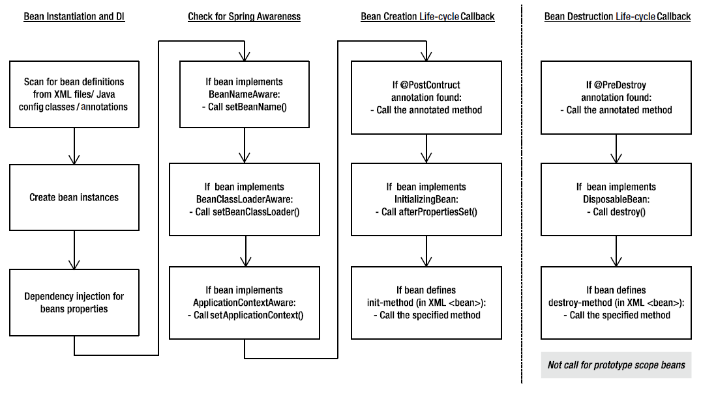
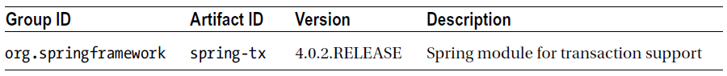
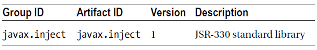
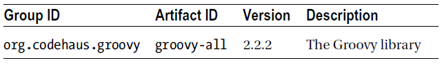

第04章 深入配置Spring
=
在上一章我们对IoC概念以及它如何在Spring Framework中使用进行了详细的讲解。但是对于Spring核心功能的介绍只是留于表面。Spring对于补充和扩展它的IoC基本功能提供了广泛的服务。本章我们会详细讨论它们的细节。具体地说你会看着下面内容：

- Bean生命周期的管理：到目前为此所见到的Bean都是相当简单的，并与Spring容器完全解耦。在本节中我们提出一些策略让你能够允许bean在它的生命周期中的不同地方从Spring容器中接收通知。你可以通过实现Spring提供的特殊的接口，通过Spring可以反射调用的特殊方法，或者通过使用JSR-250的JavaBean生命周期注解来做到这一点。
- 使你的Bean成为“Spring能识别的”：在某些情况下你配置Bean，想让它与ApplicationContext能够交互。出于这个原因Spring提供了两个接口：BeanNameAware 和ApplicationContextAware，分别让你的Bean获得其被分配的名字和引用它的ApplicationContext。这部分的章节涵盖了实现这些接口并为在你的应用程序中使用它们给出了一些实际的注意事项。
- 使用FactoryBeans：其名字蕴含着一些信息，FactoryBean接口会被任何一个充当工厂的Bean实现的，它会生产其它Bean。FactoryBean接口提供一种机制，你可以很容易的把自己的工厂与Spring的BeanFactory整合到一起。
- 使用JavaBeans的PropertyEditors工作：PropertyEditor接口是java.beans包提供的标准接口。PropertyEditor的作用是在属性值与字符串之间进行类型转换。Spring很广泛的使用PropertyEditor，主要是读取BeanFactory配置中指定的值，并将其转换为正确的类型。在本部分中会讨论一组Spring提供的PropertyEditor以及如何在你的应用程序中使用它们。我们还会介绍如何实现自定义的PropertyEditor。
- 深入学习Spring的ApplicationContext：众所周知ApplicationContext是BeanFactory的扩展，目的是用于完整的应用程序。ApplicationContext接口提供一组有用的附加功能，包括对国际化消息的支持、资源加载、事件发布等。在这部分中，我们会详细讨论ApplicationContext提供的除IoC以外的特性。我们还会回顾一下Spring是如何使用ApplicationContext简化应用程序的构建的。
- 使用Java类进行配置：在Spring3.0以前Spring只支持基于XML的注解来配置Bean和其依赖关系。从3.0开始Spring为开发人员提供了另一种选择来配置Spring的ApplicationContext，这就是使用Java类进行配置。我们会讲解这种新的配置方式如何被使用在Spring的应用程序中。
- 使用配置的增强功能：我们介绍的特性可以让应用程序的配置更简单，如profile文件管理、环境和属性源抽象等。本节中我们会介绍这些特性并展示如何使用它们来处理特定的配置需求。
- 使用Groovy进行配置：新的Spring 4.0能够使用Groovy语言配置bean的定义，这可以作为现有的XML或Java配置方式的替代或补充。

4.1 Spring对应用程序移植性的影响
-
在本章中讨论的大部分功能是特定于Spring的，在许多情况下在其它IoC容器中是不可用的。尽管许多IoC容器都提供生命周期的管理功能，但它们可能是通过与Spring不同的一组接口来完成的。如果在不同IoC容器间的移植性对于你的应用程序非常重要的话，应该尽量避免使用那些让你的应用程序与Spring耦合在一起的独有的特性。

但是请记住，通过设置一个约束，应用程序是可以在IoC容器间移植的，这会让你失去使用Spring提供的非常丰富的功能。因为你很有可能会做出战略层面的选择来使用Spring，你使用它最好的能力是有道理的。

小心不要凭空假想出一个可移植性需求。许多情况下，应用程序的最终用户不会关心应用程序可以运行在三个不同的IoC容器上；他们只希望它可以运行。根据我们的经验，尝试只使用所选技术的可用特性的交集来构建应用程序，通常是错误的。这样做往往在一开始就让应用程序处于不利地位。然而如果你的应用程序真的需要IoC容器可移植性，就不会认为这是一个缺点，而是一个真正的需求，因此你的应用程序应该实现这一点。在《Expert One-on-One: J2EE Development without EJB》这本书中Rod Johnson和Jürgen Höller描述这些类型的需求就像有名无实的幽灵需求，并提供了与它们相关的更详细的讨论以及它们如何影响你的项目。

尽管使用这些特性可能会把应用程序与Spring框架耦合起来，但在现实中你可以在更广泛的范围内增强应用程序的可移植性。考虑到你使用的是随手可以得到的、没有特定的供应商联系的开源框架。使用Spring的IoC容器运行构建的应用程序可以在任何能运行Java的地方运行。对于Java企业应用程序，Spring为可移植性开辟了新的可能。Spring提供了许多与JEE相同的功能，还提供了类来抽象和简化JEE的许多其它方面。在许多情况下可以构建一个使用Spring的web应用程序，运行在一个简单的servlet容器中，但与运行在一个成熟的JEE应用程序服务器上的应用程序具有相同程度的先进性。通过与Spring的耦合，你要么屏蔽许多供应商特定的特性来提高应用程序的可移植性，要么依靠供应商特性与Spring配置相同功能的配置。

4.2 Bean的生命周期管理
-
包括Spring在内的所有IoC容器，都有一个重要组成部分，即Bean可以在它们的生命周期中的某个点上得到通知的方式被构建。这使得你的Bean在贯穿它们生命周期的某个点上可以执行相应的处理。一般说来有两个生命周期事件对于Bean来说格外重要：初始化后处理（post-initialization）和销毁前处理（pre-destruction）。

在Spring的上下文中，初始化后处理事件发生在完成设置所有Bean的属性值及检查任何依赖关系完毕后。销毁前处理事件发生在Spring销毁Bean的实例之前。然而对于prototype作用范围的bean，Spring不会进行销毁前处理。Spring的设计是，不管Bean的作用范围是什么都会调用初始化生命周期的回调方法，而对于prototype作用范围的Bean而言，销毁生命周期的回调方法将不会被调用。Spring提供了三种机制让一个Bean可以与每一种事件挂钩并执行一些额外的处理：基于接口、基于方法、基于注解。

使用基于接口的机制，你的bean需要实现它想要得到的通知类型的特定接口，Spring通过接口中定义的回调方法通知Bean。基于方法的机制，Spring允许你在你的ApplicationContext配置中来指定初始化后和销毁前要被调用的方法名称。对于基于注解的机制，可以使用JSR-250标准中的注解来指定那些初始化后处理和销毁前处理的方法。

对于这两个事件，这些机制实现完全相同的目标。基于接口的机制被广泛使用在Spring内部，当你使用一个Spring的组件时不用记得每次都指定初始化或销毁。然而在你自己的bean中使用基于方法或注解的机制会更好，因为你的Bean不需要实现任何Spring的特定接口。虽然我们说可移植性并不像许多书所讲的那么重要，但这不意味着当存在一个完美的选择时你也要牺牲可移植性。即如果你用其它方式把应用程序耦合到Spring上，使用接口方法允许您指定回调一次，然后忘记掉它。如果你定义了许多相同类型的Bean则需要利用生命周期的通知，而使用接口机制可以避免在XML配置文件中为每个bean的生命周期都指定回调方法。使用JSR-250注解是另一个可行选择，因为它是JCP定义的一个标准，而不是专属Spring的具体注解。只需要确保你使用的IoC容器支持JSR-250标准即可。

总的来说选择哪一种机制来接收生命周期通知取决于你应用程序的需要。如果你担心可移植性或只有少量特定类型的bean需要回调，请使用基于方法的机制。如果你使用基于注解的配置并且确定你使用的IoC容器支持JSR-250标准，可以使用基于注解的机制。如果你不需要可移植性或有许多相同类型的bean定义都需要生命周期通知，使用基于接口的机制是最好的办法，这可以确保你的bean总能收到它们所期待的通知。如果你计划在很多不同的Spring项目中交叉使用一个Bean，你肯定希望那个Bean的功能尽可能的独立，所以你应该明确的使用基于接口的机制。

图4-1展示了一个Spring如何管理容器内Bean的生命周期的高层视图。

**图4-1 Spring中Bean的生命周期**

###4.2.1 连接到Bean的创建
当初始化时一个Bean可以检查所需的依赖项是否都被满足。虽然Spring可以为你检查依赖关系，但这几乎是一种要么全有要么全无的方式，而且它不能为在依赖的解析过程中使用自定义的附加逻辑提供任何机会。考虑一个用Setter方式声明了4个依赖的Bean，其中两个是必需的，一个在事件中赋予了适合的默认值，没有提供依赖。使用一个初始化的回调，您的bean可以检查所需的依赖项，根据需要抛出异常或者提供一个默认值。

Bean在它的构造器上不能执行这些检查，因为Spring没有机会提供Bean所依赖的值。在Spring中初始化回调被调用后Spring完成对依赖关系的准备，它可以执行任何你所要的依赖项检查。

在初始化的回调方法中并不是只能进行依赖关系的检查，你还可以在回调方法中做任何你想做的事，但在我们的描述中进行依赖关系的检查是最常用的目的。在许多情况下，初始化回调方法也是触发任何动作的地方，你的Bean必须能自动获得对于它的配置。比如如果你要建立一个bean的运行计划任务，初始化的回调方法就是调度器启动的一个理想起点，毕竟配置数据被设置在Bean上。

>注意：你不会写一个运行计划任务的bean，因为Spring可以通过其内置的调度功能或集成Quartz调度器来自动完成这些工作。我们会在第11章更详细地介绍这一主题。

####4.2.1.1 
在创建Bean时执行一个方法

正如我们前面提到的，一种接收初始化的回调方式是把你的Bean中的一个方法指定为初始化方法，并告诉Spring使用此方法作为一个初始化方法。如前所述，当你只有几个相同类型的bean或想让你的应用程序与Spring解耦时，这个回调机制是非常有用的。使用此机制的另一个原因是允许你的Spring应用程序可以使用预先构造的Bean或由第三方提供的Bean来工作。

定义一个回调方法是很简单的，只需把方法名指定给<bean>标签中的init-method属性。代码4-1展示了一个带有两个依赖项的基本bean。

	代码4-1 SimpleBean类
	package com.apress.prospring4.ch4;
	import org.springframework.beans.factory.BeanCreationException;
	import org.springframework.context.ApplicationContext;
	import org.springframework.context.support.GenericXmlApplicationContext;
	public class SimpleBean {
	    private static final String DEFAULT_NAME = "Luke Skywalker";
	    private String name;
	    private int age = Integer.MIN_VALUE;
	    public void setName(String name) {
	        this.name = name;
	    }
	    public void setAge(int age) {
	        this.age = age;
	    }
	    public void init() {
	        System.out.println("Initializing bean");
	        if (name == null) {
	            System.out.println("Using default name");
	            name = DEFAULT_NAME;
	        }
	        if (age == Integer.MIN_VALUE) {
	            throw new IllegalArgumentException( "You must set the age property of any beans of type " + SimpleBean.class); 
	        }
	    }
	    public String toString() {
	        return "Name: " + name + "\nAge: " + age;
	    }
	    public static void main(String[] args) {
	        GenericXmlApplicationContext ctx = new GenericXmlApplicationContext();
	        ctx.load("classpath:META-INF/spring/app-context-xml.xml");
	        ctx.refresh();
	        SimpleBean simpleBean1 = getBean("simpleBean1", ctx);
	        SimpleBean simpleBean2 = getBean("simpleBean2", ctx);
	        SimpleBean simpleBean3 = getBean("simpleBean3", ctx);
	    }
	    private static SimpleBean getBean(String beanName, ApplicationContext ctx) {
	        try {
	            SimpleBean bean = (SimpleBean) ctx.getBean(beanName);
	            System.out.println(bean);
	            return bean;
	        } catch (BeanCreationException ex) {
	            System.out.println("An error occured in bean configuration: " + ex.getMessage()); 
	            return null;
	        }
	    }
	}
注意我们定义了一个init()方法作为初始化的回调。init()方法检查name属性是否已被设置，如果没有会把常量DEFAULT_NAME的值做为默认值存储起来。init()方法还检查age是否被设置了，如果没有则抛出IllegalArgumentException异常。

SimpleBean类的main()方法尝试使用getBean()方法从GenericXmlApplicationContext中获取三个Bean，它们的类型都是SimpleBean。请注意getBean()方法，如果bean被成功获取，其细节会从控制台输出。如果从init()方法抛出异常，如age属性没有被设置的情况，Spring会把此异常包装到BeanCreationException类的异常对象中。getBean()方法会捕获这些异常并将一条错误消息输出到控制台，以便通知我们，并返回一个null值。

代码4-2展示了ApplicationContext的配置，使用代码4-1的Bean配置。（app-context-xml.xml）

	代码4-2 SimpleBeans的配置
	<?xml version="1.0" encoding="UTF-8"?> 
	<beans xmlns="http://www.springframework.org/schema/beans" 
	    xmlns:xsi="http://www.w3.org/2001/XMLSchema-instance" 
	    xmlns:p="http://www.springframework.org/schema/p" 
	    xsi:schemaLocation="http://www.springframework.org/schema/beans 
	        http://www.springframework.org/schema/beans/spring-beans.xsd" 
	    default-lazy-init="true"> 
	    <bean id="simpleBean1" class="com.apress.prospring4.ch4.SimpleBean" init-method="init" p:name="Chris Schaefer" p:age="32"/> 
	    <bean id="simpleBean2" class="com.apress.prospring4.ch4.SimpleBean" init-method="init" p:age="32"/> 
	    <bean id="simpleBean3" class="com.apress.prospring4.ch4.SimpleBean" init-method="init" p:name="Chris Schaefer"/> 
	</beans>
正如你所看到的，三个Bean的<bean>标签都有init-method属性来告诉Spring应该调用init()方法来完成bean的配置。simpleBean1 Bean的name和age属性都有值，所以init()方法绝对不会改变它们。simpleBean2 Bean没有name属性值，意味着在init()方法中会为name属性赋一个默认值。最后在simpleBean3 Bean中没有设置age属性的值，init()中定义的逻辑会视其为一个错误并抛出IllegalArgumentException异常。还要注意在<beans>标签中我们加入了一个属性：default-lazy-init="true"，这让Spring知道只有当Bean被应用程序请求时Spring才会实例化配置文件中定义的Bean。如果我们不指定它，Spring会在ApplicationContext被启动时就初始化所有的bean，simpleBean3被初始化期间会导致失败。运行以上代码会得到以下输出：

	Initializing bean
	Name: Chris Schaefer
	Age: 32
	Initializing bean
	Using default name
	Name: Luke Skywalker
	Age: 32
	An error occured in bean configuration: Error creating bean with name 'simpleBean3' defined in  class path resource [META-INF/spring/app-context-xml.xml]: Invocatio of init method failed; nested exception is java.lang.IllegalArgumentException: You must set the age property of any beans of type class com.apress.prospring4.ch4.SimpleBean.
从输出中可知simpleBean1使用XML配置文件中的值被正确的配置了。对于simpleBean2中的name属性，其值是默认的，这是因为在配置文件中没有指定它的值是什么。对于simpleBean3不会创建Bean的实例，这是因为缺少age属性的配置值，所以在init()中方法发生了错误。

如您所见，使用初始化方法是确保你的bean被配置正确的一种理想方式。通过使用这种机制，你可以充分利用IoC的优势而不会丢失任何的你所获得的手动定义依赖控制。唯一的限制是初始化方法不能接受任何参数。尽管Spring会忽略初始化方法的返回类型，但你还是可以为其定义任何的返回类型，甚至可以使用一个静态方法，但也不能有任何参数。

当使用静态初始化方法时此机制的优点被否定，因为你不能为验证它而访问任何bean的状态。如果为了节省内存，你的bean使用静态状态作为一种机制，需要使用静态初始化方法来验证这种状态，那么你应该考虑把静态状态移动到实例状态上，并使用非静态的初始化方法。如果你使用Spring的单例管理功能，最终的效果是相同的，但是你会得到一个测试起来容易的多的bean，你还可以获得增强效果，比如能够创建当必要时持有它自己状态的多个Bean的实例。当然在某些情况下你需要在多个bean的实例之间共享静态的状态，在这种情况下你可以使用一个静态初始化方法。

####4.2.1.2 实现InitializingBean接口

Spring定义的InitializingBean接口允许你在代码内部定义bean，这个Bean已经被Spring配置完成而你又想要让它收到通知。相同的方式，当你使用一个初始化方法时，给了你机会去检查bean配置以确保它是有效的，随便提供任意默认值。InitializingBean接口只定义了一个afterPropertiesSet()方法，提供的服务与代码4-1中的init()方法具有相同目的。代码4-3显示了一个使用InitializingBean接口的初始化方法重新实现前面功能的示例。

	代码4-3 使用InitializingBean接口
	package com.apress.prospring4.ch4;
	import org.springframework.beans.factory.BeanCreationException;
	import org.springframework.beans.factory.InitializingBean;
	import org.springframework.context.ApplicationContext;
	import org.springframework.context.support.GenericXmlApplicationContext;
	public class SimpleBeanWithInterface implements InitializingBean {
	    private static final String DEFAULT_NAME = "Luke Skywalker";
	    private String name;
	    private int age = Integer.MIN_VALUE;
	    public void setName(String name) {
	        this.name = name;
	    }
	    public void setAge(int age) {
	        this.age = age;
	    }
	    public void myInit() {
	        System.out.println("My Init");
	    }
	    @Override
	    public void afterPropertiesSet() throws Exception {
	        System.out.println("Initializing bean");
	        if (name == null) {
	            System.out.println("Using default name");
	            name = DEFAULT_NAME;
	        }
	        if (age == Integer.MIN_VALUE) {
	            throw new IllegalArgumentException( "You must set the age property of any beans of type " + SimpleBeanWithInterface.class); 
	        }
	    }
	    public String toString() {
	        return "Name: " + name + "\nAge: " + age;
	    }
	    public static void main(String[] args) {
	        GenericXmlApplicationContext ctx = new GenericXmlApplicationContext();
	        ctx.load("classpath:META-INF/spring/app-context-xml.xml");
	        ctx.refresh();
	        SimpleBeanWithInterface simpleBean1 = getBean("simpleBean1", ctx);
	        SimpleBeanWithInterface simpleBean2 = getBean("simpleBean2", ctx);
	        SimpleBeanWithInterface simpleBean3 = getBean("simpleBean3", ctx);
	    }
	    private static SimpleBeanWithInterface getBean(String beanName,  ApplicationContext ctx) { 
	        try {
	            SimpleBeanWithInterface bean = (SimpleBeanWithInterface) ctx.getBean(beanName);
	            System.out.println(bean);
	            return bean;
	        } catch (BeanCreationException ex) {
	            System.out.println("An error occured in bean configuration: " + ex.getMessage()); 
	            return null;
	        }
	    }
	}
如你所见这个例子的变化不大。除了明显的类名称的变化之外唯一的不同之处在于这个类实现InitializingBean接口，初始化逻辑已经搬移到InitializingBean.afterPropertiesSet()方法中。

代码4-4中你可以看到这个示例的配置（app-context-xml.xml）。

	代码4-4 配置InitializingBean
	<?xml version="1.0" encoding="UTF-8"?> 
	<beans xmlns="http://www.springframework.org/schema/beans" 
	    xmlns:xsi="http://www.w3.org/2001/XMLSchema-instance" 
	    xmlns:p="http://www.springframework.org/schema/p" 
	    xsi:schemaLocation="http://www.springframework.org/schema/beans 
	        http://www.springframework.org/schema/beans/spring-beans.xsd" 
	    default-lazy-init="true"> 
	    <bean id="simpleBean1" class="com.apress.prospring4.ch4.SimpleBeanWithInterface" p:name="Chris Schaefer" p:age="32"/> 
	    <bean id="simpleBean2" class="com.apress.prospring4.ch4.SimpleBeanWithInterface" p:age="32"/> 
	    <bean id="simpleBean3" class="com.apress.prospring4.ch4.SimpleBeanWithInterface" p:name="Chris Schaefer"/> 
	</beans>
同样，在代码4-4和代码4-2的两段配置方面没有太大的不同。明显的区别是移除了init-method属性。因为SimpleBeanWithInterface类实现了InitializingBean接口，Spring知道要调用哪个方法来完成初始化的回调，从而消除了所需要的任何额外配置。以下是此示例的输出：

	Initializing bean
	Name: Chris Schaefer
	Age: 32
	Initializing bean
	Using default name
	Name: Luke Skywalker
	Age: 32
	An error occured in bean configuration: Error creating bean with name 'simpleBean3' defined in class
	path resource [META-INF/spring/app-context-xml.xml]: Invocation of init method failed; nested
	exception is java.lang.IllegalArgumentException: You must set the age property of any beans of type
	class com.apress.prospring4.ch4.SimpleBeanWithInterface.

####4.2.1.3 使用JSR-250的@PostConstruct注解
另一种可以达到相同目的的方法是使用JSR-250标准定义的生命周期注解，@PostConstruct。从Spring2.5以后JSR-250标准的注解在特定方法上被支持，这些方法存在于类中并标有涉及Bean的生命周期的相应的注解。代码4-5展示了@PostConstruct注解的应用。

	代码4-5 使用JSR-250 @PostConstruct注解
	package com.apress.prospring4.ch4;
	import javax.annotation.PostConstruct;
	import org.springframework.beans.factory.BeanCreationException;
	import org.springframework.context.ApplicationContext;
	import org.springframework.context.support.GenericXmlApplicationContext;
	public class SimpleBeanWithJSR250 {
	    private static final String DEFAULT_NAME = "Luke Skywalker";
	    private String name;
	    private int age = Integer.MIN_VALUE;
	    public void setName(String name) {
	        this.name = name;
	    }
	    public void setAge(int age) {
	        this.age = age;
	    }
	    @PostConstruct
	    public void init() throws Exception {
	        System.out.println("Initializing bean");
	        if (name == null) {
	            System.out.println("Using default name");
	            name = DEFAULT_NAME;
	        }
	        if (age == Integer.MIN_VALUE) {
	            throw new IllegalArgumentException( "You must set the age property of any beans of type " + SimpleBeanWithJSR250.class); 
	        }
	    }
	    public String toString() {
	        return "Name: " + name + "\nAge: " + age;
	    }
	    public static void main(String[] args) {
	        GenericXmlApplicationContext ctx = new GenericXmlApplicationContext();
	        ctx.load("classpath:META-INF/spring/app-context-annotation.xml");
	        ctx.refresh();
	        SimpleBeanWithJSR250 simpleBean1 = getBean("simpleBean1", ctx);
	        SimpleBeanWithJSR250 simpleBean2 = getBean("simpleBean2", ctx);
	        SimpleBeanWithJSR250 simpleBean3 = getBean("simpleBean3", ctx);
	    }
	    private static SimpleBeanWithJSR250 getBean(String beanName, ApplicationContext ctx) {
	        try {
	            SimpleBeanWithJSR250 bean = (SimpleBeanWithJSR250) ctx.getBean(beanName);
	            System.out.println(bean);
	            return bean;
	        } catch (BeanCreationException ex) {
	            System.out.println("An error occured in bean configuration: " + ex.getMessage()); 
	            return null;
	        }
	    }
	}
此程序与使用init-method方式完全一样，只是在init()方法上应用@PostConstruct注解。注意，可以使用任何名称的方法。
由于我们使用注解，需要从配置文件的context命名空间中加入`<context:annotation-driven>`标签。

	<?xml version="1.0" encoding="UTF-8"?> 
	<beans xmlns="http://www.springframework.org/schema/beans" 
	    xmlns:xsi="http://www.w3.org/2001/XMLSchema-instance" 
	    xmlns:context="http://www.springframework.org/schema/context" 
	    xmlns:p="http://www.springframework.org/schema/p" 
	    xsi:schemaLocation="http://www.springframework.org/schema/beans 
	        http://www.springframework.org/schema/beans/spring-beans.xsd 
	        http://www.springframework.org/schema/context 
	        http://www.springframework.org/schema/context/spring-context.xsd" 
	    default-lazy-init="true"> 
	    <context:annotation-config/> 
	    <bean id="simpleBean1" class="com.apress.prospring4.ch4.SimpleBeanWithJSR250" p:name="Chris Schaefer" p:age="32"/> 
	    <bean id="simpleBean2" class="com.apress.prospring4.ch4.SimpleBeanWithJSR250" p:age="32"/> 
	    <bean id="simpleBean3" class="com.apress.prospring4.ch4.SimpleBeanWithJSR250" p:name="Chris Schaefer"/> 
	</beans>
运行该程序将看到与其他机制相同的输出：

	Initializing bean
	Name: Chris Schaefer
	Age: 32
	Initializing bean
	Using default name
	Name: Luke Skywalker
	Age: 32
	Initializing bean
	An error occured in bean configuration: Error creating bean with name 'simpleBean3' : Invocation
	of init method failed; nested exception is java.lang.IllegalArgumentException: You must set the age	property of any beans of type class com.apress.prospring4.ch4.SimpleBeanWithJSR250.
三种方式都有其优点和缺点。使用一个初始化方法，优势在于可以让你的程序与Spring解耦，而你必须记住要为每一个需要它的Bean配置初始化方法。使用InitializingBean接口，好处是你能够只为Bean类的所有实例指定一次初始化回调方法，但你必须把应用程序与Spring耦合在一起。使用注解，则需要把注解应用到方法上并确保IoC容器支持JSR-250。最后应该了解到使用哪种方式是取决于应用程序的真实需要的。如果更关心可移植性，请使用初始化方法或注解；否则使用InitializingBean接口可以减少你应用程序的配置量，同时减少因为错误的配置而让你的应用程序出错的机会。

####4.2.1.4 理解顺序的决策
您可以在同一个Bean上使用所有实例初始化机制，这种情况下Spring会先调用标有@PostConstruct注解的方法，然后是InitializingBean.afterPropertiesSet()，最后是通过你的配置文件来指定的初始化方法。当你使用Spring，如果你现在有一个Bean，在一个特定的方法上执行一些初始化动作，但是你需要添加更多的初始化代码，此时理解3种不同机制的执行顺序就非常有用了。

###4.2.2 连接到Bean的销毁
当使用了一个包装了DefaultListableBeanFactory接口的ApplicationContext实现时（比如GenericXmlApplicationContext，通过getDefaultListableBeanFactory()方法），你可以通知BeanFactory，你想要通过调用ConfigurableBeanFactory.destroySingletons()来销毁所有单例的Bean实例。通常当应用程序关闭时你要这么做，它允许您清理任何你的bean可能持有打开的资源，从而使应用程序优雅的关闭。这种回调还为同步内存中的数据缓存或结束长时间运行的进程提供了一个完美的地方。

让你的bean接收到destroySingletons()已经被调用的通知，你有三个选择，类似于可以接收初始化的回调函数机制。销毁回调经常与初始化的回调相互协调使用。在许多情况下，你在初始化回调时创建和配置资源而在销毁回调时释放资源。

####4.2.2.1 当Bean被销毁时执行一个方法
指定一个方法，会在销毁Bean时被调用，你只需要简单的在Bean定义的<bean>标签中指定destroy-method属性即可，其值就是那个方法名。Spring只在单例的Bean实例被销毁前才调用这个方法（prototype作用范围的Bean实例被销毁前不会调用它）。代码4-6展示了一个使用destroy-method回调的例子。

	代码4-6 使用destroy-method回调
	package com.apress.prospring4.ch4;
	import java.io.IOException;
	import java.io.File;
	import org.springframework.beans.factory.InitializingBean;
	import org.springframework.context.support.GenericXmlApplicationContext;
	public class DestructiveBean implements InitializingBean {
	    private File file;
	    private String filePath;
	    @Override
	    public void afterPropertiesSet() throws Exception {
	        System.out.println("Initializing Bean");
	        if (filePath == null) {
	            throw new IllegalArgumentException("You must specify the filePath property of " + DestructiveBean.class);
	        }
	        this.file = new File(filePath);
	        this.file.createNewFile();
	        System.out.println("File exists: " + file.exists());
	    }
	    public void destroy() {
	        System.out.println("Destroying Bean");
	        if(!file.delete()) {
	            System.err.println("ERROR: failed to delete file.");
	        }
	        System.out.println("File exists: " + file.exists());
	    }
	    public void setFilePath(String filePath) {
	        this.filePath = filePath;
	    }
	    public static void main(String[] args) throws Exception {
	        GenericXmlApplicationContext ctx = new GenericXmlApplicationContext();
	        ctx.load("classpath:META-INF/spring/app-context-xml.xml");
	        ctx.refresh();
	        DestructiveBean bean = (DestructiveBean) ctx.getBean("destructiveBean");
	        System.out.println("Calling destroy()");
	        ctx.destroy();
	        System.out.println("Called destroy()");
	    }
	}
这段代码定义了一个destroy()方法，它会删除被创建的文件。main()方法从GenericXmlApplicationContext中获得DestructiveBean类型的Bean，然后调用destroy()方法（反过来说，将调用被ApplicationContext包装的ConfigurableBeanFactory.destroySingletons()），通知Spring销毁所有被它管理的单例Bean。在调用初始化和销毁的回调时会向控制台输出信息。代码4-7中可以了解destructiveBean的配置。（app-context-xml.xml）

	代码4-7 配置destroy-method回调
	<?xml version="1.0" encoding="UTF-8"?> 
	<beans xmlns="http://www.springframework.org/schema/beans" 
	    xmlns:xsi="http://www.w3.org/2001/XMLSchema-instance" 
	    xmlns:p="http://www.springframework.org/schema/p" 
	    xsi:schemaLocation="http://www.springframework.org/schema/beans
	        http://www.springframework.org/schema/beans/spring-beans.xsd"> 
	    <bean id="destructiveBean" 
	        class="com.apress.prospring4.ch4.DestructiveBean" 
	        destroy-method="destroy" 
	        p:filePath= "#{systemProperties['java.io.tmpdir']}#{systemProperties['file.separator']}test.txt"/> 
	</beans>
注意，我们通过destroy-method属性指定了销毁的回调方法是destroy()。我们使用SpEL表达式构建filePath属性，把系统属性java. io.tmpdir和file.separator拼接在文件名test.txt之前，以确保跨平台的兼容性。运行此示例会输出以下内容：

	Initializing Bean
	File exists: true
	Calling destroy()
	Destroying Bean
	File exists: false
	Called destroy()
正如你所看到的，Spring首先调用初始化的回调函数，DestructiveBean实例会创建File实例并保存它。然后在调用destroy()方法时Spring会遍历它所管理的所有单例Bean，这种情况下只有一个，调用任何被指定的销毁回调方法。在这里DestructiveBean实例会删除已经创建的文件，并在屏幕上输出它已经不存在的日志消息。

####4.2.2.2 实现DisposableBean接口
与初始化回调一样，Spring提供了DisposableBean接口来实现你的Bean作为接收销毁回调的机制。DisposableBean接口定义了一个destroy()方法，在实现了这个接口的Bean被销毁前会执行它。这个机制与InitializingBean接口接收初始化回调相对。代码4-8修改了DestructiveBean类的实现，让它实现了DisposableBean接口。

	代码4-8 实现DisposableBean接口
	package com.apress.prospring4.ch4;
	import java.io.IOException;
	import java.io.File;
	import org.springframework.beans.factory.DisposableBean;
	import org.springframework.beans.factory.InitializingBean;
	import org.springframework.context.support.GenericXmlApplicationContext;
	public class DestructiveBeanWithInterface implements InitializingBean, DisposableBean {
	    private File file;
	    private String filePath;
	    @Override
	    public void afterPropertiesSet() throws Exception {
	        System.out.println("Initializing Bean");
	        if (filePath == null) {
	            throw new IllegalArgumentException( "You must specify the filePath property of " + DestructiveBeanWithInterface.class); 
	        }
	        this.file = new File(filePath);
	        this.file.createNewFile();
	        System.out.println("File exists: " + file.exists());
	    }
	    @Override
	    public void destroy() {
	        System.out.println("Destroying Bean");
	        if(!file.delete()) {
	            System.err.println("ERROR: failed to delete file.");
	        }
	        System.out.println("File exists: " + file.exists());
	    }
	    public void setFilePath(String filePath) {
	        this.filePath = filePath;
	    }
	    public static void main(String[] args) throws Exception {
	        GenericXmlApplicationContext ctx = new GenericXmlApplicationContext();
	        ctx.load("classpath:META-INF/spring/app-context-xml.xml");
	        ctx.refresh();
	        DestructiveBeanWithInterface bean = (DestructiveBeanWithInterface) ctx.getBean("destructiveBean");
	        System.out.println("Calling destroy()");
	        ctx.destroy();
	        System.out.println("Called destroy()");
	    }
	}
使用方法回调机制和使用回调接口机制没有太大的区别。在此情况下我们甚至使用了相同的方法名。代码4-8展示了修改后的配置（app-context-xml.xml）。

	代码4-9 使用DisposableBean接口的配置
	<?xml version="1.0" encoding="UTF-8"?> 
	<beans xmlns="http://www.springframework.org/schema/beans" 
	    xmlns:xsi="http://www.w3.org/2001/XMLSchema-instance" 
	    xmlns:p="http://www.springframework.org/schema/p" 
	    xsi:schemaLocation="http://www.springframework.org/schema/beans
	        http://www.springframework.org/schema/beans/spring-beans.xsd"> 
	    <bean id="destructiveBean" 
	        class="com.apress.prospring4.ch4.DestructiveBeanWithInterface" 
	        p:filePath= "#{systemProperties['java.io.tmpdir']}#{systemProperties['file.separator']}test.txt"/> 
	</beans>
除了类名不同，唯一的区别是移除了destroy-method属性。
运行此例的输出如下：

	Initializing Bean
	File exists: true
	Calling destroy()
	Destroying Bean
	File exists: false
	Called destroy()
####4.2.2.3 使用JSR-250 @PreDestroy注解
第三种方式是使用JSR-250生命周期@PreDestroy注解，它正好与前边的@PostConstruct注解相对。代码4-10中的DestructiveBean版本在一个类中使用了@PostConstruct和@PreDestroy来执行初始化和销毁动作。

	代码4-10 通过使用@PreDestroy和@PostDestroy实现的DisposableBean
	package com.apress.prospring4.ch4;
	import java.io.File;
	import javax.annotation.PostConstruct;
	import javax.annotation.PreDestroy;
	import org.springframework.context.support.GenericXmlApplicationContext;
	public class DestructiveBeanWithJSR250 {
	    private File file;
	    private String filePath;
	    @PostConstruct
	    public void afterPropertiesSet() throws Exception {
	        System.out.println("Initializing Bean");
	        if (filePath == null) {
	            throw new IllegalArgumentException( "You must specify the filePath property of " + DestructiveBeanWithJSR250.class); 
	        }
	        this.file = new File(filePath);
	        this.file.createNewFile();
	        System.out.println("File exists: " + file.exists());
	    }
	    @PreDestroy
	    public void destroy() {
	        System.out.println("Destroying Bean");
	        if(!file.delete()) {
	            System.err.println("ERROR: failed to delete file.");
	        }
	        System.out.println("File exists: " + file.exists());
	    }
	    public void setFilePath(String filePath) {
	        this.filePath = filePath;
	    }
	    public static void main(String[] args) throws Exception {
	        GenericXmlApplicationContext ctx = new GenericXmlApplicationContext();
	        ctx.load("classpath:META-INF/spring/app-context-annotation.xml");
	        ctx.refresh();
	        DestructiveBeanWithJSR250 bean =  (DestructiveBeanWithJSR250) ctx.getBean("destructiveBean");
	        System.out.println("Calling destroy()");
	        ctx.destroy();
	        System.out.println("Called destroy()");
	    }
	}
代码4-11是对于这个Bean的XML配置，添加了<context:annotation-config>标签（app-context-annotation.xml）。

	代码4-11 使用JSR-250注解配置DisposableBean
	<?xml version="1.0" encoding="UTF-8"?> 
	<beans xmlns="http://www.springframework.org/schema/beans" 
	    xmlns:xsi="http://www.w3.org/2001/XMLSchema-instance" 
	    xmlns:p="http://www.springframework.org/schema/p" 
	    xmlns:context="http://www.springframework.org/schema/context" 
	    xsi:schemaLocation="http://www.springframework.org/schema/beans
	        http://www.springframework.org/schema/beans/spring-beans.xsd
	        http://www.springframework.org/schema/context
	        http://www.springframework.org/schema/context/spring-context.xsd"> 
	    <context:annotation-config/> 
	    <bean id="destructiveBean" 
	        class="com.apress.prospring4.ch4.DestructiveBeanWithJSR250" 
	        p:filePath= "#{systemProperties['java.io.tmpdir']}#{systemProperties['file.separator']}test.txt"/> 
	</beans>
销毁回调是一种理想的机制，能让你优雅的关闭应用程序并避免资源未被释放或不一致的情况发生。然而你仍然必须在销毁方法回调、实现DisposableBean接口和@PreDestroy注解三种机制中选择使用哪个。这需要根据应用程序的需要来让你做出决定。销毁方法回调可以让应用程序有很好的可移植性，实现DisposableBean接口和@PreDestroy注解则可以减少你的配置工作。

####4.2.2.4 理解顺序的决策
与bean创建的情况相同，可以在同一个Bean上使用所有实例销毁机制。这种情况下Spring会先调用标有@PreDestroy注解的方法，然后是DisposableBean.destroy()，最后是通过你的配置文件来指定的销毁方法。

####4.2.2.5 使用关闭挂钩
在Spring中销毁回调的唯一缺点是它们不是被自动引发的；你要记住在应用程序被关闭之前来调用调用AbstractApplicationContext.destroy()。当你的应用程序运行一个servlet时，要以在Servlet的destroy()方法中简单的调用destroy()。然而在一个独立的应用程序里事情并不那么简单，尤其是在你的应用程序有多个出口的情况下。幸运的是我们有一个解决方案来应对这个问题。Java允许您创建一个关闭挂钩，是一个在应用程序被关闭前被执行的线程。这是一种调用你的AbstractApplicationContext（扩展了ApplicationContext的全部具体实现）中destroy()方法的更好方式。利用这种机制的最简单的方式是使用AbstractApplicationContext的registerShutdownHook()方法。这个方法会自动的引导Spring注册一个底层JVM运行时的关闭挂钩。如代码4-12所示。

	代码4-12 注册关闭挂钩
	package com.apress.prospring4.ch4;
	import javax.annotation.PostConstruct;
	import javax.annotation.PreDestroy;
	import java.io.File;
	import org.springframework.context.support.GenericXmlApplicationContext;
	public class DestructiveBeanWithInterface {
	    private File file;
	    private String filePath;
	    @PostConstruct
	    public void afterPropertiesSet() throws Exception {
	        System.out.println("Initializing Bean");
	        if (filePath == null) {
	            throw new IllegalArgumentException( "You must specify the filePath property of " + DestructiveBeanWithInterface.class); 
	        }
	        this.file = new File(filePath);
	        this.file.createNewFile();
	        System.out.println("File exists: " + file.exists());
	    }
	    @PreDestroy
	    public void destroy() {
	        System.out.println("Destroying Bean");
	        if(!file.delete()) {
	            System.err.println("ERROR: failed to delete file.");
	        }
	        System.out.println("File exists: " + file.exists());
	    }
	    public void setFilePath(String filePath) {
	        this.filePath = filePath;
	    }
	    public static void main(String[] args) throws Exception {
	        GenericXmlApplicationContext ctx = new GenericXmlApplicationContext();
	        ctx.load("classpath:META-INF/spring/app-context-annotation.xml");
	        ctx.registerShutdownHook();
	        ctx.refresh();
	        DestructiveBeanWithInterface bean =  (DestructiveBeanWithInterface) ctx.getBean("destructiveBean"); 
	    }
	}
以下是相应的XML配置（app-context-annotation.xml）：

	<?xml version="1.0" encoding="UTF-8"?> 
	<beans xmlns="http://www.springframework.org/schema/beans" 
	    xmlns:xsi="http://www.w3.org/2001/XMLSchema-instance" 
	    xmlns:p="http://www.springframework.org/schema/p" 
	    xmlns:context="http://www.springframework.org/schema/context" 
	    xsi:schemaLocation="http://www.springframework.org/schema/beans
	        http://www.springframework.org/schema/beans/spring-beans.xsd
	        http://www.springframework.org/schema/context
	        http://www.springframework.org/schema/context/spring-context.xsd"> 
	    <context:annotation-config/> 
	    <bean id="destructiveBean" 
	        class="com.apress.prospring4.ch4.DestructiveBeanWithInterface" 
	        p:filePath= "#{systemProperties['java.io.tmpdir']}#{systemProperties['file.separator']}test.txt"/> 
	</beans>
运行这个示例输出如下内容：

	Initializing Bean
	File exists: true
	Destroying Bean
	File exists: false
正如你所看到的，destroy()方法被调用了，即使我们没有写任何显式的代码来调用用它，应用程序还是被关闭了。

4.3 让你的Bean能被Spring识别
-
在IoC的实现方面依赖注入机制比依赖查找机制更强大的最大卖点在于你的Bean不需要知道正有一个容器在管理着它们。使用构造器或Setter进行注入的Bean，选用Spring容器与选用Google Guice或PicoContainer容器都是一样的。但是，在某些情况下，你可能需要这样一个Bean，使用依赖注入获得它的依赖性，所以它可以出于其它一些原因与容器进行交互。例如一个自动的为你配置了关闭挂钩的Bean，因此它需要访问ApplicationContext。在其他情况下，一个Bean可能需要知道它的名字叫什么（被声明在当前的ApplicationContext中的Bean的名称），因为基于这个名字它可以执行一些额外的处理。

也就是说这个功能是真正的在Spring内部使用的。为Bean命名时使用某种类型的业务意义通常是个坏主意，作为Bean的名字必须通过人工操作来支持它们的业务含义会导致配置问题。然而我们已经发现在运行时能够找到一个Bean的名字，可以为日志记录提供有用的信息。例如你有许多相同类型的bean运行在不同的配置下。Bean的名称可以被包含在日志消息中，来帮助你区分哪个Bean导致了错误，哪个Bean在发生错误时工作正常。

###4.3.1 使用BeanNameAware接口
BeanNameAware接口可以由想得知自己名字的Bean实现，它只有一个方法：setBeanName(String)。Spring会在你的Bean完成配置之后但在任何生命周期回调（初始化或销毁）之前调用setBeanName(String)方法。在大多数情况下，setBeanName()方法的实现只有一行代码，存储着从容器传递来的事先准备好的值。代码4-13展示了一个简单的Bean，通过使用BeanNameAware得到它的名字，之后把这个Bean的名字打印到控制台上。

	代码4-13 实现BeanNameAware
	package com.apress.prospring4.ch4;
	import org.springframework.beans.factory.BeanNameAware;
	public class BeanNamePrinter implements BeanNameAware {
	    private String beanName;
	    @Override
	    public void setBeanName(String beanName) {
	        this.beanName = beanName;
	    }
	    public void someOperation() {
	        System.out.println("Bean [" + beanName + "] - someOperation()");
	    }
	}
这个实现非常简单。记住BeanNameAware.setBeanName()是在你的应用程序通过调用ApplicationContext.getBean()来返回第一个Bean的实例之前被调用的，所以没有必要检查在someOperation()方法中Bean的名字是否可用。代码4-14展示了这个例子的配置（app-context-xml.xml）。

	代码4-14 配置LoggingBean例子
	<?xml version="1.0" encoding="UTF-8"?> 
	<beans xmlns="http://www.springframework.org/schema/beans" 
	    xmlns:xsi="http://www.w3.org/2001/XMLSchema-instance" 
	    xsi:schemaLocation="http://www.springframework.org/schema/beans
	        http://www.springframework.org/schema/beans/spring-beans.xsd"> 
	    <bean id="beanNamePrinter" class="com.apress.prospring4.ch4.BeanNamePrinter"/> 
	</beans>
如你所见，使用BeanNameAware接口不需要任何特殊配置。在代码4-15中你可以看到一个简单的示例应用程序，从ApplicationContext中获得NamePrinter Bean的实例，然后调用它的someOperation()方法。

	代码4-15 LoggingBeanExample类
	package com.apress.prospring4.ch4;
	import org.springframework.context.support.GenericXmlApplicationContext;
	public class BeanNamePrinterExample {
	    public static void main(String[] args) {
	        GenericXmlApplicationContext ctx = new GenericXmlApplicationContext();
	        ctx.load("classpath:META-INF/spring/app-context-xml.xml");
	        ctx.refresh();
	        BeanNamePrinter bean = (BeanNamePrinter) ctx.getBean("beanNamePrinter");
	        bean.someOperation();
	    }
	}
这个示例生成下面的日志输出，注意调用someOperation()方法所输出的包含了bean名称的日志消息。

	Loading XML bean definitions from class path resource [META-INF/spring/app-context-xml.xml]
	...
	Bean [beanNamePrinter] - someOperation()
使用BeanNameAware接口相当简单，当要改善日志消息的质量时应该好好使用它。避免使用包含业务含义的Bean名称仅仅是因为你可以访问它们；如果这样做，你为了某个特性把Spring和你的类耦合在一起所带来的好处可以忽略不计。如果你的bean需要某种形式的内部名称，让他们实现一个带有setName()方法的Nameable接口，这个接口你你在应用程序中自定义的，然后通过依赖注入为每个Bean分配名称。这样可以保持名称配置的简洁，你不需要操作不必要的配置来为你的Bean名称赋予业务含意。

###4.3.2 使用ApplicationContextAware接口
使用ApplicationContextAware接口，可以让你的Bean获得一个配置它们的ApplicationContext的引用 。这个接口主要的存在原因是可以让你的Bean访问到你应用程序中的Spring的ApplicationContext，例如使用getBean()方法通过编程方式获取其他Spring的bean。然而你应该避免使用这种实践，并使用依赖注入来为你提供bean以及它们的合作Bean。当你可以使用依赖注入时，如果使用基于查找的getBean()方法来获取依赖项，会为你的Bean添加不必要的复杂性，同时在没有什么好的理由的前提下，把它们与Spring耦合到了一起。

当然，ApplicationContext不仅仅是为了查找Bean才被使用的，还可以执行许多其它任务。如在前面看到的，这些任务其中之一就是销毁所有单例Bean，在这样做之前会通知到它们中的每一个。在上一节中你看到如何创建一个关闭挂钩来确保在应用程序被关闭之前，ApplicationContext指明销毁所有的单例Bean。通过使用ApplicationContextAware接口，你可以创建一个Bean，它可以在ApplicationContext中被配置后建立出来，还能配置一个自动关闭钩子的Bean。如代码4-16所示。

	代码4-16 ShutdownHookBean类
	package com.apress.prospring4.ch4;
	import org.springframework.beans.BeansException;
	import org.springframework.context.ApplicationContext;
	import org.springframework.context.ApplicationContextAware;
	import org.springframework.context.support.GenericApplicationContext;
	public class ShutdownHookBean implements ApplicationContextAware {
	    private ApplicationContext ctx;
	    @Override
	    public void setApplicationContext(ApplicationContext ctx)  throws BeansException { 
	        if (ctx instanceof GenericApplicationContext) {
	            ((GenericApplicationContext) ctx).registerShutdownHook();
	        }
	    }
	}
似乎大部分的代码应该很熟悉了。ApplicationContextAware接口定义了一个单独的方法，setApplicationContext(ApplicationContext)，Spring调用它把你的Bean的引用传递给它的ApplicationContext。在代码4-16中ShutdownHookBean类检查ApplicationContext是否是GenericApplicationContext类型，这意味着它支持
registerShutdownHook()方法；如果是这个类型，它会在ApplicationContext中注册一个关闭挂钩。代码4-17展示了如何配置DestructiveBeanWithInterface Bean来工作（app-context-annotation.xml）。

	代码4-17 配置ShutdownHookBean
	<?xml version="1.0" encoding="UTF-8"?> 
	<beans xmlns="http://www.springframework.org/schema/beans" 
	    xmlns:xsi="http://www.w3.org/2001/XMLSchema-instance" 
	    xmlns:p="http://www.springframework.org/schema/p" 
	    xmlns:context="http://www.springframework.org/schema/context" 
	    xsi:schemaLocation="http://www.springframework.org/schema/beans
	        http://www.springframework.org/schema/beans/spring-beans.xsd
	        http://www.springframework.org/schema/context
	        http://www.springframework.org/schema/context/spring-context.xsd"> 
	    <context:annotation-config/> 
	    <bean id="destructiveBean" 
	        class="com.apress.prospring4.ch4.DestructiveBeanWithInterface" 
	        p:filePath= "#{systemProperties['java.io.tmpdir']}#{systemProperties['file.separator']}test.txt"/> 
	    <bean id="shutdownHook" class="com.apress.prospring4.ch4.ShutdownHookBean"/> 
	</beans>

注意，不需要特殊的配置。代码4-18展示了一个简单的应用程序的例子，使用ShutdownHookBean来管理单例Bean的销毁。

	代码4-18 使用ShutdownHookBean
	package com.apress.prospring4.ch4;
	import javax.annotation.PostConstruct;
	import javax.annotation.PreDestroy;
	import java.io.File;
	import org.springframework.context.support.GenericXmlApplicationContext;
	public class DestructiveBeanWithInterface {
	    private File file;
	    private String filePath;
	    @PostConstruct
	    public void afterPropertiesSet() throws Exception {
	        System.out.println("Initializing Bean");
	        if (filePath == null) {
	            throw new IllegalArgumentException( "You must specify the filePath property of " + DestructiveBeanWithInterface.class); 
	        }
	        this.file = new File(filePath);
	        this.file.createNewFile();
	        System.out.println("File exists: " + file.exists());
	    }
	    @PreDestroy
	    public void destroy() {
	        System.out.println("Destroying Bean");
	        if(!file.delete()) {
	            System.err.println("ERROR: failed to delete file.");
	        }
	        System.out.println("File exists: " + file.exists());
	    }
	    public void setFilePath(String filePath) {
	        this.filePath = filePath;
	    }
	    public static void main(String[] args) throws Exception {
	        GenericXmlApplicationContext ctx = new GenericXmlApplicationContext();
	        ctx.load("classpath:META-INF/spring/app-context-annotation.xml");
	        ctx.registerShutdownHook();
	        ctx.refresh();
	        DestructiveBeanWithInterface bean =  (DestructiveBeanWithInterface) ctx.getBean("destructiveBean"); 
	    }
	}
这段代码看起来应该很熟悉。当Spring启动ApplicationContext并且destructiveBean在配置中被定义时，为了注册关闭挂钩，Spring会传递ApplicationContext的引用到shutdownHook Bean里。运行这个例子会得到以下输出，正如预期：

	Initializing Bean
	File exists: true
	Destroying Bean
	File exists: false
如你所见，在主应用程序中即使没有调用destroy()方法，ShutdownHookBean也作为关闭挂钩被注册了，就在应用程序关闭前它会调用destroy()方法。

4.4 使用FactoryBean
-
当使用Spring时你会面临一个问题，如何创建Bean，然后注入不能使用new操作符创建的依赖关系。为克服这个问题，Spring提供了FactoryBean接口作为那些不能使用标准Spring语意被创建和被管理对象的一个适配器。

通常使用FactoryBeans来创建那些不能使用new操作符创建的Bean，比如那些通过静态工厂方法访问的Bean，虽然并非总是如此。简而言之，FactoryBean是一个Bean，它作为一个工厂生产其它Bean。FactoryBean像其它普通的Bean一样被配置在你的ApplicationContext中，但当Spring使用FactoryBean接口来满足依赖或查找请求时它不返回FactoryBean；而是调用FactoryBean.getObject()方法并返回调用的结果。

FactoryBeans在Spring中的使用会产生巨大影响；最明显的用途是事务代理的创建，在第9章中我们会进行详细讨论，以及自动检索资源的JNDI上下文。但是FactoryBean不仅在Spring的内部构建上是有用的；当构建自己的应用程序时也会发现它非常有用，因为它们允许你管理的更多资源，这是与原本通过IoC管理的资源比较得来的。

###4.4.1 FactoryBean例子：MessageDigestFactoryBean
在项目中我们经常需要某种形式的加密处理，通常这会涉及到生成的消息摘要或用户的密码进行散列处理后存储到数据库中。在Java中MessageDigest类提供了创建任意数据摘要的功能。MessageDigest是抽象的，你需要调用MessageDigest.getInstance()方法来获得它的具体实现，并传递一个你想使用的摘要算法名称。例如，如果我们想使用MD5算法创建一个摘要，我们使用下面的代码来创建MessageDigest实例：

	MessageDigest md5 = MessageDigest.getInstance("MD5");

如果我们想使用Spring管理MessageDigest对象的创建，不使用FactoryBean的情况下我们能做的最好的是让我们的Bean有一个algorithmName属性，然后使用一个初始化回调来调用MessageDigest.getInstance()方法。使用FactoryBean时我们可以在bean中封装这个逻辑。然后任何需要MessageDigest实例的Bean可以声明一个messageDigest属性，使用FactoryBean来获取实例。代码4-19展示了这么做的FactoryBean的实现。

	代码4-19 MessageDigestFactoryBean类
	package com.apress.prospring4.ch4;
	import java.security.MessageDigest;
	import org.springframework.beans.factory.FactoryBean;
	import org.springframework.beans.factory.InitializingBean;
	public class MessageDigestFactoryBean implements  FactoryBean<MessageDigest>, InitializingBean { 
	    private String algorithmName = "MD5";
	    private MessageDigest messageDigest = null;
	    @Override
	    public MessageDigest getObject() throws Exception {
	        return messageDigest;
	    }
	    @Override
	    public Class<MessageDigest> getObjectType() {
	        return MessageDigest.class;
	    }
	    @Override
	    public boolean isSingleton() {
	        return true;
	    }
	    @Override
	    public void afterPropertiesSet() throws Exception {
	        messageDigest = MessageDigest.getInstance(algorithmName);
	    }
	    public void setAlgorithmName(String algorithmName) {
	        this.algorithmName = algorithmName;
	    }
	}
FactoryBean接口定义了三个方法：getObject()、getObjectType()和isSingleton()。Spring调用getObject()方法来获得被FactoryBean创建的对象。这是使用FactoryBean作为合作者传递给其它Bean的实际对象。在代码4-19中可以看到MessageDigestFactoryBean传递一个在InitializingBean.afterPropertiesSet()回调时创建的，被存储的MessageDigest克隆实例。

getObjectType()方法允许你告诉Spring，FactoryBean将返回什么类型的对象。如果提前返回类型是未知的则可以让这个方法返回一个null值（例如FactoryBean根据配置创建不同类型的对象，只有当FactoryBean被初始化后才可以确定），但是如果你指定了一个类型，Spring可以使用它进行自动装配。我们把MessageDigest作为我们的类型（这种情况下是一个类，但尝试返回一个接口类型，FactoryBean实例化具体的实现类，除非必要）。原因在于我们不知道将被返回的具体类型（那并不重要，因为无论如何所有bean将通过使用MessageDigest来定义它们的依赖）。

isSingleton()属性允许你告诉Spring，FactoryBean管理的Bean是否是单例的。记住通过设置FactoryBean的<bean>标签的单例属性，你告诉Spring的是FactoryBean本身的单例状态，而不是它所返回的对象的。

现在让我们看看FactoryBean在一个应用程序中是如何工作的。在代码4-20中可以看到一个简单的Bean，持有两个MessageDigest实例，然后把要显示的消息摘要传递给它的digest()方法。

	代码4-20 MessageDigester类
	package com.apress.prospring4.ch4;
	import java.security.MessageDigest;
	public class MessageDigester {
	    private MessageDigest digest1;
	    private MessageDigest digest2;
	    public void setDigest1(MessageDigest digest1) {
	        this.digest1 = digest1;
	    }
	    public void setDigest2(MessageDigest digest2) {
	        this.digest2 = digest2;
	    }
	    public void digest(String msg) {
	        System.out.println("Using digest1");
	        digest(msg, digest1);
	        System.out.println("Using digest2");
	        digest(msg, digest2);
	    }
	    private void digest(String msg, MessageDigest digest) {
	        System.out.println("Using alogrithm: " + digest.getAlgorithm());
	        digest.reset();
	        byte[] bytes = msg.getBytes();
	        byte[] out = digest.digest(bytes);
	        System.out.println(out);
	    }
	}
代码4-21显示了两个MessageDigestFactoryBeans的配置示例，一个使用SHA1算法，另一个使用默认的（MD5）算法（app-context-xml.xml）。

	代码4-21 配置FactoryBeans
	<?xml version="1.0" encoding="UTF-8"?> 
	<beans xmlns="http://www.springframework.org/schema/beans" 
	    xmlns:xsi="http://www.w3.org/2001/XMLSchema-instance" 
	    xmlns:p="http://www.springframework.org/schema/p" 
	    xsi:schemaLocation="http://www.springframework.org/schema/beans
	        http://www.springframework.org/schema/beans/spring-beans.xsd">
	    <bean id="shaDigest" class="com.apress.prospring4.ch4.MessageDigestFactoryBean"  p:algorithmName="SHA1"/> 
	    <bean id="defaultDigest"  class="com.apress.prospring4.ch4.MessageDigestFactoryBean"/> 
	    <bean id="digester"  class="com.apress.prospring4.ch4.MessageDigester" p:digest1-ref="shaDigest" p:digest2-ref="defaultDigest"/> 
	</beans>
如你所见，这里不只有两个MessageDigestFactoryBean的配置，我们还配置了MessageDigester，使用两个MessageDigestFactoryBeans来为digest1和digest2属性提供值。对于defaultDigest Bean没有指定algorithmName属性，所以没有注入会发生，使用代码中定义的默认MD5算法。代码4-22可以看到一个从BeanFactory获取MessageDigester Bean实例并创建一个简单的消息摘要的基本示例。

	代码4-22 MessageDigester类
	package com.apress.prospring4.ch4;
	import org.springframework.context.support.GenericXmlApplicationContext;
	public class MessageDigestExample {
	    public static void main(String[] args) {
	        GenericXmlApplicationContext ctx = new GenericXmlApplicationContext();
	        ctx.load("classpath:META-INF/spring/app-context-xml.xml");
	        ctx.refresh();
	        MessageDigester digester = (MessageDigester) ctx.getBean("digester");
	        digester.digest("Hello World!");
	    }
	}
以下是输出结果：

	Using digest1 
	Using alogrithm: SHA1 
	[B@77cd7a0
	Using digest2 
	Using alogrithm: MD5 
	[B@204f30ec
如你所见，即使MessageDigest没有被配置在BeanFactory里，MessageDigest也有两个实现，SH1和MD5。这是FactoryBean在起作用。

当遇到不能使用new操作符来创建Bean的类时，FactoryBean是一个完美的解决方案。如果你使用的对象是通过一个工厂方法创建的，并且你想在Spring的应用程序中使用这些类，创建一个FactoryBean作为适配器，让你的程序可以充分使用Spring的IoC功能。

###4.4.2 直接访问FactoryBean
鉴于Spring通过被FactoryBean产生的对象自动满足任何FactoryBean的引用，你可能想知道是否能直接访问FactoryBean。答案是肯定的。

访问FactoryBean很简单：调用getBean()方法时在作为参数的Bean名称前加一个“&”前缀，代码如4-23所示。

	代码4-23 直接访问FactoryBean
	package com.apress.prospring4.ch4;
	import java.security.MessageDigest;
	import org.springframework.context.support.GenericXmlApplicationContext;
	public class AccessingFactoryBeans {
	    public static void main(String[] args) {
	        GenericXmlApplicationContext ctx = new GenericXmlApplicationContext();
	        ctx.load("classpath:META-INF/spring/app-context-xml.xml");
	        ctx.refresh();
	        MessageDigest digest = (MessageDigest) ctx.getBean("shaDigest");
	        MessageDigestFactoryBean factoryBean =  (MessageDigestFactoryBean) ctx.getBean("&shaDigest"); 
	        try {
	            MessageDigest shaDigest = factoryBean.getObject();
	            System.out.println(shaDigest.digest("Hello world".getBytes()));
	        } catch (Exception ex) {
	            ex.printStackTrace();
	        }
	    }
	}
运行这段程序获得以下输出：

	[B@77cd7a0
在Spring的代码中此功能被用于一些地方，但你的应用程序应该没有任何理由使用它。FactoryBean的目的是被用于作为一个基础设施，以便让更多的你的应用程序中的类可以使用IoC设置。避免直接访问FactoryBean和手动调用它的getObject()方法，而是让Spring为你做这些事情。如果你手动的做了此事，会带来额外的工作，并不必要的把你的程序耦合在将来很有可能变化的具体实现细节之上。

###4.4.3 使用factory-bean和factory-method属性
有时你需要实例化第三方应用程序提供的JavaBean。你不知道如何实例化这个类，但是你知道第三方应用程序提供了一个类，可以用于获取Spring应用程序需要的对象的一个实例。这种情况下可以在<bean>标签中使用Spring Bean的factory-bean 和factory-method属性。

看看它是如何工作的，代码4-24展示了MessageDigestFactory的另一个版本，它提供了一个方法来返回MessageDigest的Bean。

	代码4-24 MessageDigestFactory类
	package com.apress.prospring4.ch4;
	import java.security.MessageDigest;
	public class MessageDigestFactory {
	    private String algorithmName = "MD5";
	    public MessageDigest createInstance() throws Exception {
	        return MessageDigest.getInstance(algorithmName);
	    }
	    public void setAlgorithmName(String algorithmName) {
	        this.algorithmName = algorithmName;
	    }
	}
代码4-25展示了如何为获取相应的MessageDigest实例配置工厂方法（app-context-xml.xml）。

	代码4-25 MessageDigestFactory的配置
	<?xml version="1.0" encoding="UTF-8"?> 
	<beans xmlns="http://www.springframework.org/schema/beans" 
	    xmlns:xsi="http://www.w3.org/2001/XMLSchema-instance" 
	    xmlns:p="http://www.springframework.org/schema/p" 
	    xsi:schemaLocation="http://www.springframework.org/schema/beans
	        http://www.springframework.org/schema/beans/spring-beans.xsd"> 
	    <bean id="shaDigestFactory" class="com.apress.prospring4.ch4.MessageDigestFactory" p:algorithmName="SHA1"/> 
	    <bean id="defaultDigestFactory" class="com.apress.prospring4.ch4.MessageDigestFactory"/> 
	    <bean id="shaDigest" factory-bean="shaDigestFactory" factory-method="createInstance"> </bean> 
	    <bean id="defaultDigest" factory-bean="defaultDigestFactory" factory-method="createInstance"/> 
	    <bean id="digester" class="com.apress.prospring4.ch4.MessageDigester" p:digest1-ref="shaDigest" p:digest2-ref="defaultDigest"/> 
	</beans>
注意这里定义了两个摘要工厂Bean，一个被用于SHA1另一个被用于默认的算法。然后是shaDigest和defaultDigest两个Bean，通过factory-bean属性，我们让Spring使用相应的消息摘要工厂Bean来实例化它们，我们通过factory-method属性指定了要使用的方法，来获取Bean的实例。

	代码4-26 MessageDigestFactory在工作
	package com.apress.prospring4.ch4;
	import org.springframework.context.support.GenericXmlApplicationContext;
	public class MessageDigestFactoryExample {
	    public static void main(String[] args) {
	        GenericXmlApplicationContext ctx = new GenericXmlApplicationContext();
	        ctx.load("classpath:META-INF/spring/app-context-xml.xml");
	        ctx.refresh();
	        MessageDigester digester = (MessageDigester) ctx.getBean("digester");
	        digester.digest("Hello World!");
	    }
	}
以下是进行结果：

	Using digest1 
	Using alogrithm: SHA1 
	[B@1e397ed7
	Using digest2 
	Using alogrithm: MD5 
	[B@490ab905

4.5 JavaBean PropertyEditor
-
如果你不太熟悉JavaBean的概念，PropertyEditor是一个接口，用于把一个属性的值在其原生类型与String之间进行转换。起初，它被设想为用作允许属性值输入的一种方式，比如String类型的值，成为一个编辑器并且转换它们为正确的类型。然而因为PropertyEditors是固有的轻量级类，可以在很多设置中使用它，也包括Spring。

因为设置属性值较好的地方是在BeanFactory的配置文件中的基于Spring的应用程序开始生命周期之处，所以本质上它们是字符串类型。但这些属性的值可能不是字符串类型的。所以为了避免人为的添加一个String类型的属性，Spring允许你定义PropertyEditor来管理对基于String属性的值转换成为正确类型的值。

###4.5.1 使用内建的PropertyEditor
在Spring 4中，通过BeanFactory预先注册了13个PropertyEditor的实现。代码4-27定义了一个有13个属性的简单Bean，它们中的每一个类型都被内置的PropertyEditor支持。

	代码4-27 使用内置的PropertyEditor
	package com.apress.prospring4.ch4;
	import java.io.File;
	import java.io.InputStream;
	import java.net.URL;
	import java.util.Date;
	import java.util.List;
	import java.util.Locale;
	import java.util.Properties;
	import java.util.regex.Pattern;
	import java.text.SimpleDateFormat;
	import org.springframework.beans.PropertyEditorRegistrar;
	import org.springframework.beans.PropertyEditorRegistry;
	import org.springframework.beans.propertyeditors.CustomDateEditor;
	import org.springframework.beans.propertyeditors.StringTrimmerEditor;
	import org.springframework.context.support.GenericXmlApplicationContext;
	public class PropertyEditorBean {
	    private byte[] bytes; // ByteArrayPropertyEditor
	    private Class cls; // ClassEditor
	    private Boolean trueOrFalse; // CustomBooleanEditor
	    private List<String> stringList; // CustomCollectionEditor
	    private Date date; // CustomDateEditor
	    private Float floatValue; // CustomNumberEditor
	    private File file; // FileEditor
	    private InputStream stream; // InputStreamEditor
	    private Locale locale; // LocaleEditor
	    private Pattern pattern; // PatternEditor
	    private Properties properties; // PropertiesEditor
	    private String trimString; // StringTrimmerEditor
	    private URL url; // URLEditor
	    public void setCls(Class cls) {
	        System.out.println("Setting class: " + cls.getName());
	        this.cls = cls;
	    }
	    public void setFile(File file) {
	        System.out.println("Setting file: " + file.getName());
	    this.file = file;
	    }
	    public void setLocale(Locale locale) {
	        System.out.println("Setting locale: " + locale.getDisplayName());
	        this.locale = locale;
	    }
	    public void setProperties(Properties properties) {
	        System.out.println("Loaded " + properties.size() + " properties");
	    this.properties = properties;
	    }
	    public void setUrl(URL url) {
	        System.out.println("Setting URL: " + url.toExternalForm());
	        this.url = url;
	    }
	    public void setBytes(byte[] bytes) {
	        System.out.println("Adding " + bytes.length + " bytes");
	        this.bytes = bytes;
	    }
	    public void setTrueOrFalse(Boolean trueOrFalse) {
	        System.out.println("Setting Boolean: " + trueOrFalse);
	        this.trueOrFalse = trueOrFalse;
	    }
	    public void setStringList(List<String> stringList) {
	        System.out.println("Setting string list with size: " + stringList.size()); 
	        this.stringList = stringList;
	        for (String string: stringList) {
	            System.out.println("String member: " + string);
	        }
	    }
	    public void setDate(Date date) {
	        System.out.println("Setting date: " + date);
	        this.date = date;
	    }
	    public void setFloatValue(Float floatValue) {
	        System.out.println("Setting float value: " + floatValue);
	        this.floatValue = floatValue;
	    }
	    public void setStream(InputStream stream) {
	        System.out.println("Setting stream: " + stream);
	        this.stream = stream;
	    }
	    public void setPattern(Pattern pattern) {
	        System.out.println("Setting pattern: " + pattern);
	        this.pattern = pattern;
	    }
	    public void setTrimString(String trimString) {
	        System.out.println("Setting trim string: " + trimString);
	        this.trimString = trimString;
	    }
	    public static class CustomPropertyEditorRegistrar implements PropertyEditorRegistrar {
	        @Override
	        public void registerCustomEditors(PropertyEditorRegistry registry) {
	            SimpleDateFormat dateFormatter = new SimpleDateFormat("MM/dd/yyyy");
	            registry.registerCustomEditor(Date.class,  new CustomDateEditor(dateFormatter, true)); 
	            registry.registerCustomEditor(String.class, new StringTrimmerEditor(true));
	        }
	    }
	    public static void main(String[] args) throws Exception {
	        File file = File.createTempFile("test", "txt");
	        file.deleteOnExit();
	        GenericXmlApplicationContext ctx = new GenericXmlApplicationContext();
	        ctx.load("classpath:META-INF/spring/app-context-xml.xml");
	        ctx.refresh();
	        PropertyEditorBean bean =  (PropertyEditorBean) ctx.getBean("builtInSample"); 
	    }
	}
在代码4-27中，可以看到PropertyEditorBean有13个属性，每个属性都对应一个PropertyEditor。在代码4-28中可以看到一个为所有这些属性配置指定值的例子（app-config-xml.xml）。

	代码4-28 配置使用PropertyEditor
	<?xml version="1.0" encoding="UTF-8"?> 
	<beans xmlns="http://www.springframework.org/schema/beans" 
	    xmlns:xsi="http://www.w3.org/2001/XMLSchema-instance" 
	    xmlns:util="http://www.springframework.org/schema/util" 
	    xmlns:p="http://www.springframework.org/schema/p" 
	    xsi:schemaLocation="http://www.springframework.org/schema/beans
	        http://www.springframework.org/schema/beans/spring-beans.xsd
	        http://www.springframework.org/schema/util
	        http://www.springframework.org/schema/util/spring-util.xsd"> 
	    <bean id="customEditorConfigurer" 
	        class="org.springframework.beans.factory.config.CustomEditorConfigurer" 
	        p:propertyEditorRegistrars-ref="propertyEditorRegistrarsList"/> 
	    <util:list id="propertyEditorRegistrarsList"> 
	        <bean class="com.apress.prospring4.ch4.PropertyEditorBean$CustomPropertyEditorRegistrar"/> 
	    </util:list>
	    <bean id="builtInSample" class="com.apress.prospring4.ch4.PropertyEditorBean" 
	        p:bytes="Hello World" 
	        p:cls="java.lang.String" 
	        p:trueOrFalse="true" 
	        p:stringList-ref="stringList" 
	        p:stream="test.txt" 
	        p:floatValue="123.45678" 
	        p:date="05/03/13" 
	        p:file="#{systemProperties['java.io.tmpdir']}#{systemProperties['file.separator']}test.txt" 
	        p:locale="en_US" 
	        p:pattern="a*b" 
	        p:properties="name=Chris age=32" 
	        p:trimString=" String need trimming " 
	        p:url="http://www.springframework.org" 
	    /> 
	    <util:list id="stringList"> 
	        <value>String member 1</value> 
	        <value>String member 2</value> 
	    </util:list> 
	</beans>
如你所见，虽然PropertyEditorBean中的所有属性都不是String类型，而属性的值都被指定为简单的字符串。还要注意，我们注册了CustomDateEditor和StringTrimmerEditor，因为在Spring中这两个编辑器没有被默认注册。运行代码得到以下输出：

	Adding 11 bytes 
	Setting class: java.lang.String 
	Setting date: Wed May 03 00:00:00 EST 13 
	Setting file: test.txt 
	Setting float value: 123.45678 
	Setting locale: English (United States) 
	Setting pattern: a*b 
	Loaded 1 properties 
	Setting stream: sun.net.www.protocol.jar.JarURLConnection$JarURLInputStream@57e1b0c
	Setting string list with size: 2 
	String member: String member 1 
	String member: String member 2 
	Setting trim string: String need trimming 
	Setting Boolean: true 
	Setting URL: http://www.springframework.org
	正如您可以看到的，Spring使用内置PropertyEditor把String转换为各种各样的属性的正确类型。表4-1列出了Spring中可用的PropertyEditor。
**表4-1 Spring的PropertyEditors**
<table>
<tr><th>
PropertyEditor
</th><th>
描述
</th></tr>
<tr><td>
ByteArrayPropertyEditor</td><td>
把String的值转换成为一个字节数组</td></tr>
<tr><td>
ClassEditor</td><td>
把一个全限定类名的类转换成为Class实例。当使用这个属性编辑器时，如果你用GenericXmlApplicationContext，在类名的两侧不要加入任何空白，因为这会导致ClassNotFoundException异常</td></tr>
<tr><td>
CustomBooleanEditor</td><td>
把String的值转换成Java的Boolean类型</td></tr>
<tr><td>
CustomCollectionEditor</td><td>
把一个源容器（例如能被Spring的util全名空间表示的）转换成为目标Collection类型</td></tr>
<tr><td>
CustomDateEditor</td><td>
将日期的字符串表示形式转换成java.util.Date类型的值。需要在Spring的ApplicationContext中注册带有期望日期格式的CustomDateEditor</td></tr>
<tr><td>
CustomNumberEditor</td><td>
把字符串值转换成为目标的数字类型，可以是Integer、Long、Double、Float</td></tr>
<tr><td>
FileEditor</td><td>
把文件路径字符串转换成为File实例。Spring不会检查文件是否存在</td></tr>
<tr><td>
InputStreamEditor</td><td>
把一个表示资源的字符串（比如文件资源file:D:/temp/test.txt或classpath:test.txt）转换成输入流属性</td></tr>
<tr><td>
LocaleEditor</td><td>
把一个表示位置的字符串，如en-GB，转换成java.util.Locale的实例</td></tr>
<tr><td>
Pattern</td><td>
把一个字符串转换成JDK的Pattern对象或把一个JDK的Pattern对象转换成字符串</td></tr>
<tr><td>
PropertiesEditor</td><td>
把key1=value1 key2=value2 keyn=valuen格式的字符串转换成java.util.Properties实例的相应的属性配置</td></tr>
<tr><td>
StringTrimmerEditor</td><td>
在注入前对字符串进行空白消除，需要显式的注册这个编辑器</td></tr>
<tr><td>
URLEditor</td><td>
把一个表示URL的字符串转换成java.net.URL的实例</td></tr>
</table>

这组PropertyEditors为Spring的处理提供了良好的基础，让使用常见组件配置应用程序变得更简单（如文件和URL）。

###4.5.2 创建自定义的PropertyEditor
尽管PropertyEditor涉及了很多常用的属性类型转换场景，但有可能当你需要为使用自己的应用程序中的一个或一组类时，来创建自己的PropertyEditor。Spring完全支持对自定义的PropertyEditors的注册；唯一的缺点是java.beans.PropertyEditor接口中的方法太多，其中的许多方法与关注的属性类型转换是无关的。不过从JDK5以后提供了PropertyEditorSupport类，你自己的PropertyEditor可以被扩展，你只需要实现一个方法：setAsText()。

让我们考虑一个简单的例子，来看看实现一个自定义属性编辑器的工作。假设我们一个只有两个属性的Name类，firstName和lastName，代码如4-29。

	代码4-29 Name类
	package com.apress.prospring4.ch4;
	public class Name {
	    private String firstName;
	    private String lastName;
	    public Name(String firstName, String lastName) {
	        this.firstName = firstName;
	        this.lastName = lastName;
	    }
	    public String getFirstName() {
	        return firstName;
	    }
	    public void setFirstName(String firstName) {
	        this.firstName = firstName;
	    }
	    public String getLastName() {
	        return lastName;
	    }
	    public void setLastName(String lastName) {
	        this.lastName = lastName;
	    }
	    public String toString() {
	        return "First name: " + firstName + " - Last name: " + lastName;
	    }
	}

为简化应用程序配置，我们开发一个自定义的属性编辑器，把将一个用空白分隔的字符串分别转换为Name类的firstName和lastName。代码4-30展示了自定义的属性编辑器。

	代码4-30 NamePropertyEditor类
	package com.apress.prospring4.ch4;
	import java.beans.PropertyEditorSupport;
	public class NamePropertyEditor extends PropertyEditorSupport {
	    @Override
	    public void setAsText(String text) throws IllegalArgumentException {
	        String[] name = text.split("\\s");
	        setValue(new Name(name[0], name[1]));
	    }
	}
这个编辑器非常简单。它扩展了JDK的PropertyEditorSupport类并实现了setAsText()方法。在这个方法中我们只是把以空格作为分隔符的字符串分割成字符串数组。然后实例化一个Name类的实例，把数组第一个元素传递给firstName属性，把数据的第二个元素传递给lastName属性。最后通过调用setValue()方法把转换后的值返回出去。

为了在我们的应用程序中使用NamePropertyEditor，我们需要在Spring的ApplicationContext中注册这个编辑器。代码4-31展示了一个CustomEditorConfigurer和NamePropertyEditor的ApplicationContext配置（app-context-xml.xml）。
	
	代码4-31 使用CustomEditorConfigurer
	<?xml version="1.0" encoding="UTF-8"?> 
	<beans xmlns="http://www.springframework.org/schema/beans" 
	    xmlns:xsi="http://www.w3.org/2001/XMLSchema-instance" 
	    xmlns:p="http://www.springframework.org/schema/p" 
	    xsi:schemaLocation="http://www.springframework.org/schema/beans
	        http://www.springframework.org/schema/beans/spring-beans.xsd"> 
	    <bean name="customEditorConfigurer" class="org.springframework.beans.factory.config.CustomEditorConfigurer"> 
	        <property name="customEditors"> 
	            <map> 
	                <entry key="com.apress.prospring4.ch4.Name" value="com.apress.prospring4.ch4.NamePropertyEditor"/> 
	            </map> 
	        </property> 
	    </bean> 
	    <bean id="exampleBean" class="com.apress.prospring4.ch4.CustomEditorExample" p:name="Chris Schaefer"/> 
	</beans>
在这个配置上你应该注意两点。首先自定义的PropertyEditor通过使用Map类型的customEditors属性被注入到了CustomEditorConfigurer之中。第二每个Map的条目表示一个PropertyEditor，Map的Key是被PropertyEditor使用的那个类的名字。正如你所看到的，NamePropertyEditor的key是com.apress.prospring4.ch4.Name，这意味着这个编辑器应该使用这个类。

代码4-32展示了CustomEditorExample类的代码，是代码4-31中所配置的exampleBean的类。

	代码4-31 CustomEditorExample类
	package com.apress.prospring4.ch4;
	import org.springframework.context.support.GenericXmlApplicationContext;
	public class CustomEditorExample {
	    private Name name;
	    public Name getName() {
	        return name;
	    }
	    public void setName(Name name) {
	        this.name = name;
	    }
	    public static void main(String[] args) {
	        GenericXmlApplicationContext ctx = new GenericXmlApplicationContext();
	        ctx.load("classpath:META-INF/spring/app-context-xml.xml");
	        ctx.refresh();
	        CustomEditorExample bean =  (CustomEditorExample) ctx.getBean("exampleBean"); 
	        System.out.println(bean.getName());
	    }
	}
前面的代码是没什么特别的。运行这个示例将看到以下输出：

	First name: Chris - Last name: Schaefer
这是我们在类中实现的toString()方法的输出，你可以看到Name对象的firstName和lastName通过使用NamePropertyEditor的配置被正确的填充了。

从Spring3开始，Spring引用了类型转换和字段格式服务提供者接口（SPI），在执行类型转换和字段格式化方面提供了一个更简单的，结构良好的API。这在web开发中特别有用。类型转换SPI和字段格式API会在第10章中详细讨论。

4.6 更多的Spring ApplicationContext配置
-
到目前为止我们讨论了Spring的ApplicationContext，但我们介绍的大部分特性主要是围绕着被ApplicationContext包装起来的BeanFactory接口展开的。在Spring中不同BeanFactory接口的实现负责Bean的实现化、提供依赖注入和通过Spring对Bean生命周期管理进行支持。然而如前所述，作为BeanFactory的扩展，ApplicationContext同时也提供了一些其它方面的有用的功能。

ApplicationContext的主要功能是提供更丰富的框架来构建你的应用程序。ApplicationContext更有能力识别配置在其中的那些Bean（与BeanFactory相比），对于Spring的许多基础设施类和接口的情况下，比如BeanFactoryPostProcessor，它与它们的交互会为你带来利益，减少为了使用Spring而所需编写的代码量。

使用ApplicationContext最大的好处是它允许你以完全声明的方式来配置与管理Spring及被Spring管理的资源。这意味着只要有可能，Spring为自动加载ApplicationContext到你的应用程序中提供了支持类，因此不必为了访问ApplicationContext而编写任何代码。在实践中只有我们在使用Spring构建Web应用程序时这个功能才可用，它允许你在web应用程序的部署描述符中初始化Spring的ApplicationContext。当使用单机应用程序时你可以通过简单的编码来初始化Spring的ApplicationContext。
除了提供一个侧重于声明配置的模型外，ApplicationContext还支持以下功能：

- 国际化
- 事件发布
- 资源管理和访问
- 附加的生命周期接口
- 改善基础设施组件的自动配置

在下面几节中我们将讨论一些除DI之外ApplicationContext最重要的特性。

###4.6.1 使用MessageSource进行国际化
对国际化（i18n）的支持是Spring所真正擅长的一个领域。使用MessageSource接口，你的应用程序可以访问被存储的各种语言的String资源，这被称为消息。对于你想要在你的应用程序中支持的每一种语言，你要维护一个消息列表，在不同语言列表中的键要保持一致。例如你想使用英语和捷克语显示“The quick brown fox jumped over the lazy dog”消息，要创建两条消息，它们的键都是msg，对于英语的消息内容应该是“The quick brown fox jumped over the lazy dog”而对于捷克语的消息则是“Príšerne žlutoucký kun úpel dábelské ódy”。

虽然你不需要通过ApplicationContext来使用MessageSource，但ApplicationContext接口扩展自MessageSource接口，为加载消息提供特殊支持，并让它们在你的环境中可用。自动加载的消息可以用在任何环境中，但自动访问只有在某些被Spring管理的场景下才被支持，例如当你使用Spring的MVC框架来构建一个Web应用程序时。尽管任何类可以在实现ApplicationContextAware后访问自动加载的消息，但我们推荐使用本章后面提出的更好的解决方案，详见“在单机应用程序中使用MessageSource”那一节。

在我们继续之前，如果您不熟悉Java对i18n的支持，我们建议你至少看看API（<http://download.java.net/jdk8/docs/api/index.html>）。

####4.6.1.1 使用ApplicationContext和MessageSource
除ApplicationContext之外，Spring还提供了3个MessageSource的实现：ResourceBundleMessageSource、ReloadableResourceBundleMessageSource和StaticMessageSource。StaticMessageSource实现不应该被使用在生产环境的应用程序中，因为在外部不能对其进行配置，而这通常是在你的应用程序中加入国际化能力的一个主要要求。ResourceBundleMessageSource通过使用一个Java的ResourceBundle来加载消息。而ReloadableResourceBundleMessageSource与ResourceBundleMessageSource在本质上是相同的，只不过它对现有的资源文件支持重新加载的定时任务。

这三个MessageSource的实现同时也是另一个HierarchicalMessageSource接口的实现，允许很多MessageSource实例被嵌套。ApplicationContext与MessageSources工作是关键。

为MessageSource使用ApplicationContext的支持，你必须在你的MessageSource类型的配置中定义一个Bean，这个Bean的名称是messageSource。ApplicationContext获取到这个MessageSource并持有它，允许你通过使用ApplicationContext来访问消息。这可能有些抽象，请看以下的例子。

代码4-33展示了一个简单的应用程序，分别在英国和捷克来访问一组消息。

	代码4-33 MessageSource的用法
	package com.apress.prospring4.ch4;
	import java.util.Locale;
	import org.springframework.context.support.GenericXmlApplicationContext;
	public class MessageSourceDemo {
	    public static void main(String[] args) {
	        GenericXmlApplicationContext ctx = new GenericXmlApplicationContext();
	        ctx.load("classpath:META-INF/spring/app-context-xml.xml");
	        ctx.refresh();
	        Locale english = Locale.ENGLISH;
	        Locale czech = new Locale("cs", "CZ");
	        System.out.println(ctx.getMessage("msg", null, english));
	        System.out.println(ctx.getMessage("msg", null, czech));
	        System.out.println(ctx.getMessage("nameMsg", new Object[] { "Chris", "Schaefer" }, english)); 
	    }
	}
先不用纠结于getMessage()方法的调用，我们很快会做出解释。现在只需要知道它们为特定的地区获取消息。在代码4-34中可以看到对这个应用程序进行的配置（app-context-xml.xml）。

	代码4-34 配置MessageSource Bean
	<?xml version="1.0" encoding="UTF-8"?> 
	<beans xmlns="http://www.springframework.org/schema/beans" 
	    xmlns:xsi="http://www.w3.org/2001/XMLSchema-instance" 
	    xmlns:p="http://www.springframework.org/schema/p" 
	    xmlns:util="http://www.springframework.org/schema/util" 
	    xsi:schemaLocation="http://www.springframework.org/schema/beans
	        http://www.springframework.org/schema/beans/spring-beans.xsd
	        http://www.springframework.org/schema/util
	        http://www.springframework.org/schema/util/spring-util.xsd"> 
	    <bean id="messageSource" class="org.springframework.context.support.ResourceBundleMessageSource" p:basenames-ref="basenames"/> 
	    <util:list id="basenames"> 
	        <value>buttons</value> 
	        <value>labels</value> 
	    </util:list> 
	</beans>
这里我们定义了一个ResourceBundleMessageSource的Bean，它的名字是messageSource，并使用一组名称来配置它构成了它的文件集合的基础。通过ResourceBundleMessageSource来使用一个Java的ResourceBundle，工作于一组通过基础名称作为标识的属性文件上。当为特定区域查找消息时，ResourceBundle会查找一个文件，这个文件的名字是由文件基础名称和区域名称组成的。例如，基础文件名是foo，并且我们在en-GB地区（英国）要查找一条消息，ResourceBundle会查找一个名为foo_en_GB.properties的文件。

对于前边的示例，英语属性文件（labels_en.properties）的内容和捷克语属性文件（labels_cs_CZ.properties）的内容分别展示在代码4-35和代码4-36中。

	代码4-35 labels_en.properties文件
	msg=The quick brown fox jumped over the lazy dog
	nameMsg=My name is {0} {1}

	代码4-36 labels_cs_CZ.properties文件
	msg=Príšerne žlutoucký kun úpel dábelské ódy

运行代码4-33中的MessageSourceDemo类会产生以下输出：

	The quick brown fox jumped over the lazy dog
	Príšerne žlutoucký kun úpel dábelské ódy
	My name is Chris Schaefer

现在这个例子只提出了更多的问题。那些调用getMessage()方法是什么意思？为什么我们使用ApplicationContext.getMessage()而不是直接访问ResourceBundleMessageSource的Bean？这些问题我们会依次做出解释。

####4.6.1.2 使用getMessage()方法
MessageSource接口定义了3个getMessage()方法的重载形式。表4-2中是对它们的描述：

**表4-2 MessageSource.getMessage()方法的重载**

<table>
<tr><th>
方法签名</th><th>
描述</th></tr>
<tr><td>
getMessage (String, Object[], Locale)</td><td>
这是标准的getMessage()方法。String参数对应属性文件中消息的键。在代码4-33中，getMessage()方法的第一次调用使用了msg这个键，这对应于en地区属性文件中的条目：msg=The quick brown fox jumped over the lazy dog。Object[]数组参数被用于替换消息中的替换位置，在代码4-33中的第3次getMessage()方法调用，我们把数组中的两个String值传递了进去。键是nameMsg的消息是My name is {0} {1}。括号中的数字是占位符，对应数组参数中的每一个元素。Locale是最后一个参数，告知ResourceBundleMessageSource应该查找哪一个属性文件。虽然在示例中第一次和第二次调用getMessage()方法时使用了相同的键，但向getMessage()方法中传递对应的Locale会返回不同的消息。</td></tr>
<tr><td>
getMessage (String, Object[], String, Locale)</td><td>
这个重载形式与第一个方法基本相同，只不过第二个String类型的参数会在消息的键不可用时，提供一条默认的消息。
</td></tr>
<tr><td>
getMessage (MessageSourceResolvable,Locale)</td><td>
这种重载是一种特例。我们将在MessageSourceResolvable接口那一节来讨论它。
</td></tr></table>

####4.6.1.3 为什么使用ApplicationContext作为MessageSource
为回答这个问题，我们需要提前了解一下Spring是如何支持web应用程序的。通常来说答案是你不应该使用ApplicationContext作为MessageSource，因为这样会在你的Bean和ApplicationContext之间建立没必要的耦合关系（更多这方面的细节会在下一节讨论）。当使用Spring的MVC框架来构建web应用程序时应该使用ApplicationContext。

Spring MVC的核心接口是Controller。它不像Struts框架那样需要继承一个具体类来实现你的控制器，Spring只需要你简单的实现Controller接口（或使用@Controller来标注你的控制器类）。前面说过，Spring提供了一个有用的基础类的集合，你将使用它来实现自己的控制器。每一个基础类都是ApplicationObjectSupport类的子类（直接或间接的），对于任何想被ApplicationContext感知到的应用程序对象来说它都是一个方便的父类。

请记住在一个web应用程序设置中ApplicationContext是被自动加载的。ApplicationObjectSupport访问这个ApplicationContext，把它包装在一个MessageSourceAccessor对象中，通过protected的getMessageSourceAccessor()方法让你的控制器可用。MessageSourceAccessor提供大量方便的方法来与MessageSources协同工作。自动注入的形式是很有益的，你的所有控制器没必要暴露MessageSource属性。

然而这不是在你的web应用程序中使用ApplicationContext作为MessageSource的主要原因。使用ApplicationContext而不是手动的定义MessageSource的Bean的主要原因是在可能的情况下为了视图层把ApplicationContext作为MessageSource而暴露出来。具体来说当你使用Spring的JSP标签库时，<spring:message>标签自动的从ApplicationContext读取消息，当你使用JSTL时，<fmt:message>标签也可以完成同样的工作。

所有的这些好处意味着当你构建一个web应用程序时最好通过ApplicationContext使用MessageSource，而不是个别的管理MessageSource的实例。以下情况尤其如此，当你想利用这个特性时你需要做的是配置一个名为messageSource的MessageSource的Bean。

###4.6.2 在桌面应用程序中使用MessageSource
当我们在桌面应用程序中使用MessageSource时，Spring没有提供额外的支持，这不像在ApplicationContext中自动嵌入MessageSource的Bean，使用依赖注入是使用MessageSource的最好方式。可以选择使用ApplicationContextAware的Bean，但这样做妨碍了它在BeanFactory上下文中的使用。再加上复杂的测试，不会有任何明显的益处，很明显，在一个桌面程序中你应该坚持使用依赖注入来访问MessageSource对象。

###4.6.3 MessageSourceResolvable接口
当你从MessageSource中查找消息时，你可以在关键的地方使用一个MessageSourceResolvable接口实现的对象和一组参数。在Spring的校验库中这个接口十分有用，主要用于把Error对象与它们的国际化错误消息匹配起来。

###4.6.4 应用程序事件
ApplicationContext中提供的另一个BeanFactory中没有的特性是使用ApplicationContext作为代理发布和接收事件的能力。在本节中你将看到它的用法。

####4.6.4.1 使用应用程序事件
事件是从ApplicationEvent派生出的，本身来源于java.util.EventObject。任何Bean可以通过实现ApplicationListener<T>接口来监听事件，当它被配置后，ApplicationContext自动的注册任何实现了这个接口的作为监听器的Bean。使用ApplicationEventPublisher.publishEvent()方法进行事件发布，所以发布类必须可以感知到ApplicationContext（通过扩展ApplicationEventPublisher接口）。在web应用程序中是很简单的，因为许多你的类是派生自Spring框架中的类的，允许你通过它们的protected的方法来访问ApplicationContext。在一个独立的应用程序中可以使用一个实现了ApplicationContextAware的发布Bean来启用发布事件。

代码4-37展示了一个基本事件类的示例。

	代码4-37 创建事件类
	package com.apress.prospring4.ch4;
	import org.springframework.context.ApplicationEvent;
	public class MessageEvent extends ApplicationEvent {
	    private String msg;
	    public MessageEvent(Object source, String msg) {
	        super(source);
	        this.msg = msg;
	    }
	    public String getMessage() {
	        return msg;
	    }
	}
这段代码很简单，唯一值得注意的是ApplicationEvent只有一个构造器，它接受一个事件源的引用。这体现在MessageEvent的构造器中。代码4-38中可以看到这段代码的监听器。

	代码4-38 MessageEventListener类
	package com.apress.prospring4.ch4;
	import org.springframework.context.ApplicationListener;
	public class MessageEventListener implements ApplicationListener<MessageEvent> {
	    @Override
	    public void onApplicationEvent(MessageEvent event) {
	        MessageEvent msgEvt = (MessageEvent) event;
	        System.out.println("Received: " + msgEvt.getMessage());
	    }
	}
ApplicationListener接口只定义了一个onApplicationEvent方法，它会在事件发生时被Spring调用。MessageEventListener只关心MessageEvent类型或其子类的事件，这是通过实现明确类型的ApplicationListener接口完成的。如果收到一个MessageEvent事件，会把消息输出到标准控制台。发布事件也很简单，它只创建一个事件类的实例并把它传递给ApplicationEventPublisher.publishEvent()方法，如代码4-39。

	代码4-39 发布一个事件
	package com.apress.prospring4.ch4;
	import org.springframework.beans.BeansException;
	import org.springframework.context.ApplicationContext;
	import org.springframework.context.ApplicationContextAware;
	import org.springframework.context.support.ClassPathXmlApplicationContext;
	public class Publisher implements ApplicationContextAware {
	    private ApplicationContext ctx;
	    @Override
	    public void setApplicationContext(ApplicationContext applicationContext)  throws BeansException { 
	        this.ctx = applicationContext;
	    }
	    public void publish(String message) {
	        ctx.publishEvent(new MessageEvent(this, message));
	    }
	    public static void main(String[] args) {
	        ApplicationContext ctx = new ClassPathXmlApplicationContext( "classpath:META-INF/spring/app-context-xml.xml");
	        Publisher pub = (Publisher) ctx.getBean("publisher");
	        pub.publish("Hello World!");
	        pub.publish("The quick brown fox jumped over the lazy dog");
	    }
	}
你可以看到Publisher类从ApplicationContext中获得一个它自己的实例，然后使用publish()方法发布两个MessageEvent到ApplicationContext。Publisher这个Bean的实例通过实现ApplicationContextAware来访问ApplicationContext。代码4-40展示了这个例子的配置（app-context-xml.xml）。

	代码4-40 配置ApplicationListener的Bean
	<?xml version="1.0" encoding="UTF-8"?> 
	<beans xmlns="http://www.springframework.org/schema/beans" 
	    xmlns:xsi="http://www.w3.org/2001/XMLSchema-instance" 
	    xsi:schemaLocation="http://www.springframework.org/schema/beans
	        http://www.springframework.org/schema/beans/spring-beans.xsd"> 
	    <bean id="publisher" class="com.apress.prospring4.ch4.Publisher"/> 
	    <bean id="messageEventListener" class="com.apress.prospring4.ch4.MessageEventListener"/> 
	</beans>
注意你不需要为MessageEventListener注册到ApplicationContext中进行特别的配置，这是由Spring自动完成的。运行结果如下：

	Received: Hello World!
	Received: The quick brown fox jumped over the lazy dog

####4.6.4.2 思考事件的使用
应用程序中的很多情况下某些组件需要某些事件的通知。你经常这样做：编写代码显式的通知每个组件或使用如JMS这样的消息技术。编写代码依次通知每一个组件的缺点是会把这些组件和发布者耦合在一起，这往往是不必要的。

考虑一种情况，为了避免访问数据库，你在应用程序中缓存了产品信息。而另一个组件允许维护和持久化产品信息到数据库中。为了避免无效的缓存，更新组件要明确的通知缓存，用户信息已经发生了改变。在这个例子中更新组件与另一组件耦合在一起，而这真正是与业务无关的。更好的解决方案是当每次修改一个产品的详细信息时都会有更新组件发布一个事件，然后让其它对此感兴趣的组件监听它，如缓存。这样做的好处是让组件松散耦合，这使得在需要时移除缓存或为其它对产品信息的改变感兴趣的组件添加监听器时非常简单。

在这种情况下使用JMS显得有些牛刀杀鸡，因为在缓存中对无效的产品条目的处理很快并且不是业务的关键。使用Spring的事件基础设施只会为你的应用程序带来很小的开销。

通常我们会为那些运行速度快并且与主要程序逻辑无关的那些逻辑使用事件。在之前的例子中当更新产品信息后缓存中会产生失效数据，这执行很快（或应该很快），并且不是应用程序主函数中的一部分。而当程序运行需要较长时间并是程序主要逻辑的一部分时，最好使用JMS或相似的消息技术，如RabbitMQ。JMS的主要优点是它更适合于长时间运行的过程，随着程序的成长，如果必要，你可以把JMS驱动的包含业务信息消息的处理部署到另一台机器上去。

###4.6.5 访问资源
应用程序经常通过不同形式来访问各种资源。你可能需要访问文件系统中存储的一个配置文件、一些保存在classpath中的jar包里的图片数据或可能访问服务器上的其它一些数据。Spring提供了一种协议无关的统一机制来访问资源。即你的应用程序可以通过一些方式来访问一个文件资源，而不用关心它被存储在文件系统中、classpath下还是远程服务器上。

Spring对资源支持的核心是org.springframework.core.io.Resource接口。Resource接口中定义了10个明确的方法：contentLength()、exists()、getDescription()、getFile()、getFileName()、getURI()、getURL()、isOpen()、isReadable()和lastModified()。除了这10个方法之外有一个方法不是很明确：createRelative()。这个方法会通过相对于调用它的实例路径来创建一个新的Resource实例。你可以提供自己的Resource实现，尽管这超出了本章的范围，但大多数情况下你可以使用内建的实现来访问文件（FileSystemResource类）、一个classpath（ClassPathResource类）或一个URL资源（UrlResource类）。在Spring内部会使用另一个名叫ResourceLoader的接口和它的默认实现DefaultResourceLoader，去定位和创建Resource实例。然而通常你不会与DefaultResourceLoader进行交互，而是使用另一个ResourceLoader的实现——ApplicationContext。

代码4-41展示了使用ApplicationContext来访问三种资源的例子。

	代码4-41 访问资源
	package com.apress.prospring4.ch4; 
	import java.io.File; 
	import org.springframework.context.ApplicationContext; 
	import org.springframework.context.support.ClassPathXmlApplicationContext; 
	import org.springframework.core.io.Resource; 
	public class ResourceDemo { 
	    public static void main(String[] args) throws Exception{ 
	        ApplicationContext ctx = new ClassPathXmlApplicationContext(); 
	        File file = File.createTempFile("test", "txt"); 
	        file.deleteOnExit(); 
	        System.out.println(file.getPath()); 
	        Resource res1 = ctx.getResource("file://" + file.getPath()); 
	        displayInfo(res1); 
	        Resource res2 = ctx.getResource("classpath:test.txt"); 
	        displayInfo(res2); 
	        Resource res3 = ctx.getResource("http://www.google.com"); 
	        displayInfo(res3); 
	    }
	    private static void displayInfo(Resource res) throws Exception{
	        System.out.println(res.getClass());
	        System.out.println(res.getURL().getContent());
	        System.out.println("");
	    }
	}
请注意每次对getResource()方法的调用，我们为每个资源传入一个URI。你应该认识传递给res1和res3的两个协议：file:和http:。而res2使用的classpath:协议是Spring特有的，它表明ResourceLoader应该在类路径中查找资源。运行结果如下：

	class org.springframework.core.io.UrlResource 
	java.io.BufferedInputStream@6a024a67
	class org.springframework.core.io.ClassPathResource 
	sun.net.www.content.text.PlainTextInputStream@4de8b406 
	class org.springframework.core.io.UrlResource 
	sun.net.www.protocol.http.HttpURLConnection$HttpInputStream@48eff760
注意file:和http:两个协议，Spring会返回UrlResource实例。Spring包含了一个FileSystemResource类，但DefaultResourceLoader根本不使用这个类。这是因为Spring的默认资源加载策略将URL和文件视为使用不同协议而类型相同的资源（file:和http:）。如果需要一个FileSystemResource类型的实例应该使用FileSystemResourceLoader。一旦获得Resource实例，你可以使用getFile()、getInputStream()或getURL()来自由访问你想要的内容。在一些情况下，如在你使用HTTP协议时调用getFile()方法会得到FileNotFoundException的结果。因此我们建议使用getInputStream()方法来访问资源的内容，因为它适合于所有可能的资源类型。

4.7 使用Java的类进行配置
-
除了使用XML和属性文件配置，也可以使用Java的类来配置Spring的ApplicationContext。Spring JavaConfig曾是一个独立的项目，但从Spring3.0以后，它使用Java类进行配置的主要功能被合并到了Spring Framework的核心中。

在本节中，我们会看到如何通过Java类来对Spring的ApplicationContext进行配置，及其与XML配置方式的等效关联。

###4.7.1 使用Java配置ApplicationContext
先让我们使用与第3章中相同的消息提供者和渲染者的例子来看看如何通过Java的类来配置ApplicationContext。代码4-42中是消息提供者接口和一个可配置的消息提供者。

	代码4-42 MessageProvider和ConfigurableMessageProvider
	package com.apress.prospring4.ch4;
	public class ConfigurableMessageProvider implements MessageProvider {
	    private String message = "Default message";
	    public ConfigurableMessageProvider() {
	    }
	    public ConfigurableMessageProvider(String message) {
	        this.message = message;
	    }
	    public void setMessage(String message) {
	        this.message = message;
	    }
	    @Override
	    public String getMessage() {
	        return message;
	    }
	}
代码4-43展示了MessageRenderer接口和StandardOutMessageRenderer实现。

	代码4-43 MessageRenderer和StandardOutMessageRenderer
	package com.apress.prospring4.ch4;
	public interface MessageRenderer {
	    void render();
	    void setMessageProvider(MessageProvider provider);
	    MessageProvider getMessageProvider();
	}
	package com.apress.prospring4.ch4;
	public class StandardOutMessageRenderer implements MessageRenderer {
	    private MessageProvider messageProvider;
	    @Override
	    public void render() {
	        if (messageProvider == null) {
	            throw new RuntimeException( "You must set the property messageProvider of class:" + StandardOutMessageRenderer.class.getName()); 
	        }
	        System.out.println(messageProvider.getMessage());
	    }
	    @Override
	    public void setMessageProvider(MessageProvider provider){
	        this.messageProvider = provider;
	    }
	    @Override
	    public MessageProvider getMessageProvider() {
	        return this.messageProvider;
	    }
	}
代码4-44展示了为Spring ApplicationContext进行的XML配置

	代码4-44 XML配置
	<?xml version="1.0" encoding="UTF-8"?> 
	<beans xmlns="http://www.springframework.org/schema/beans" 
	    xmlns:xsi="http://www.w3.org/2001/XMLSchema-instance" 
	    xmlns:p="http://www.springframework.org/schema/p" 
	    xmlns:c="http://www.springframework.org/schema/c" 
	    xsi:schemaLocation="http://www.springframework.org/schema/beans
	        http://www.springframework.org/schema/beans/spring-beans.xsd">
	    <bean id="messageRenderer" class="com.apress.prospring4.ch4.StandardOutMessageRenderer" p:messageProvider-ref="messageProvider"/> 
	    <bean id="messageProvider"  class="com.apress.prospring4.ch4.ConfigurableMessageProvider" c:message="This is a configurable message"/> 
	</beans>
代码4-45是测试程序

	代码4-45 XML配置的测试程序
	package com.apress.prospring4.ch4;
	import org.springframework.context.ApplicationContext;
	import org.springframework.context.support.ClassPathXmlApplicationContext;
	public class JavaConfigXMLExample {
	    public static void main(String[] args) {
	        ApplicationContext ctx = new  ClassPathXmlApplicationContext("classpath:META-INF/spring/app-context-xml.xml"); 
	        MessageRenderer renderer =  ctx.getBean("messageRenderer", MessageRenderer.class); 
	        renderer.render();
	    }
	}
运行结果如下：

	This is a configurable message
当使用Java类替代XML的配置时我们只需要实现一个常见的JavaBean，在之上使用Spring的Java配置注解。代码4-46就是这个Java类，等同于代码4-44中的XML配置。

	代码4-46 Java配置
	package com.apress.prospring4.ch4;
	import org.springframework.context.annotation.Bean;
	import org.springframework.context.annotation.Configuration;
	@Configuration
	public class AppConfig {
	    @Bean
	    public MessageProvider messageProvider() {
	        return new ConfigurableMessageProvider();
	    }
	    @Bean
	    public MessageRenderer messageRenderer() {
	        MessageRenderer renderer = new StandardOutMessageRenderer();
	        renderer.setMessageProvider(messageProvider());
	        return renderer;
	    }
	}
在AppConfig类中我们首先使用@Configuration来通知Spring这是一个基于Java的配置文件。之后@Bean用于声明一个Spring的Bean和依赖注入的需求。@Bean等同于<bean>标签，方法名对应标签中的id属性，当实例化MessageRender的Bean时setter注入是通过调用实现的相应的方法来获取消息提供者的，这对应于XML配置中的<ref>属性。代码4-47展示了如何从Java配置文件初始化ApplicationContext。

	代码4-47 Java配置测试
	package com.apress.prospring4.ch4;
	import org.springframework.context.ApplicationContext;
	import org.springframework.context.annotation.AnnotationConfigApplicationContext;
	public class JavaConfigSimpleExample {
	    public static void main(String[] args) {
	        ApplicationContext ctx = new  AnnotationConfigApplicationContext(AppConfig.class); 
	        MessageRenderer renderer =  ctx.getBean("messageRenderer", MessageRenderer.class); 
	        renderer.render();
	    }
	}
从以上代码看到我们使用了AnnotationConfigApplicationContext类，把一个配置类作为参数传递给它的构造器（通过JDK的变长参数特性可以把多个配置类传递给它）。之后你可以像以往一样使用返回的ApplicationContext。
运行结果如下：

	Default message
我们已经看到了Java配置类的基本用法，下面让我们看看更多的配置项。对于消息提供者，假设我们想要把外部化的消息放到一个属性文件中（message.properties），然后使用构造器注入方式把它注入到ConfigurableMessageProvider中。message.properties文件的内容如下：

	message=Hello from Spring Java Configuration
让我们看看修改后的测试程序，通过使用@PropertySource注解来加载属性文件，然后将它们注入到消息提供者实现中。代码4-48中我们还加入了几种Spring支持的基于Java配置的其它注解。注意若想让@EnableTransactionManagement注解可以工作，需要加入spring-tx项目模块的依赖。（见表4-3）

**表4-3 Spring事务支持的依赖**

	代码4-48 Java配置类AppConfig（修进后）
	package com.apress.prospring4.ch4;
	import org.springframework.beans.factory.annotation.Autowired;
	import org.springframework.context.annotation.Bean;
	import org.springframework.context.annotation.ComponentScan;
	import org.springframework.context.annotation.Configuration;
	import org.springframework.context.annotation.DependsOn;
	import org.springframework.context.annotation.Import;
	import org.springframework.context.annotation.ImportResource;
	import org.springframework.context.annotation.Lazy;
	import org.springframework.context.annotation.PropertySource;
	import org.springframework.context.annotation.Scope;
	import org.springframework.core.env.Environment;
	import org.springframework.transaction.annotation.EnableTransactionManagement;
	@Configuration
	@ImportResource(value="classpath:META-INF/spring/app-context-xml.xml")
	@PropertySource(value="classpath:message.properties")
	@ComponentScan(basePackages={"com.apress.prospring4.ch4"})
	@EnableTransactionManagement
	public class AppConfig {
	    @Autowired
	    Environment env;
	    @Bean
	    @Lazy(value=true)
	    public MessageProvider messageProvider() {
	        return new ConfigurableMessageProvider(env.getProperty("message"));
	    }
	    @Bean(name="messageRenderer")
	    @Scope(value="prototype")
	    @DependsOn(value="messageProvider")
	    public MessageRenderer messageRenderer() {
	        MessageRenderer renderer = new StandardOutMessageRenderer();
	        renderer.setMessageProvider(messageProvider());
	        return renderer;
	    }
	}
在上面的代码中我们看到了一些通过Java类进行配置的常见注解。以下是代码4-48中一些特殊位置的讲解。

- @PropertySource注解被用于把属性文件加载到Spring的ApplicationContext里，参数是文件的位置（可以是多个）。对于XML<context:property-placeholder>用于相同的目的。
- @ImportResource也可以用来从XML文件导入配置，这意味着可以使用XML和Java配置类混用的方式，不过我们不建议这样做。混用XML和Java配置将使应用程序难以维护，因为需要通过对XML文件和Java类都进行搜索才可以找到一个特定的bean。
- 除了@ImportResource之外，@Import注解可以导入其他配置类，这意味着你也可以为不同配置做多个Java配置类（例如一个类可以专门配置DAO的Bean，另一个类配置Service的Bean等等）。
- @ComponentScan定义了Spring为扫描到被定义的Bean注解所在的包，与XML配置文件中<context:component-scan>标签作用相同。
- 其他的注释相当明了。@Lazy通知Spring只有在请求时才实例化Bean（等同于XML中的lazy-init="true"），@DependsOn告诉Spring某个bean依赖于其他bean，所以Spring会首先确保这些bean事先被实例化。@Scope定义了bean的作用范围。
- 应用程序基础设施服务也可以在Java类中定义。例如，@EnableTransactionManagement定义了我们将使用的Spring事务管理特性，这将在第9章中讨论。
- 你可能也注意到标有@Autowired的Environment类型变量env，这是Spring提供的Environment抽象特性，我们会在本章稍后进行讨论。
再次运行测试程序产生以下输出：

	Hello from Spring Java Configuration
此消息被定义在message.properties文件中。

###4.7.2 使用Java配置或XML配置？
我们已经看到使用Java类可以实现与XML相同级别的ApplicationContext配置。那么我们应该如何选择它们呢？这有点像是使用Java注解还是使用XML来配置依赖注入。每种方式都有其优缺点。而我们的建议是一致的，即当你和你的团队决定要使用某种方式时，坚持下去，保持稳定的配置风格，而不是把配置散落在Java类和XML文件中。使用一种方式会使维护工作更加容易。

4.8 Profiles
-
Spring提供了另一个有趣的特性是配置概要文件的概念。基本上当一个profile是活跃的时，只有这个profile会被定义为Spring的ApplicationContext的配置。在这部分中我们将演示使用概要文件的一个简单的程序。

###4.8.1 一个使用Spring Profiles特性的例子
假设有一个名为FoodProviderService服务，负责为学校提供食品，包括幼儿园和中学。FoodProviderService接口中只有一个provideLunchSet()方法，为学校的每个学生配送午饭套餐。一套午餐是一个Food对象的列表，这是一个很简单的类，只有一个name属性。代码4-49展示了Food类。

	代码4-49 Food类
	package com.apress.prospring4.ch4;
	public class Food {
	    private String name;
	    public Food() {
	    }
	    public Food(String name) {
	        this.name = name;
	    }
	    public String getName() {
	        return name;
	    }
	    public void setName(String name) {
	        this.name = name;
	    }
	}
代码4-50展示了FoodProviderService接口。

	代码4-50 FoodProviderService接口
	package com.apress.prospring4.ch4;
	import java.util.List;
	public interface FoodProviderService {
	    List<Food> provideLunchSet();
	}
假如现在有两个套餐提供者，一个是幼儿园的一个是高中的。它们所生成的午饭套餐是不同的，而所提供的服务是相同的，都是为学生提供午餐。所以现在我们来创建两个FoodProviderService的实现，使用相同的名称但放到不同的包中来区分不同学校。代码4-51和4-52展示了这两个类。

	代码4-51 幼儿园的FoodProviderService实现
	package com.apress.prospring4.ch4.kindergarten;
	import java.util.ArrayList;
	import java.util.List;
	import com.apress.prospring4.ch4.Food;
	import com.apress.prospring4.ch4.FoodProviderService;
	public class FoodProviderServiceImpl implements FoodProviderService {
	    @Override
	    public List<Food> provideLunchSet() {
	        List<Food> lunchSet = new ArrayList<Food>();
	        lunchSet.add(new Food("Milk"));
	        lunchSet.add(new Food("Biscuits"));
	        return lunchSet;
	    }
	}

	代码4-51 中学的FoodProviderService实现
	package com.apress.prospring4.ch4.highschool;
	import java.util.ArrayList;
	import java.util.List;
	import com.apress.prospring4.ch4.Food;
	import com.apress.prospring4.ch4.FoodProviderService;
	public class FoodProviderServiceImpl implements FoodProviderService {
	    @Override
	    public List<Food> provideLunchSet() {
	        List<Food> lunchSet = new ArrayList<Food>();
	        lunchSet.add(new Food("Coke"));
	        lunchSet.add(new Food("Hamburger"));
	        lunchSet.add(new Food("French Fries"));
	        return lunchSet;
	    }
	}
从以上代码可以看到两个FoodProviderService接口的实现，但产生了不同的午餐食物组合。假设现在幼儿园要让提供者为学生提供午餐，让我们看看如何使用Spring的profile配置来实现这目标。首先我们会通过XML配置运行。

我们来建立两个XML配置文件，一个是幼儿园的profile另一个是高中的profile。代码4-53和4-54分别展示了幼儿园和高中的午餐提供者。

	代码4-53 幼儿园的XML配置（kindergarten-config.xml）
	<?xml version="1.0" encoding="UTF-8"?> 
	<beans xmlns="http://www.springframework.org/schema/beans" 
	    xmlns:xsi="http://www.w3.org/2001/XMLSchema-instance" 
	    xsi:schemaLocation="http://www.springframework.org/schema/beans
	        http://www.springframework.org/schema/beans/spring-beans.xsd" 
	    profile="kindergarten"> 
	    <bean id="foodProviderService" class="com.apress.prospring4.ch4.kindergarten.FoodProviderServiceImpl"/> 
	</beans>

	代码4-54 高中的XML配置（highschool-config.xml）
	<?xml version="1.0" encoding="UTF-8"?> 
	<beans xmlns="http://www.springframework.org/schema/beans" 
	    xmlns:xsi="http://www.w3.org/2001/XMLSchema-instance" 
	    xsi:schemaLocation="http://www.springframework.org/schema/beans
	        http://www.springframework.org/schema/beans/spring-beans.xsd" 
	    profile="highschool"> 
	    <bean id="foodProviderService" class="com.apress.prospring4.ch4.highschool.FoodProviderServiceImpl"/> 
	</beans>
请注意在这两个配置中的<beans>标签里分别使用了profile="kindergarten"和profile="highschool"。当指定的配置文件是有效时，高会告诉Spring只实例化这个配置文件中的Bean。现在让我们看看在单独的应用程序中使用Spring的ApplicationContext时如何激活正确的profile。代码4-55展示了测试程序。

	代码4-55 Profile的XML配置例子
	package com.apress.prospring4.ch4;
	import java.util.List;
	import org.springframework.context.support.GenericXmlApplicationContext;
	public class ProfileXmlConfigExample {
	    public static void main(String[] args) {
	        GenericXmlApplicationContext ctx = new GenericXmlApplicationContext();
	        ctx.load("classpath:META-INF/spring/*-config.xml");
	        ctx.refresh();
	        FoodProviderService foodProviderService =  ctx.getBean("foodProviderService", FoodProviderService.class); 
	        List<Food> lunchSet = foodProviderService.provideLunchSet();
	        for (Food food: lunchSet) {
	            System.out.println("Food: " + food.getName());
	        }
	    }
	}
ctx.load()方法会加载kindergarten-config.xml和highschool-config.xml，这是因为我们使用了通配符作为前缀的方式。这段程序中，使用JVM的参数-Dspring.profiles.active="kindergarten"来激活kindergarten-config.xml，以达到只有kindergarten-config.xml文件里定义的Bean才能被基于Spring的profile属性实例化的效果。使用这个JVM参数运行以上程序会得到以下输出：

	Food: Milk
	Food: Biscuits
这正是为幼儿园提供午餐的提供者生产出的食物。现在把JVM的profile参数改为highschool（-Dspring.profiles.active="highschool"）则会得到以下输出：

	Food: Coke
	Food: Hamburger
	Food: French Fries
现在你看到了这种使用方式。也可以在代码中使用编程式的方式来设置profile，即调用ctx.getEnvironment().setActiveProfiles("kindergarten")。另外以JavaConfig的方式也可以对profile进行配置，可以简单的把@Profile加到你的类上。

###4.8.2 思考关于Profiles的使用
Profile特性在Spring中为开发者创造了另一种方式来管理应用程序的运行配置，这以前是被构建工具完成的（例如Maven的Profile）。构建工具依赖于被传入的参数来打包正确的配置/属性文件到Java文件包中（Jar或war，依赖于应用程序的类型）然后部署到目标环境。Spring的Profile特性让我们为应用程序开发人员定义自己配置文件，并且使用JVM参数传递或编程方式来激活它们。通过使用Spring的Profile的支持，你现在可以使用相同的应用程序存档和部署环境，在JVM启动时把Profile作为正确的参数传入 。例如你可以为应用程序编写不同的Profile，如（dev, hibernate）（prd, jdbc）等等，每一个组合表示一个运行环境（如开发环境和生产环境）和一种数据访问技术（Hibernate和JDBC）。在编程方式会带来应用程序Profile管理的能力。

但这种方式也有其缺陷。例如一些人认为把所有不同环境的应用程序的配置放到应用程序配置文件或Java类中并将它们绑定到一起，一但不小心就很容易出错（例如管理员可能忘了为应用程序服务器环境设置正确的JVM参数）。把所有Profile打包还会增加Java包文件的体积。还是那样，让应用程序和配置需求来驱动你做出最适合你的项目的选择吧。

4.9 环境和PropertySource抽象
-
为了激活profile我们需要访问Environment接口。Environment接口是一个抽象层的服务，封装了Spring应用程序运行的环境。

除了profile，其它信息的关键部分被Environment接口封装为属性。属性用于存储应用程序的底层环境配置，如应用程序文件夹的位置，数据库连接信息等。

Spring中的Environment和PropertySource抽象功能协助开发人员从正在运行的平台访问不同配置信息。在抽象的基础上，所有的系统属性、环境变量和应用程序的属性都是通过Environment接口提供服务的，当启动ApplicationContext时被Spring填充。代码4-56展示了一个简单的例子。

	例4-56 Spring环境抽象例子
	package com.apress.prospring4.ch4;
	import java.util.HashMap;
	import java.util.Map;
	import org.springframework.context.support.GenericXmlApplicationContext;
	import org.springframework.core.env.ConfigurableEnvironment;
	import org.springframework.core.env.MapPropertySource;
	import org.springframework.core.env.MutablePropertySources;
	public class EnvironmentSample {
	    public static void main(String[] args) {
	        GenericXmlApplicationContext ctx = new GenericXmlApplicationContext();
	        ctx.refresh();
	        ConfigurableEnvironment env = ctx.getEnvironment();
	        MutablePropertySources propertySources = env.getPropertySources();
	        Map appMap = new HashMap();
	        appMap.put("application.home", "application_home");
	        propertySources.addLast(new MapPropertySource("PROSPRING4_MAP", appMap));
	        System.out.println("user.home: " + System.getProperty("user.home"));
	        System.out.println("JAVA_HOME: " + System.getenv("JAVA_HOME"));
	        System.out.println("user.home: " + env.getProperty("user.home"));
	        System.out.println("JAVA_HOME: " + env.getProperty("JAVA_HOME"));
	        System.out.println("application.home: " + env.getProperty("application.home"));
	    }
	}
在代码4-56中，当ApplicationContext初始化完毕后我们获得了一个ConfigurableEnvironment接口的引用。通过这个接口获得了一个MutablePropertySources（这是PropertySources接口的默认实现，允许包含属性源的操作）的句柄。然后我们创建了一个Map，把应用程序的属性放到这个Map中，然后通过map来构建MapPropertySource类（PropertySource的子类，会从map对象中读取键和值）。最后MapPropertySource类通过addLast()方法被加入到MutablePropertySources中。

运行结果如下：
	user.home: /home/chris
	JAVA_HOME: /home/chris/bin/java
	user.home: /home/chris
	JAVA_HOME: /home/chris/bin/java
	application.home: application_home
前两行是获取到的JVM系统属性user.home和环境变量JAVA_HOME，这与以前一样（通过使用JVM的System类）。但是从后三行可以看出，所有的系统属性、环境变量、应用程序属性都可以通过Environment接口来访问。你可以看到Environment抽象在应用程序的运行环境中如何为我们管理和访问所有的各类属性。

对于PropertySource抽象，Spring会用以下默认的顺序来访问属性：

- 运行JVM的系统属性
- 环境变更
- 应用程序中定义的属性
举一个例子，假设我们在应用程序中定义了一个相同的属性user.home，然后通过MutablePropertySources类把它添加到Environment接口中。如果你运行这个程序，你仍然会看到从JVM属性获取到的user.home，而不是你自己定义的。当然，Spring允许你亲自控制Environment获得属性的顺序。我们来修改一下代码4-56，看看它们是如何工作的。代码4-57展示了新的版本（差别用粗体强调）。

	代码4-57 Spring环境抽象例子（修改后）
	package com.apress.prospring4.ch4;
	import java.util.HashMap;
	import java.util.Map;
	import org.springframework.context.support.GenericXmlApplicationContext;
	import org.springframework.core.env.ConfigurableEnvironment;
	import org.springframework.core.env.MapPropertySource;
	import org.springframework.core.env.MutablePropertySources;
	public class EnvironmentSample {
	    public static void main(String[] args) {
	        GenericXmlApplicationContext ctx = new GenericXmlApplicationContext();
	        ctx.refresh();
	        ConfigurableEnvironment env = ctx.getEnvironment();
	        MutablePropertySources propertySources = env.getPropertySources();
	        Map appMap = new HashMap();
	        appMap.put("user.home", "application_home");
	        propertySources.addFirst(new MapPropertySource("PROSPRING4_MAP", appMap));
	        System.out.println("user.home: " + System.getProperty("user.home"));
	        System.out.println("JAVA_HOME: " + System.getenv("JAVA_HOME"));
	        System.out.println("user.home: " + env.getProperty("user.home"));
	        System.out.println("JAVA_HOME: " + env.getProperty("JAVA_HOME"));
	    }
	}
在代码4-57中我们也定义了一个名为user.home的应用程序属性，并通过MutablePropertySources类的addFirst()方法把这个属性加入到搜索的首位。当运行程序时会得到以下输出：

	user.home: /home/chris
	JAVA_HOME: /home/chris/bin/java
	user.home: application_home
	JAVA_HOME: /home/chris/bin/java
前两行与以前一样，因为我们仍然使用JVM的System类中的getProperty()和getenv()方法来获得它们。但是当使用Environment接口时，会优先看到我们自己定义的user.home属性，这是因为我们将它定义为第一个搜索属性值。

在现实工作中，很少需要与Environment接口直接交互，除了使用属性占位符的形式${}（如${application.home}）并把它解析出的值注入到Spring的Bean中。让我们来看看这个动作。

假设我们有一个类保存着所有从属性文件中加载来的应用程序属性。如代码4-58中的AppProperty类。

	代码4-58 Spring属性占位符的例子
	package com.apress.prospring4.ch4;
	public class AppProperty {
	    private String applicationHome;
	    private String userHome;
	    public String getApplicationHome() {
	        return applicationHome;
	    }
	    public void setApplicationHome(String applicationHome) {
	        this.applicationHome = applicationHome;
	    }
	    public String getUserHome() {
	        return userHome;
	    }
	    public void setUserHome(String userHome) {
	        this.userHome = userHome;
	    }
	}
代码4-59是application.properties属性文件，存储着运行应用程序的属性。

	代码4-59 application.properties属性文件
	application.home=application_home
	user.home=/home/chris-new
注意这个属性文件中也定义了一个user.home属性。让我们看一下Spring XML配置（代码4-60，app-context-xml.xml文件）。

	代码4-60 Spring属性占位符的配置
	<?xml version="1.0" encoding="UTF-8"?> 
	<beans xmlns="http://www.springframework.org/schema/beans" 
	    xmlns:xsi="http://www.w3.org/2001/XMLSchema-instance" 
	    xmlns:context="http://www.springframework.org/schema/context" 
	    xsi:schemaLocation="http://www.springframework.org/schema/beans
	        http://www.springframework.org/schema/beans/spring-beans.xsd
	        http://www.springframework.org/schema/context
	        http://www.springframework.org/schema/context/spring-context.xsd"> 
	    <context:property-placeholder location="classpath:application.properties"/> 
	    <bean id="appProperty" class="com.apress.prospring4.ch4.AppProperty"> 
	        <property name="applicationHome" value="${application.home}"/> 
	        <property name="userHome" value="${user.home}"></property> 
	    </bean> 
	</beans>
我们使用<context:property-placeholder>标签来加载Spring的Environment中的属性，它被包装在ApplicationContext接口中。我们也使用占位符来把值注入到AppProperty Bean中。代码4-61展示了测试程序。

	代码4-61 Spring属性占位符测试
	package com.apress.prospring4.ch4;
	import org.springframework.context.support.GenericXmlApplicationContext;
	public class PlaceHolderSample {
	    public static void main(String[] args) {
	        GenericXmlApplicationContext ctx = new GenericXmlApplicationContext();
	        ctx.load("classpath:META-INF/spring/app-context-xml.xml");
	        ctx.refresh();
	        AppProperty appProperty = ctx.getBean("appProperty", AppProperty.class);
	        System.out.println("application.home: " + appProperty.getApplicationHome());
	        System.out.println("user.home: " + appProperty.getUserHome());
	    }
	}
运行程序得到以下结果：

	application.home: application_home
	user.home: /home/chris
你会看到application.home占位符被妥善的解析，user.home属性仍然从JVM属性中获得，这是正确的，因为是PropertySource抽象的默认行为。为了通知Spring优先处理application.properties文件中的值，我们在`<context:property-placeholder>`标签中加入了`local-override="true"`属性。

	<context:property-placeholder local-override="true"  location="classpath:env/application.properties"/>

`local-override="true"`属性通知Spring使用这个占位符所定义的属性来覆盖原有属性。运行这个程序你会看到从application.properties文件中获得的`user.home`属性值。

	application.home: application_home
	user.home: /home/chris-new

4.10 使用JSR-330注解进行配置
-
正如我们在第1章中讨论的，JEE 6提供了对JSR-330的支持（Java的依赖注入），它是一个注解的集合，用于表示能在JEE容器或其它具有IoC能力的框架中运行的应用程序的依赖注入配置。Spring也支持和认可这些注解，所以尽管可能你不需要让应用程序运行在JEE6的容器中，但你仍然可以在Spring中使用JSR-330注解。使用JSR-330注解可以让跑在Spring下的应用程序轻松的迁移到JEE6容器或其它支持IoC的框架上（如Google的Guice）。

我们使用JSR-330再一次对消息渲染者和提供者的程序进行修改。为了能支持JSR-330注解，需要把表4-4中的Jar文件加入到项目中。

**表4-4 支持JSR-330注解的Jar文件**

代码4-62展示了MessageProvider和ConfigurableMessageProvider实现

	代码4-62 ConfigurableMessageProvider（JSR-330）
	package com.apress.prospring4.ch4;
	public interface MessageProvider {
	    String getMessage();
	}

	package com.apress.prospring4.ch4;
	import javax.inject.Inject;
	import javax.inject.Named;
	@Named("messageProvider")
	public class ConfigurableMessageProvider implements MessageProvider {
	    private String message = "Default message";
	    public ConfigurableMessageProvider() {
	    }
	    @Inject
	    @Named("message")
	    public ConfigurableMessageProvider(String message) {
	        this.message = message;
	    }
	    public void setMessage(String message) {
	        this.message = message;
	    }
	    @Override
	    public String getMessage() {
	        return message;
	    }
	}
你会注意到所有注解都属于javax.inject包，这是JSR-330标准。在类中有两处使用了@Named注解。第一处用于声明一个可以被注入的Bean（类似Spring中的@Component或@Service）。在代码中的@Named("messageProvider")注解说明ConfigurableMessageProvider是一个可以被注入的Bean，这个Bean的名字是messageProvider，与Spring中<bean>标签中的name属性作用相同。第二处，我们先在那个接受一个字符器参数的构造器前，通过@Inject注解使用了构造器注入。然后使用@Named来指定我们想要注入的值，这个值是名字是message。我们继续看MessageRenderer接口和StandardOutMessageRenderer实现，见代码4-63。

	代码4-63 StandardOutMessageRenderer（JSR-330）
	package com.apress.prospring4.ch4;
	public interface MessageRenderer {
	    void render();
	    void setMessageProvider(MessageProvider provider);
	    MessageProvider getMessageProvider();
	}
	package com.apress.prospring4.ch4;
	import javax.inject.Inject;
	import javax.inject.Named;
	import javax.inject.Singleton;
	@Named("messageRenderer")
	@Singleton
	public class StandardOutMessageRenderer implements MessageRenderer {
	    @Inject
	    @Named("messageProvider")
	    private MessageProvider messageProvider = null;
	    @Override
	    public void render() {
	        if (messageProvider == null) {
	            throw new RuntimeException( "You must set the property messageProvider of class:" + StandardOutMessageRenderer.class.getName()); 
	        }
	        System.out.println(messageProvider.getMessage());
	    }
	    @Override
	    public void setMessageProvider(MessageProvider provider) {
	        this.messageProvider = provider;
	    }
	    @Override
	    public MessageProvider getMessageProvider() {
	        return this.messageProvider;
	    }
	}
代码4-63中使用@Named来定义它是一个可被注入的Bean。请注意@Singleton注解。在JSR-330标准中Bean的作用范围是非单例的，这很像Spring的原型作用范围。因此在一个JSR-330的环境中如果你想让你的bean是一个单例就需要使用@Singleton注解。然而在Spring中使用这个注解实际上没有任何效果，因为Spring中Bean实例的默认作用范围已经是单例了。我们只是在这里稍做了解，看看Spring和其它具有JSR-330能力的容器有何需要注意的区别。

对于messageProvider属性，我们这次把@Inject标注在Setter方法上，并告诉它应该注入一个名为messageProvider的Bean。

代码4-64为应用程序定义了一个简单的XML配置（app-context-annotation.xml）。

	代码4-64 Spring XML配置（JSR-330）
	<?xml version="1.0" encoding="UTF-8"?> 
	<beans xmlns="http://www.springframework.org/schema/beans" 
	    xmlns:xsi="http://www.w3.org/2001/XMLSchema-instance" 
	    xmlns:context="http://www.springframework.org/schema/context" 
	    xsi:schemaLocation="http://www.springframework.org/schema/beans
	        http://www.springframework.org/schema/beans/spring-beans.xsd
	        http://www.springframework.org/schema/context
	        http://www.springframework.org/schema/context/spring-context.xsd"> 
	    <context:component-scan base-package="com.apress.prospring4.ch4"/>
	    <bean id="message" class="java.lang.String">
	        <constructor-arg value="You are running JSR330!"/>
	    </bean>
	</beans>
使用JSR-330你不需要任何特殊的标签，只需要像一个常见的Spring应用程序那样进行配置即可。我们使用`<context:component-scan>`来告知Spring扫描DI相关的注解，Spring会识别这个JSR-330注解。在ConfigurableMessageProvider类中，我们为构造器注入还声明了一个叫message的Bean。代码4-65展示了测试程序。

	代码4-65 JSR-330测试程序
	package com.apress.prospring4.ch4;
	import org.springframework.context.support.GenericXmlApplicationContext;
	public class Jsr330Example {
	    public static void main(String[] args) {
	        GenericXmlApplicationContext ctx = new GenericXmlApplicationContext();
	        ctx.load("classpath:META-INF/spring/app-context-annotation.xml");
	        ctx.refresh();
	        MessageRenderer renderer = ctx.getBean("messageRenderer", MessageRenderer.class);
	        renderer.render();
	    }
	}
运行程序得到以下结果：

	You are running JSR330!
通过使用JSR-330你可以轻松的把项目迁移到其它JSR-330兼容的IoC容器中（如支持JEE6的应用程序服务器或像Google Guice这样的其它依赖注入容器）。但Spring的注解比JSR-330的注解要更加丰富和灵活。以下是它们之间的区别：

- 当使用Spring的@Autowired注解时可以指定required属性来表示依赖注入必须实现（也可以使用Spring的@Required注解来达到这个目的），而对于JSR-330的@Inject注解则没有这种功能的支持。此外，Spring还提供@Qualifier注解，它允许Spring更细粒度的控制基于限定名称依赖的自动执行。
- JSR-330只支持单例和非单例两类Bean的作用范围，而Spring支持更多的作用范围，这对于Web应用程序非常有用。
- 在Spring中，可以使用@Lazy注解通知Spring只有在应用程序需要时才实例化Bean。而JSR-330没有提供这样的功能。

在应用程序中你也可以混用Spring和JSR-330的注解。但我们还是建议你在应用程序中始终只使用一种注解配置方式。一个可行的方式是尽可能使用JSR-330注解，而当真正需要时才使用Spring的注解。但这不会带给你什么利益，因为当把项目迁移到其它依赖注入的容器时你仍需要做大量的工作。总之比起JSR-330注解我们更推荐使用Spring的注解方式，这是因为Spring的注解功能更强大，除非你的应用程序有不依赖于IoC容器方面的需求。

4.11 使用Groovy进行配置
-
新的Spring Framework 4.0能使用Groovy语言配置你的bean定义和ApplicationContext。这为开发者提供了另一种配置方面的选择。Spring的ApplicationContext能够通过Groovy脚本被直接创建或从Java直接加载，这都是通过GenericGroovyApplicationContext类来完成的。首先让我们通过展示如何使用一个外部的Groovy脚本创建Bean的定义以及如何用Java加载它来深入到细节中去。代码4-66展示了一个简单的Contact类。

	代码4-66 Contact的POJO类
	package com.apress.prospring4.ch4;
	public class Contact {
	    private String firstName;
	    private String lastName;
	    private int age;
	    public void setFirstName(String firstName) {
	        this.firstName = firstName;
	    }
	    public String getFirstName() {
	        return firstName;
	    }
	    public void setLastName(String lastName) {
	        this.lastName = lastName;
	    }
	    public String getLastName() {
	        return lastName;
	    }
	    public void setAge(int age) {
	        this.age = age;
	    }
	    public int getAge() {
	        return age;
	    }
	    @Override
	    public String toString() {
	        return "First name: " + firstName + ", Last name: " + lastName + ", Age: " + age;
	    }
	}
如你所见，这只是一个拥有一些于联系信息相关的属性的常见Java类。在这里我们使用这个简单的Java类来讨论，只是因为使用Groovy配置Bean时不需要使用Groovy重写你的代码。随着我们类的建立，让我们创建一个Groovy脚本（beans.groovy），它将被用于创建Bean的定义，如代码4-67。

	代码4-67 外部Groovy Bean配置脚本
	package com.apress.prospring4.ch4
	beans {
	    contact(Contact, firstName: 'Chris', lastName: 'Schaefer', age: 32)
	}
Groovy被包含在一个被称作beans的代码块中，为Spring提供Bean的定义。首先我们指定了Bean的名字是contact，在后边的参数中我们指定了Bean的类型是Contact，再后边是我们设置的属性名值对。下面让我们用Java建立简单的测试，从Groovy脚本中加载Bean的定义，如代码4-68所示。

	代码4-68 从Java加载Groovy的Bean定义
	package com.apress.prospring4.ch4;
	import org.springframework.context.ApplicationContext;
	import org.springframework.context.support.GenericGroovyApplicationContext;
	public class GroovyBeansFromJava {
	    public static void main(String[] args) {
	        ApplicationContext context = new GenericGroovyApplicationContext("classpath:beans.groovy");
	        Contact contact = context.getBean("contact", Contact.class);
	        System.out.println(contact);
	    }
	}
如你所见，ApplicationContext的建立还是传统的样子，只不过使用了GenericGroovyApplicationContext实现类和你的Groovy脚本来构建Bean的定义。

在运行这个例子之前应该先加载表4-5中的Jar文件。

**表4-5 支持Groovy所需要的Jar**

运行代码得到以下输出：

	First name: Chris, Last name: Schaefer, Age: 32

现在我们了解了如何通过外部Groovy脚本文件来从Java中加载Bean的定义，以及如何使用单独的Groovy脚本来创建ApplicationContext和Bean的定义。让我们看一下代码4-69中的Groovy代码（GroovyConfig.groovy）。

	代码4-69 使用Groovy创建ApplicationContext和Bean定义
	package com.apress.prospring4.ch4
	import org.springframework.context.support.GenericApplicationContext
	import org.springframework.beans.factory.groovy.GroovyBeanDefinitionReader
	def ctx = new GenericApplicationContext()
	def reader = new GroovyBeanDefinitionReader(ctx)
	reader.beans {
	    contact(Contact, firstName: 'Chris', lastName: 'Schaefer', age: 32)
	}
	ctx.refresh()
	println ctx.getBean("contact")

运行程序得到以下输出：

	First name: Chris, Last name: Schaefer, Age: 32
这次我们创建了一个GenericApplicationContext的实例，但使用的是GroovyBeanDefinitionReader，它会被用于传递Bean的定义。相比前面的例子，我们从POJO创建了一个Bean，刷新ApplicationContext并且打印了Contact的字符串表示形式。这种方式比起前一种来并不简单。

正如你可能要说的，我们只讲了Spring 4中对Groovy支持的表面知识。