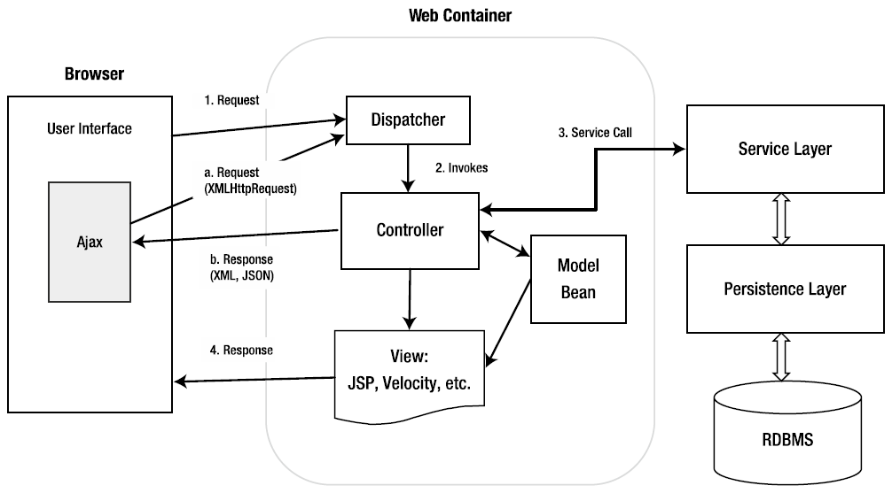
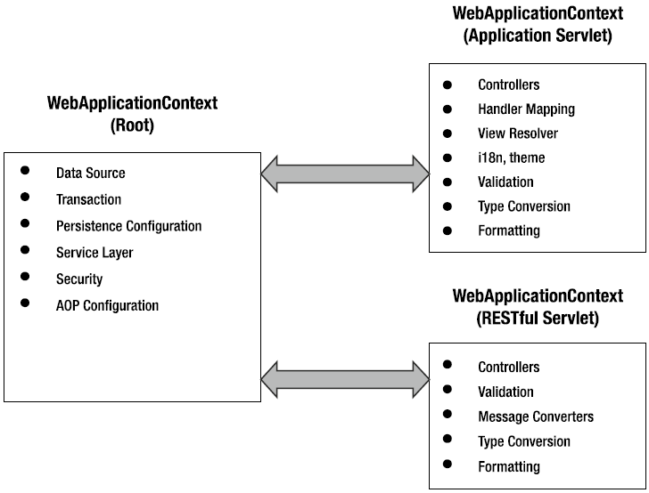
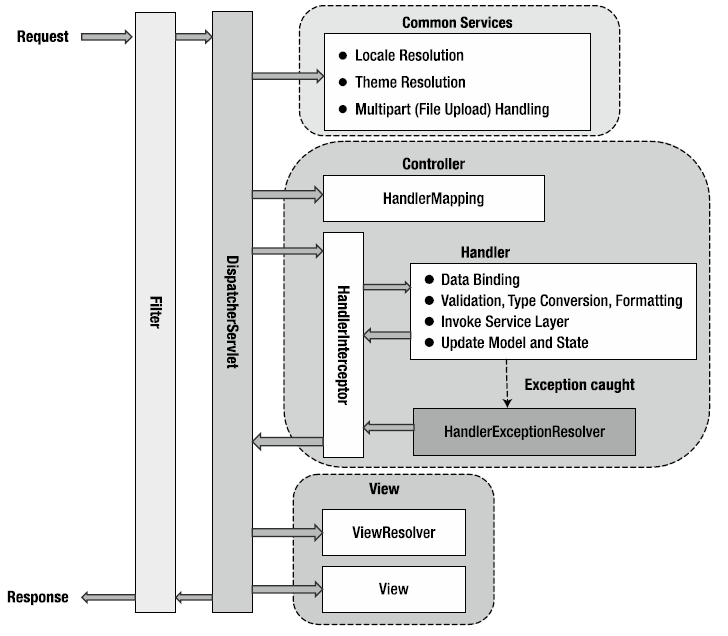
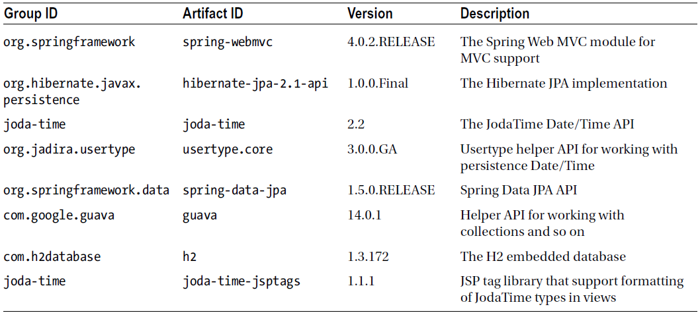
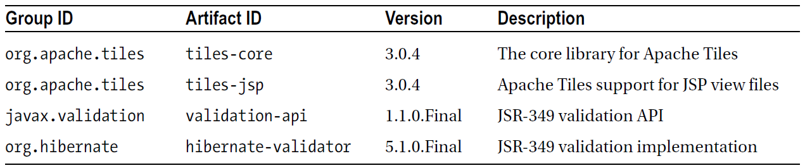
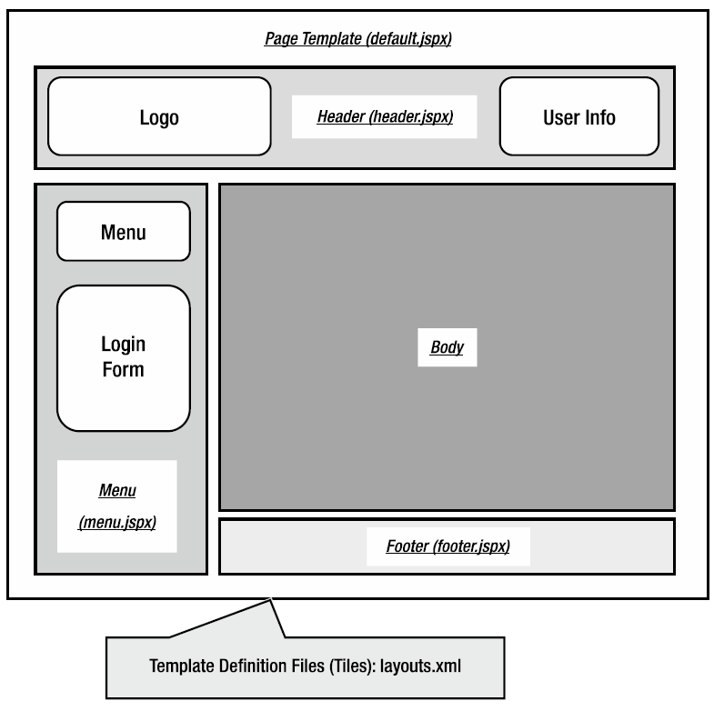

第16章 使用Spring开发Web应用程序
=
企业级应用程序中，用户对应用程序的优劣判断很大程度上是源自表示层的。表示层是应用程序的门面。它能让用户执行程序中定义的业务功能，还可以通过应用程序来维护用户的视图信息。用户界面如何执行大大有助于应用程序的成功。

因为互联网的爆炸式发展（尤其是近些年，人们可以使用多种终端设备接入互联网），开发应用程序的表示层成为了一项具有挑战性的任务。以下是一些在开发Web应用程序时需要考虑的要点：

- **性能**：性能对于web应用程序来说总是非常重要的一项要求。如果用户执行了一个系统功能或点击了一个连接而需要很长时间来执行（在互联网的世界中3秒即百年），用户一定不会对应用程序满意。
- **用户友好度**：应用程序应该易于使用和导航，力图结构清晰，不让用户迷惑。
- **强交互性与丰富性**：用户界面应该是高度互动和响应的。此外表示层还应该具有丰富的视觉呈现，如图表、仪表盘等类型的界面。
- **可访问性**：如今用户需要在任何地方可以使用各种终端设备来访问应用程序。在办公室里他们将使用电脑访问应用程序，在路上用户将使用不同的移动设备（包括笔记本电脑、平板电脑、智能手机等）来访问应用程序。

开发出一个能同时满足以上要求的Web应用程序不是很容易，但对于业务用户来说，这些是强制性的。幸运的是许多新技术和框架也被开发出来，以解决以上需要。有很多Web应用程序框架和库，比如Spring MVC、Struts、Tapestry、Java Server Faces （JSF）、Google Web Toolkit（GWT）、jQuery、Dojo，这仅仅是举几个例子，提供工具和丰富的组件库可以帮助我们开发出高交互性的web前端程序。此外很多框架针对包括智能手机和平板电脑在内的移动设备提供工具或相应的组件库。HTML5和CSS3标准的崛起以及支持这些最新标准的大多数浏览器厂商和移动设备制造商，也有助于缓解在任何地方任何设备上运行Web应用程序的开发层面的困难。

在Web应用程序开发方面，Spring提供了全面和深入的支持。Spring的MVC模块为Web应用程序的开发提供了一个坚实的基础和MVC（模型、视图、控制器）框架。当使用Spring MVC时，你可以使用不同的视图技术（如JSP或Velocity）。此外Spring MVC可与许多常见的web框架和工具包（例如Struts和GWT）集成在一起。其他Spring项目帮助解决web应用程序中的特定需求。例如让SpringMVC与Spring Web Flow项目和它的Spring Faces模块联合使用，会为使用复杂的流和使用JSF作为视图技术来开发web应用程序提供全面支持。简单的说，在表示层的开发中有很多技术可以被选择。

本章着重于讨论Spring MVC和如何使用Spring MVC提供的强大功能来开发出高性能web应用程序。本章会涵盖以下主题：

- **Spring MVC**：我们会讨论MVC部分的主要概念并介绍Spring MVC。我们介绍MVC的核心概念，包括WebApplicationContext的层次，及请求处理的生命周期。
- **国际化、本地化和主题**：Spring MVC为常见的Web应用程序需要提供了广泛的支持，包括国际化、本地化和主题。我们会讨论如何使用Spring MVC来开发支持这些需求的Web应用程序。
- **视图和AJAX支持**：Spring MVC支持很多种视图技术。在本章中我们主要使用JSP和Tiles作为Web应用程序中视图部分的技术。在JSP之上Javascript被用于提供富客户端技术。现在有许多优秀并且流行的JavaScript库，如jQuery和Dojo。本章我们关注使用jQuery，使用它的子项目jQuery UI库来支持开发高交互性的Web应用程序。
- **分页和文件上传支持**：在开发本章中例子的时候，我们讨论我们如何能使用Spring Data JPA与前端jQuery组件提供的分页支持，来开发基于网格浏览数据的功能。此外还讲述了如何使用Spring MVC来实现文件上传的功能。抛开Apache Commons File Upload组件，我们讨论如何在Servlet 3.1的容器提供的multipart内置功能之上，使用Spring MVC来进行文件上传。
- **安全**：安全在web应用程序中是一个非常重要的话题。我们将讨论如何使用Spring Security帮助保护应用程序及处理登录和注销。
16.1 实现例程中的服务层
-
在本章例程中的服务层，我们仍然使用联系人的那个例子。在这部分中我们会讨论数据模型和服务层的实现。
###16.1.1 使用例程中的数据模型
对于本章中的数据模型样例，我们会使用一个比较简单的模型，只包含一个存储联系人信息的单表CONTACT。代码16-1展示了创建schema的数据库脚本。

	代码16-1 样例数据库的schema
	DROP TABLE IF EXISTS CONTACT;
	CREATE TABLE CONTACT (
	    ID INT NOT NULL AUTO_INCREMENT
	    , FIRST_NAME VARCHAR(60) NOT NULL
	    , LAST_NAME VARCHAR(40) NOT NULL
	    , BIRTH_DATE DATE
	    , DESCRIPTION VARCHAR(2000)
	    , PHOTO BLOB
	    , VERSION INT NOT NULL DEFAULT 0
	    , UNIQUE UQ_CONTACT_1 (FIRST_NAME, LAST_NAME)
	    , PRIMARY KEY (ID)
	);
如你所见，CONTACT表中只存储着几个与联系人信息相关的基础字段，其中PHOTO字段应该提一下，它是BLOB（二进制大对象）类型的，用于保存联系人上传的照片文件。代码16-2
展示了插入测试数据的脚本（test-data.sql）。

	代码16-2 插入测试数据的脚本
	insert into contact (first_name, last_name, birth_date) values ('Chris', 'Schaefer', '1981-05-03');
	insert into contact (first_name, last_name, birth_date) values ('Scott', 'Tiger', '1990-11-02');
	insert into contact (first_name, last_name, birth_date) values ('John', 'Smith', '1964-02-28');
	insert into contact (first_name, last_name, birth_date) values ('Peter', 'Jackson', '1944-1-10');
	insert into contact (first_name, last_name, birth_date) values ('Jacky', 'Chan', '1955-10-31');
	insert into contact (first_name, last_name, birth_date) values ('Susan', 'Boyle', '1970-05-06');
	insert into contact (first_name, last_name, birth_date) values ('Tinner', 'Turner', '1967-04-30');
	insert into contact (first_name, last_name, birth_date) values ('Lotus', 'Notes', '1990-02-28');
	insert into contact (first_name, last_name, birth_date) values ('Henry', 'Dickson', '1997-06-30');
	insert into contact (first_name, last_name, birth_date) values ('Sam', 'Davis', '2001-01-31');
	insert into contact (first_name, last_name, birth_date) values ('Max', 'Beckham', '2002-02-01');
	insert into contact (first_name, last_name, birth_date) values ('Paul', 'Simon', '2002-02-28');
这一次为了支持显示分页，所以填充了更多的测试数据。

###16.1.2 实现和配置ContactService
在以下几节中我们首先讨论使用JPA2、Spring JPA Data、Hibernate作为持久层服务提供者来实现ContactService。然后将介绍在Spring项目中配置服务层。

####16.1.2.1 实现ContactService
在这个例子中我们会公开各种服务方法来操作联系人，使其与表示层交互。首先我们需要创建联系人的实体类，如代码16-3所示。

	代码16-3 Contact实体类
	package com.apress.prospring4.ch16;
	import static javax.persistence.GenerationType.IDENTITY;
	import java.io.Serializable;
	import org.hibernate.annotations.Type;
	import org.joda.time.DateTime;
	import org.springframework.format.annotation.DateTimeFormat;
	import org.springframework.format.annotation.DateTimeFormat.ISO;
	import javax.persistence.Basic;
	import javax.persistence.Column;
	import javax.persistence.Entity;
	import javax.persistence.FetchType;
	import javax.persistence.GeneratedValue;
	import javax.persistence.Id;
	import javax.persistence.Lob;
	import javax.persistence.Table;
	import javax.persistence.Transient;
	import javax.persistence.Version;
	@Entity
	@Table(name = "contact")
	public class Contact implements Serializable {
	    private Long id;
	    private int version;
	    private String firstName;
	    private String lastName;
	    private DateTime birthDate;
	    private String description;
	    private byte[] photo;
	    @Id
	    @GeneratedValue(strategy = IDENTITY)
	    @Column(name = "ID")
	    public Long getId() {
	        return id;
	    }
	    public void setId(Long id) {
	        this.id = id;
	    }
	    @Version
	    @Column(name = "VERSION")
	    public int getVersion() {
	        return version;
	    }
	    public void setVersion(int version) {
	        this.version = version;
	    }
	    @Column(name = "FIRST_NAME")
	    public String getFirstName() {
	        return firstName;
	    }
	    public void setFirstName(String firstName) {
	        this.firstName = firstName;
	    }
	    @Column(name = "LAST_NAME")
	    public String getLastName() {
	        return lastName;
	    }
	    public void setLastName(String lastName) {
	        this.lastName = lastName;
	    }
	    @Column(name = "BIRTH_DATE")
	    @Type(type="org.jadira.usertype.dateandtime.joda.PersistentDateTime")
	    @DateTimeFormat(iso=ISO.DATE)
	    public DateTime getBirthDate() {
	        return birthDate;
	    }
	    public void setBirthDate(DateTime birthDate) {
	        this.birthDate = birthDate;
	    }
	    @Column(name = "DESCRIPTION")
	    public String getDescription() {
	        return description;
	    }
	    public void setDescription(String description) {
	        this.description = description;
	    }
	    @Basic(fetch= FetchType.LAZY)
	    @Lob
	    @Column(name = "PHOTO")
	    public byte[] getPhoto() {
	        return photo;
	    }
	    public void setPhoto(byte[] photo) {
	        this.photo = photo;
	    }
	    @Transient
	    public String getBirthDateString() {
	        String birthDateString = "";
	        if (birthDate != null)
	            birthDateString = org.joda.time.format.DateTimeFormat.forPattern("yyyy-MM-dd").print(birthDate);
	        return birthDateString;
	    }
	    @Override
	    public String toString() {
	        return "Contact - Id: " + id + ", First name: " + firstName
	            + ", Last name: " + lastName + ", Birthday: " + birthDate
	            + ", Description: " + description;
	    }
	}
如代码16-3，我们使用标准JPA的注解，并为birthDate属性使用了自定义的JodaTime的DateTime。还请注意以下两点：
- 添加了一个新的瞬时（在相应的get方法上使用了@Transient注解）属性birthDateString，它主要用于前端的展示。
- 对于photo属性，我们使用一个字节数组作为它的Java数据类型，这对应RDBMS的BLOB数据类型，此外在其get方法上标注了@Lob和@Basic(fetch=FetchType.LAZY)。前者为JPA提供者表明这是一个大对象列，而后者表明这个属性应该被延迟加载，这主要是出于性能考虑，当加载类时不需要照片信息。
让我们继续处理服务层。代码16-4展示了ContactService接口，其中包含着我们想要公开的服务。

	代码16-4 ContactService服务
	package com.apress.prospring4;
	import java.util.List;
	public interface ContactService {
	    List<Contact> findAll();
	    Contact findById(Long id);
	    Contact save(Contact contact);
	}
这些方法不言而喻。因为我们要使用Spring Data JPA的存储支持，将实现ContactRepository接口，如代码16-5。

	代码16-5 ContactRepository接口
	package com.apress.prospring4.ch16;
	import org.springframework.data.repository.CrudRepository;
	public interface ContactRepository extends CrudRepository<Contact, Long> {
	}
	代码16-6展示了ContactService接口的实现类
	代码16-6 ContactServiceImpl实现类
	package com.apress.prospring4.ch16;
	import java.util.List;
	import org.springframework.beans.factory.annotation.Autowired;
	import org.springframework.stereotype.Repository;
	import org.springframework.stereotype.Service;
	import org.springframework.transaction.annotation.Transactional;
	import com.google.common.collect.Lists;
	@Repository
	@Transactional
	@Service("contactService")
	public class ContactServiceImpl implements ContactService {
	    private ContactRepository contactRepository;
	    @Override
	    @Transactional(readOnly=true)
	    public List<Contact> findAll() {
	        return Lists.newArrayList(contactRepository.findAll());
	    }
	    @Override
	    @Transactional(readOnly=true)
	    public Contact findById(Long id) {
	        return contactRepository.findOne(id);
	    }
	    @Override
	    public Contact save(Contact contact) {
	        return contactRepository.save(contact);
	    }
	    @Autowired
	    public void setContactRepository(ContactRepository contactRepository) {
	        this.contactRepository = contactRepository;
	    }
	}
实现基本完成，下一步是在基于Web项目的Spring的ApplicationContext中配置服务，这将在下一节讨论。
16.1.2.2 配置ContactService
为设置服务层中的Spring MVC项目，首先我们要创建一个单独的配置文件datasource-tx-jpa.xml。如代码16-7所示。

	代码16-7 datasource-tx-jpa.xml配置文件
	<?xml version="1.0" encoding="UTF-8"?> 
	<beans xmlns="http://www.springframework.org/schema/beans" 
	    xmlns:xsi="http://www.w3.org/2001/XMLSchema-instance" 
	    xmlns:context="http://www.springframework.org/schema/context" 
	    xmlns:jdbc="http://www.springframework.org/schema/jdbc" 
	    xmlns:jpa="http://www.springframework.org/schema/data/jpa" 
	    xmlns:tx="http://www.springframework.org/schema/tx" 
	    xsi:schemaLocation="http://www.springframework.org/schema/beans
	        http://www.springframework.org/schema/beans/spring-beans.xsd
	        http://www.springframework.org/schema/context
	        http://www.springframework.org/schema/context/spring-context.xsd
	        http://www.springframework.org/schema/jdbc
	        http://www.springframework.org/schema/jdbc/spring-jdbc.xsd
	        http://www.springframework.org/schema/data/jpa
	        http://www.springframework.org/schema/data/jpa/spring-jpa.xsd
	        http://www.springframework.org/schema/tx
	        http://www.springframework.org/schema/tx/spring-tx.xsd"> 
	    <jdbc:embedded-database id="dataSource" type="H2"> 
	        <jdbc:script location="classpath:META-INF/sql/schema.sql"/> 
	        <jdbc:script location="classpath:META-INF/sql/test-data.sql"/> 
	    </jdbc:embedded-database> 
	    <bean id="transactionManager" class="org.springframework.orm.jpa.JpaTransactionManager"> 
	        <property name="entityManagerFactory" ref="emf"/> 
	    </bean> 
	    <tx:annotation-driven transaction-manager="transactionManager" /> 
	    <bean id="emf" class="org.springframework.orm.jpa.LocalContainerEntityManagerFactoryBean"> 
	        <property name="dataSource" ref="dataSource" /> 
	        <property name="jpaVendorAdapter"> 
	            <bean class="org.springframework.orm.jpa.vendor.HibernateJpaVendorAdapter" /> 
	        </property> 
	        <property name="packagesToScan" value="com.apress.prospring4"/> 
	        <property name="jpaProperties"> 
	            <props> 
	                <prop key="hibernate.dialect">org.hibernate.dialect.H2Dialect</prop> 
	                <prop key="hibernate.max_fetch_depth">3</prop> 
	                <prop key="hibernate.jdbc.fetch_size">50</prop> 
	                <prop key="hibernate.jdbc.batch_size">10</prop> 
	                <prop key="hibernate.show_sql">true</prop> 
	            </props> 
	        </property> 
	    </bean> 
	    <context:annotation-config/> 
	    <jpa:repositories base-package="com.apress.prospring4.ch16" entity-manager-factory-ref="emf" transaction-manager-ref="transactionManager"/> 
	</beans>
接下来我们需要把配置导入到Spring的根WebApplicationContext里。代码16-8展示了配置文件。

	代码16-8 root-context.xml配置文件
	<?xml version="1.0" encoding="UTF-8"?> 
	<beans xmlns="http://www.springframework.org/schema/beans" 
	    xmlns:xsi="http://www.w3.org/2001/XMLSchema-instance" 
	    xmlns:context="http://www.springframework.org/schema/context" 
	    xsi:schemaLocation="http://www.springframework.org/schema/beans
	        http://www.springframework.org/schema/beans/spring-beans.xsd
	        http://www.springframework.org/schema/context
	        http://www.springframework.org/schema/context/spring-context.xsd"> 
	    <import resource="classpath:META-INF/spring/datasource-tx-jpa.xml" /> 
	    <context:component-scan base-package="com.apress.prospring4.ch16" /> 
	</beans>
首先在配置文件中添加context命名空间。然后把datasource-tx-jpa.xml文件导入到WebApplicationContext中，最后我们为Spring指明扫描Bean的包。

现在服务层已经完成，准备为远程客户端公开并使用。
###16.2 MVC和Spring MVC简介
在继续实现表示层之前，让我们先熟悉一些MVC的主要概念，MVC是Web应用程序中的模式，并了解在这个领域Spring MVC是如何提供全面的支持的。

在以下部分中，我们会提出这些高级概念。首先我们给出一个对MVC的简要介绍。然后描述出一张Spring MVC和它的WebApplicationContext层次上的高级视图。最后我们将讨论在Spring MVC中的请求生命周期。
###16.2.1 MVC简介
在应用程序的表示层实现方面MVC是一种常见的模式。MVC模式的主要原则是定义一个具有明确职责的不同组件的架构。正如其名，MVC模式由三部分组成：

- 模型：模型表示业务数据以及应用程序上下文中的用户“状态”。例如在一个电子商务的网站中，模型将包括用户的配置信息，如果用户在网站上购买商品，则还会有购物车数据和订单数据。
- 视图：把数据表示为用户需要的格式，支持与用户的交互，支持客户端验证，国际化，风格等等。
- 控制器：在前端，控制器处理用户请求的行为，与服务层进行交互，更新模型，并把用户引导到合适的基于结果的视图。

因为基于AJAX的web应用程序的兴起，为了能提供响应性更强或更丰富的用户体验，MVC模式得到了增强。例如当使用JavaScript时，视图可以“监听”事件或用户的行为，然后向服务器提交一个XMLHttpRequest。在控制器端，不再返回视图，而只返回原始数据（如XML或JSON格式）。JavaScript应用程序执行视图的局部数据更新。图16-1展示了这个概念。

**图16-1 MVC模式**

图16-1说明了常用的web应用程序的模式，这可以被视为是一个对传统的MVC模式的增强。普通视图的请求会按如下步骤处理：

- 请求：提交一个请求到服务器。在服务器端很多框架（如Spring MVC、Struts 2）使用一个转发器（一个Servlet）来处理请求。
- 调用：转发器转发请求到相应的基于HTTP请求信息和web应用程序的配置的控制器上。
- 使用调用：控制器与服务层进行交互。
- 响应：控制器更新模型，并根据执行结果向用户返回相应的视图。

此外，在视图中Ajax调用也会发生。例如，用户使用风格浏览数据。当用户点击下一页时不会整页刷新，而是执行以下步骤：

- 请求：XMLHttpRequest被准备并提交到服务器。转发器将转发请求到相应的控制器上。
- 响应：控制器与服务层进行交互后，响应数据将被格式化，并且发送到浏览器。在这种情况下不涉及视图。浏览器获取到数据，并且在现有视图上执行局部更新。

###16.2.2 Spring MVC简介
在Spring框架中，Spring MVC模块为MVC模式提供了全面的支持，还支持其他功能（例如主题化、国际化、验证及类型转换和格式化）来简化表示层的实现。

以下部分我们将讨论Spring MVC的主要概念。主题包括Spring MVC 的WebApplicationContext层次结构，一个典型的请求处理生命周期和配置。

####16.2.2.1 Spring MVC的WebApplicationContext层次结构
在Spring MVC中，DispatcherServlet是接收请求并将它们分派到适当的控制器上的中央Servlet。在Spring MVC的应用程序中为了不同目的（例如处理用户界面请求和RESTful-WS请求）可以有任意数量的DispatcherServlets，并且每个DispatcherServlet有自己的WebApplicationContext配置，它定义了Servlet级别功能，如控制器支持Servlet，处理器映射，视图解析，国际化，主题化，校验，类型转换和格式化。

在Servlet级别的WebApplicationContext配置之下Spring MVC还维护着一个根WebApplicationContext，其中包括应用程序级别的配置，如后端数据源、安全、服务和持久层的配置。根WebApplicationContext将提供给所有servlet级别的WebApplicationContexts使用。

让我们来看一个例子。在我们的应用程序中有两个DispatcherServlets。一个Servlet支持用户界面（我们称之为应用程序Servlet）。另一个是RESTful-WS的形式，为其他应用程序提供服务（我们称之为RESTful Servlet）。在Spring MVC中，我们将为根WebApplicationContext和两个DispatcherServlets的WebApplicationContext定义配置。图16-2展示了由Spring MVC维护的WebApplicationContext层次结构的情况。

**图16-2 Spring MVC WebApplicationContext层次结构**
####16.2.2.2 Spring MVC的请求生命周期
让我们看看Spring MVC处理的一个请求。图16-3展示了在Spring MVC中处理一个请求时主要参与的组件。

**图16-3 Spring MVC请求生命周期**

主要的组件及其目的如下：

- Filter：过滤器适用于每一个请求。几个常用的过滤器和他们的用途将在下一节中介绍。
- Dispatcher servlet：这个Servlet分析请求并转发它们到适当的控制器去进行处理。
- Common services：常用的服务将应用于每一个请求来提供各种支持，包括国际化、主题化和文件上传。它们的配置被定义在DispatcherServlet的WebApplicationContext中。
- Handler mapping：把请求映射到处理器（Spring MVC控制器类中的一个方法）。从Spring 2.5以后，在大多数情况下不需要进行配置，因为Spring会自动注册org.springframework.web.servlet.mvc. annotation.DefaultAnnotationHandlerMapping类，它通过标在控制器类上的或其方法上的@RequestMapping标注来把处理器映射成基于HTTP的路径表示。
- Handler interceptor：在Spring MVC中可以为处理器注册拦截器来实现常用的检查和逻辑。例如一个处理器拦截器能确保某个处理器只在办公时间被调用。
- Handler exception resolver：在Spring MVC中HandlerExceptionResolver接口（位于org.springframework.web.servlet包下）被设计为在通过处理器处理请求期间，解决那些被抛出的出乎意料的异常。默认情况下DispatcherServlet会注册DefaultHandlerExceptionResolver类（位于org.springframework.web.servlet.mvc.support包下）。这个解析器通过设置特定的响应状态码来处理某些标准的Spring MVC异常。也可以通过在控制器中的方法上标注@ExceptionHandler注解，并传入异常类型来实现自己的异常处理程序。
- View Resolver：Spring MVC的ViewResolver接口（位于org.springframework.web.servlet包下）支持通过基于控制器返回的逻辑名称来解析视图。有很多实现类来支持各种视图解析机制。例如UrlBasedViewResolver类支持把逻辑名称直接解析成为URL。ContentNegotiatingViewResolver类支持动态的解析依赖于客户端所支持的媒体类型的视图（如XML、PDF、JSON）。也存在大量对不同视图技术进行整合的实现，如FreeMarker （FreeMarkerViewResolver），Velocity （VelocityViewResolver）和JasperReports （JasperReportsViewResolver）。

这些描述只涉及几个常用的处理器和解析器。对于完整的描述请参阅Spring框架的参考文档和它的Javadoc。
####16.2.2.3 Spring MVC的配置
为了在Web应用程序中使用Spring MVC，首先要进行一些初始配置，尤其是对Web部署描述符web.xml文件的配置。从Spring3.1开始，在一个可用的Servlet 3.0 web容器中支持基于代码的配置，我们将在本章稍后的“支持基于Servlet 3的代码配置”部分进行讨论。

为了配置支持Spring MVC的web应用程序，我们需要在web部署描述符文件中执行以下的配置：

- 配置根WebApplicationContext
- 配置Spring MVC所需的Servlet过滤器
- 在应用程序中配置转发器Servlet

首先创建Servlet 3.0的web.xml文件。代码16-9展示了它的内容。

	代码16-9 Spring MVC的Web部署描述文件
	<?xml version="1.0" encoding="UTF-8"?>
	<web-app version="3.0" xmlns="http://java.sun.com/xml/ns/javaee"
	xmlns:xsi="http://www.w3.org/2001/XMLSchema-instance"
	xsi:schemaLocation="http://java.sun.com/xml/ns/javaee
	http://java.sun.com/xml/ns/javaee/web-app_3_0.xsd">
	    <context-param>
	        <param-name>contextConfigLocation</param-name>
	        <param-value>/WEB-INF/spring/root-context.xml</param-value>
	    </context-param>
	    <filter>
	        <filter-name>CharacterEncodingFilter</filter-name>
	        <filter-class>org.springframework.web.filter.CharacterEncodingFilter</filter-class>
	        <init-param>
	            <param-name>encoding</param-name>
	            <param-value>UTF-8</param-value>
	        </init-param>
	        <init-param>
	            <param-name>forceEncoding</param-name>
	            <param-value>true</param-value>
	        </init-param>
	    </filter>
	    <filter>
	        <filter-name>HttpMethodFilter</filter-name>
	        <filter-class>org.springframework.web.filter.HiddenHttpMethodFilter</filter-class>
	    </filter>
	    <filter>
	        <filter-name>Spring OpenEntityManagerInViewFilter</filter-name>
	        <filter-class>org.springframework.orm.jpa.support.OpenEntityManagerInViewFilter</filter-class>
	    </filter>
	    <filter-mapping>
	        <filter-name>CharacterEncodingFilter</filter-name>
	        <url-pattern>/*</url-pattern>
	    </filter-mapping>
	    <filter-mapping>
	        <filter-name>HttpMethodFilter</filter-name>
	        <url-pattern>/*</url-pattern>
	    </filter-mapping>
	    <filter-mapping>
	        <filter-name>Spring OpenEntityManagerInViewFilter</filter-name>
	        <url-pattern>/*</url-pattern>
	    </filter-mapping>
	    <listener>
	        <listener-class>org.springframework.web.context.ContextLoaderListener</listener-class>
	    </listener>
	    <servlet>
	        <servlet-name>appServlet</servlet-name>
	        <servlet-class>org.springframework.web.servlet.DispatcherServlet</servlet-class>
	        <init-param>
	            <param-name>contextConfigLocation</param-name>
	            <param-value>/WEB-INF/spring/appServlet/servlet-context.xml</param-value>
	        </init-param>
	        <load-on-startup>1</load-on-startup>
	    </servlet>
	    <servlet-mapping>
	        <servlet-name>appServlet</servlet-name>
	        <url-pattern>/</url-pattern>
	    </servlet-mapping>
	</web-app>
代码16-9中的要点如下：

在`<web-app>`标签中，version属性和相应的URL用于指明web容器运行的web应用程序将使用Servlet 3.0标准。

在`<context-param>`标签中有一个contextConfigLocation参数，它定义了Spring的根WebApplicationContext配置文件的位置。

一些Spring MVC提供的Servlet过滤器被定义，所有过滤器被映射到Web应用程序的根路径下。这些过滤器是web应用程序中经常使用的。表16-1展示了过滤器的配置和各自的用途。

**表16-1 常用的Spring MVC Servlet过滤器**
<table>
<tr><th>
过滤器类名称</th><th>
描述</th></tr>
<tr><td>
org.springframework.web.filter.CharacterEncodingFilter
</td><td>
这个过滤器用于指定请求的字符编码
</td></tr>
<tr><td>
org.springframework.web.filter. HiddenHttpMethodFilter
</td><td>
这个过滤器支持HTTP GET和POST以外的方法（如PUT）
</td></tr>
<tr><td>
org.springframework.orm.jpa.support. OpenEntityManagerInViewFilter
</td><td>
这个过滤器将JPA EntityManager绑定到整个处理请求的线程上
</td></tr>
</table>
定义了一个org.springframework.web.context.ContextLoaderListener类的监听器。它被用于启动和关闭Spring的根WebApplicationContext。

定义了一个叫做appServlet的转发器Servlet。WebApplicationContext的转发器Servlet被定位在/src/main/webapp/WEB-INF/spring/appServlet/servletcontext. xml中。
16.3 使用Spring MVC创建第一个视图
-
在创建了适当的服务层和Spring MVC配置后，我们可以开始实现自己的第一个视图。在本节中我们会实现一个简单的视图，显示由最初的测试数据脚本（test-data.sql）产生的所有联系人信息。

正如前面所提到的，我们将使用JSPX实现视图。JSPX是一种符合JSP语法规则的XML格式。JSPX比JSP更具优势表现在以下方面：

- JSPX促使代码从视图层更彻底的分离出来。例如你不能把Java的程序脚本嵌入到JSPX的文档中。
- 工具可能执行即时验证（使用XML语法），所以错误可以更早的被感知。
- 
我们需要为我们的项目配置表16-2中列出的依赖关系。

**表16-2 Spring MVC视图层的Maven依赖**

###16.3.1 配置DispatcherServlet
下一步是配置DispatcherServlet。代码16-10显示了修改后的配置（/src/main/webapp/WEB-INF/spring/appServlet/servlet-context.xml）。

	代码16-10 DispatcherServlet的配置
	<?xml version="1.0" encoding="UTF-8"?>
	<beans:beans xmlns="http://www.springframework.org/schema/mvc"
	    xmlns:xsi="http://www.w3.org/2001/XMLSchema-instance"
	    xmlns:beans="http://www.springframework.org/schema/beans"
	    xmlns:context="http://www.springframework.org/schema/context"
	    xsi:schemaLocation="http://www.springframework.org/schema/mvc
	        http://www.springframework.org/schema/mvc/spring-mvc.xsd
	        http://www.springframework.org/schema/beans
	        http://www.springframework.org/schema/beans/spring-beans.xsd
	        http://www.springframework.org/schema/context
	        http://www.springframework.org/schema/context/spring-context.xsd">
	    <annotation-driven />
	    <resources mapping="/resources/**" location="/resources/" />
	    <beans:bean class="org.springframework.web.servlet.view.InternalResourceViewResolver">
	        <beans:property name="prefix" value="/WEB-INF/views/" />
	        <beans:property name="suffix" value=".jspx" />
	    </beans:bean>
	    <context:component-scan base-package="com.apress.prospring4.ch16" />
	</beans:beans>
mvc命名空间被定义为默认命名空间。`<annotation-driven>`标签允许支持Spring MVC中控制器的注解配置，同时支持Spring的类型转换和格式化。也支持JSR-349标准，Bean的校验也被此标签支持。`<resources>`标签定义了静态的资源（CSS、JavaScript和images）及它们的位置，所以Spring MVC能通过这些文件提高性能。`<context:component-scan>`标签你应该比较熟悉了。

对于ViewResolver接口，我们将继续使用InternalResourceViewResolver类作为实现。只不过我们要把suffix的值修改为.jspx。

###16.3.2 实现ContactController
DispatcherServlet的WebApplicationContext已经被配置，下一步是实现服务器类。代码16-11展示了ContactController类。

	代码16-11 ContactController类
	package com.apress.prospring4.ch16;
	import java.util.List;
	import org.slf4j.Logger;
	import org.slf4j.LoggerFactory;
	import org.springframework.beans.factory.annotation.Autowired;
	import org.springframework.stereotype.Controller;
	import org.springframework.ui.Model;
	import org.springframework.web.bind.annotation.RequestMapping;
	import org.springframework.web.bind.annotation.RequestMethod;
	@RequestMapping("/contacts")
	@Controller
	public class ContactController {
	    private final Logger logger = LoggerFactory.getLogger(ContactController.class);
	    private ContactService contactService;
	    @RequestMapping(method = RequestMethod.GET)
	    public String list(Model uiModel) {
	        logger.info("Listing contacts");
	        List<Contact> contacts = contactService.findAll();
	        uiModel.addAttribute("contacts", contacts);
	        logger.info("No. of contacts: " + contacts.size());
	        return "contacts/list";
	    }
	    @Autowired
	    public void setContactService(ContactService contactService) {
	        this.contactService = contactService;
	    }
	}
注解@Controller被标在了类上，表明这是一个Spring MVC控制器。在类上标的@RequestMapping注解映射了将由控制器来处理的URL根。假使这样的话，所有以/ch16/contacts为前缀的URL将被转发到这个控制器。在list()方法上也标有@RequestMapping注解，但这一次是把方法映射到HTTP的GET方法上。这意味着当使用HTTP的GET方式访问/ch16/contacts这个URL时这个方法将被处理。在list()方法中，会获取到联系人的列表，然后经过Spring MVC的处理，将其保存到通过方法传入的Model接口中。最后返回一个称为contacts/list的逻辑视图名称。在DispatcherServlet的配置中，InternalResourceViewResolver被配置成为视图解析器，它的前缀被配置成/WEB-INF/views/，而后缀是.jspx。因此，Spring MVC会获取/WEB-INF/views/contacts/list.jspx文件做为视图。

###16.3.3 实现联系人列表视图
下一步是实现视图页面来显示联系人信息，这个文件被保存在/src/main/webapp/WEB-INF/views/contacts/list.jspx。代码16-12展示了页面的内容。

	代码16-12 联系人列表视图
	<?xml version="1.0" encoding="UTF-8" standalone="no"?> 
	
 
	    <jsp:directive.page contentType="text/html;charset=UTF-8"/> 
	    <jsp:output omit-xml-declaration="yes"/> 
	    <h1>Contact Listing</h1> 
	    <c:if test="${not empty contacts}"> 
	        <table> 
	            <thead> 
	                <tr> 
	                    <th>First Name</th> 
	                    <th>Last Name</th> 
	                    <th>Birth Date</th> 
	                </tr> 
	            </thead>
	            <tbody>
	                <c:forEach items="${contacts}" var="contact">
	                    <tr>
	                        <td>${contact.firstName}</td>
	                        <td>${contact.lastName}</td>
	                        <td><joda:format value="${contact.birthDate}" pattern="yyyy-MM-dd"/></td>
	                    </tr>
	                </c:forEach>
	            </tbody>
	        </table>
	    </c:if>
	

如果你之前开发过JSP，代码16-12中的内容应该比较熟悉。但由于这是一个JSPX页面，其内容是嵌入在`
`标记中的。此外，使用的标签库被声明在XML的命名空间中。

首先`<jsp:directive.page>`标签定义了适用于整个JSPX页面的属性。`<jsp:output>`标签控制JSPX文档输出的属性。

其次`<c:if>`标签检查模型的contacts属性是否为空。因为我们已经在数据库中填写了一些联系人信息，所以contacts属性应该包含有数据。因此`<c:forEach>`标签会使用联系人数据来渲染此页面中的表格。`<joda:format>`标签是用于格式化birthDate属性的，使用的是JodaTime的DateTime类型。
###16.3.4 测试联系人列表视图
我们现在已经可以测试联系人的列表视图了。首先要构建和部署应用程序，然后测试联系人列表视图，打开浏览器，然后访问<http://localhost:8080/contact-webapp/contacts>。你可以看到联系人的信息列表页面。

现在我们已经完成了第一项工作。接下来的部分中我们会创建更多的视图来丰满这个应用程序，并支持国际化、主题化等功能。

16.4 理解Spring MVC的项目结构
=
在深入到web应用程序各个方面的实现之前，让我们先来看一看本章中出现的样例Web应用程序的项目结构。

通常在一个web应用程序中，很多文件需要用于支持各种功能。例如会出现大量静态资源文件，如CSS样式文件、Javascript脚本文件、图片及组件库等。还有一些文件支持各种语言的界面呈现。当然，这些视图页面将通过Web容器被解析和呈现，同时布局和定义文件将使用模板框架（例如Apache的Tiles），以便为应用程序提供一种一致的外观和感觉。

把不同用途的文件存储在一个结构良好的文件夹层次结构是一个很好的实践方式，应用程序所使用的各种资源如果结构明确，则可以为后续的维护工作带来便利。

表16-3中列出了web应用程序的文件夹结构，在本章后续的程序会按这些目录的目的逐个被开发。
注意，这里给出的结构不是强制性的，但这是在web应用程序的开发者社区中常用的结构。

**表16-3 Web项目样例的文件夹结构描述**
<table>
<tr><td>
文件夹名称
</td><td>
用途
</td><td>
注意
</td></tr>
<tr><td>
ckeditor</td><td>
CKEditor (http://ckeditor.com)是一个Javascript组件库，提供一个富文本输入表单。我们会使用它来完成联系人描述信息的富文本编辑。</td><td>
从样例的源代码中把这个文件夹复制到你的项目的文件夹下。</td></tr>
<tr><td>
jqgrid</td><td>
jqGrid (www.trirand.com/blog)是一个基于JQuery的组件，为数据的展示提供了一些网格的组件。这个组件我们主要用于把联系人的信息显示到网格上，并支持Ajax风格的分页。</td><td>
从样例的源代码中把这个文件夹复制到你的项目的文件夹下。</td></tr>
<tr><td>
scripts</td><td>
这是所有通用JavaScript文件的文件夹。例如本章中为实现富用户界面使用的jQuery (http://jquery.org)和jQuery UI (http://jqueryui.com)的JavaScript库。它们的脚本将会放在这个文件夹下。公司内部的JavaScript库也应该放在这里。</td><td>
从样例的源代码中把这个文件夹复制到你的项目的文件夹下。</td></tr>
<tr><td>
styles</td><td>
存储样式表文件及其使用的相关图片文件。</td><td>
从样例的源代码中把这个文件夹复制到你的项目的文件夹下。</td></tr>
<tr><td>
WEB-INF/i18n</td><td>
国际化文件。application*.properties这样的文件存储与布局相关的文本（如页面标题、输入控件的标签、菜单项）。message*.properties这样的文件存储各种消息（如成功、失败、校验信息）。本样例中我们使用英语（US）和中文（HK）。</td><td>
从样例的源代码中把这个文件夹复制到你的项目的文件夹下。</td></tr>
<tr><td>
WEB-INF/layouts</td><td>
存储布局视图和定义。这些文件会使用Apache Tiles (http://tiles.apache.org)这个模板框架。</td><td>&nbsp;</td></tr>
<tr><td>
WEB-INF/spring</td><td>
存储Spring MVC的WebApplicationContext配置，根级别和转发器Servlet级别的上下文配置都被保存在这个文件夹下。</td><td>&nbsp;</td><tr>
<tr><td>
WEB-INF/views</td><td>
存储着应用程序要使用的视图文件（在我们的例子里是JSPX文件）。
</td><td>&nbsp;</td></tr>
</table>
在接下来的部分，我们需要各种各样的文件（如CSS文件，Javascript脚本文件和图片等）来支持实现。CSS和Javascript的文件内容不会在这里展示，因此我们建议你下载本章的源代码，并把它解压到临时文件夹下，从中可以找到这些文件，并把你需要的文件直接复制到项目中。
16.5 使用国际化（i18n）
-
在开发web应用程序的早期阶段使用i18n通常是很好的做法。其主要的工作是把文本和消息从用户界面中分离出来，并将它们存储到属性文件中去。

即使在最初的时候可能没有国际化的需求，但是把相关的语言抽离到外部文件中也是很有价值的，这样做，可以在当你需要支持更多的语言时进行很容易的扩展。

在Spring MVC中使用国际化是非常简单的。首先把用户界面中的文本所使用的各种语言外部化到属性文件中，并把它们存储到/WEB-INF/i18n这个文件夹下，如表16-3中描述。因为我们将要支持英语（US）和繁体中文（HK），所以需要4个文件。application.properties和message.properties这两个文件对默认语言环境进行配置，在这个例子中是英语（US）。此外，application_zh_ HK.properties和message_zh_HK.properties是对繁体中文的配置。

###16.5.1 在DispatcherServlet的配置中配置国际化
所语言配置好后，下一步是为国际化的支持配置DispatcherServlet的WebApplicationContext。

代码16-13展示了为了支持国际化而修改后的配置文件（servlet-context.xml）。

	代码16-13 修改后的Servlet上下文配置
	<?xml version="1.0" encoding="UTF-8"?>
	<beans:beans xmlns="http://www.springframework.org/schema/mvc"
	    xmlns:xsi="http://www.w3.org/2001/XMLSchema-instance"
	    xmlns:beans="http://www.springframework.org/schema/beans"
	    xmlns:p="http://www.springframework.org/schema/p"
	    xmlns:context="http://www.springframework.org/schema/context"
	    xsi:schemaLocation="http://www.springframework.org/schema/mvc
	        http://www.springframework.org/schema/mvc/spring-mvc.xsd
	        http://www.springframework.org/schema/beans
	        http://www.springframework.org/schema/beans/spring-beans.xsd
	        http://www.springframework.org/schema/context
	        http://www.springframework.org/schema/context/spring-context.xsd">
	    <annotation-driven />
	    <resources location="/, classpath:/META-INF/web-resources/" mapping="/resources/**"/>
	    <default-servlet-handler/>
	    <beans:bean class="org.springframework.web.servlet.view.InternalResourceViewResolver">
	        <beans:property name="prefix" value="/WEB-INF/views/" />
	        <beans:property name="suffix" value=".jspx" />
	    </beans:bean>
	    <context:component-scan base-package="com.apress.prospring4.ch16" />
	    <interceptors>
	        <beans:bean class="org.springframework.web.servlet.i18n.LocaleChangeInterceptor" p:paramName="lang"/>
	    </interceptors>
	    <beans:bean class="org.springframework.context.support.ReloadableResourceBundleMessageSource"
	        id="messageSource" p:basenames="WEB-INF/i18n/messages,WEB-INF/i18n/application"
	        p:fallbackToSystemLocale="false"/>
	    <beans:bean class="org.springframework.web.servlet.i18n.CookieLocaleResolver"
	        id="localeResolver" p:cookieName="locale"/>
	</beans:beans>
在代码16-13中首先补充了p命名空间，并且资源定义被修改为表16-3中所呈现的新的目录结构。`<resources>`标签属于Spring 3引入的mvc命名空间。这个标签定义了静态资源文件的位置，这使Spring MVC可以有效的处理存储在这些文件夹中的文件。此标签中的`location`属性定义静态资源的文件夹。第一个路径是‘/’，表明web应用程序的根目录，‘/src/main/webapp’目录是第二个路径，‘classpath:/META-INF/web-resources/’为被包含的库指明了资源文件。如果你引入Spring JavaScript模块，则这将很有用，会在`/META-INF/web-resources`目录中存储支持的资源文件。`mapping`属性定义了URL到资源文件的映射；例如有一个URL：http://localhost:8080/contact-webapp/resources/styles/standard.css，Spring MVC将从/src/main/webapp/styles目录检索standard.css。`<default-servlet-handler/>`标签让DispatcherServlet映射到web应用程序的根上下文URL，并且允许静态资源的请求被容器的默认servlet处理。

第二，Spring MVC中的拦截器类LocaleChangeInterceptor被定义，拦截所有到达DispatcherServlet的请求。这个拦截器通过可配置的请求参数来支持语言环境的切换。通过拦截器的配置，URL使用被定义的名为lang的参数来改变应用程序的语言环境。

然后定义了一个类型为ReloadableResourceBundleMessageSource的Bean。ReloadableResourceBundleMessageSource类实现了MessageSource接口，可以从被定义的文件中加载消息（本例中`messages*.properties`和`application*.properties`被存储在/WEB-INF/i18n目录下）来支持国际化。注意fallbackToSystemLocale属性。它指示当应用程序运行时，一个特殊的资源绑定在客户端区域设置中没有被发现，Spring MVC是否回退到系统的默认区域设置上。

最后是一个CookieLocaleResolver类型的Bean。这个类支持对用户浏览器的cookie进行地区设置的存储和检索。

###16.5.2 为联系人列表视图加入国际化支持
现在我们可以改变JSPX页面来显示国际化消息了。代码16-14展示了修改后的联系人列表视图（list.jspx）。

	代码16-14 支持国际化的联系人列表视图
	<?xml version="1.0" encoding="UTF-8" standalone="no"?>
	

		<jsp:directive.page contentType="text/html;charset=UTF-8"/>
		<jsp:output omit-xml-declaration="yes"/>
		<spring:message code="label_contact_list" var="labelContactList"/>
		<spring:message code="label_contact_first_name" var="labelContactFirstName"/>
		<spring:message code="label_contact_last_name" var="labelContactLastName"/>
		<spring:message code="label_contact_birth_date" var="labelContactBirthDate"/>
		<h1>${labelContactList}</h1>
		<c:if test="${not empty contacts}">
			<table>
				<thead>
					<tr>
						<th>${labelContactFirstName}</th>
						<th>${labelContactLastName}</th>
						<th>${labelContactBirthDate}</th>
					</tr>
				</thead>
				<tbody>
				<c:forEach items="${contacts}" var="contact">
					<tr>
						<td>${contact.firstName}</td>
						<td>${contact.lastName}</td>
						<td><joda:format value="${contact.birthDate}" pattern="yyyy-MM-dd"/></td>
					</tr>
				</c:forEach>
				</tbody>
			</table>
		</c:if>
	

如代码16-14，首先在页面上添加了spring命名空间。然后`<spring:message>`标签被用于通过视图中相应的变量加载请求的消息。最后页面标题和标签被修改为使用国际化消息。

现在构建和部署项目，打开你的浏览器，在地址栏上输入http://localhost:8080/contactwebapp/contacts?lang=zh_HK这个URL。您将看到在中国(HK)地区的页面。

因为我们在DispatcherServlet的WebApplicationContext中定义了localeResolver，Spring MVC会在你的浏览器Cookie中存储区域设置（使用locale这个名字），默认情况下cookie将为用户会话所保持。如果想长时间保持cookie，可能使用代码16-13中的localeResolver Bean定义，你可以覆盖从org.springframework.web.util.CookieGenerator类继承来的cookieMaxAge的属性。

切换到英语(US)，可以改变你的浏览器的URL查询串?lang=en_US，然后页面会切换回英文(US)。尽管我们不提供名为application_en_US.properties的属性文件，但Spring MVC会回退到使用application.properties文件，它存储默认语言为英语的属性。

16.6 使用主题和模板
-
除了国际化，一个Web应用程序通常还需要适当的外观和用户体验（例如商业Web站点需要看起来比较专业，而社交网站需要更加活泼的风格），以及统一的布局，以便让用户在操作Web应用程序时不会感到迷惑。

在Web应用程序中，定义风格的样式代码应该被定义在一个外部的样式文件中，而不是被硬编码到视图页面文件里。此外，不同风格的样式文件的文件名应该是一致的，这样可以简化在不同主题之间的切换工作。Spring MVC为web应用程序的主题提供了全面支持。

另外，为了提供一致的布局，需要一个模板框架。在本节中我们会使用Apache的Tiles项目（<http://tiles.apache.org>），它是一个非常流行的页面模板框架，支持视图模板。Spring MVC与Apache Tiles在这方面有着紧密的集成。Spring同时也支持Velocity与FreeMarker模板技术的开箱即用，它们是更通用的模板系统，可以在Web应用程序之外来使用，比如定义电子邮件模板等等。

在下面一节我们先来介绍Spring MVC是如何支持主题的，然后讨论使用Apache Tiles来定义页面布局。

###16.6.1 对主题的支持

Spring MVC对主题提供了全面的支持，并且在Web应用程序中使用它会非常简单。例如在本章的联系人应用程序样例中，我们想创建一个名为standard的主题。首先在/src/main/resources目录中创建了个叫standard.properties的文件，其内容如代码16-15中所示。

	代码16-15 standard.properties文件中的内容
	styleSheet=resources/styles/standard.css

这个属性文件包含了一个叫styleSheet的属性，它指向了使用standard.css样式表的标准主题。这个属性文件是ResourceBundle的主题，你可以为你的主题添加尽可能多的你想要的组件（如logo图片的位置、背景图片的位置等）。

下一步是通过修改配置文件（servlet-context.xml）来配置DispatcherServlet的WebApplicationContext，以便来支持主题。首先在`<interceptors>`标签中我们需要添加一个拦截器的Bean，如代码16-16。

	代码16-16 配置主题拦截器
	<interceptors>
		<beans:bean class="org.springframework.web.servlet.theme.ThemeChangeInterceptor"/>
		<beans:bean class="org.springframework.web.servlet.i18n.LocaleChangeInterceptor"
			p:paramName="lang"/>
	</interceptors>

拦截器ThemeChangeInterceptor被加入到配置文件中，这个类会为改变主题拦截每一次请求。

然后在配置文件中（servlet-context.xml）加入如代码16-17中的Bean定义。

	代码16-17 配置主题的支持
	<beans:bean class="org.springframework.ui.context.support.ResourceBundleThemeSource"
		id="themeSource"/>
	<beans:bean class="org.springframework.web.servlet.theme.CookieThemeResolver"
		id="themeResolver" p:cookieName="theme" p:defaultThemeName="standard"/>

这里定义了两个Bean。第一个Bean的类型是ResourceBundleThemeSource，负责装载ResourceBundle的活跃主题。例如，如果当前的活动主题是standard，这个Bean会查找standard.properties文件来作为ResourceBundle的主题。第二个Bean是CookieThemeResolver类型的，用于解析用户的活跃主题。defaultThemeName属性定义了要使用的默认主题，即standard主题。注意，顾名思义，CookieThemeResolver类使用cookie来存储用户的主题。Spring中还有一个SessionThemeResolver类，会在用户的session中存储主题。

现在standard主题已经被配置好了，可以在视图中使用它。代码16-18展示了修改后的联系人列表视图（/WEB-INF/views/contacts/list.jspx），以便使用对主题的支持。

	代码16-18 支持主题的联系人列表视图
	<?xml version="1.0" encoding="UTF-8" standalone="no"?>
	

		<jsp:directive.page contentType="text/html;charset=UTF-8"/>
		<jsp:output omit-xml-declaration="yes"/>
		<spring:message code="label_contact_list" var="labelContactList"/>
		<spring:message code="label_contact_first_name" var="labelContactFirstName"/>
		<spring:message code="label_contact_last_name" var="labelContactLastName"/>
		<spring:message code="label_contact_birth_date" var="labelContactBirthDate"/>
		<head>
			<spring:theme code="styleSheet" var="app_css" />
			<spring:url value="/${app_css}" var="app_css_url" />
			<link rel="stylesheet" type="text/css" media="screen" href="${app_css_url}" />
		</head>
		<h1>${labelContactList}</h1>
		<c:if test="${not empty contacts}">
			<table>
				<thead>
					<tr>
						<th>${labelContactFirstName}</th>
						<th>${labelContactLastName}</th>
						<th>${labelContactBirthDate}</th>
					</tr>
				</thead>
				<tbody>
					<c:forEach items="${contacts}" var="contact">
						<tr>
							<td>${contact.firstName}</td>
							<td>${contact.lastName}</td>
							<td><joda:format value="${contact.birthDate}" pattern="yyyy-MM-dd"/></td>
						</tr>
					</c:forEach>
				</tbody>
			</table>
		</c:if>
	

在视图中添加了`<head>`部分，`<spring:theme>`标签被用于从主题的ResourceBundle中来检索styleSheet属性，即standard.css这个样式表文件。最后，样式表文件的链接会被添加到视图中。

在把应用程序重构并重新部署到服务器以后，打开浏览器并输入http://localhost:8080/contact-webapp/contacts这个URL，你会看到以前的联系人页面变成使用了standard.css样式表以后的风格。

使用Spring MVC的主题支持可以让你在应用程序中很容易地添加新主题或改变现有的主题。

###16.6.2 视图模板与Apache Tiles

视图模板使用JSP技术，Apache Tiles（<http://tiles.apache.org>）是最受欢迎的框架。Spring MVC紧密的集成了Tiles。

为了使用Tiles和进行数据验证，我们需要向项目中添加所需的依赖Jar包，如表16-4。

**表16-4 Apache Tiles所依赖的Maven jar包坐标**

在以下部分中，我们会讨论如何实现页面模板，包括页面层设计、定义和实现组件的布局。

#### 16.6.2.1 模板层设计

首先我们要在应用程序中定义几个必要的模板，并为每个模板进行布局。

在这一章的联系人样例程序中，我们只需要一个模板。布局相当琐碎，如图16-4所示：

**图16-4 使用布局组件的页面模板**

正如看到的一样，模板需要以下页面组件：

- /WEB-INF/views/header.jspx：这个页面提供了页头。
- /WEB-INF/views/menu.jspx：这个页面提供左侧菜单区域，以及本章稍后要实现的登录表单。
- /WEB-INF/views/footer.jspx：这个页面提供了页脚。 

我们将使用Apache Tiles技术来定义模板，我们需要开发页面模板文件和布局定义文件，列表如下：

- /WEB-INF/layouts/default.jspx：这个页面为特定的模板提供了整体页面布局。
- /WEB-INF/layouts/layouts.xml：这个文件存储Apache Tiles需要的页面布局定义。

####16.6.2.2 实现页面布局组件

有了布局的定义我们可以实现页面组件，首先我们将开发Apache Tiles必需的页面模板文件和布局定义文件。
代码16-19展示了Apache Tiles的定义文件（src/main/webapp/WEB-INF/layouts/layouts.xml）。

	代码16-19 Apache Tiles的定义文件
	<?xml version="1.0" encoding="UTF-8"?>
	<!DOCTYPE tiles-definitions PUBLIC
		"-//Apache Software Foundation//DTD Tiles Configuration 2.1//EN"
		"http://tiles.apache.org/dtds/tiles-config_3_0.dtd">
	<tiles-definitions>
		<definition name="default" template="/WEB-INF/layouts/default.jspx">
			<put-attribute name="header" value="/WEB-INF/views/header.jspx" />
			<put-attribute name="menu" value="/WEB-INF/views/menu.jspx" />
			<put-attribute name="footer" value="/WEB-INF/views/footer.jspx" />
		</definition>
	</tiles-definitions>

文件应该很容易理解。有一个页面模板定义，名字是default。这个模板代码在default.jspx文件中。在页面内，定义了三个组件，被命名为header、menu和footer。组件的内容会从value属性所提供的文件中被加载。对于Tiles定义的细节知识请参考项目官方文档（<http://tiles.apache.org>）。
代码16-20显示了默认的页面模板（default.jspx）。

	代码16-20 默认的模板文件
	<html xmlns:jsp="http://java.sun.com/JSP/Page"
		xmlns:c="http://java.sun.com/jsp/jstl/core"
		xmlns:fn="http://java.sun.com/jsp/jstl/functions"
		xmlns:tiles="http://tiles.apache.org/tags-tiles"
		xmlns:spring="http://www.springframework.org/tags">
		<jsp:output doctype-root-element="HTML" doctype-system="about:legacy-compat" />
		<jsp:directive.page contentType="text/html;charset=UTF-8" />
		<jsp:directive.page pageEncoding="UTF-8" />
		<head>
			<meta http-equiv="Content-Type" content="text/html; charset=UTF-8" />
			<meta http-equiv="X-UA-Compatible" content="IE=8" />
			<spring:theme code="styleSheet" var="app_css" />
			<spring:url value="/${app_css}" var="app_css_url" />
			<link rel="stylesheet" type="text/css" media="screen" href="${app_css_url}" />
			<!-- Get the user locale from the page context (it was set by Spring MVC's locale resolver) -->
			<c:set var="userLocale">
				<c:set var="plocale">${pageContext.response.locale}</c:set>
				<c:out value="${fn:replace(plocale, '_', '-')}" default="en" />
			</c:set>
			<spring:message code="application_name" var="app_name" htmlEscape="false"/>
			<title><spring:message code="welcome_h3" arguments="${app_name}" /></title>
		</head>
		<body class="tundra spring">
			

				<tiles:insertAttribute name="header" ignore="true" />
			

			

				<tiles:insertAttribute name="menu" ignore="true" />
				

					<tiles:insertAttribute name="body"/>
					<tiles:insertAttribute name="footer" ignore="true"/>
				

			

		</body>
	</html>

此页面基本上是一个JSP页面。需要注意以下两点：

- `<spring:theme>`标签被放置在模板里，在模板级别支持主题。
- `<tiles:insertAttribute>`用于表示需要从其它文件加载的页面组件，比如在layouts.xml文件中所定义的页面组件。

现在让我们来实现header、menu和footer组件。代码分别在16-21、16-22、16-23中展示。

代码16-21 Header组件（header.jspx）

	

		<jsp:directive.page contentType="text/html;charset=UTF-8" />
		<jsp:output omit-xml-declaration="yes" />
		<spring:message code="header_text" var="headerText"/>
		

			<h1>${headerText}</h1>
		

	

代码16-22 Menu组件（menu.jspx）

	<?xml version="1.0" encoding="UTF-8" standalone="no"?>
	

		<jsp:directive.page contentType="text/html;charset=UTF-8" />
		<jsp:output omit-xml-declaration="yes" />
		<spring:message code="menu_header_text" var="menuHeaderText"/>
		<spring:message code="menu_add_contact" var="menuAddContact"/>
		<spring:url value="/contacts?form" var="addContactUrl"/>
		<h3>${menuHeaderText}</h3>
		<a href="${addContactUrl}"><h3>${menuAddContact}</h3></a>
	

代码16-23 Footer组件（footer.jspx）

	<?xml version="1.0" encoding="UTF-8" standalone="no"?>
	

		<jsp:directive.page contentType="text/html;charset=UTF-8" />
		<jsp:output omit-xml-declaration="yes" />
		<spring:message code="home_text" var="homeText"/>
		<spring:message code="label_en_US" var="labelEnUs"/>
		<spring:message code="label_zh_HK" var="labelZhHk"/>
		<spring:url value="/contacts" var="homeUrl"/>
		<a href="${homeUrl}">${homeText}</a> |
		<a href="${homeUrl}?lang=en_US">${labelEnUs}</a> |
		<a href="${homeUrl}?lang=zh_HK">${labelZhHk}</a>
	

现在对于联系人列表视图，我们可以修改它，并把它融入到模板中。基本上我们只需要删除`<head>`标签部分，这是因为现在它已经被包含到模板页面（default.jspx）中了。代码16-24显示了修改后的联系人列表视图。

**代码16-24 修改后的联系人列表视图**

	<?xml version="1.0" encoding="UTF-8" standalone="no"?>
	

		<jsp:directive.page contentType="text/html;charset=UTF-8"/>
		<jsp:output omit-xml-declaration="yes"/>
		<spring:message code="label_contact_list" var="labelContactList"/>
		<spring:message code="label_contact_first_name" var="labelContactFirstName"/>
		<spring:message code="label_contact_last_name" var="labelContactLastName"/>
		<spring:message code="label_contact_birth_date" var="labelContactBirthDate"/>
		<h1>${labelContactList}</h1>
		<c:if test="${not empty contacts}">
			<table>
				<thead>
					<tr>
						<th>${labelContactFirstName}</th>
						<th>${labelContactLastName}</th>
						<th>${labelContactBirthDate}</th>
					</tr>
				</thead>
				<tbody>
					<c:forEach items="${contacts}" var="contact">
						<tr>
							<td>${contact.firstName}</td>
							<td>${contact.lastName}</td>
							<td><joda:format value="${contact.birthDate}" pattern="yyyy-MM-dd"/></td>
						</tr>
					</c:forEach>
				</tbody>
			</table>
		</c:if>
	

现在模板、定义和组件都已经准备好了，下一步是配置Spring MVC来与Apache Tiles集成。

####16.6.2.3 在Spring MVC中配置Tiles

在Spring MVC中配置对Tiles的支持很简单。在DispatcherServlet（servlet-context.xml）的配置中我们需要做一个修改，把InternalResourceViewResolver类替换成UrlBasedViewResolver类。代码16-25显示了如何修改配置文件。

**代码16-25 在Spring MVC中配置对Tiles的支持**

	<?xml version="1.0" encoding="UTF-8"?>
	<beans:beans>
		<!-- Other code omitted -->
		<!-- 删除以下这个bean -->
		<beans:bean class="org.springframework.web.servlet.view.InternalResourceViewResolver">
			<beans:property name="prefix" value="/WEB-INF/views/" />
			<beans:property name="suffix" value=".jspx" />
		</beans:bean>
		<!-- Other code omitted -->
		<!--	 添加以下beans -->
		<!-- Tiles Configuration -->
		<beans:bean class="org.springframework.web.servlet.view.UrlBasedViewResolver" id="tilesViewResolver">
			<beans:property name="viewClass" value="org.springframework.web.servlet.view.tiles3.TilesView"/>
		</beans:bean>
		<beans:bean class="org.springframework.web.servlet.view.tiles3.TilesConfigurer"
	id="tilesConfigurer">
			<beans:property name="definitions">
				<beans:list>
					<beans:value>/WEB-INF/layouts/layouts.xml</beans:value>
					<beans:value>/WEB-INF/views/**/views.xml</beans:value>
				</beans:list>
			</beans:property>
		</beans:bean>
	</beans:beans>

首先我们要删除原有的ViewResolver Bean（InternalResourceViewResolver）。然后定义一个UrlBasedViewResolver类型的ViewResolver Bean，把viewClass属性设置为TilesView类，这是Spring MVC对Tiles提供的支持。最后定义tilesConfigurer Bean，它提供Tiles需要的布局配置。

我们需要准备最后一个配置文件是/WEB-INF/views/contacts/views.xml，它为我们例子中的联系人应用程序定义了视图。代码16-26展示了这个文件的内容。

**代码16-26 views.xml文件**

	<?xml version="1.0" encoding="UTF-8" standalone="no"?>
	<!DOCTYPE tiles-definitions PUBLIC "-//Apache Software Foundation//DTD Tiles Configuration 3.0//EN"
		"http://tiles.apache.org/dtds/tiles-config_3_0.dtd">
	<tiles-definitions>
		<definition extends="default" name="contacts/list">
			<put-attribute name="body" value="/WEB-INF/views/contacts/list.jspx" />
		</definition>
	</tiles-definitions>

如代码16-26所示，为了显示，逻辑视图名称被映射到相应的视图的body属性上。如代码16-11中的ContactController类，list()方法返回逻辑视图名称contacts/list，所以Tiles将能够把逻辑视图名称映射到正确的模板上，并且显示视图的body部分。

我们现在可以测试页面。确保项目被重建并部署到服务器上。再次加载联系人列表视图（http://localhost:8080/contact-webapp/contacts），并且基本模板的视图将会被显示。

16.7 为联系信息实现视图
=

现在我们可以继续实现视图，包括允许用户查看联系人的详细信息、添加新联系人、更新以有联系人。

以下部分我们讨论URL到各种视图的映射，以及如何实现这些视图。我们还会讨论在Spring MVC中如何对编辑视图提供JSR-349的验证支持。

###16.7.1 在URL和视图间建立映射

首先我们需要设计如何把不同的URL映射到与其对应的视图上。在Spring MVC中，最好的做法之一是按照RESTful风格的URL来对视图进行映射。表16-5展示了URL到视图的映射，以及将处理action的控制器方法名。

**表16-5 URL到视图的映射**

<table>
<tr><th>URL</th><th>HTTP方法</th><th>控制器方法名</th><th>描述</th></tr>
<tr><td>/contacts</td><td>GET</td><td>list()</td><td>联系人信息列表</td></tr>
<tr><td>/contacts/{id}</td><td>GET</td><td>show()</td><td>显示某一个联系人的信息</td></tr>
<tr><td>/contacts/{id}?form</td><td>GET</td><td>updateForm()</td><td>把已经有的联系人信息回显到编辑页面的表单上</td></tr>
<tr><td>/contacts/{id}?form</td><td>POST</td><td>update()</td><td>用户更新联系人信息后提交表单，数据会在这里被处理</td></tr>
<tr><td>/contacts?form GET</td><td>GET</td><td>createForm()</td><td>显示创建新联系人信息的表单视图</td></tr>
<tr><td>/contacts?form</td><td>POST</td><td>create()</td><td>用户输入新联系人的信息并提交表单，数据将在这里被处理</td></tr>
<tr><td>/contacts/photo/{id}</td><td>GET</td><td>downloadPhoto()</td><td>下载一个联系人的照片</td></tr>
</table>

###16.7.2 实现显示联系人视图

现在我们实现了显示联系人信息的视图。实现显示视图要经过三步处理：

- 实现控制器方法
- 实现显示联系人视图（/views/contacts/show.jspx）
- 为视图修改视图定义文件（/views/contacts/views.xml）

代码16-27展示了ContactController类实现的show()方法，它被用于显示一个联系人的信息。

**代码16-27 ContactController类中的show()方法**

	package com.apress.prospring4.ch16;

	import java.util.List;
	import org.slf4j.Logger;
	import org.slf4j.LoggerFactory;
	import org.springframework.beans.factory.annotation.Autowired;
	import org.springframework.stereotype.Controller;
	import org.springframework.ui.Model;
	import org.springframework.web.bind.annotation.PathVariable;
	import org.springframework.web.bind.annotation.RequestMapping;
	import org.springframework.web.bind.annotation.RequestMethod;
	
	@RequestMapping("/contacts")
	@Controller
	public class ContactController {
		private final Logger logger = LoggerFactory.getLogger(ContactController.class);
		private ContactService contactService;
		
		@RequestMapping(method = RequestMethod.GET)
		public String list(Model uiModel) {
			logger.info("Listing contacts");
			List<Contact> contacts = contactService.findAll();
			uiModel.addAttribute("contacts", contacts);
			logger.info("No. of contacts: " + contacts.size());
			return "contacts/list";
		}
		
		@RequestMapping(value = "/{id}", method = RequestMethod.GET)
		public String show(@PathVariable("id") Long id, Model uiModel) {
			Contact contact = contactService.findById(id);
			uiModel.addAttribute("contact", contact);
			return "contacts/show";
		}
		
		@Autowired
		public void setContactService(ContactService contactService) {
			this.contactService = contactService;
		}
	}

在show()方法中@RequestMapping注解被标注在方法上表示这个方法会处理以HTTP GET方法传来的形如/contacts/{id}的URL。在这个方法中@PathVariable注解被应用在id参数上，这会为Spring MVC指明应该从URL中提取id参数值。然后检索出联系人的信息，被放置到Model中，并返回contacts/show这个逻辑视图名称。下一步是实现显示联系人视图（/views/contacts/show.jspx），如代码16-28所示。

**代码16-28 显示联系人视图**

	<?xml version="1.0" encoding="UTF-8" standalone="no"?>
	

		<jsp:directive.page contentType="text/html;charset=UTF-8"/>
		<jsp:output omit-xml-declaration="yes"/>
		<spring:message code="label_contact_info" var="labelContactInfo"/>
		<spring:message code="label_contact_first_name" var="labelContactFirstName"/>
		<spring:message code="label_contact_last_name" var="labelContactLastName"/>
		<spring:message code="label_contact_birth_date" var="labelContactBirthDate"/>
		<spring:message code="label_contact_description" var="labelContactDescription"/>
		<spring:message code="label_contact_update" var="labelContactUpdate"/>
		<spring:message code="date_format_pattern" var="dateFormatPattern"/>
		<spring:url value="/contacts" var="editContactUrl"/>
		<h1>${labelContactInfo}</h1>
		

			<c:if test="${not empty message}">
				
${message.message}

			</c:if>
			<table>
				<tr>
					<td>${labelContactFirstName}</td>
					<td>${contact.firstName}</td>
				</tr>
				<tr>
					<td>${labelContactLastName}</td>
					<td>${contact.lastName}</td>
				</tr>
				<tr>
					<td>${labelContactBirthDate}</td>
					<td><joda:format value="${contact.birthDate}" pattern="${dateFormatPattern}"/></td>
				</tr>
				<tr>
					<td>${labelContactDescription}</td>
					<td>${contact.description}</td>
				</tr>
			</table>
			<a href="${editContactUrl}/${contact.id}?form">${labelContactUpdate}</a>
		

	

这个页面很简单，只是在页面中显示了contact这个模型属性。

最后一步是修改视图定义文件（/views/contacts/views.xml），以便设置contacts/show这个逻辑视图名称。把代码16-29中的片段添加到视图定义文件里的`<tiles-definitions>`标签下。

**代码16-29 显示联系人视图映射**

	<definition extends="default" name="contacts/show">
		<put-attribute name="body" value="/WEB-INF/views/contacts/show.jspx" />
	</definition>

显示联系人的视图已经完成了。现在我们需要将每个联系人的详细信息的超级链接添加到联系人列表视图中（/views/contacts/list.jspx）。代码16-30显示了修改后的代码。

**代码16-30 在联系人列表视图中添加超级链接**

	<?xml version="1.0" encoding="UTF-8" standalone="no"?>
	

		<jsp:directive.page contentType="text/html;charset=UTF-8"/>
		<jsp:output omit-xml-declaration="yes"/>
		<spring:message code="label_contact_list" var="labelContactList"/>
		<spring:message code="label_contact_first_name" var="labelContactFirstName"/>
		<spring:message code="label_contact_last_name" var="labelContactLastName"/>
		<spring:message code="label_contact_birth_date" var="labelContactBirthDate"/>
		<spring:url value="/contacts" var="showContactUrl"/>
		<h1>${labelContactList}</h1>
		<c:if test="${not empty contacts}">
			<table>
				<thead>
					<tr>
						<th>${labelContactFirstName}</th>
						<th>${labelContactLastName}</th>
						<th>${labelContactBirthDate}</th>
					</tr>
				</thead>
				<tbody>
					<c:forEach items="${contacts}" var="contact">
						<tr>
							<td><a href="${showContactUrl}/${contact.id}">${contact.firstName}</a></td>
							<td>${contact.lastName}</td>
							<td><joda:format value="${contact.birthDate}" pattern="yyyy-MM-dd"/></td>
						</tr>
					</c:forEach>
				</tbody>
			</table>
		</c:if>
	

如代码16-30所示，我们使用`<spring:url>`标签声明了一个URL变量并在firstName属性上添加了一个超级链接。为测试显示联系人视图，让我们重建并部署项目，重新打开联系人列表页面。现在这个列表应该包含了显示联系人信息的超级链接。点击任何链接都会为你显示相应联系人的信息视图。

###16.7.3 实现编辑联系人视图

现在让我们来实现编辑联系人的视图。与显示视图一样，首先我们在ContactController类中添加updateForm()和update()方法。代码16-31展示了修改后的控制器。

**代码16-31 为修改联系人更新的控制器类**

	package com.apress.prospring4.ch16;
	
	import java.util.List;
	import java.util.Locale;
	import org.slf4j.Logger;
	import org.slf4j.LoggerFactory;
	import org.springframework.beans.factory.annotation.Autowired;
	import org.springframework.context.MessageSource;
	import org.springframework.stereotype.Controller;
	import org.springframework.ui.Model;
	import org.springframework.validation.BindingResult;
	import org.springframework.web.bind.annotation.PathVariable;
	import org.springframework.web.bind.annotation.RequestMapping;
	import org.springframework.web.bind.annotation.RequestMethod;
	import org.springframework.web.servlet.mvc.support.RedirectAttributes;
	import javax.servlet.http.HttpServletRequest;
	
	@RequestMapping("/contacts")
	@Controller
	public class ContactController {
		private final Logger logger = LoggerFactory.getLogger(ContactController.class);
		private ContactService contactService;
		private MessageSource messageSource;
		
		@RequestMapping(method = RequestMethod.GET)
		public String list(Model uiModel) {
			logger.info("Listing contacts");
			List<Contact> contacts = contactService.findAll();
			uiModel.addAttribute("contacts", contacts);
			logger.info("No. of contacts: " + contacts.size());
			return "contacts/list";
		}
		
		@RequestMapping(value = "/{id}", method = RequestMethod.GET)
		public String show(@PathVariable("id") Long id, Model uiModel) {
			Contact contact = contactService.findById(id);
			uiModel.addAttribute("contact", contact);
			return "contacts/show";
		}
		
		@RequestMapping(value = "/{id}", params = "form", method = RequestMethod.POST)
		public String update(Contact contact, BindingResult bindingResult, Model uiModel,
		HttpServletRequest httpServletRequest, RedirectAttributes redirectAttributes,
		Locale locale) {
			logger.info("Updating contact");
			if (bindingResult.hasErrors()) {
				uiModel.addAttribute("message", new Message("error",
				messageSource.getMessage("contact_save_fail", new Object[]{}, locale)));
				uiModel.addAttribute("contact", contact);
				return "contacts/update";
			}
			uiModel.asMap().clear();
			redirectAttributes.addFlashAttribute("message", new Message("success",
			messageSource.getMessage("contact_save_success", new Object[]{}, locale)));
				contactService.save(contact);
			return "redirect:/contacts/" + UrlUtil.encodeUrlPathSegment(contact.getId().toString(),
		httpServletRequest);
		}
		
		@RequestMapping(value = "/{id}", params = "form", method = RequestMethod.GET)
		public String updateForm(@PathVariable("id") Long id, Model uiModel) {
			uiModel.addAttribute("contact", contactService.findById(id));
			return "contacts/update";
		}
		
		@Autowired
		public void setContactService(ContactService contactService) {
			this.contactService = contactService;
		}
		
		@Autowired
		public void setMessageSource(MessageSource messageSource) {
			this.messageSource = messageSource;
		}
	}

在代码16-31中有以下需要注意的地方：

- 为支持检索国际化消息，MessageSource接口被自动注入到控制器中。
- updateForm()方法会把联系人检索出来后放到Model里，然后返回逻辑视图contacts/update，这将显示编辑联系人视图。
- 当用户更新联系人信息并按下Save按钮后会触发update()方法。这个方法需要一些详细说明。首先Spring MVC会尝试把提交来的数据绑定到Contact域对象上，并自动执行类型转换和格式化。对象绑定过程出现错误（如生日的输入格式有误），错误会被保存到BindingResult接口（位于org.springframework.validation包下），错误消息会被保存到Model中，重新显示编辑视图。如果绑定成功，数据将被保存，并且逻辑视图名将被返回，这个逻辑视图名使用redirect:作为前缀，来显示联系人视图。注意，我们希望在重定向后显示消息，所以要使用RedirectAttributes.addFlashAttribute()方法（org.springframework.web.servlet.mvc.support包下的一个接口），来在显示联系人视图中显示成功消息。在Spring MVC中，重定向前flash属性会被临时保存（通常是在Session中），在请求被重定向后会被立即清除。
- Message类是自定义的类，保存着从MessageSource中获得的消息和消息类型（如成功，错误等），这些信息会被显示到视图的消息区域。代码16-32展示了联系人的Message类。
- UrlUtil类是为重定向的URL进行编码的工具类。代码16-33展示了其内容。

**代码16-32 Message类**

	package com.apress.prospring4.ch16;

	public class Message {
		private String type;
		private String message;
		
		public Message(String type, String message) {
			this.type = type;
			this.message = message;
		}
	
		public String getType() {
			return type;
		}
	
		public String getMessage() {
			return message;
		}
	}

**代码16-33 UrlUtil类**

	package com.apress.prospring4.ch16;
	
	import java.io.UnsupportedEncodingException;
	import javax.servlet.http.HttpServletRequest;
	import org.springframework.web.util.UriUtils;
	import org.springframework.web.util.WebUtils;
	
	public class UrlUtil {
		public static String encodeUrlPathSegment(String pathSegment,HttpServletRequest httpServletRequest) {
			String enc = httpServletRequest.getCharacterEncoding();
			if (enc == null) {
				enc = WebUtils.DEFAULT_CHARACTER_ENCODING;
			}
			try {
				pathSegment = UriUtils.encodePathSegment(pathSegment, enc);
			} catch (UnsupportedEncodingException uee) {
				//
			}
			return pathSegment;
		}
	}

下一步是编辑联系信息视图（/views/contacts/edit.jspx），我们将用它来更新和创建一个新联系人。代码16-34展示了其内容。

**代码16-34 编辑联系人视图**

	<?xml version="1.0" encoding="UTF-8" standalone="no"?>
	

		<jsp:directive.page contentType="text/html;charset=UTF-8"/>
		<jsp:output omit-xml-declaration="yes"/>
		<spring:message code="label_contact_new" var="labelContactNew"/>
		<spring:message code="label_contact_update" var="labelContactUpdate"/>
		<spring:message code="label_contact_first_name" var="labelContactFirstName"/>
		<spring:message code="label_contact_last_name" var="labelContactLastName"/>
		<spring:message code="label_contact_birth_date" var="labelContactBirthDate"/>
		<spring:message code="label_contact_description" var="labelContactDescription"/>
		<spring:message code="label_contact_photo" var="labelContactPhoto"/>
		<spring:eval expression="contact.id == null ? labelContactNew:labelContactUpdate"
	var="formTitle"/>
		<h1>${formTitle}</h1>
		

			<form:form modelAttribute="contact" id="contactUpdateForm" method="post">
				<c:if test="${not empty message}">
					
${message.message}

				</c:if>
				<form:label path="firstName">
					${labelContactFirstName}*
				</form:label>
				<form:input path="firstName" />
				

					<form:errors path="firstName" cssClass="error" />
				

				

				<form:label path="lastName">
					${labelContactLastName}*
				</form:label>
				<form:input path="lastName" />
				

					<form:errors path="lastName" cssClass="error" />
				

				

				<form:label path="birthDate">
					${labelContactBirthDate}
				</form:label>
				<form:input path="birthDate" id="birthDate"/>
				

					<form:errors path="birthDate" cssClass="error" />
				

				

				<form:label path="description">
					${labelContactDescription}
				</form:label>
				<form:textarea cols="60" rows="8" path="description" id="contactDescription"/>
				

					<form:errors path="description" cssClass="error" />
				

				

				<form:hidden path="version" />
				<button type="submit">Save</button>
				<button type="reset">Reset</button>
			</form:form>
		

	

代码16-34有以下几点需要注意：

- `<spring:eval>`标签使用Spring的表达式语言来测试联系人信息的ID是否是null。如果是，则代表是新添加联系人；否则表示更新操作。会显示相应的表单标题。
- 各种Spring MVC的`<form>`标签被用于在表单中显示label内容、input控件和表单数据绑定失败后的消息。

接下来，把视图映射添加到视图定义文件中（/views/contacts/views.xml）。代码16-35展示了代码片段。

**代码16-35 编辑联系人视图映射**

	<definition extends="default" name="contacts/update">
		<put-attribute name="body" value="/WEB-INF/views/contacts/edit.jspx" />
	</definition>

编辑视图现在完成了。让我们重建和部署项目。单击edit链接后，编辑视图将会显示出来。更新信息并单击Save按钮。如果绑定成功会看到成功消息，并且联系人视图将显示出来。

### 16.7.4 实现添加联系人视图

