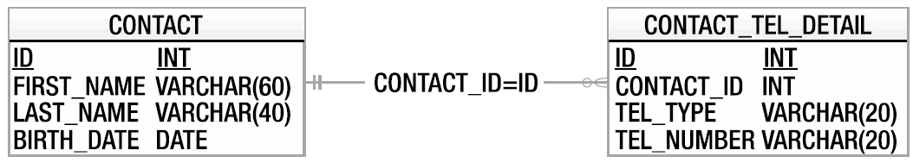
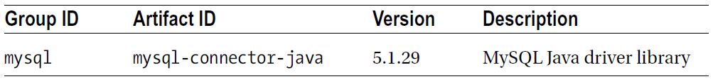
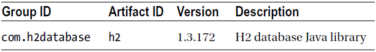
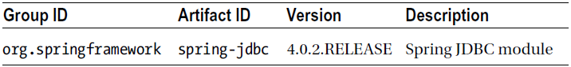
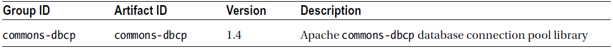

第6章 Spring中对JDBC的支持
=
现在你了解到构建一个完全由Spring管理的应用程序是是多么容易。你对Bean的配置和AOP的理解非常透彻。但会有一些迷惑：如何让程序帮你操作数据。

除了简单的一次性的命令行工具，几乎每一个应用程序需要使用数据存储技术来保存数据。常见的数据存储技术是数据库。

最著名的开源关系型数据库可能就是MySQL和PostgreSQL。MySQL通常是更广泛地用于web应用程序的开发中，尤其是在Linux平台下。另一方面PostgreSQL对于Oracle的开发者更加友好，因为它的过程化的语言PL/pgSQL非常接近于Oracle的PL/SQL。

在你使用的数据访问层代码设计和实现都非常混乱的情况下，即使选择性能最好和最可靠的数据库也不能发挥出它的速度和灵活性，应用程序经常使用数据访问层，因此无论多么精心的设计，数据访问层中的任何没必要的瓶颈代码都会影响到整个应用程序。

在本章中我们向你展示如何使用Spring来简化JDBC实现的数据访问代码。开始我们先来看一段大家熟悉的没有使用Spring之前大量重复的巨型的数据访问代码，然后将其与使用Spring数据访问类的代码进行对比。结果是惊人的，Spring允许你使用人工SQL查询的强大威力，同时只需要最小的代码量来支持实现。具体来说我们讨论以下内容：

- 比较传统的JDBC代码和Spring JDBC支持的代码：我们在保持功能一致的前提下来探索Spring如何简化传统的JDBC代码，你还将看到Spring如何访问底层JDBC API，以及这个底层API是如何被映射到如JdbcTemplate这样方便的类上。
- 连接到数据库：即使我们不进入数据库连接管理的每一个细节，我们为你展示简单的Connection和DataSource之间本质上的区别。自然的，我们还将讨论Spring如何管理数据源，以及在应用程序中可以使用的数据源。
- 检索和映射数据为Java对象：我们向你展示如何检索数据与如何有效地将查出的数据映射成Java对象。同时你会了解到Spring JDBC是一种可选用的ORM工具。
- 插入、更新和删除数据：最后讨论如何使用Spring来实现数据的插入、更新和删除操作。
6.1 Lambda表达式简介
-
从Java 8版本开始支持Lambda表达式和很多其它功能。Lambda表达式是匿名内部类的极佳替代，也是使用Spring的JDBC工作的理想候选技术。如果要使用Lambda表达式一定要有Java 8版本。编写本书时Java 8的版本是预发布版，而现在是第一个GA版本，所以我们了解不是每个人都在使用Java 8。考虑到这个因素，本章的代码示例和源代码下载包含了两种写法。Lambda表达式适合在大多数Spring API的模板或回调代码上使用，而不仅仅限于JDBC。本章涵盖Lambda表达式的技术细节，因为它们是Java语言的功能，读者应该熟悉lambda概念和语法，可以通过<http://docs.oracle.com/javase/tutorial/java/javaOO/lambdaexpressions.html>来学习Lambda表达式的更多细节。

6.2 示例代码中的数据模型
-
在继续讨论之前，我们要先介绍一个在本章示例应用程序中使用的简单数据模型，同时也可以使用在以后几章中所讨论的其它数据访问技术上（随着每个主题的需要，我们会对这个模型进行相应的扩展）。

这个模型是一个简单的联系人数据库。有两张表。其中一张表的名称是CONTACT，保存着联系人的基本信息，另一张表的名称是`CONTACT_TEL_DETAIL`，存储着一个联系人的电话号码。每个联系人可以有0到多个电话号码，换句话说CONTACT和`CONTACT_TEL_DETAIL`之间是一对多的关系。一个联系人信息包含他的`first_name`、`last_name`、生日、电话类型和相应的电话号码。图6-1展示了这个数据库的实体关系图（ER图）。

**图6-1 示例代码的数据模型**


正如你看到的，两张表中都有ID字段，并会在数据被插入期间自动生成一个值。对于CONTACT_TEL_DETAIL表，有一个外键关联到了CONTACT表，这个外键是CONTACT_TEL_DETAIL表里的CONTACT_ID字段，关联到CONTACT表中的主键（即其中的ID字段）。

>注意：本章我们使用开源的MySQL数据库来展示程序与真实数据库的交互。这需要你有一个可用的MySQL数据库实例。我们不打算讲解如何安装MySQL。你可以选择使用其它数据库，但这可能需要修改schema和函数定义。我们还会讨论嵌入式数据库的使用，这不必安装MySQL。

代码6-1是数据库的创建脚本。

	代码6-1 数据库创建脚本（schema.sql）：
	CREATE TABLE CONTACT (
	    ID INT NOT NULL AUTO_INCREMENT
	    , FIRST_NAME VARCHAR(60) NOT NULL
	    , LAST_NAME VARCHAR(40) NOT NULL
	    , BIRTH_DATE DATE
	    , UNIQUE UQ_CONTACT_1 (FIRST_NAME, LAST_NAME)
	    , PRIMARY KEY (ID)
	);
	CREATE TABLE CONTACT_TEL_DETAIL (
	    ID INT NOT NULL AUTO_INCREMENT
	    , CONTACT_ID INT NOT NULL
	    , TEL_TYPE VARCHAR(20) NOT NULL
	    , TEL_NUMBER VARCHAR(20) NOT NULL
	    , UNIQUE UQ_CONTACT_TEL_DETAIL_1 (CONTACT_ID, TEL_TYPE)
	    , PRIMARY KEY (ID)
	    , CONSTRAINT FK_CONTACT_TEL_DETAIL_1 FOREIGN KEY (CONTACT_ID)
	        REFERENCES CONTACT (ID)
	);

代码6-2中展示了一些要被填充到CONTACT和CONTACT_TEL_DETAIL表之中的样例数据。

	代码6-2 样例数据（test-data.sql）：
	insert into contact (first_name, last_name, birth_date) values  ('Chris', 'Schaefer', '1981-05-03'); 
	insert into contact (first_name, last_name, birth_date) values  ('Scott', 'Tiger', '1990-11-02'); 
	insert into contact (first_name, last_name, birth_date) values  ('John', 'Smith', '1964-02-28'); 
	insert into contact_tel_detail (contact_id, tel_type, tel_number) values  (1, 'Mobile', '1234567890'); 
	insert into contact_tel_detail (contact_id, tel_type, tel_number) values  (1, 'Home', '1234567890'); 
	insert into contact_tel_detail (contact_id, tel_type, tel_number) values  (2, 'Home', '1234567890');

在本章稍后部分，你将看到通过JDBC从数据库中检索数据，并直接把数据结果集合映射成Java对象（POJO）的例子。代码6-3和6-4分别展示了Contact和ContactTelDetail两个POJO类的代码。

	代码6-3 Contact类
	package com.apress.prospring4.ch6;
	import java.io.Serializable;
	import java.sql.Date;
	import java.util.List;
	public class Contact implements Serializable {
	    private Long id;
	    private String firstName;
	    private String lastName;
	    private Date birthDate;
	    private List<ContactTelDetail> contactTelDetails;
	    public void setId(Long id) {
	        this.id = id;
	    }
	    public Long getId() {
	        return this.id;
	    }
	    public void setFirstName(String firstName) {
	        this.firstName = firstName;
	    }
	    public String getFirstName() {
	        return this.firstName;
	    }
	    public void setLastName(String lastName) {
	        this.lastName = lastName;
	    }
	    public String getLastName() {
	        return this.lastName;
	    }
	    public void setContactTelDetails(List<ContactTelDetail> contactTelDetails) {
	        this.contactTelDetails = contactTelDetails;
	    }
	    public List<ContactTelDetail> getContactTelDetails() {
	        return contactTelDetails;
	    }
	    public void setBirthDate(Date birthDate) {
	        this.birthDate = birthDate;
	    }
	    public Date getBirthDate() {
	        return birthDate;
	    }
	    public String toString() {
	        return "Contact - Id: " + id + ", First name: " + firstName
	                + ", Last name: " + lastName + ", Birthday: " + birthDate;
	    }
	}

	代码6-4 ContactTelDetail类
	package com.apress.prospring4.ch6;
	import java.io.Serializable; 
	public class ContactTelDetail implements Serializable {
	    private Long id;
	    private Long contactId;
	    private String telType;
	    private String telNumber;
	    public void setId(Long id) {
	        this.id = id;
	    }
	    public Long getId() {
	        return this.id;
	    }
	    public void setContactId(Long contactId) {
	        this.contactId = contactId;
	    }
	    public Long getContactId() {
	        return this.contactId;
	    }
	    public void setTelType(String telType) {
	        this.telType = telType;
	    }
	    public String getTelType() {
	        return this.telType;
	    }
	    public void setTelNumber(String telNumber) {
	        this.telNumber = telNumber;
	    }
	    public String getTelNumber() {}
	        return this.telNumber;
	    }
	    @Override
	    public String toString() {
	        return "Contact Tel Detail - Id: " + id + ", Contact id: " + contactId
	                + ", Type: " + telType + ", Number: " + telNumber;
	    }
	}
让我们先从一个简单的ContactDao接口开始，它为联系人信息封装了所有的数据访问服务。代码6-5中展示了ContactDao接口。

	代码6-5 ContactDao接口
	package com.apress.prospring4.ch6;
	import java.util.List;
	public interface ContactDao {
	    List<Contact> findAll();
	    List<Contact> findByFirstName(String firstName);
	    String findLastNameById(Long id);
	    String findFirstNameById(Long id);
	    void insert(Contact contact);
	    void update(Contact contact);
	    void delete(Long contactId);
	}
在以上接口中定义了两个查询方法和一个删除、更新、插入方法。这对应CRUD这个术语（创建、读取、更新、删除）。

最后为了方便测试，让我们修改log4j的属性，将日志级别设置为所有类的DEBUG模式。在DEBUG级别上，Spring JDBC模块会输出所有发送到底层数据库SQL语句，所以你可以知道到底发生了什么事情；这对于排除SQL语句语法错误方面的故障特别有用。代码6-6展示了打开DEBUG级别的log4j.properties文件（位于第6章项目的src/main/resources源代码目录下）的内容。

	代码6-6 log4j.properties文件
	log4j.rootCategory=DEBUG, stdout
	log4j.appender.stdout=org.apache.log4j.ConsoleAppender
	log4j.appender.stdout.layout=org.apache.log4j.PatternLayout
	log4j.appender.stdout.layout.ConversionPattern=%d{ABSOLUTE} %5p %40.40c:%4L - %m%n

6.3 探索JDBC基础设施
-
JDBC为Java应用程序访问数据库中存储的数据提供了标准。JDBC基础设施的核心是特定于某种数据库的驱动程序，它可以让Java程序代码访问数据库。

一旦数据库的驱动程序被加载，就可以使用java.sql.DriverManager类来注册它自己。这个类管理着一个驱动程序列表，并提供了建立数据库连接的静态方法。DriverManager类的getConnection()方法返回会返回一个驱动程序实现的java.sql.Connection接口的实现类。这个接口允许你运行某个数据库中的SQL语句。 

JDBC框架非常复杂并且容易测试，然而这种复杂性为开发带来了难度。第一级的复杂性在于要使用代码来管理与数据库的连接。数据库的连接是一种稀缺资源，而且创建的系统开销也会很大。一般来说，数据库会为每个连接创建一个线程或产生一个子进程。同时并发连接的数量通常是有限的，过多的开放数据库连接会降低数据库的性能。

我们会向你展示如何使用Spring帮助管理这种复杂性，但在这之前我们先来看一下使用JDBC如何来对数据进行增删改查。

让我们创建一个使用纯JDBC技术与数据库进行交互的实现形式，这是ContactDao接口的实现。记住我们已经了解有关数据库连接的知识，我们以十分小心并代价高昂（性能方面）的方式为每一条SQL语句的创建一个连接。这大大降低了Java的性能并为数据库增加了额外的压力。因为必须要为每个查询创建一个连接。然而，如果我们一直保持着连接的打开状态，会把数据库服务器拖跨。示例代码6-7展示了管理JDBC连接所需的代码，这是使用MySQL数据库为例的。

	代码6-7 管理JDBC连接
	package com.apress.prospring4.ch6;
	public class PlainContactDao implements ContactDao {
	    static {
	        try {
	            Class.forName("com.mysql.jdbc.Driver");
	        } catch (ClassNotFoundException ex) {
	            ex.printStackTrace();
	        }
	    }
	    private Connection getConnection() throws SQLException {
	        return DriverManager.getConnection( "jdbc:mysql://localhost:3306/prospring4_ch6", "prospring4", "prospring4"); 
	    }
	    ……
	    private void closeConnection(Connection connection) {
	        if (connection == null) {
	            return;
	        }
	        try {
	            connection.close();
	        } catch (SQLException ex) {
	            ex.printStackTrace();
	        }
	    }
	}
这段代码还远远没有完成，但它给了你关于需要管理JDBC连接步骤的一些思路。这段代码甚至没有使用连接池来处理，数据库的连接池是一种常见的管理数据库连接的技术，能使数据库更加高效。在这里我们不讨论数据库连接池（会在本章稍后的“数据库连接和数据源”部分中讨论），反而在代码示例6-8中，我们展示了ConnectDao接口中findAll()、insert()和delete()方法的实现，它使用JDBC技术实现。

	代码6-8 纯JDBC的DAO实现
	package com.apress.prospring4.ch6;
	import java.sql.Connection;
	import java.sql.DriverManager;
	import java.sql.PreparedStatement;
	import java.sql.ResultSet;
	import java.sql.SQLException;
	import java.sql.Statement;
	import java.util.ArrayList;
	import java.util.List;
	public class PlainContactDao implements ContactDao {
	    static {
	        try {
	            Class.forName("com.mysql.jdbc.Driver");
	        } catch (ClassNotFoundException ex) {
	            ex.printStackTrace();
	        }
	    }
	    private Connection getConnection() throws SQLException {
	        return DriverManager.getConnection( "jdbc:mysql://localhost:3306/prospring4_ch6", "prospring4", "prospring4"); 
	    }
	    private void closeConnection(Connection connection) {
	        if (connection == null) {
	            return;
	        }
	        try {
	            connection.close();
	        } catch (SQLException ex) {
	            ex.printStackTrace();
	        }
	    }
	    @Override
	    public List<Contact> findAll() {
	        List<Contact> result = new ArrayList<Contact>();
	        Connection connection = null;
	        try {
	            connection = getConnection();
	            PreparedStatement statement =  connection.prepareStatement("select * from contact");
	            ResultSet resultSet = statement.executeQuery();
	            while (resultSet.next()) {
	                Contact contact = new Contact();
	                contact.setId(resultSet.getLong("id"));
	                contact.setFirstName(resultSet.getString("first_name"));
	                contact.setLastName(resultSet.getString("last_name"));
	                contact.setBirthDate(resultSet.getDate("birth_date"));
	                result.add(contact);
	            }
	        } catch (SQLException ex) {
	            ex.printStackTrace();
	        } finally {
	            closeConnection(connection);
	        }
	        return result;
	    }
	    @Override
	    public void insert(Contact contact) {
	        Connection connection = null;
	        try {
	            connection = getConnection();
	            PreparedStatement statement = connection.prepareStatement(
	                "insert into Contact (first_name, last_name, birth_date) values (?, ?, ?)"
	                , Statement.RETURN_GENERATED_KEYS);
	            statement.setString(1, contact.getFirstName());
	            statement.setString(2, contact.getLastName());
	            statement.setDate(3, contact.getBirthDate());
	            statement.execute();
	            ResultSet generatedKeys = statement.getGeneratedKeys();.
	            if (generatedKeys.next()) {
	                contact.setId(generatedKeys.getLong(1));
	            }
	        } catch (SQLException ex) {
	            ex.printStackTrace();
	        } finally {
	            closeConnection(connection);
	        }
	    }
	    @Override
	    public void delete(Long contactId) {
	        Connection connection = null;
	        try {
	            connection = getConnection();
	            PreparedStatement statement =  connection.prepareStatement("delete from contact where id=?"); 
	            statement.setLong(1, contactId);
	            statement.execute();
	        } catch (SQLException ex) {
	            ex.printStackTrace();
	        } finally {
	            closeConnection(connection);
	        }
	    }
	    @Override
	    public List<Contact> findByFirstName(String firstName) {
	        return null;
	    }
	    @Override
	    public String findFirstNameById(Long id) {
	        return null;
	    }
	    @Override
	    public String findLastNameById(Long id) {
	        return null;
	    }
	    @Override
	    public void update(Contact contact) {
	    }
	}

代码6-9展示了这个DAO的主要测试类。

	代码6-9 纯JDBC实现测试
	package com.apress.prospring4.ch6;
	import java.sql.Date;
	import java.util.GregorianCalendar;
	import java.util.List;
	public class PlainJdbcSample {
	    private static ContactDao contactDao = new PlainContactDao();
	    public static void main(String[] args) {
	        System.out.println("Listing initial contact data:");
	        listAllContacts();
	        System.out.println();
	        System.out.println("Insert a new contact");
	        Contact contact = new Contact();
	        contact.setFirstName("Jacky");
	        contact.setLastName("Chan");
	        contact.setBirthDate(new Date( (new GregorianCalendar(2001, 10, 1)).getTime().getTime())); 
	        contactDao.insert(contact);
	        System.out.println("Listing contact data after new contact created:");
	        listAllContacts();
	        System.out.println();
	        System.out.println("Deleting the previous created contact");
	        contactDao.delete(contact.getId());.
	        System.out.println("Listing contact data after new contact deleted:");
	        listAllContacts();
	    }
	    private static void listAllContacts() {
	        List<Contact> contacts = contactDao.findAll();
	        for (Contact contact: contacts) {
	            System.out.println(contact);
	        }
	    }
	}
运行这个程序需要在你的Java项目中添加MySQL的JDBC驱动。如表6-1：

**表6-1 MySQL依赖**


运行这个测试得到以下输出（假设你安装了名为prospring4_ch6的本地MySQL数据库，用户名和密码均为prospring4；这个数据库的schema应该可以被访问，并且应该运行schema.sql和test-data.sql两个脚本，在数据库中创建表结构并填充好测试数据）。

	Listing initial contact data:
	Contact - Id: 1, First name: Chris, Last name: Schaefer, Birthday: 1981-05-03
	Contact - Id: 2, First name: Scott, Last name: Tiger, Birthday: 1990-11-02
	Contact - Id: 3, First name: John, Last name: Smith, Birthday: 1964-02-28
	Insert a new contact
	Listing contact data after new contact created:
	Contact - Id: 1, First name: Chris, Last name: Schaefer, Birthday: 1981-05-03
	Contact - Id: 2, First name: Scott, Last name: Tiger, Birthday: 1990-11-02
	Contact - Id: 3, First name: John, Last name: Smith, Birthday: 1964-02-28
	Contact - Id: 4, First name: Jacky, Last name: Chan, Birthday: 2001-11-01
	Deleting the previous created contact
	Listing contact data after new contact deleted:
	Contact - Id: 1, First name: Chris, Last name: Schaefer, Birthday: 1981-05-03
	Contact - Id: 2, First name: Scott, Last name: Tiger, Birthday: 1990-11-02
	Contact - Id: 3, First name: John, Last name: Smith, Birthday: 1964-02-28
就像输出中所看到的，在第一个块中显示了初始数据。第二个块中显示了新加入的内容。第三个块中显示了新加入的数据被删除后的数据内容。

正如你在代码6-8中所看到的，大量的代码应该被转移到另一个帮助类中，如果不这样做会更糟，将导致在每个Dao类中重复编写这些代码。这从应用程序开发人员的角度来看，是JDBC的主要缺点——你可能只是因为没有时间，才会为每一个Dao类编写那些重复的代码。而这样做，你更需要集中精力为Dao类编写那些确实被需要的代码：检索、更新和删除数据。你要编写更多的帮助类，并处理更多受检异常，并且你可能向你的代码中引入更多的Bug。

Spring带来了一个Dao框架。框架消除了那些并不实际执行业务逻辑的代码，让你忽略所有要执行的非业务代码。此外Spring对JDBC的广泛支持可以让你的工作更愉快。

6.4 Spring JDBC基础设施
-
本章中第一部分所讨论的代码并不复杂，但有些乏味，也正是由于这可的代码写法，编码错误的可能性会很高。现在是时候看看Spring是如何让事情变的更容易、更优雅的。

###6.4.1 概览和使用的包
Spring对JDBC的支持包含表6-2中的这5个包，用于处理JDBC访问的每个方面。
<table><tr><th>
包</th><th>
描述</th></tr>
<tr><td>
org.springframework.jdbc.core</td><td>
包含了Spring的JDBC基础类。它包含了核心的JDBC类JdbcTemplate，它简化了使用JDBC对数据库的操作。它的几个子包为更具体的目的对JDBC数据访问提供了支持（例如一个支持命名参数的JdbcTemplate类），还包含了相关支持的类。</td></tr>
<tr><td>
org.springframework.jdbc.datasource</td><td>
包含帮助类和可以在JEE容器之外运行JDBC代码的DataSource实现。其下的子包提供对嵌入式数据库、数据库初始化和各种数据源查找机制的支持。</td></tr>
<tr><td>
org.springframework.jdbc.object</td><td>
包含把数据库中的数据转换成为对象或对象列表的类。对象和对象列表都是纯Java对象，因此它们与数据库的连接是断开的。
</td></tr>
<tr><td>
org.springframework.jdbc.support</td><td>
这个包中最重要的类是对SQLException的翻译支持类。这允许Spring识别所使用的数据库的错误代码并将它们映射到更高级的异常。</td></tr>
<tr><td>
org.springframework.jdbc.config</td><td>
包含使用Spring的ApplicationContext支持JDBC配置的类。例如包含了一个为jdbc命名空间的处理器类（如<jdbc:embedded-database>标签）。</td></tr>
</table>
我们通过查看最低级别的功能来开始讨论Spring的JDBC支持。在运行SQL查询之前首要的事情是创建与数据库的连接。

###6.4.2 数据库连接和数据源
你可以通过一个实现了javax.sql. DataSource接口的Bean来使用Spring管理数据库的连接。DataSource和Connection之间的不同在于DataSource提供并管理着Connection。

org.springframework.jdbc.datasource包下的DriverManagerDataSource是最简单的DataSource的实现。通过查看类名，你可以猜到它是简单的调用DriverManager来获得连接的。事实上DriverManagerDataSource不支持数据库连接池，所以它最好只用于测试。DriverManagerDataSource的配置十分简单，就像代码6-10中所示，你只需要提供驱动程序类的名称、连接的URL串、用户名和密码（datasource-drivermanager.xml）。

	代码6-10 Spring管理的DriverManagerDataSource的数据源Bean
	<?xml version="1.0" encoding="UTF-8"?>
	<beans xmlns="http://www.springframework.org/schema/beans"
	    xmlns:xsi="http://www.w3.org/2001/XMLSchema-instance"
	    xmlns:context="http://www.springframework.org/schema/context"
	    xmlns:p="http://www.springframework.org/schema/p"
	    xsi:schemaLocation="http://www.springframework.org/schema/beans
	        http://www.springframework.org/schema/beans/spring-beans.xsd
	        http://www.springframework.org/schema/context
	        http://www.springframework.org/schema/context/spring-context.xsd">
	    <bean id="dataSource"
	        class="org.springframework.jdbc.datasource.DriverManagerDataSource"
	        p:driverClassName="${jdbc.driverClassName}"
	        p:url="${jdbc.url}"
	        p:username="${jdbc.username}"
	        p:password="${jdbc.password}"/>
	    <context:property-placeholder location="classpath:META-INF/config/jdbc.properties"/>
	</beans>
对于列表中的属性你应该比较熟悉，它们的值通常被传递给JDBC来获取Connection接口类型的对象。为了易于维护和易于在不同部署环境下替换，通常的数据库连接信息一般被保存在属性文件中。代码6-11展示了jdbc.properties的例子，Spring的属性占位符会加载连接信息。

	代码6-11 jdbc.properties文件
	jdbc.driverClassName=com.mysql.jdbc.Driver
	jdbc.url=jdbc:mysql://localhost:3306/prospring4_ch6
	jdbc.username=prospring4
	jdbc.password=prospring4
在真正的应用程序中我们可以使用Apache的Commons-DBCP中的BasicDataSource或被JEE应用程序服务器实现的DataSource（如JBoss、WebSphere、WebLogic、GlassFish），这可能进一步提高应用程序的性能。你可以使用纯JDBC代码中的DataSource，这与连接池有相同的优点，但在大多数情况下，更愿意使用以配置为中心的DataSource。Spring在另一方面允许你声明一个叫作dataSource的Bean，在ApplicationContext的文件中配置连接属性（见代码6-12，文件名为datasource-dbcp.xml）。

	代码6-12 被Spring管理的dataSource Bean
	<?xml version="1.0" encoding="UTF-8"?> 
	<beans xmlns="http://www.springframework.org/schema/beans" 
	    xmlns:xsi="http://www.w3.org/2001/XMLSchema-instance" 
	    xmlns:context="http://www.springframework.org/schema/context" 
	    xmlns:p="http://www.springframework.org/schema/p" 
	    xsi:schemaLocation="http://www.springframework.org/schema/beans
	        http://www.springframework.org/schema/beans/spring-beans.xsd
	        http://www.springframework.org/schema/context
	        http://www.springframework.org/schema/context/spring-context.xsd"> 
	    <bean id="dataSource" class="org.apache.commons.dbcp.BasicDataSource" 
	        destroy-method="close" 
	        p:driverClassName="${jdbc.driverClassName}" 
	        p:url="${jdbc.url}" 
	        p:username="${jdbc.username}" 
	        p:password="${jdbc.password}"/> 
	    <context:property-placeholder location="classpath:META-INF/config/jdbc.properties"/> 
	</beans>

>注意：除了Apache Commons BasicDataSource以外，还有其它流行的数据库连接池，如C3P0（www.mchange.com/projects/c3p0/index.html）和BoneCP （http://jolbox.com/）。

这个被Spring管理的DataSource实现了org.apache.commons.dbcp.BasicDataSource。最重要的一点是dataSource Bean实现javax.sql.DataSource接口，可以在你的数据访问类中立即使用它。

另一种配置dataSource Bean的方式是使用JNDI。如果你的应用程序运行在一个JEE容器中，可以利用容器提供的数据库连接池的优点。为了使用基于JNDI技术的数据源，需要改变dataSource Bean的声明，如代码6-13所示。

	代码6-13 JNDI dataSource Bean
	<?xml version="1.0" encoding="UTF-8"?> 
	<beans xmlns="http://www.springframework.org/schema/beans" 
	    xmlns:xsi="http://www.w3.org/2001/XMLSchema-instance" 
	    xsi:schemaLocation="http://www.springframework.org/schema/beans
	        http://www.springframework.org/schema/beans/spring-beans.xsd"> 
	    <bean id="dataSource" class="org.springframework.jndi.JndiObjectFactoryBean"
	        p:jndiName="java:comp/env/jdbc/prospring4ch6"/> 
	</beans>
以上例子中我们通过使用Spring的JndiObjectFactoryBean来利用JNDI查找，获取了数据源。从2.5开始Spring提供了jee命名空间，它进一步简化了配置。代码6-14展示了使用jee命名空间来对相同JNDI数据源的配置（datasource-jee.xml）。

	<?xml version="1.0" encoding="UTF-8"?> 
	<beans xmlns="http://www.springframework.org/schema/beans" 
	    xmlns:xsi="http://www.w3.org/2001/XMLSchema-instance" 
	    xmlns:jee="http://www.springframework.org/schema/jee" 
	    xsi:schemaLocation="http://www.springframework.org/schema/beans
	        http://www.springframework.org/schema/beans/spring-beans.xsd
	        http://www.springframework.org/schema/jee
	        http://www.springframework.org/schema/jee/spring-jee.xsd"> 
	    <jee:jndi-lookup jndi-name="java:comp/env/jdbc/prospring4ch6"/> 
	</beans>
在以上代码中我们在<beans>标签中定义了jee命名空间，然后使用<jee:jndi-lookup>标签声明了数据源。如果你选用JNDI方式，不要忘记在应用程序的描述文件中添加对资源的引用（resource-ref）如代码6-15。

	代码6-15 描述文件中的资源引用
	<root-node>
	    <resource-ref>
	        <res-ref-name>jdbc/prospring4ch6</res-ref-name>
	        <res-type>javax.sql.DataSource</res-type>
	        <res-auth>Container</res-auth>
	    </resource-ref>
	</root-node>
`<root-node>`只是一个占位符，如何修改它取决于你的模块是被怎样包装的。例如如果是web应用程序，则要在web描述符文件（WEB-INF/web.xml）中把它改为`<web-app>`。多数情况下你还需要在一个特定于应用服务器的描述符文件中配置resource-ref。但注意resource-ref元素配置jdbc/prospring4ch6引用名称，同时dataSource的jndiName名称要被设置为java:comp/env/jdbc/prospring4ch6。

正如你看到的，Spring允许你使用喜欢的方式来配置DataSource，并且它把真正数据源的实现和位置从应用程序的其余部分的代码中分离出来，并隐藏起来。换句话说，你的Dao类不知道也不需要知道数据源在哪里。

对连接的管理也是委托给dataSource Bean的，反过来执行管理它自己，或使用JEE容器来做所有的工作。

###6.4.3 对嵌入式数据库的支持
从3.0以后Spring提供了对嵌入式数据库的支持，可以自动启动嵌入式数据库，并把它做为DataSource暴露给应用程序。代码6-16展示了嵌入式数据库的配置（app-context-xml.xml）。

	代码6-16 Spring对嵌入式数据库的支持
	<?xml version="1.0" encoding="UTF-8"?>
	<beans xmlns="http://www.springframework.org/schema/beans"
	    xmlns:xsi="http://www.w3.org/2001/XMLSchema-instance"
	    xmlns:jdbc="http://www.springframework.org/schema/jdbc"
	    xsi:schemaLocation="http://www.springframework.org/schema/beans
	        http://www.springframework.org/schema/beans/spring-beans.xsd
	        http://www.springframework.org/schema/jdbc
	        http://www.springframework.org/schema/jdbc/spring-jdbc.xsd">
	    <jdbc:embedded-database id="dataSource" type="H2">
	        <jdbc:script location="classpath:META-INF/sql/schema.sql"/>
	        <jdbc:script location="classpath:META-INF/sql/test-data.sql"/>
	    </jdbc:embedded-database>
	</beans>
以上代码中我们首先在<beans>标签中声明了jdbc命名空间。之后我们使用<jdbc:embedded-database>声明了一个嵌入式的数据库，并为它分配了一个id属性，取值为dataSource。此标签内部，我们告诉Spring执行指定的SQL脚本，以便为测试创建数据库schema和数据。注意，脚本的执行顺序很重要，那些包含数据定义语言（DDL）的脚本应该总是被先执行，其后应该再执行那些数据操纵语言（DML）。type属性用于让我们指定要使用的嵌入式数据库的类型。4.0版本以后，Spring支持HSQL（默认）、H2、DERBY。

对于本地开发和单元测试来说，Spring对嵌入式数据库的支持非常有用。本章余下部分我们会使用嵌入式数据库来运行程序示例，所以你的电脑上不必安装数据库管理系统就可以运行例程。

你不但可以利用通过JDBC命名空间来支持的嵌入式数据库，还可以把初始化的数据库实例运行在其它地方，如MySQL和Oracle等等。 不用指定type和embedded-database，而是简单的使用initialize-database，脚本会像在嵌入式数据库中一样，来在目标数据源中执行。

6.5 在DAO类中使用DataSources
-
为实现例程，先编创建一个ContactDao接口，见代码6-17。

	代码6-17 ContactDao接口
	package com.apress.prospring4.ch6;
	public interface ContactDao {
	    String findLastNameById(Long id);
	}
作为简单的实现，首先在JdbcContactDao实现类中添加一个dataSource的属性。我们之所以把dataSource属性放在实现类中而不是接口里，其实原因很明显：接口不需要知道数据是如何被检索和更新的。通过在接口中添加DataSource的设值方法，最好的情况下，也要强迫实现类声明getter和setter方法。显然这不是一个很好的实践。代码6-18展示了简单的JdbcContactDao类。

	代码6-18 带有dataSource属性的JdbcUserDao类
	package com.apress.prospring4.ch6;
	import javax.sql.DataSource;
	public class JdbcContactDao implements ContactDao {
	    private DataSource dataSource;
	    public void setDataSource(DataSource dataSource) {
	        this.dataSource = dataSource;
	    }
	...
	}
我们现在可以让Spring来通过JdbcContactDao类来配置我们的contactDao Bean，并设置dataSource属性（代码6-19的app-context-xml.xml配置）。

	代码6-19 在Spring应用程序上下文中的配置文件里配置dataSource和contactDao这两个Bean
	<?xml version="1.0" encoding="UTF-8"?> 
	<beans xmlns="http://www.springframework.org/schema/beans" 
	    xmlns:xsi="http://www.w3.org/2001/XMLSchema-instance" 
	    xmlns:jdbc="http://www.springframework.org/schema/jdbc" 
	    xsi:schemaLocation="http://www.springframework.org/schema/beans
	        http://www.springframework.org/schema/beans/spring-beans.xsd
	        http://www.springframework.org/schema/jdbc
	        http://www.springframework.org/schema/jdbc/spring-jdbc.xsd"> 
	    <jdbc:embedded-database id="dataSource" type="H2"> 
	    <jdbc:script location="classpath:META-INF/sql/schema.sql"/> 
	    <jdbc:script location="classpath:META-INF/sql/test-data.sql"/> 
	    </jdbc:embedded-database> 
	    <bean id="contactDao" class="com.apress.prospring4.ch6.JdbcContactDao" p:dataSource-ref="dataSource"/> 
	</beans>
为了支持H2数据库，需要把对H2数据库的依赖加入到项目中，见表6-3。

**表6-3 H2的依赖**



通过实例化带有dataSource属性的JdbcContactDao类，创建了一个contactDao Bean。这个Bean中已经把一个id叫做dataSource的Bean注入到了它的dataSource属性上。

是一种很好的做法，可以确保所有必需的bean属性被设置。做这事最简单的方式是实现InitializingBean接口并提供一个afterPropertiesSet()方法的实现（代码6-20）。这种方式下可以确保所有必须的属性被设置到JdbcContactDao的相应属性上。为Bean初始化的进一步讨论，请参阅第4章。

	代码6-20 使用InitializingBean实现JdbcContactDao
	import javax.sql.DataSource;
	import org.springframework.beans.factory.BeanCreationException;
	import org.springframework.beans.factory.InitializingBean;
	public class JdbcContactDao implements ContactDao, InitializingBean {
	    private DataSource dataSource;
	    public void setDataSource(DataSource dataSource) {
	        this.dataSource = dataSource;
	    }
	    ...
	    @Override
	    public void afterPropertiesSet() throws Exception {
	        if (dataSource == null) {
	            throw new BeanCreationException("Must set dataSource on ContactDao");
	        }
	    }
	}
目前我们看到的代码使用Spring来管理数据源，并引入了ContactDao接口和它的JDBC实现类。在Spring的应用程序上下文的配置文件中我们还为JdbcContactDao类设置了dataSource属性。现在我们要通过添加对数据的真实操作来扩展DAO接口和实现类。
6.6 异常处理
-
因为Spring提倡使用非受检异常（RuntimeException）而不是受检异常，所以你需要一个机制，来把受检的SQLException转换成为非受检的Spring JDBC异常。因为Spring的SQL异常属于非受检异常，所以它们比受检异常的粒度更细。按照定义，这不是非受检异常的特性，但在throws子句中声明一长串受检异常非常不方便；因此受检异常往往比等价的非受检异常的粒度更粗。

Spring提供了SQLExceptionTranslator接口的默认实现，它负责把通用SQL错误代码翻译成Spring JDBC的异常。大多数情况下这个实现已足够了，但我们可以扩展Spring的默认实现并在我们使用的JdbcTemplate中使用新的SQLExceptionTranslator实现，如代码6-21：

	代码6-21 自定义的SQLExceptionTranslator
	package com.apress.prospring4.ch6;
	import java.sql.SQLException;
	import org.springframework.dao.DataAccessException;
	import org.springframework.dao.DeadlockLoserDataAccessException;
	import org.springframework.jdbc.support.SQLErrorCodeSQLExceptionTranslator;
	public class MySQLErrorCodesTranslator extends  SQLErrorCodeSQLExceptionTranslator { 
	    @Override
	    protected DataAccessException customTranslate(String task,  String sql, SQLException sqlex) { 
	        if (sqlex.getErrorCode() == -12345) {
	            return new DeadlockLoserDataAccessException(task, sqlex);
	        }
	        return null;
	    }
	}
同时我们要向项目中加入spring-jdbc的依赖，如表6-4。

**表6-4 spring-jdbc的依赖**



要使用自定义翻译器，需要在DAO类中把它传递给JdbcTemplate。为了说明其用法，代码6-22展示了一个被增强的JdbcContactDao.setDataSource()方法的代码示例片段。

	代码6-22 在Spring jdbc中使用自定义的SQLExceptionTranslator
	public void setDataSource(DataSource dataSource) {
	    this.dataSource = dataSource;
	    JdbcTemplate jdbcTemplate = new JdbcTemplate();
	    jdbcTemplate.setDataSource(dataSource);
	    MySQLErrorCodesTranslator errorTranslator =  new MySQLErrorCodesTranslator(); 
	    errorTranslator.setDataSource(dataSource);
	    jdbcTemplate.setExceptionTranslator(errorTranslator);
	    this.jdbcTemplate = jdbcTemplate;
	}
在这里我们已经有了一个自定义的SQL异常翻译器，当对数据库执行SQL语句时，Spring会根据侦测到的SQL异常来调用这个翻译器，并且当错误的代码是-12345时自定义的异常翻译将被触发。对于其它错误Spring会使用其默认的异常转换机制。

显然，没有什么可以阻止你创建一个被Spring管理的SQLExceptionTranslator类型的Bean，并且在你的DAO类中使用JdbcTemplate Bean。不要担心JdbcTemplate类，我们将更详细地讨论这个问题。

6.7 JdbcTemplate类
-
这个类是Spring对JDBC支持的核心。它可以执行所有类型的SQL语句。以最简单的观点来看，可以把数据操作语句和数据定义语句分为两类。数据定义语句可以创建各种数据库对象（如表、视图、存储过程等）。数据操作语句用于操作数据，并且可以分为select和update语句。通常一个select语句返回一组行的集合，而每行都包含着相同的列的集合。update语句可以修改数据库中的数据，但不返回任何结果。

JdbcTemplate类允许你发送任何类型的SQL语句到数据库中，同时可以返回任何类型的结果。

在本部分中我们会通过几个常见的用例来介绍使用Spring中JdbcTemplate类的JDBC程序。

###6.7.1 在DAO类中初始化JdbcTemplate
在讨论如何使用JdbcTemplate之前，让我们看看如何为在DAO类中使用JdbcTemplate做准备。这是非常简单的，大多数时间你只需要把数据源对象传入JdbcTemplate的构造器中（应该把它注入到DAO类中）。代码6-23展示了初始化JdbcTemplate对象的代码片段。

	代码6-23 初始化JdbcTemplate
	private JdbcTemplate jdbcTemplate;
	private DataSource dataSource;
	public void setDataSource(DataSource dataSource) {
	    this.dataSource = dataSource;
	    this.jdbcTemplate = new JdbcTemplate(dataSource);
	}
通常的做法是在setDataSource方法中初始化JdbcTemplate，以便一旦数据来源通过Spring注入后，JdbcTemplate将也被初始化并准备好被使用。

一旦被配置好，JdbcTemplate便是线程安全的。这意味着你可以选择在Spring的XML配置文件中配置一个单独的JdbcTemplate实例，然后把它注入到所有DAO的Bean中去。

>注意：在Spring的jdbc模块中有一个称作JdbcDaoSupport的类。它包装着JdbcTemplate类，并且你可以让你的Dao类继承自JdbcDaoSupport类。如果这么做，当Dao类带着数据源被注入时，JdbcTemplate将被自动初始化。

###6.7.2 通过使用JdbcTemplate来检索单值
让我们从一个返回单值的简单查询开始。例如我们想通过联系人的id来获得他的first name，可以很轻松的获取到它。代码6-24展示了JdbcContactDao类中findFirstNameById()方法的实现。对于其他方法，先创建空的实现。

	代码6-24 使用JdbcTemplate来获取单值
	package com.apress.prospring4.ch6;
	import javax.sql.DataSource;
	import java.util.List;
	import org.springframework.beans.factory.BeanCreationException;
	import org.springframework.beans.factory.InitializingBean;
	import org.springframework.jdbc.core.JdbcTemplate;
	public class JdbcContactDao implements ContactDao, InitializingBean {
	    private DataSource dataSource;
	    private JdbcTemplate jdbcTemplate;
	    @Override
	    public String findFirstNameById(Long id) {
	        return jdbcTemplate.queryForObject( "select first_name from contact where id = ?", new Object[]{id}, String.class); 
	    }
	    public void setDataSource(DataSource dataSource) {
	        this.dataSource = dataSource;
	        JdbcTemplate jdbcTemplate = new JdbcTemplate();
	        jdbcTemplate.setDataSource(dataSource);
	        MySQLErrorCodesTranslator errorTranslator =  new MySQLErrorCodesTranslator(); 
	        errorTranslator.setDataSource(dataSource);
	        jdbcTemplate.setExceptionTranslator(errorTranslator);
	        this.jdbcTemplate = jdbcTemplate;
	    }
	    @Override
	    public void afterPropertiesSet() throws Exception {
	        if (dataSource == null) {
	            throw new BeanCreationException("Must set dataSource on ContactDao");
	        }
	        if (jdbcTemplate == null) {
	            throw new BeanCreationException("Null JdbcTemplate on ContactDao");
	        }
	    }
	}
在这个例子中我们使用JdbcTemplate类中的queryForObject()方法来检索联系人的first name。这个方法的第一个参数是SQL语句串，第二个参数包含了要传递到SQL语句中的参数，是以对象数组格式绑定的。最后一个参数是返回值的类型，这个例子中是String类型。除了Object，你也可以查询其他类型，如Long和Integer。让我们看一下结果。代码6-25展示了测试程序。

	代码6-25 使用JdbcTemplate来查询数据
	package com.apress.prospring4.ch6;
	import org.springframework.context.support.GenericXmlApplicationContext;
	public class JdbcContactDaoSample {
	    public static void main(String[] args) {
	        GenericXmlApplicationContext ctx = new GenericXmlApplicationContext();
	        ctx.load("classpath:META-INF/spring/app-context-xml.xml");
	        ctx.refresh();
	        ContactDao contactDao = ctx.getBean("contactDao", ContactDao.class);
	        System.out.println("First name for contact id 1 is: " +
	        contactDao.findFirstNameById(1l));
	    }
	}
正如所料，运行程序产生以下输出：

	First name for contact id 1 is: Chris
###6.7.3 通过NamedParameterJdbcTemplate使用命名参数
在上一个例子中我们使用了常用的参数占位符（？）来作为查询参数，我们要以一个Object数组的方式来传递参数值。在使用这种占位符时，参数的顺序非常重要，参数值在Object数组中的顺序要与查询语句中参数占位符的顺序完全一致。

一些开发人员更喜欢使用命名参数，这可以确保每个参数按照其意图明确的被绑定到查询语句上。在Spring中有一个JdbcTemplate的变体，被称为NamedParameterJdbcTemplate（位于org.springframework.jdbc.core.namedparam包下），提供了对命名参数的支持。

NamedParameterJdbcTemplate的初始化与JdbcTemplate一样，所以我们只需要声明一个NamedParameterJdbcTemplate类型的变量，然后在setDataSource()方法中创建一个它的新实例。见代码6-26

	代码6-26 使用NamedParameterJdbcTemplate的JdbcContactDao类，完成按id检索last name
	package com.apress.prospring4.ch6;
	import javax.sql.DataSource;
	import java.util.List;
	import java.util.Map;
	import java.util.HashMap;
	import org.springframework.beans.factory.BeanCreationException;
	import org.springframework.beans.factory.InitializingBean;
	import org.springframework.jdbc.core.namedparam.NamedParameterJdbcTemplate;
	public class JdbcContactDao implements ContactDao, InitializingBean {
	    private DataSource dataSource;
	    private NamedParameterJdbcTemplate namedParameterJdbcTemplate;
	    @Override
	    public String findLastNameById(Long id) {
	        String sql = "select last_name from contact where id = :contactId";
	        Map<String, Object> namedParameters = new HashMap<String, Object>();
	        namedParameters.put("contactId", id);
	        return namedParameterJdbcTemplate.queryForObject(sql,
	        namedParameters, String.class);
	    }
	    public void setDataSource(DataSource dataSource) {
	        this.dataSource = dataSource;
	        NamedParameterJdbcTemplate namedParameterJdbcTemplate =  new NamedParameterJdbcTemplate(dataSource); 
	        this.namedParameterJdbcTemplate = namedParameterJdbcTemplate;
	    }
	    @Override
	    public void afterPropertiesSet() throws Exception {
	        if (dataSource == null) {
	            throw new BeanCreationException("Must set dataSource on ContactDao");
	        }
	        if (namedParameterJdbcTemplate == null) {
	            throw new BeanCreationException("Null NamedParameterJdbcTemplate on ContactDao");
	        }
	    }
	}
你会发现代替问号占位符的命名参数是以冒号开头的。
代码6-27展示了更新后的测试程序

	代码6-27 使用命名参数的更新后的JdbcContactDaoSample测试程序
	package com.apress.prospring4.ch6;
	import org.springframework.context.support.GenericXmlApplicationContext;
	public class JdbcContactDaoSample {
	    public static void main(String[] args) {
	        GenericXmlApplicationContext ctx = new GenericXmlApplicationContext();
	        ctx.load("classpath:META-INF/spring/app-context-xml.xml");
	        ctx.refresh();
	        ContactDao contactDao = ctx.getBean("contactDao", ContactDao.class);
	        System.out.println("Last name for contact id 1 is: " +
	        contactDao.findLastNameById(1l));
	    }
	}
再次运行程序，现在我们使用命名参数，你可以在控制台上看到以下输出：

	Last name for contact id 1 is: Schaefer
###6.7.4 通过RowMapper<T>获取领域对象
比起检索单值，更多的时候你会查询一行或多行数据，并把每一行转换成为与之对应的领域对象。Spring的RowMapper<T>接口（位于org.springframework.jdbc.core包下）为你把JDBC的数据映射成为POJO提供了一种简单的方式。让我们看看ContactDao中findAll()方法，在其中使用了对RowMapper<T>接口的实现。代码6-28展示了findAll()方法的实现。

	代码6-28 使用RowMapper<T>来查询领域对象
	package com.apress.prospring4.ch6;
	import javax.sql.DataSource;
	import java.sql.SQLException;
	import java.sql.ResultSet;
	import java.util.List;
	import java.util.Map;
	import java.util.HashMap;
	import org.springframework.beans.factory.BeanCreationException;
	import org.springframework.beans.factory.InitializingBean;
	import org.springframework.jdbc.core.namedparam.NamedParameterJdbcTemplate;
	import org.springframework.jdbc.core.RowMapper;
	public class JdbcContactDao implements ContactDao, InitializingBean {
	    private DataSource dataSource;
	    private NamedParameterJdbcTemplate namedParameterJdbcTemplate;
	    @Override
	    public String findLastNameById(Long id) {
	        String sql = "select last_name from contact where id = :contactId";
	        Map<String, Object> namedParameters = new HashMap<String, Object>();
	        namedParameters.put("contactId", id);
	        return namedParameterJdbcTemplate.queryForObject(sql,  namedParameters, String.class); 
	    }
	    @Override
	    public List<Contact> findAll() {
	        String sql = "select id, first_name, last_name, birth_date from contact";
	        return namedParameterJdbcTemplate.query(sql, new ContactMapper());
	    }
	    public void setDataSource(DataSource dataSource) {
	        this.dataSource = dataSource;
	        NamedParameterJdbcTemplate namedParameterJdbcTemplate =  new NamedParameterJdbcTemplate(dataSource); 
	        this.namedParameterJdbcTemplate = namedParameterJdbcTemplate;
	}
	    @Override
	    public void afterPropertiesSet() throws Exception {>
	        if (dataSource == null) {
	            throw new BeanCreationException("Must set dataSource on ContactDao");
	        }
	        if (namedParameterJdbcTemplate == null) {
	            throw new BeanCreationException("Null NamedParameterJdbcTemplate on ContactDao");
	        }
	    }
	    private static final class ContactMapper implements RowMapper<Contact> {
	        @Override
	        public Contact mapRow(ResultSet rs, int rowNum) throws SQLException {
	            Contact contact = new Contact();
	            contact.setId(rs.getLong("id"));
	            contact.setFirstName(rs.getString("first_name"));
	            contact.setLastName(rs.getString("last_name"));
	            contact.setBirthDate(rs.getDate("birth_date"));
	            return contact;
	        }
	    }
	}
在上边的代码中我们定义了一个静态内部类ContactMapper，它实现了RowMapper<T>接口。这个类需要提供mapRow()方法的实现，这个方法会把ResultSet中的特定记录转换成为你想要的领域对象。而让它成为静态内部类是因为这样可以让多个查询方法中共享这个RowMapper<T>的实现。

**使用Lambda表达式重构**
如果使用Java 8，则可以使用Lambda表达式来代替以上代码中创建的ContactMapper类：

	@Override
	public List<Contact> findAll() {
	    String sql = "select id, first_name, last_name, birth_date from contact";
	    return namedParameterJdbcTemplate.query(sql, (rs, rowNum) -> {
	        Contact contact = new Contact();
	        contact.setId(rs.getLong("id"));
	        contact.setFirstName(rs.getString("first_name"));
	        contact.setLastName(rs.getString("last_name"));
	        contact.setBirthDate(rs.getDate("birth_date"));
	        return contact; >
	    });
	}
以后findAll()方法只需要把查询语句串和行映射器传递给query方法并调用即可。查询需要的参数，query()方法提供了一个重载方法，可接收查询参数。

让我们创建JdbcContactDaoSample来查询所有联系人数据，见代码6-29。

	代码6-29 联系人列表
	package com.apress.prospring4.ch6;
	import java.util.List;
	import org.springframework.context.support.GenericXmlApplicationContext;
	public class JdbcContactDaoSample {
	    public static void main(String[] args) {
	        GenericXmlApplicationContext ctx = new GenericXmlApplicationContext();
	        ctx.load("classpath:META-INF/spring/app-context-xml.xml");
	        ctx.refresh();
	        ContactDao contactDao = ctx.getBean("contactDao", ContactDao.class);
	        List<Contact> contacts = contactDao.findAll();
	        for (Contact contact: contacts) {
	            System.out.println(contact);
	            if (contact.getContactTelDetails() != null) {
	                for (ContactTelDetail contactTelDetail:
	                    contact.getContactTelDetails()) {
	                    System.out.println("---" + contactTelDetail);
	                }
	            }
	            System.out.println();
	        }
	    }
	}
运行程序得到以下输出：

	Contact - Id: 1, First name: Chris, Last name: Schaefer, Birthday: 1981-05-03
	Contact - Id: 2, First name: Scott, Last name: Tiger, Birthday: 1990-11-02
	Contact - Id: 3, First name: John, Last name: Smith, Birthday: 1964-02-28
###6.7.5 通过ResultSetExtractor获取领域对象
让我们编写一个更加复杂的例子，我们要把主表（CONTACT）和子表（CONTACT_TEL_DETAIL）连接起来，从中获取数据，然后把数据以相应的嵌套对象形式（ContactTelDetail对象被嵌套在Contact对象中）返回。

前面提到的RowMapper<T>是只适合所一行映射到一个单一的领域对象上。对于更复杂的对象结构，我们需要使用ResultSetExtractor接口。为了展示它的使用，我们在ContactDao接口中添加另一个findAllWithDetail()方法。此方法会返回带有详细电话信息的联系人列表。

代码6-30展示了添加了findAllWithDetail()方法的接口，和一个使用ResultSetExtractor的实现方法。

	代码6-30 使用ResultSetExtractor查询领域对象
	package com.apress.prospring4.ch6;
	import java.util.List;
	public interface ContactDao {
	    String findLastNameById(Long id);
	    List<Contact> findAllWithDetail();
	}
	package com.apress.prospring4.ch6;
	import javax.sql.DataSource;
	import java.util.List;
	import java.util.Map;
	import java.util.HashMap;
	import java.util.ArrayList;
	import java.sql.ResultSet;
	import java.sql.SQLException;
	import org.springframework.dao.DataAccessException;
	import org.springframework.jdbc.core.ResultSetExtractor;
	import org.springframework.beans.factory.BeanCreationException;
	import org.springframework.beans.factory.InitializingBean;
	import org.springframework.jdbc.core.namedparam.NamedParameterJdbcTemplate;
	public class JdbcContactDao implements ContactDao, InitializingBean {
	    private DataSource dataSource;
	    private NamedParameterJdbcTemplate namedParameterJdbcTemplate;
	    @Override
	    public String findLastNameById(Long id) {
	        String sql = "select last_name from contact where id = :contactId";
	        Map<String, Object> namedParameters = new HashMap<String, Object>();
	        namedParameters.put("contactId", id);
	        return namedParameterJdbcTemplate.queryForObject(sql, namedParameters, String.class); 
	    }
	    @Override
	    public List<Contact> findAllWithDetail() {
	        String sql = "select c.id, c.first_name, c.last_name, c.birth_date" +
	            ", t.id as contact_tel_id, t.tel_type, t.tel_number from contact c " +
	            "left join contact_tel_detail t on c.id = t.contact_id";
	        return namedParameterJdbcTemplate.query(sql, new ContactWithDetailExtractor());
	    }
	    public void setDataSource(DataSource dataSource) {
	        this.dataSource = dataSource;
	        NamedParameterJdbcTemplate namedParameterJdbcTemplate = new NamedParameterJdbcTemplate(dataSource);
	        this.namedParameterJdbcTemplate = namedParameterJdbcTemplate;
	    }
	    @Override
	    public void afterPropertiesSet() throws Exception {
	        if (dataSource == null) {
	            throw new BeanCreationException("Must set dataSource on ContactDao");
	        }
	        if (namedParameterJdbcTemplate == null) {
	            throw new BeanCreationException("Null NamedParameterJdbcTemplate on ContactDao");
	        }
	    }
	    private static final class ContactWithDetailExtractor implements ResultSetExtractor<List<Contact>> {
	        @Override
	        public List<Contact> extractData(ResultSet rs) throws SQLException,DataAccessException {
	            Map<Long, Contact> map = new HashMap<Long, Contact>();
	            Contact contact = null;
	            while (rs.next()) {
	                Long id = rs.getLong("id");
	                contact = map.get(id);
	                if (contact == null) {
	                    contact = new Contact();
	                    contact.setId(id);
	                    contact.setFirstName(rs.getString("first_name"));
	                    contact.setLastName(rs.getString("last_name"));
	                    contact.setBirthDate(rs.getDate("birth_date"));
	                    contact.setContactTelDetails(new ArrayList<ContactTelDetail>());
	                    map.put(id, contact);
	                }
	                Long contactTelDetailId = rs.getLong("contact_tel_id");
	                if (contactTelDetailId > 0) {
	                    ContactTelDetail contactTelDetail = new ContactTelDetail();
	                    contactTelDetail.setId(contactTelDetailId);
	                    contactTelDetail.setContactId(id);
	                    contactTelDetail.setTelType(rs.getString("tel_type"));
	                    contactTelDetail.setTelNumber(rs.getString("tel_number"));
	                    contact.getContactTelDetails().add(contactTelDetail);
	                }
	            }
	            return new ArrayList<Contact> (map.values());
	        }
	    }
	}
这个示例代码看起来很像RowMapper，但这次我们声明了一个实现了ResultSetExtractor的内部类。然后我们实现了extractData()方法来把结果集合转换成为与之相对应的Contact对象列表。在findAllWithDetail()方法中，查询使用了左连接来把两张表连接起来，所以在联系人没有电话的时候也会被检索出来。结果是两张表的笛卡尔积。最后我们使用JdbcTemplate.query()方法，传入查询字符串和数据结果集合抽取器。

**使用Lambda表达式重构**
如果使用Java 8，则可以使用Lambda表达式来代替以上代码中创建的ContactWithDetailExtractor类：

	@Override
	public List<Contact> findAllWithDetail() {
	    String sql = "select c.id, c.first_name, c.last_name, c.birth_date" +
	        ", t.id as contact_tel_id, t.tel_type, t.tel_number from contact c " +
	        "left join contact_tel_detail t on c.id = t.contact_id";
	    return namedParameterJdbcTemplate.query(sql, (ResultSet rs) -> {
	        Map<Long, Contact> map = new HashMap<Long, Contact>();
	        Contact contact = null;
	        while (rs.next()) {
	            Long id = rs.getLong("id");
	            contact = map.get(id);
	            if (contact == null) {
	                contact = new Contact();
	                contact.setId(id);
	                contact.setFirstName(rs.getString("first_name"));
	                contact.setLastName(rs.getString("last_name"));
	                contact.setBirthDate(rs.getDate("birth_date"));
	                contact.setContactTelDetails(new ArrayList<ContactTelDetail>());
	                map.put(id, contact);
	            }
	            Long contactTelDetailId = rs.getLong("contact_tel_id");
	            if (contactTelDetailId > 0) {
	                ContactTelDetail contactTelDetail = new ContactTelDetail();
	                contactTelDetail.setId(contactTelDetailId);
	                contactTelDetail.setContactId(id);
	                contactTelDetail.setTelType(rs.getString("tel_type"));
	                contactTelDetail.setTelNumber(rs.getString("tel_number"));
	                contact.getContactTelDetails().add(contactTelDetail);
	            }
	        }
	        return new ArrayList<Contact> (map.values());
	    });
	}
代码6-31展示了新的JdbcContactDaoSample，用于联系人细节的列表。

	代码6-31 带有细节的联系人列表
	package com.apress.prospring4.ch6;
	import java.util.List;
	import org.springframework.context.support.GenericXmlApplicationContext;
	public class JdbcContactDaoSample {
	    public static void main(String[] args) {
	        GenericXmlApplicationContext ctx = new GenericXmlApplicationContext();
	        ctx.load("classpath:META-INF/spring/app-context-xml.xml");
	        ctx.refresh();
	        ContactDao contactDao = ctx.getBean("contactDao", ContactDao.class);
	        List<Contact> contactsWithDetail = contactDao.findAllWithDetail();
	        for (Contact contact: contactsWithDetail) {
	            System.out.println(contact);
	            if (contact.getContactTelDetails() != null) {
	                for (ContactTelDetail contactTelDetail: contact.getContactTelDetails()) {
	                    System.out.println("---" + contactTelDetail);
	                }
	            }
	            System.out.println();
	        }
	    }
	}
执行程序得到以下输出：

	Contact - Id: 2, First name: Scott, Last name: Tiger, Birthday: 1990-11-02
	---Contact Tel Detail - Id: 3, Contact id: 2, Type: Home, Number: 1234567890
	Contact - Id: 3, First name: John, Last name: Smith, Birthday: 1964-02-28
	Contact - Id: 1, First name: Chris, Last name: Schaefer, Birthday: 1981-05-03
	---Contact Tel Detail - Id: 2, Contact id: 1, Type: Home, Number: 1234567890
	---Contact Tel Detail - Id: 1, Contact id: 1, Type: Mobile, Number: 1234567890
你可以看到联系人及其相应的电话被打印出来，这些数据来自本章前面部分中的数据脚本6-2。

到目前为止，你已经看到了如何使用JdbcTemplate执行一些常见的查询操作。JdbcTemplate（以及NamedParameterJdbcTemplate类）也提供了一些update()方法的重载形式，用以支持数据的更新操作，包括数据的添加、更新和删除等等。然而update()方法是不必特别加以说明的，所以我们把它作为练习留给你去探索。另一方面，正如你将在后面部分看到的，我们会使用Spring提供的SqlUpdate类来执行数据更新操作。

6.8 Spring JDBC操作模型类
-
在前面章节，你了解了JdbcTemplate和相关的数据映射器实用工具类如何在开发JDBC的数据访问逻辑方面极大的简化了编程模型。在JdbcTemplate之上，Spring还提供了一些有用的JDBC数据操作模型类，让开发者维护查询并以更面向对象的方式来把ResultSet转换成为领域对象。具体来说本节讨论以下类：

- MappingSqlQuery<T>：这个类允许你把the mapRow()方法与查询字符串包装到单独类中。
- SqlUpdate：这个类允许你把任何SQL的更新语句包装在其中。它还为绑定SQL参数提供了很多有用的功能，如在一条新记录被插入后获取由关系型数据库管理系统生成的主键值等。
- BatchSqlUpdate：正如其名，这个类用于执行批量更新操作。例如可以循环遍历Java的List对象，持有记录的BatchSqlUpdate队列，为你的批量更新提交更新语句。你可以设置批量的大小并随时执行刷新操作。
- SqlFunction<T>：这个类允许你调用数据库中带有参数和返回类型的存储函数。还有另一个StoredProcedure类，可以帮助你调用数据库的存储过程。
- 通过使用注解设置JDBC DAO。

首先让我们看看如何使用注解设置JDBC的DAO实现类。下面的代码会一个方法一个方法的实现ContactDao接口，直到编写一个完整的ContactDao的实现类。代码6-32展示了一个提供了完整数据访问服务列表的ContactDao接口。

	代码6-32 ContactDao接口
	package com.apress.prospring4.ch6;
	import java.util.List;
	public interface ContactDao {
	    List<Contact> findAll();
	    List<Contact> findByFirstName(String firstName);
	    String findFirstNameById(Long id);
	    List<Contact> findAllWithDetail();
	    void insert(Contact contact);
	    void insertWithDetail(Contact contact);
	    void update(Contact contact);
	}
在代码6-33中展示了初始化声明和数据源属性的注入使用JSR-250注解方式。

	代码6-33 使用注解来声明JdbcContactDao
	package com.apress.prospring4.ch6;
	import javax.annotation.Resource;
	import javax.sql.DataSource;
	import org.apache.commons.logging.Log;
	import org.apache.commons.logging.LogFactory;
	import org.springframework.stereotype.Repository;
	@Repository("contactDao")
	public class JdbcContactDao implements ContactDao {
	    private Log log = LogFactory.getLog(JdbcContactDao.class);
	    private DataSource dataSource;
	    @Resource(name="dataSource")
	    public void setDataSource(DataSource dataSource) {
	        this.dataSource = dataSource;
	    }
	    public DataSource getDataSource() {
	        return dataSource;
	    }
	    ...
	}
以上代码中，使用@Repository来声明Spring的Bean，并为其命名为contactDao，这个类包含数据访问代码，@Repository还通知Spring把出现的数据库特有异常转为对应用程序更友好的Spring中的DataAccessException层次。

我们还使用Apache commons-logging项目，声明了一个日志变量，用于在程序运行中记录日志消息。我们为dataSource属性使用了JSR-250中的@Resource注解，让Spring把id是dataSource的Bean注入到这个属性上。

代码6-34展示了Spring使用注解的XML配置（app-context-annotation.xml）。

	代码6-34 使用注解的Spring配置
	<?xml version="1.0" encoding="UTF-8"?> 
	<beans xmlns="http://www.springframework.org/schema/beans" 
	    xmlns:xsi="http://www.w3.org/2001/XMLSchema-instance" 
	    xmlns:context="http://www.springframework.org/schema/context" 
	    xmlns:jdbc="http://www.springframework.org/schema/jdbc" 
	    xsi:schemaLocation="http://www.springframework.org/schema/beans
	        http://www.springframework.org/schema/beans/spring-beans.xsd
	        http://www.springframework.org/schema/context
	        http://www.springframework.org/schema/context/spring-context.xsd
	        http://www.springframework.org/schema/jdbc
	        http://www.springframework.org/schema/jdbc/spring-jdbc.xsd"> 
	    <context:component-scan base-package="com.apress.prospring4.ch6"/> 
	    <jdbc:embedded-database id="dataSource" type="H2"> 
	        <jdbc:script location="classpath:META-INF/sql/schema.sql"/> 
	        <jdbc:script location="classpath:META-INF/sql/test-data.sql"/> 
	    </jdbc:embedded-database> 
	</beans>
在这段配置中，我们声明使用了H2这种嵌入式数据库，并使用<context:component-scan>让Spring的Bean可以被自动感知。已经准备好项目的基础设施，下面就可以处理JDBC操作的实现。

###6.8.1 通过使用MappingSqlQuery<T>查询数据
Spring提供MappingSqlQuery<T>类来为查询操作建模。基本上我们可以通过数据源和SQL语句串来构建一个MappingSqlQuery<T>类。之后我们实现mapRow()方法，来把ResultSet中的每一条数据映射成为相应的领域对象。

我们来扩展MappingSqlQuery<T>抽象类，创建SelectAllContacts类（包含对联系人的所有查询操作）。代码6-35展示了SelectAllContacts类。

	代码6-35 SelectAllContacts类
	package com.apress.prospring4.ch6;
	import java.sql.ResultSet;
	import java.sql.SQLException;
	import javax.sql.DataSource;
	import org.springframework.jdbc.object.MappingSqlQuery;
	public class SelectAllContacts extends MappingSqlQuery<Contact> {
	    private static final String SQL_SELECT_ALL_CONTACT =
	        "select id, first_name, last_name, birth_date from contact";
	    public SelectAllContacts(DataSource dataSource) {
	        super(dataSource, SQL_SELECT_ALL_CONTACT);
	    }
	    protected Contact mapRow(ResultSet rs, int rowNum) throws SQLException {
	        Contact contact = new Contact();
	        contact.setId(rs.getLong("id"));
	        contact.setFirstName(rs.getString("first_name"));
	        contact.setLastName(rs.getString("last_name"));
	        contact.setBirthDate(rs.getDate("birth_date"));
	        return contact;
	    }
	}
在SelectAllContacts类中声明了查询所有联系人的SQL。在类的构造方法中调用了super()方法来构造这个类，并把数据源以及SQL语句作为参数传递给super()。而且MappingSqlQuery<T>.mapRow()方法也被实现，用来提供从数据结果集合到Contact领域对象的映射。

对于SelectAllContacts类，我们可以在JdbcContactDao类中实现findAll()方法。代码6-36展示了这个类。

	代码6-36 实现findAll()方法
	package com.apress.prospring4.ch6;
	import java.util.List;
	import javax.annotation.Resource;
	import javax.sql.DataSource;
	import org.apache.commons.logging.Log;
	import org.apache.commons.logging.LogFactory;
	import org.springframework.stereotype.Repository;
	@Repository("contactDao")
	public class JdbcContactDao implements ContactDao {
	    private static final Log LOG = LogFactory.getLog(JdbcContactDao.class);
	    private DataSource dataSource;
	    private SelectAllContacts selectAllContacts;
	    @Override
	    public List<Contact> findAll() {
	        return selectAllContacts.execute();
	    }
	    @Override
	    public List<Contact> findByFirstName(String firstName) {
	        return null;
	    }
	    @Override
	    public String findFirstNameById(Long id) {.
	        return null;
	    }
	    @Override
	        public void insert(Contact contact) {
	    }
	    @Override
	    public void update(Contact contact) {
	    }
	    @Resource(name="dataSource")
	    public void setDataSource(DataSource dataSource) {
	        this.dataSource = dataSource;
	        this.selectAllContacts = new SelectAllContacts(dataSource);
	    }
	    public DataSource getDataSource() {
	        return dataSource;
	    }
	}
在setDataSource()方法中，注入了DataSource，构建了一个SelectAllContacts类的实例。在findAll()方法中，我们简单的调用了SelectAllContacts.execute()方法，是间接从抽象类SqlQuery<T>继承来的。这就是我们所需做的全部事情。代码6-37展示了这个程序逻辑的测试。

	代码6-37 测试MappingSqlQuery
	package com.apress.prospring4.ch6;
	import java.util.List;
	import org.springframework.context.support.GenericXmlApplicationContext;
	public class AnnotationJdbcDaoSample {
	    public static void main(String[] args) {
	        GenericXmlApplicationContext ctx = new GenericXmlApplicationContext();
	        ctx.load("classpath:META-INF/spring/app-context-annotation.xml");
	        ctx.refresh();
	        ContactDao contactDao = ctx.getBean("contactDao", ContactDao.class);
	        List<Contact> contacts = contactDao.findAll();
	        listContacts(contacts);
	    }
	    private static void listContacts(List<Contact> contacts) {
	        for (Contact contact: contacts) {
	            System.out.println(contact);
	            if (contact.getContactTelDetails() != null) {
	                for (ContactTelDetail contactTelDetail: contact.getContactTelDetails()) {
	                    System.out.println("---" + contactTelDetail);
	                }
	            }
	            System.out.println();
	        }
	    }
	}
运行测试程序得到以下输出：

	Contact - Id: 1, First name: Chris, Last name: Schaefer, Birthday: 1981-05-03
	Contact - Id: 2, First name: Scott, Last name: Tiger, Birthday: 1990-11-02
	Contact - Id: 3, First name: John, Last name: Smith, Birthday: 1964-02-28
因为我们将日志记录属性设置为DEBUG级别，从控制台输出中可以看到如下通过Spring提交的查询语句：

	JdbcTemplate: 663 - Executing prepared SQL query
	JdbcTemplate: 597 - Executing prepared SQL statement [select id, first_name, last_name, birth_date
	from contact].
让我们继续实现findByFirstName()方法，它需要一个命名参数。与前边的例子一样，我们为操作建立了SelectContactByFirstName类，见代码6-38。

	代码6-38 SelectContactByFirstName类
	package com.apress.prospring4.ch6;
	import java.sql.ResultSet;
	import java.sql.SQLException;
	import java.sql.Types;
	import javax.sql.DataSource;
	import org.springframework.jdbc.object.MappingSqlQuery;
	import org.springframework.jdbc.core.SqlParameter;
	public class SelectContactByFirstName extends MappingSqlQuery<Contact> {
	    private static final String SQL_FIND_BY_FIRST_NAME =
	        "select id, first_name, last_name, birth_date from contact where first_name = :first_name";
	    public SelectContactByFirstName(DataSource dataSource) {
	        super(dataSource, SQL_FIND_BY_FIRST_NAME);
	        super.declareParameter(new SqlParameter("first_name", Types.VARCHAR));
	    }
	    protected Contact mapRow(ResultSet rs, int rowNum) throws SQLException {
	        Contact contact = new Contact();
	        contact.setId(rs.getLong("id"));
	        contact.setFirstName(rs.getString("first_name"));
	        contact.setLastName(rs.getString("last_name"));
	        contact.setBirthDate(rs.getDate("birth_date"));
	        return contact;
	    }
	}
SelectContactByFirstName类与SelectAllContacts类有些类似。首先SQL语句不同，并且带有一个名为first_name的命名参数。在构造方法中，declareParameter()方法被调用（间接的从org.springframework.jdbc.object.RdbmsOperation类中继承而来）。让我们继续实现JdbcContactDao类中的findByFirstName()方法。代码6-39中展示了更新后的代码。

	代码6-39 findByFirstName()方法的实现
	package com.apress.prospring4.ch6;
	import java.util.List;
	import java.util.Map;
	import java.util.HashMap;
	import javax.annotation.Resource;
	import javax.sql.DataSource;
	import org.apache.commons.logging.Log;
	import org.apache.commons.logging.LogFactory;
	import org.springframework.stereotype.Repository;
	@Repository("contactDao")
	public class JdbcContactDao implements ContactDao {
	    private static final Log LOG = LogFactory.getLog(JdbcContactDao.class);
	    private DataSource dataSource;
	    private SelectAllContacts selectAllContacts;
	    private SelectContactByFirstName selectContactByFirstName;
	    @Override
	    public List<Contact> findAll() {
	        return selectAllContacts.execute();
	    }
	    @Override
	    public List<Contact> findByFirstName(String firstName) {
	        Map<String, Object> paramMap = new HashMap<String, Object>();
	        paramMap.put("first_name", firstName);
	        return selectContactByFirstName.executeByNamedParam(paramMap);
	    }
	    @Override
	    public String findFirstNameById(Long id) {
	        return null;
	    }
	    @Override
	    public void insert(Contact contact) {
	    }
	    @Override
	    public void update(Contact contact) {.
	    }
	    @Resource(name="dataSource")
	    public void setDataSource(DataSource dataSource) {
	        this.dataSource = dataSource;
	        this.selectAllContacts = new SelectAllContacts(dataSource);
	        this.selectContactByFirstName = new SelectContactByFirstName(dataSource);
	    }
	    public DataSource getDataSource() {
	        return dataSource;
	    }
	}
在数据源注入时创建了一个SelectContactByFirstName的实例。然后在findByFirstName()方法中创建了一个HashMap，其中装载着命名参数的参数名和值。最后调用executeByNamedParam()方法（此方法是间接继承自SqlQuery<T>抽象类的）。执行代码6-40来执行测试。

	代码6-40 测试findByFirstName()方法
	package com.apress.prospring4.ch6;
	import java.util.List;
	import org.springframework.context.support.GenericXmlApplicationContext;
	public class AnnotationJdbcDaoSample {
	    public static void main(String[] args) {
	        GenericXmlApplicationContext ctx = new GenericXmlApplicationContext();
	        ctx.load("classpath:META-INF/spring/app-context-annotation.xml");
	        ctx.refresh();
	        ContactDao contactDao = ctx.getBean("contactDao", ContactDao.class);
	        List<Contact> contacts = contactDao.findByFirstName("Chris");
	        listContacts(contacts);
	    }
	    private static void listContacts(List<Contact> contacts) {
	        for (Contact contact: contacts) {
	            System.out.println(contact);
	            if (contact.getContactTelDetails() != null) {
	                for (ContactTelDetail contactTelDetail: contact.getContactTelDetails()) {
	                    System.out.println("---" + contactTelDetail);
	                }
	            }
	            System.out.println();.
	        }
	    }
	}
测试程序会从findByFirstName()方法中产生以下输出：

	Contact - Id: 1, First name: Chris, Last name: Schaefer, Birthday: 1981-05-03
有一点值得注意，MappingSqlQuery<T>只适用于把一行数据映射成为一个领域对象。对于嵌套对象你仍然需要使用带有ResultSetExtractor的JdbcTemplate，就像在JdbcTemplate类那部分中介绍的例子中的findAllWithDetail()方法。
6.8.2 使用SqlUpdate更新数据对于更新数据来说，Spring提供了SqlUpdate类。代码6-41展示了UpdateContact类，这个类为了更新数据对SqlUpdate进行了扩展。

	代码6-41 UpdateContact类
	package com.apress.prospring4.ch6;
	import java.sql.Types;
	import javax.sql.DataSource;
	import org.springframework.jdbc.core.SqlParameter;
	import org.springframework.jdbc.object.SqlUpdate;
	public class UpdateContact extends SqlUpdate {
	    private static final String SQL_UPDATE_CONTACT =
	        "update contact set first_name=:first_name, last_name=:last_name, birth_date=:birth_date
	        where id=:id";
	    public UpdateContact(DataSource dataSource) {
	        super(dataSource, SQL_UPDATE_CONTACT);
	        super.declareParameter(new SqlParameter("first_name", Types.VARCHAR));
	        super.declareParameter(new SqlParameter("last_name", Types.VARCHAR));
	        super.declareParameter(new SqlParameter("birth_date", Types.DATE));
	        super.declareParameter(new SqlParameter("id", Types.INTEGER));
	    }
	}
对于以上代码现在应该很熟悉了。一个带有查询的SqlUpdate类的实例被创建出来，同时定义了命名参数。

	代码6-42 使用SqlUpdate
	package com.apress.prospring4.ch6;
	import java.util.List;
	import java.util.Map;
	import java.util.HashMap;
	import javax.annotation.Resource;
	import javax.sql.DataSource;
	import org.apache.commons.logging.Log;
	import org.apache.commons.logging.LogFactory;
	import org.springframework.stereotype.Repository;
	@Repository("contactDao")
	public class JdbcContactDao implements ContactDao {
	    private static final Log LOG = LogFactory.getLog(JdbcContactDao.class);
	    private DataSource dataSource;
	    private SelectAllContacts selectAllContacts;
	    private SelectContactByFirstName selectContactByFirstName;
	    private UpdateContact updateContact;
	    @Override
	    public List<Contact> findAll() {
	        return selectAllContacts.execute();
	    }
	    @Override
	    public List<Contact> findByFirstName(String firstName) {
	        Map<String, Object> paramMap = new HashMap<String, Object>();
	        paramMap.put("first_name", firstName);
	        return selectContactByFirstName.executeByNamedParam(paramMap);
	    }
	    @Override
	    public String findFirstNameById(Long id) {
	        return null;
	    }
	    @Override
	    public void insert(Contact contact) {
	    }
	    @Override
	    public void update(Contact contact) {
	        Map<String, Object> paramMap = new HashMap<String, Object>();
	        paramMap.put("first_name", contact.getFirstName());
	        paramMap.put("last_name", contact.getLastName());
	        paramMap.put("birth_date", contact.getBirthDate());
	        paramMap.put("id", contact.getId());
	        updateContact.updateByNamedParam(paramMap);
	        LOG.info("Existing contact updated with id: " + contact.getId());
	    }
	    @Resource(name="dataSource")
	    public void setDataSource(DataSource dataSource) {
	        this.dataSource = dataSource;
	        this.selectAllContacts = new SelectAllContacts(dataSource);
	        this.selectContactByFirstName = new SelectContactByFirstName(dataSource);
	        this.updateContact = new UpdateContact(dataSource);
	    }
	    public DataSource getDataSource() {
	        return dataSource;
	    }
	}
在数据源注入时创建了一个UpdateContact实例。在update()方法中使用传递进来的Contact对象创建了一个带有命名参数的HashMap，然后调用updateByNamedParam()方法来更新联系人数据。为了测试我们更新一下AnnotationJdbcDaoSample类，如代码6-43所示。

	代码6-43 测试update()方法
	package com.apress.prospring4.ch6;
	import java.util.List;
	import java.util.GregorianCalendar;
	import java.sql.Date;
	import org.springframework.context.support.GenericXmlApplicationContext;
	public class AnnotationJdbcDaoSample {
	    public static void main(String[] args) {
	        GenericXmlApplicationContext ctx = new GenericXmlApplicationContext();
	        ctx.load("classpath:META-INF/spring/app-context-annotation.xml");
	        ctx.refresh();
	        ContactDao contactDao = ctx.getBean("contactDao", ContactDao.class);
	        Contact contact = new Contact();
	        contact.setId(1l);
	        contact.setFirstName("Chris");
	        contact.setLastName("John");
	        contact.setBirthDate(new Date( (new GregorianCalendar(1977, 10, 1)).getTime().getTime()));
	        contactDao.update(contact);
	        listContacts(contactDao.findAll());
	    }
	    private static void listContacts(List<Contact> contacts) {
	        for (Contact contact: contacts) {
	            System.out.println(contact);
	            if (contact.getContactTelDetails() != null) {
	                for (ContactTelDetail contactTelDetail: contact.getContactTelDetails()) {
	                    System.out.println("---" + contactTelDetail);
	                }
	            }
	            System.out.println();
	        }
	    }
	}
在这里我们只是构造一个联系人对象，然后调用update()方法。运行程序可以从最后的listContacts()方法中得到以下输出：

	INFO com.apress.prospring4.ch6.JdbcContactDao: 60 - Existing contact updated with id: 1
	Contact - Id: 1, First name: Chris, Last name: John, Birthday: 1977-11-01
	Contact - Id: 2, First name: Scott, Last name: Tiger, Birthday: 1990-11-02
	Contact - Id: 3, First name: John, Last name: Smith, Birthday: 1964-02-28
在输出中可以看到ID字段值为1的那条数据被更新了。

###6.8.3 插入数据并获取生成的主键值
对于插入数据，我们也可以使用SqlUpdate类。一个有趣的问题是主键（通常是指id列）是如何生成的。这个值只在insert语句完成后被生成出来，即向关系型数据库管理系统中插入的记录生成唯一标识。ID列被声明为AUTO_INCREMENT的并且是表的主键。这个值将在数据被插入到关系型数据库管理系统期间被分配。如果你使用Oracle，可能先从Oracle的Secquence中获得唯一ID，然后执行一个带有查询结果的插入语句。

在老版本的JDBC中，这种方法有点棘手。例如我们使用MySQL，我们需要执行select last_insert_id()，然而对于微软的Sql Server则要执行select @@IDENTITY。

幸运的是从JDBC3.0以后添加了一个新特性，允许以统一的风格来获得由关系型数据库管理系统生成的主键值。代码6-44展示了insert()方法的实现，同时也得到了插入的联系人记录的主键。这可以工作于大部分数据库上（如果不是全部的话）；这只需要确保使用的JDBC驱动程序兼容JDBC 3.0或更新的版本的规范。

我们首先为插入数据创建InsertContact类，它扩展自SqlUpdate类，如代码6-44所示。

	代码6-44 InsertContact类
	package com.apress.prospring4.ch6;
	import java.sql.Types;
	import javax.sql.DataSource;
	import org.springframework.jdbc.core.SqlParameter;
	import org.springframework.jdbc.object.SqlUpdate;
	public class InsertContact extends SqlUpdate {
	    private static final String SQL_INSERT_CONTACT =
	        "insert into contact (first_name, last_name, birth_date) values (:first_name,
	            :last_name, :birth_date)";
	    public InsertContact(DataSource dataSource) {
	        super(dataSource, SQL_INSERT_CONTACT);
	        super.declareParameter(new SqlParameter("first_name", Types.VARCHAR));
	        super.declareParameter(new SqlParameter("last_name", Types.VARCHAR));
	        super.declareParameter(new SqlParameter("birth_date", Types.DATE));
	        super.setGeneratedKeysColumnNames(new String[] {"id"});
	        super.setReturnGeneratedKeys(true);
	    }
	} // JDBC操作：插入数据并且生成主键。
InsertContact类几乎与UpdateContact代码一样，我们只需要做两件事。当创建InsertContact类时我们可以调用SqlUpdate.setGeneratedKeysColumnNames()方法来声明ID列的名字。然后使用SqlUpdate.setReturnGeneratedKeys()方法指示底层JDBC驱动程序获取生成的主键。

代码6-45展示了JdbcContactDao类中insert()方法的实现。

	代码6-45 使用SqlUpdate进行插入操作
	package com.apress.prospring4.ch6;
	import java.util.List;
	import java.util.Map;
	import java.util.HashMap;
	import javax.annotation.Resource;
	import javax.sql.DataSource;
	import org.apache.commons.logging.Log;
	import org.apache.commons.logging.LogFactory;
	import org.springframework.stereotype.Repository;
	import org.springframework.jdbc.support.GeneratedKeyHolder;
	import org.springframework.jdbc.support.KeyHolder;
	@Repository("contactDao")
	public class JdbcContactDao implements ContactDao {
	    private static final Log LOG = LogFactory.getLog(JdbcContactDao.class);
	    private DataSource dataSource;
	    private SelectAllContacts selectAllContacts;
	    private SelectContactByFirstName selectContactByFirstName;
	    private UpdateContact updateContact;
	    private InsertContact insertContact;
	    @Override
	    public List<Contact> findAll() {
	        return selectAllContacts.execute();
	    }
	    @Override
	    public List<Contact> findByFirstName(String firstName) {
	        Map<String, Object> paramMap = new HashMap<String, Object>();
	        paramMap.put("first_name", firstName);
	        return selectContactByFirstName.executeByNamedParam(paramMap);
	    }
	    @Override
	    public String findFirstNameById(Long id) {
	        return null;
	    }
	    @Override
	    public void insert(Contact contact) {
	        Map<String, Object> paramMap = new HashMap<String, Object>();
	        paramMap.put("first_name", contact.getFirstName());
	        paramMap.put("last_name", contact.getLastName());
	        paramMap.put("birth_date", contact.getBirthDate());
	        KeyHolder keyHolder = new GeneratedKeyHolder();
	        insertContact.updateByNamedParam(paramMap, keyHolder);
	        contact.setId(keyHolder.getKey().longValue());
	        LOG.info("New contact inserted with id: " + contact.getId());
	    }
	    @Override
	    public void update(Contact contact) {
	        Map<String, Object> paramMap = new HashMap<String, Object>();
	        paramMap.put("first_name", contact.getFirstName());
	        paramMap.put("last_name", contact.getLastName());
	        paramMap.put("birth_date", contact.getBirthDate());
	        paramMap.put("id", contact.getId());
	        updateContact.updateByNamedParam(paramMap);
	        LOG.info("Existing contact updated with id: " + contact.getId());
	    }
	    @Resource(name="dataSource")
	    public void setDataSource(DataSource dataSource) {
	        this.dataSource = dataSource;
	        this.selectAllContacts = new SelectAllContacts(dataSource);
	        this.selectContactByFirstName = new SelectContactByFirstName(dataSource);
	        this.updateContact = new UpdateContact(dataSource);
	        this.insertContact = new InsertContact(dataSource);
	    }
	    public DataSource getDataSource() {
	        return dataSource;
	    }
	}
在注入数据源时创建了一个InsertContact实例。在insert()方法中我们使用了SqlUpdate.updateByNamedParam()方法。而且我们把一个KeyHolder类型的实例传递到了这个方法中，被生成的ID会保存在其中。数据被插入后，我们可以从KeyHolder中获得被生成的主键。

代码6-46展示了修改后的AnnotationJdbcDaoSample类。

	代码6-46 测试insert()方法
	package com.apress.prospring4.ch6;
	import java.util.List;
	import java.util.GregorianCalendar;
	import java.sql.Date;
	import org.springframework.context.support.GenericXmlApplicationContext;
	public class AnnotationJdbcDaoSample {
	    public static void main(String[] args) {
	        GenericXmlApplicationContext ctx = new GenericXmlApplicationContext();
	        ctx.load("classpath:META-INF/spring/app-context-annotation.xml");
	        ctx.refresh();
	        ContactDao contactDao = ctx.getBean("contactDao", ContactDao.class);
	        Contact contact = new Contact();
	        contact.setFirstName("Rod");
	        contact.setLastName("Johnson");
	        contact.setBirthDate(new Date((new GregorianCalendar(2001, 10, 1)).getTime().getTime()));
	        contactDao.insert(contact);
	        listContacts(contactDao.findAll());
	    }
	    private static void listContacts(List<Contact> contacts) {
	        for (Contact contact: contacts) {
	            System.out.println(contact);
	            if (contact.getContactTelDetails() != null) {
	                for (ContactTelDetail contactTelDetail: contact.getContactTelDetails()) {
	                    System.out.println("---" + contactTelDetail);
	                }
	            }
	            System.out.println();JDBC operations:inserting data and generated key
	        }
	    }
	}
运行程序，从listContacts()方法中获得以下输出：

	INFO com.apress.prospring4.ch6.JdbcContactDao: 62 - New contact inserted with id: 4
	Contact - Id: 1, First name: Chris, Last name: Schaefer, Birthday: 1981-05-03
	Contact - Id: 2, First name: Scott, Last name: Tiger, Birthday: 1990-11-02
	Contact - Id: 3, First name: John, Last name: Smith, Birthday: 1964-02-28
	Contact - Id: 4, First name: Rod, Last name: Johnson, Birthday: 2001-11-01
	你可以看到ID是4的新联系人数据被插入，并且被正确的检索到。
###6.8.4 使用BatchSqlUpdate进行批量操作
对于批量数据操作你可以使用BatchSqlUpdate类。新的insertWithDetail()方法可以把联系人和他的电话详细信息插入到数据库中。为了能够插入电话的详细信息，我们需要创建InsertContactTelDetail类，如代码6-47所示。

	代码6-47 InsertContactTelDetail类
	package com.apress.prospring4.ch6;
	import java.sql.Types;
	import javax.sql.DataSource;
	import org.springframework.jdbc.core.SqlParameter;
	import org.springframework.jdbc.object.BatchSqlUpdate;
	public class InsertContactTelDetail extends BatchSqlUpdate {
	    private static final String SQL_INSERT_CONTACT_TEL =
	        "insert into contact_tel_detail (contact_id, tel_type, tel_number) values  (:contact_id, :tel_type, :tel_number)";
	    private static final int BATCH_SIZE = 10;
	    public InsertContactTelDetail(DataSource dataSource) {
	        super(dataSource, SQL_INSERT_CONTACT_TEL);
	        declareParameter(new SqlParameter("contact_id", Types.INTEGER));
	        declareParameter(new SqlParameter("tel_type", Types.VARCHAR));
	        declareParameter(new SqlParameter("tel_number", Types.VARCHAR));
	        setBatchSize(BATCH_SIZE);
	    }
	}
注意在构造函数中可以调用BatchSqlUpdate.setBatchSize()方法来为JDBC的插入操作设置批量大小。

代码6-48展示了JdbcContactDao类中insertWithDetail()方法的实现。

	代码6-48 批量SQL更新操作
	package com.apress.prospring4.ch6;
	import java.util.List;
	import java.util.ArrayList;
	import java.util.Map;
	import java.util.HashMap;
	import java.sql.ResultSet;
	import java.sql.SQLException;
	import javax.annotation.Resource;
	import javax.sql.DataSource;
	import org.apache.commons.logging.Log;
	import org.apache.commons.logging.LogFactory;
	import org.springframework.stereotype.Repository;
	import org.springframework.jdbc.core.JdbcTemplate;
	import org.springframework.jdbc.support.GeneratedKeyHolder;
	import org.springframework.jdbc.support.KeyHolder;
	import org.springframework.jdbc.core.ResultSetExtractor;
	import org.springframework.dao.DataAccessException;
	@Repository("contactDao")
	public class JdbcContactDao implements ContactDao {
	    private static final Log LOG = LogFactory.getLog(JdbcContactDao.class);
	    private DataSource dataSource;
	    private SelectAllContacts selectAllContacts;
	    private SelectContactByFirstName selectContactByFirstName;
	    private UpdateContact updateContact;
	    private InsertContact insertContact;
	    private InsertContactTelDetail insertContactTelDetail;
	    @Override
	    public List<Contact> findAll() {
	        return selectAllContacts.execute();
	    }
	    @Override
	    public List<Contact> findByFirstName(String firstName) {
	        Map<String, Object> paramMap = new HashMap<String, Object>();
	        paramMap.put("first_name", firstName);
	        return selectContactByFirstName.executeByNamedParam(paramMap);
	    }
	    @Override
	    public String findFirstNameById(Long id) {
	        return null;
	    }
	    @Override
	    public void insert(Contact contact) {
	        Map<String, Object> paramMap = new HashMap<String, Object>();
	        paramMap.put("first_name", contact.getFirstName());
	        paramMap.put("last_name", contact.getLastName());
	        paramMap.put("birth_date", contact.getBirthDate());
	        KeyHolder keyHolder = new GeneratedKeyHolder();
	        insertContact.updateByNamedParam(paramMap, keyHolder);
	        contact.setId(keyHolder.getKey().longValue());
	        LOG.info("New contact inserted with id: " + contact.getId());
	    }
	    @Override
	    public void insertWithDetail(Contact contact) {
	        insertContactTelDetail = new InsertContactTelDetail(dataSource);
	        Map<String, Object> paramMap = new HashMap<String, Object>();
	        paramMap.put("first_name", contact.getFirstName());
	        paramMap.put("last_name", contact.getLastName());
	        paramMap.put("birth_date", contact.getBirthDate());
	        KeyHolder keyHolder = new GeneratedKeyHolder();
	        insertContact.updateByNamedParam(paramMap, keyHolder);
	        contact.setId(keyHolder.getKey().longValue());
	        LOG.info("New contact inserted with id: " + contact.getId());
	        List<ContactTelDetail> contactTelDetails =
	        contact.getContactTelDetails();
	        if (contactTelDetails != null) {
	            for (ContactTelDetail contactTelDetail: contactTelDetails) {
	                paramMap = new HashMap<String, Object>();
	                paramMap.put("contact_id", contact.getId());
	                paramMap.put("tel_type", contactTelDetail.getTelType());
	                paramMap.put("tel_number", contactTelDetail.getTelNumber());
	                insertContactTelDetail.updateByNamedParam(paramMap);
	            }
	        }
	        insertContactTelDetail.flush();
	    }
	    @Override
	    public List<Contact> findAllWithDetail() {
	        JdbcTemplate jdbcTemplate = new JdbcTemplate(getDataSource());
	        String sql = "select c.id, c.first_name, c.last_name, c.birth_date" +
	            ", t.id as contact_tel_id, t.tel_type, t.tel_number from contact c " +
	            "left join contact_tel_detail t on c.id = t.contact_id";
	        return jdbcTemplate.query(sql, new ContactWithDetailExtractor());
	    }
	    @Override
	    public void update(Contact contact) {
	        Map<String, Object> paramMap = new HashMap<String, Object>();
	        paramMap.put("first_name", contact.getFirstName());
	        paramMap.put("last_name", contact.getLastName());
	        paramMap.put("birth_date", contact.getBirthDate());
	        paramMap.put("id", contact.getId());
	        updateContact.updateByNamedParam(paramMap);
	        LOG.info("Existing contact updated with id: " + contact.getId());
	    }
	    @Resource(name="dataSource")
	    public void setDataSource(DataSource dataSource) {
	        this.dataSource = dataSource;
	        this.selectAllContacts = new SelectAllContacts(dataSource);
	        this.selectContactByFirstName = new SelectContactByFirstName(dataSource);
	        this.updateContact = new UpdateContact(dataSource);
	        this.insertContact = new InsertContact(dataSource);
	    }
	    public DataSource getDataSource() {
	        return dataSource;
	    }
	    private static final class ContactWithDetailExtractor  implements ResultSetExtractor<List<Contact>> { 
	        @Override
	        public List<Contact> extractData(ResultSet rs) throws  SQLException, DataAccessException { 
	            Map<Long, Contact> map = new HashMap<Long, Contact>();
	            Contact contact = null;
	            while (rs.next()) {
	                Long id = rs.getLong("id");
	                contact = map.get(id);
	                if (contact == null) {
	                    contact = new Contact();
	                    contact.setId(id);
	                    contact.setFirstName(rs.getString("first_name"));
	                    contact.setLastName(rs.getString("last_name"));
	                    contact.setBirthDate(rs.getDate("birth_date"));
	                    contact.setContactTelDetails(new ArrayList<ContactTelDetail>());
	                    map.put(id, contact);
	                }
	                Long contactTelDetailId = rs.getLong("contact_tel_id");
	                if (contactTelDetailId > 0) {
	                    ContactTelDetail contactTelDetail = new ContactTelDetail();
	                    contactTelDetail.setId(contactTelDetailId);
	                    contactTelDetail.setContactId(id);
	                    contactTelDetail.setTelType(rs.getString("tel_type"));
	                    contactTelDetail.setTelNumber(rs.getString("tel_number"));
	                    contact.getContactTelDetails().add(contactTelDetail);
	                }
	            }
	            return new ArrayList<Contact> (map.values());
	        }
	    }
	}
在每次调用insertWithDetail()方法时都会构建一个InsertContactTelDetail的新实例，这是因为BatchSqlUpdate类是非线程安全的。然后我们使用它就像使用SqlUpdate一样。主要的不同在于BatchSqlUpdate类会让插入操作形成队列，并且将它们批量提交到数据库。每次插入的记录数量等于设置的批量大小，Spring会为挂起的记录执行批量插入到数据库中的操作。另一方面，完成后我们调用BatchSqlUpdate.flush()方法让Spring去flush所有被挂起的操作（即那些仍然还没有达到批量大小的，正在排队的insert操作）。最后我们遍历Contact对象中的ContactTelDetail列表对象并调用BatchSqlUpdate.updateByNamedParam()方法。

为了方便测试，findAllWithDetail()方法也被实现了。

**使用Lambda表达式重构**
如果使用Java 8，则可以使用Lambda表达式来代替以上代码中创建的ContactWithDetailExtractor类：

	@Override
	public List<Contact> findAllWithDetail() {
	    JdbcTemplate jdbcTemplate = new JdbcTemplate(getDataSource());
	    String sql = "select c.id, c.first_name, c.last_name, c.birth_date" +
	        ", t.id as contact_tel_id, t.tel_type, t.tel_number from contact c " +
	        "left join contact_tel_detail t on c.id = t.contact_id";
	    return jdbcTemplate.query(sql, (ResultSet rs) -> {
	        Map<Long, Contact> map = new HashMap<Long, Contact>();
	        Contact contact = null;
	        while (rs.next()) {
	            Long id = rs.getLong("id");
	            contact = map.get(id);
	            if (contact == null) {
	                contact = new Contact();
	                contact.setId(id);
	                contact.setFirstName(rs.getString("first_name"));
	                contact.setLastName(rs.getString("last_name"));
	                contact.setBirthDate(rs.getDate("birth_date"));
	                contact.setContactTelDetails(new ArrayList<ContactTelDetail>());
	                map.put(id, contact);
	            }
	            Long contactTelDetailId = rs.getLong("contact_tel_id");
	            if (contactTelDetailId > 0) {
	                ContactTelDetail contactTelDetail = new ContactTelDetail();
	                contactTelDetail.setId(contactTelDetailId);
	                contactTelDetail.setContactId(id);
	                contactTelDetail.setTelType(rs.getString("tel_type"));
	                contactTelDetail.setTelNumber(rs.getString("tel_number"));
	                contact.getContactTelDetails().add(contactTelDetail);
	            }
	        }
	        return new ArrayList<Contact> (map.values());
	    });
	}
代码6-49展示了修改后的AnnotationJdbcDaoSample类来测试批量插入操作。

	代码6-49 测试insertWithDetail()方法
	package com.apress.prospring4.ch6;
	import java.util.List;
	import java.util.ArrayList;
	import java.util.GregorianCalendar;
	import java.sql.Date;
	import org.springframework.context.support.GenericXmlApplicationContext;
	public class AnnotationJdbcDaoSample {
	    public static void main(String[] args) {
	        GenericXmlApplicationContext ctx = new GenericXmlApplicationContext();
	        ctx.load("classpath:META-INF/spring/app-context-annotation.xml");
	        ctx.refresh();
	        ContactDao contactDao = ctx.getBean("contactDao", ContactDao.class);
	        Contact contact = new Contact();
	        contact.setFirstName("Michael");
	        contact.setLastName("Jackson");
	        contact.setBirthDate(new Date((new GregorianCalendar(1964, 10, 1)).getTime().getTime()));
	        List<ContactTelDetail> contactTelDetails = new ArrayList<ContactTelDetail>();
	        ContactTelDetail contactTelDetail = new ContactTelDetail();
	        contactTelDetail.setTelType("Home");
	        contactTelDetail.setTelNumber("11111111");
	        contactTelDetails.add(contactTelDetail);
	        contactTelDetail = new ContactTelDetail();
	        contactTelDetail.setTelType("Mobile");
	        contactTelDetail.setTelNumber("22222222");
	        contactTelDetails.add(contactTelDetail);
	        contact.setContactTelDetails(contactTelDetails);
	        contactDao.insertWithDetail(contact);
	        listContacts(contactDao.findAllWithDetail());
	    }
	    private static void listContacts(List<Contact> contacts) {
	        for (Contact contact: contacts) {
	            System.out.println(contact);
	            if (contact.getContactTelDetails() != null) {
	                for (ContactTelDetail contactTelDetail: contact.getContactTelDetails()) {
	                    System.out.println("---" + contactTelDetail);
	                }
	            }
	            System.out.println();
	        }
	    }
	}
运行程序，从listContacts()中得到以下输出：
```
Contact - Id: 1, First name: Chris, Last name: Schaefer, Birthday: 1981-05-03
---Contact Tel Detail - Id: 2, Contact id: 1, Type: Home, Number: 1234567890
---Contact Tel Detail - Id: 1, Contact id: 1, Type: Mobile, Number: 1234567890
Contact - Id: 2, First name: Scott, Last name: Tiger, Birthday: 1990-11-02
---Contact Tel Detail - Id: 3, Contact id: 2, Type: Home, Number: 1234567890
Contact - Id: 3, First name: John, Last name: Smith, Birthday: 1964-02-28
Contact - Id: 4, First name: Michael, Last name: Jackson, Birthday: 1964-11-01
---Contact Tel Detail - Id: 4, Contact id: 4, Type: Home, Number: 11111111
---Contact Tel Detail - Id: 5, Contact id: 4, Type: Mobile, Number: 22222222
```
你可以看到新的联系人与电话的详细信息都插入到数据库中。

###6.8.5 使用SqlFunction调用存储函数
Spring还提供了一些类来使用JDBC简化存储过程或函数的执行。本节内容我们向你展示如何通过使用SqlFunction类执行一个简单的函数。我们将使用MySQL数据库创建一个存储函数，并使用SqlFunction<T>类来调用它。

我们假设你有一个叫作prospring4_ch6的MySQL数据库，它的用户名和密码都是prospring4（这与在“探索JDBC基础设施”那一节中的例子一样）。我们来创建了个名为getFirstNameById()的函数，它把联系人的id作为参数，并返回联系人的first_name字段中的数据。代码6-50展示了在MySQL数据库中建立这个储存函数的脚本（stored-function.sql）。在MySQL数据库上执行这个脚本。

	代码6-50 MySQL的存储函数
	DELIMITER //
	CREATE FUNCTION getFirstNameById(in_id INT)
	RETURNS VARCHAR(60)
	BEGIN
	RETURN (SELECT first_name FROM contact WHERE id = in_id);
	END //
	DELIMITER ;
这个函数简单的通过联系人的id来查找到他的first_name数据。

下面我们来创建一个StoredFunctionFirstNameById类，来表示存储函数操作。它扩展自SqlFunction<T>类。代码如6-51所示。

	代码6-51 StoredFunctionFirstNameById类
	package com.apress.prospring4.ch6;
	import java.sql.Types;
	import javax.sql.DataSource;
	import org.springframework.jdbc.core.SqlParameter;
	import org.springframework.jdbc.object.SqlFunction;
	public class StoredFunctionFirstNameById extends SqlFunction<String> {
	    private static final String SQL = "select getfirstnamebyid(?)";
	    public StoredFunctionFirstNameById (DataSource dataSource) {
	        super(dataSource, SQL);
	        declareParameter(new SqlParameter(Types.INTEGER));
	        compile();
	    }
	}
这个类扩展自SqlFunction<T>类，并把String类型传递进去，它表示函数的返回类型。然后我们声明了在MySQL中调用存储函数的SQL。之后在构造函数中参数被声明，然后我们编译这个操作。现在这个类可以在实现类中被使用了。代码6-52展示了为使用存储函数而修改的JdbcContactDao类。

	代码6-52 使用存储函数的JdbcContactDao类
	package com.apress.prospring4.ch6;
	import java.util.List;
	import java.util.ArrayList;
	import java.util.Map;
	import java.util.HashMap;
	import java.sql.ResultSet;
	import java.sql.SQLException;
	import javax.annotation.Resource;
	import javax.sql.DataSource;
	import org.apache.commons.logging.Log;
	import org.apache.commons.logging.LogFactory;
	import org.springframework.stereotype.Repository;
	import org.springframework.jdbc.core.JdbcTemplate;
	import org.springframework.jdbc.support.GeneratedKeyHolder;
	import org.springframework.jdbc.support.KeyHolder;
	import org.springframework.jdbc.core.ResultSetExtractor;
	import org.springframework.dao.DataAccessException;
	@Repository("contactDao")
	public class JdbcContactDao implements ContactDao {
	    private static final Log LOG = LogFactory.getLog(JdbcContactDao.class);
	    private DataSource dataSource;
	    private SelectAllContacts selectAllContacts;
	    private SelectContactByFirstName selectContactByFirstName;
	    private UpdateContact updateContact;
	    private InsertContact insertContact;
	    private InsertContactTelDetail insertContactTelDetail;
	    private StoredFunctionFirstNameById storedFunctionFirstNameById;
	    @Override
	    public List<Contact> findAll() {
	        return selectAllContacts.execute();
	    }
	    @Override
	    public List<Contact> findByFirstName(String firstName) {
	        Map<String, Object> paramMap = new HashMap<String, Object>();
	        paramMap.put("first_name", firstName);
	        return selectContactByFirstName.executeByNamedParam(paramMap);
	    }
	    @Override
	    public String findFirstNameById(Long id) {
	        List<String> result = storedFunctionFirstNameById.execute(id);
	        return result.get(0);
	    }
	    @Override
	    public void insert(Contact contact) {
	        Map<String, Object> paramMap = new HashMap<String, Object>();
	        paramMap.put("first_name", contact.getFirstName());
	        paramMap.put("last_name", contact.getLastName());
	        paramMap.put("birth_date", contact.getBirthDate());
	        KeyHolder keyHolder = new GeneratedKeyHolder();
	        insertContact.updateByNamedParam(paramMap, keyHolder);
	        contact.setId(keyHolder.getKey().longValue());
	        LOG.info("New contact inserted with id: " + contact.getId());
	    }
	    @Override
	    public void insertWithDetail(Contact contact) {
	        insertContactTelDetail = new InsertContactTelDetail(dataSource);
	        Map<String, Object> paramMap = new HashMap<String, Object>();
	        paramMap.put("first_name", contact.getFirstName());
	        paramMap.put("last_name", contact.getLastName());
	        paramMap.put("birth_date", contact.getBirthDate());
	        KeyHolder keyHolder = new GeneratedKeyHolder();
	        insertContact.updateByNamedParam(paramMap, keyHolder);
	        contact.setId(keyHolder.getKey().longValue());
	        LOG.info("New contact inserted with id: " + contact.getId());
	        List<ContactTelDetail> contactTelDetails =
	        contact.getContactTelDetails();
	        if (contactTelDetails != null) {
	            for (ContactTelDetail contactTelDetail: contactTelDetails) {
	                paramMap = new HashMap<String, Object>();
	                paramMap.put("contact_id", contact.getId());
	                paramMap.put("tel_type", contactTelDetail.getTelType());
	                paramMap.put("tel_number", contactTelDetail.getTelNumber());
	                insertContactTelDetail.updateByNamedParam(paramMap);
	            }
	        }
	        insertContactTelDetail.flush();
	    }
	    @Override
	    public List<Contact> findAllWithDetail() {
	        JdbcTemplate jdbcTemplate = new JdbcTemplate(getDataSource());
	        String sql = "select c.id, c.first_name, c.last_name, c.birth_date" +
	                ", t.id as contact_tel_id, t.tel_type, t.tel_number from contact c " +
	                "left join contact_tel_detail t on c.id = t.contact_id";
	        return jdbcTemplate.query(sql, new ContactWithDetailExtractor());
	    }
	    @Override
	    public void update(Contact contact) {
	        Map<String, Object> paramMap = new HashMap<String, Object>();
	        paramMap.put("first_name", contact.getFirstName());
	        paramMap.put("last_name", contact.getLastName());
	        paramMap.put("birth_date", contact.getBirthDate());
	        paramMap.put("id", contact.getId());
	        updateContact.updateByNamedParam(paramMap);
	        LOG.info("Existing contact updated with id: " + contact.getId());
	    }
	    @Resource(name="dataSource")
	    public void setDataSource(DataSource dataSource) {
	        this.dataSource = dataSource;
	        this.selectAllContacts = new SelectAllContacts(dataSource);
	        this.selectContactByFirstName = new SelectContactByFirstName(dataSource);
	        this.updateContact = new UpdateContact(dataSource);
	        this.insertContact = new InsertContact(dataSource);
	        this.storedFunctionFirstNameById = new StoredFunctionFirstNameById(dataSource);
	    }
	    public DataSource getDataSource() {
	        return dataSource;
	    }
	    private static final class ContactWithDetailExtractor  implements ResultSetExtractor<List<Contact>> { 
	        @Override
	        public List<Contact> extractData(ResultSet rs) throws  SQLException, DataAccessException { 
	            Map<Long, Contact> map = new HashMap<Long, Contact>();
	            Contact contact = null;
	            while (rs.next()) {
	                Long id = rs.getLong("id");
	                contact = map.get(id);
	                if (contact == null) {
	                    contact = new Contact();
	                    contact.setId(id);
	                    contact.setFirstName(rs.getString("first_name"));
	                    contact.setLastName(rs.getString("last_name"));
	                    contact.setBirthDate(rs.getDate("birth_date"));
	                    contact.setContactTelDetails(new ArrayList<ContactTelDetail>());
	                    map.put(id, contact);
	                }
	                Long contactTelDetailId = rs.getLong("contact_tel_id");
	                if (contactTelDetailId > 0) {
	                    ContactTelDetail contactTelDetail = new ContactTelDetail();
	                    contactTelDetail.setId(contactTelDetailId);
	                    contactTelDetail.setContactId(id);
	                    contactTelDetail.setTelType(rs.getString("tel_type"));
	                    contactTelDetail.setTelNumber(rs.getString("tel_number"));
	                    contact.getContactTelDetails().add(contactTelDetail);
	                }
	            }
	            return new ArrayList<Contact> (map.values());
	        }
	    }
	}
在注入数据源时创建了一个StoredFunctionFirstNameById实例，然后在findFirstNameById()方法中，它的execute()方法被调用，把联系人的id传递给它。这个方法会返回一个装载着String的List，我们只需要第一个，这是因为在返回的结果集中应该只有一条记录。

**使用Lambda表达式重构**
如果使用Java 8，则可以使用Lambda表达式来代替以上代码中创建的ContactWithDetailExtractor类：

	@Override
	public List<Contact> findAllWithDetail() {
	    JdbcTemplate jdbcTemplate = new JdbcTemplate(getDataSource());
	    String sql = "select c.id, c.first_name, c.last_name, c.birth_date" +
	        ", t.id as contact_tel_id, t.tel_type, t.tel_number from contact c " +
	        "left join contact_tel_detail t on c.id = t.contact_id";
	    return jdbcTemplate.query(sql, (ResultSet rs) -> {
	        Map<Long, Contact> map = new HashMap<Long, Contact>();
	        Contact contact = null;
	        while (rs.next()) {
	            Long id = rs.getLong("id");
	            contact = map.get(id);
	            if (contact == null) {
	                contact = new Contact();
	                contact.setId(id);
	                contact.setFirstName(rs.getString("first_name"));
	                contact.setLastName(rs.getString("last_name"));
	                contact.setBirthDate(rs.getDate("birth_date"));
	                contact.setContactTelDetails(new ArrayList<ContactTelDetail>());
	                map.put(id, contact);
	            }
	            Long contactTelDetailId = rs.getLong("contact_tel_id");
	            if (contactTelDetailId > 0) {
	                ContactTelDetail contactTelDetail = new ContactTelDetail();
	                contactTelDetail.setId(contactTelDetailId);
	                contactTelDetail.setContactId(id);
	                contactTelDetail.setTelType(rs.getString("tel_type"));
	                contactTelDetail.setTelNumber(rs.getString("tel_number"));
	                contact.getContactTelDetails().add(contactTelDetail);
	            }
	        }
	        return new ArrayList<Contact> (map.values());
	    });
	}
代码6-53展示了修改后的连接MySQL数据库的Spring配置（app-context-annotation.xml）。

	代码6-53 MySQL的Spring配置
	<?xml version="1.0" encoding="UTF-8"?>
	<beans xmlns="http://www.springframework.org/schema/beans"
	    xmlns:xsi="http://www.w3.org/2001/XMLSchema-instance"
	    xmlns:context="http://www.springframework.org/schema/context"
	    xsi:schemaLocation="http://www.springframework.org/schema/beans
	        http://www.springframework.org/schema/beans/spring-beans.xsd
	        http://www.springframework.org/schema/context
	        http://www.springframework.org/schema/context/spring-context.xsd">
	    <import resource="classpath:META-INF/spring/datasource-dbcp.xml"/>
	    <context:component-scan base-package="com.apress.prospring4.ch6"/>
	</beans>
datasource-dbcp.xml文件非常重要，保存着对MySQL数据库中数据源的配置。为了运行该程序，我们需要把依赖的commons-dbcp引入到项目中，如表6-5所示：

**表6-5 commons-dbcp的依赖**


代码6-54中展示了修改后的测试代码。

	代码6-54 测试MySQL中的存储函数
	package com.apress.prospring4.ch6;
	import org.springframework.context.support.GenericXmlApplicationContext;
	public class AnnotationJdbcDaoSample {
	    public static void main(String[] args) {
	        GenericXmlApplicationContext ctx = new GenericXmlApplicationContext();
	        ctx.load("classpath:META-INF/spring/app-context-annotation.xml");
	        ctx.refresh();
	        ContactDao contactDao = ctx.getBean("contactDao", ContactDao.class);
	        System.out.println(contactDao.findFirstNameById(1l));
	    }
	}
在程序中我们把一个以1为值的id传递给了存储函数。如果你只对MySQL数据库运行test-data.sql脚本，则会返回一个值为Chris的first_name。运行程序会得到以下输出：

	JdbcTemplate: 663 - Executing prepared SQL query
	JdbcTemplate: 597 - Executing prepared SQL statement [select getfirstnamebyid(?)]
	DataSourceUtils: 110 - Fetching JDBC Connection from DataSource
	DataSourceUtils: 327 - Returning JDBC Connection to DataSource
	Chris
您可以看到first_name能被正确检索到。这里只介绍了一个简单的示例，来演示Spring JDBC模块的函数调用能力。Spring还为你调用能返回复杂数据类型的复杂的存储过程提供了一些其它的类（例如StoredProcedure）。如果你需要通过JDBC来访问存储过程，我们建议你参考Spring的参考手册。

6.9 Spring Data项目：JDBC扩展
-
近几年数据库技术发展非常迅速，大量用于特定目的的数据库兴起，如今RDBMS已经不是唯一的应用程序的后端数据库的选择。为了应对数据库技术的发展及开发者社区的需要，Spring创建了Spring Data项目（www.springsource.org/spring-data）。这个项目的主要目标是在Spring的核心数据访问功能上提供有用的扩展，来与传统的RDBMS以外的数据库技术进行交互。

Spring Data项目有多种扩展，在这里我们提一下它对JDBC的扩展（<http://www.springsource.org/spring-data/jdbc-extensions>）。正如其名，这个扩展提供了一些高级功能，以方便使用Spring JDBC开发应用程序。

JDBC的扩展提供的主要特性如下：

- 对QueryDSL的支持：QueryDSL（www.querydsl.com）是一种领域特定语言，为开发类型安全的查询提供了一个框架。Spring JDBC的扩展提供了QueryDslJdbcTemplate类，主要是为了在JDBC应用程序的开发中方便使用QueryDSL来替代SQL语句。
- 对Oracle数据库提供高级支持：这个扩展对于Oracle的用户提供了高级功能。在数据库的连接方面它支持Oracle特有的会话设置，当使用Oracle RAC时还提供了快速连接故障切换（Fast Connection Failover）技术。此外还提供了与Oracle高级队列集成的类。在数据类型方面，支持了Oracle的XML、STRUCT、ARRAY等类型。

如果你使用Oracle数据库来和Spring来开发JDBC应用程序，JDBC的扩展确实值得一看。

6.10 考虑使用JDBC
-
随着丰富的功能集合，你可以看到Spring如何在使用JDBC与底层的RDBMS交互方面使你的开发工作更容易。然而仍有相当多的代码需要开发，特别是当转换结果集到相应的域对象时。

在JDBC之上，已经有很多开源库被开发出来，帮助缩小关系型数据结构和Java的面向对象之间的差距。比如iBATIS就是一个流行的基于SQL映射的DataMapper框架。iBATIS可以让你使用存储过程或查询把一个对象映射到一个XML描述符文件上。像Spring和iBATIS会提供了一种声明式的方式来查询对象映射，大大节省了维护那些可能分散在不同的DAO类中的SQL查询的时间。

也有许多其他关注对象模型而不是关注查询的ORM框架。如Hibernate、EclipseLink（众所周知的TopLink）、OpenJPA。它们都遵守JCP的JPA规范。

近些年这些ORM工具和映射框架变得更加成熟，以至于大部分程序员都至少掌握其中一种，来替代直接使用JDBC的方式。但这种情况下你需要为了性能来绝对控制提交到数据库的查询（如在Oracle中使用分层查询），Spring JDBC的确是一个很好的选择。当使用Spring时，可以得到的一个巨大的优势是可以混用不同的数据访问技术。例如你可以使用Hibernate作为主要的ORM技术，然后再使用JDBC作为补充，来完成一些复杂的查询逻辑或批处理操作；你在一个独立的业务操作中也可以混用它们，然后把它们放在一个相同的数据库事务内。Spring会帮助你很容易的处理这些情况。

小结
-
这一章介绍了如何使用Spring来简化JDBC编程。你学到了如何连接数据库并执行select、update、insert、delete语句和如何调用数据库的存储过程。还详细讨论了如何使用Spring核心的JDBC类——JdbcTemplate。另外我们讨论了一些构建于JdbcTemplate类之上的其他类，帮助你操作各种JDBC模型。

我们还展示了如何在适当的地方使用Java 8提供的新的Lambda表达式。在接下来的几章中，我们将讨论如何在Spring中使用流行的ORM技术来开发数据访问逻辑层的代码。