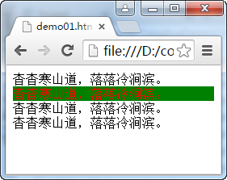
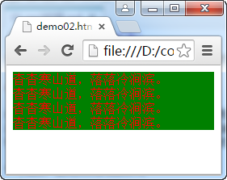
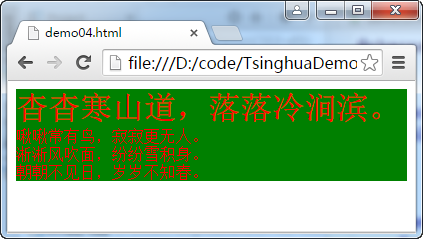
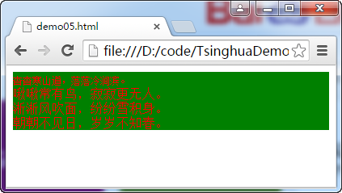
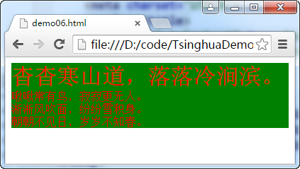

# CSS3初探

CSS（层叠样式表）用于定义HTML文档的呈现形式（外观、格式、布局）。

## 定义和应用样式

CSS样式由一条或多条以分号分隔的样式声明组成。每条声明包含一个CSS属性名称和属性取值，二者以冒号分隔。如`background-color:grey; color:white;`。代码中定义了两个样式，分别为背景色和前景色，每个样式都有属性名和其取值。

### 使用元素内嵌样式
在HTML元素中可以使用style属性设置此元素的样式。

**代码1 使用元素内嵌样式**
```
<!DOCTYPE html>
<html>
<head>
    <meta charset="UTF-8">
    <title></title>
</head>
<body>
    <div>杳杳寒山道，落落冷涧滨。</div>
    <div style="background-color: green; color: red;">杳杳寒山道，落落冷涧滨。</div>
    <div>杳杳寒山道，落落冷涧滨。</div>
    <div>杳杳寒山道，落落冷涧滨。</div>
</body>
</html>
```


图中只有应用了style属性的div元素的样式才被改变，其它三个div元素还保持默认样式。

### 使用文档内嵌样式

使用style属性应用CSS样式的效率不高，而且在维护时的工作量也非常大并容易出错。为了避免这个问题，可以在HTML文档中使用style元素（而不是元素中使用style属性）来定义文档的内嵌样式，再通过CSS选择器指示浏览器应用样式。

**代码2 使用文档内嵌样式**
```
<!DOCTYPE html>
<html>
<head>
    <meta charset="UTF-8">
    <title></title>
    <style>
        div{
            background-color: green;
            color: red;
        }
    </style>
</head>
<body>
    <div>杳杳寒山道，落落冷涧滨。</div>
    <div>杳杳寒山道，落落冷涧滨。</div>
    <div>杳杳寒山道，落落冷涧滨。</div>
    <div>杳杳寒山道，落落冷涧滨。</div>
</body>
</html>
```



使用文档的内嵌样式语法如下：
```
选择器 {
	属性名1:取值1;
	属性名2:取值2;
	...
	属性名n:取值n;
}
```
通过以上语法，可以为当前文档内的所有符合选择器定义的元素应用统一的样式。

在一个style元素中可以定义多个选择器。

**代码3 在style元素中定义多个选择器**
```
<!DOCTYPE html>
<html>
<head>
    <meta charset="UTF-8">
    <title></title>
    <style>
        div{
            background-color: green;
            color: red;
        }
        em{
            font-size: 2em;
            font-style: normal;
        }
    </style>
</head>
<body>
    <div><em>杳杳寒山道，落落冷涧滨。</em></div>
    <div>啾啾常有鸟，寂寂更无人。</div>
    <div>淅淅风吹面，纷纷雪积身。</div>
    <div>朝朝不见日，岁岁不知春。</div>
</body>
</html>
```


### 使用外部样式表
如果一套样式要应用于多个HTML文档，则使用文档内嵌样式就比较低效了，所应该创建外部样式文件，并把它引入到所有需要应用此文件中定义样式的HTML文档中。样式文件的文件名后缀通常为.css。

**代码4 样式文件**
```
@charset "UTF-8";/* 声明样式文件使用的字符编码类型 */

div{
    background-color: green;
    color: red;
}

em{
    font-size: 2em;
    font-style: normal;
}
```

在HTML文档中应用样式文件需要使用link元素把样式文件引入。一个HTML文档中可以使用多个link元素来引用多个样式文件。

**代码5 在HTML文档中应用样式文件**
```
<!DOCTYPE html>
<html>
<head>
    <meta charset="UTF-8">
    <title></title>
    <link rel="stylesheet" type="text/css" href="css/style01.css" />
</head>
<body>
    <div><em>杳杳寒山道，落落冷涧滨。</em></div>
    <div>啾啾常有鸟，寂寂更无人。</div>
    <div>淅淅风吹面，纷纷雪积身。</div>
    <div>朝朝不见日，岁岁不知春。</div>
</body>
</html>
```



注意：如果在HTML文档中引入多个样式文件，在这些文件中又存在着一些相同的选择器，那么引入文件的顺序就很关键了。在多个样式文件中有相同选择器定义时，后引入的样式会覆盖先引入的样式。

**代码6 样式文件1**
```
@charset "UTF-8";/* 声明样式文件使用的字符编码类型 */

div{
    background-color: green;
    color: red;
}

em{
    font-size: 2em;
    font-style: normal;
}
```

**代码7 样式文件2**
```
@charset "UTF-8";/* 声明样式文件使用的字符编码类型 */

em{
    font-size: 0.5em;
    font-style: normal;
}
```

**代码8 引入多个CSS文件的HTML页面**
```
<!DOCTYPE html>
<html>
<head>
    <meta charset="UTF-8">
    <title></title>
    <link rel="stylesheet" type="text/css" href="css/style01.css" />
    <link rel="stylesheet" type="text/css" href="css/style02.css" />
</head>
<body>
    <div><em>杳杳寒山道，落落冷涧滨。</em></div>
    <div>啾啾常有鸟，寂寂更无人。</div>
    <div>淅淅风吹面，纷纷雪积身。</div>
    <div>朝朝不见日，岁岁不知春。</div>
</body>
</html>
```



因为在HTML文档中后引入的是style02.css，所以span选择器中的字体大小为0.5em覆盖了先引入的style01.css中的span选择器中的字体大小为2em的样式。

修改代码，把引入顺序调换。

**代码9 调换样式文件引入顺序**
```
<!DOCTYPE html>
<html>
<head>
    <meta charset="UTF-8">
    <title></title>
    <link rel="stylesheet" type="text/css" href="css/style02.css" />
    <link rel="stylesheet" type="text/css" href="css/style01.css" />
</head>
<body>
    <div><em>杳杳寒山道，落落冷涧滨。</em></div>
    <div>啾啾常有鸟，寂寂更无人。</div>
    <div>淅淅风吹面，纷纷雪积身。</div>
    <div>朝朝不见日，岁岁不知春。</div>
</body>
</html>
```

结果如下图。



>可以使用`@import "文件名";`指令在一个CSS文件中引入其它CSS文件。

### 样式如何层叠

浏览器会按以下顺序对元素进行样式应用（优先级由高到低）：

1. 元素内嵌样式
2. 文档内嵌样式
3. 外部样式
4. 用户样式
5. 浏览器样式

可以在样式属性之后使用`!important`来调整层叠次序（调整优先级）。

**代码10 使用!important调整层叠次序**
```
a {
    color: red !important;
}
```
以上代码会提高优先级。

### 常见单位

#### 颜色表示

- 颜色名称
- 颜色取值`#rrggbb`
- rgb(r,g,b) 红绿蓝
- rgba(r,g,b,a) 红绿蓝透明
- hsl(h,s,l) 色相 饱和度 亮度
- hsla(h,s,l,a) 色相 饱和度 亮度 透明度

#### 长度
**绝对长度**

|单位|说明|
|---|---|
|in|英寸|
|cm|厘米|
|mm|毫米|
|pt|磅（1/72英寸）|
|pc|pica （12磅）|

**相对长度**

|单位|说明|
|---|---|
|em|与元素字号挂钩|
|ex|与元素字体的x高度挂钩|
|rem|与根元素的字号挂钩|
|px|css像素|
|%|百分比|

**缺乏支持的相对长度单位**
|单位|说明|
|---|---|
|gd|与网格挂钩，未获广泛支持|
|vw|与视口宽度挂钩，1vm等于文档显示区域（如浏览器）宽度的1%。
|vh|与视口高度挂钩，1vm等于文档显示区域（如浏览器）高度的1%。
|vmin|vw和vh中较小的那个的1%|
|vmax|vw和vh中较大的那个的1%|
|ch|与当前字体显示的字符的平均宽度挂钩|

使用calc()算式：`width: calc(80%-40px);`

目前只有ie支持。

**角度单位**
|单位|说明|
|---|---|
|deg|度（取值：0~360）|
|grad|百分度（取值：0~400）|
|rad|弧度（取值：0~6.28）|
|turn|圆周（取值：1到360）|

**时间单位**
|单位|说明|
|---|---|
|s|秒|
|ms|毫秒|

