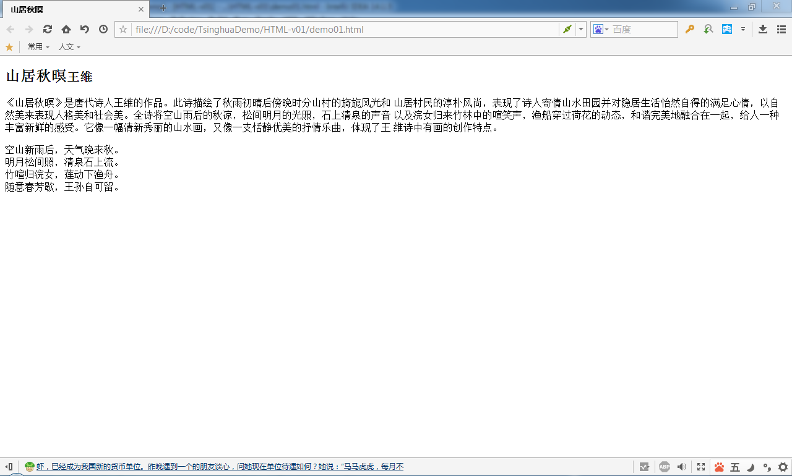
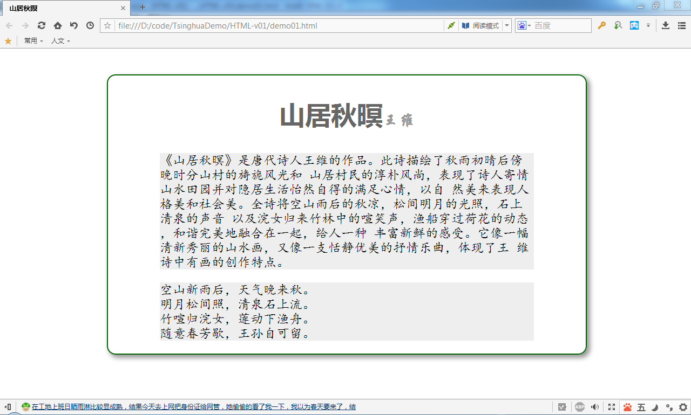
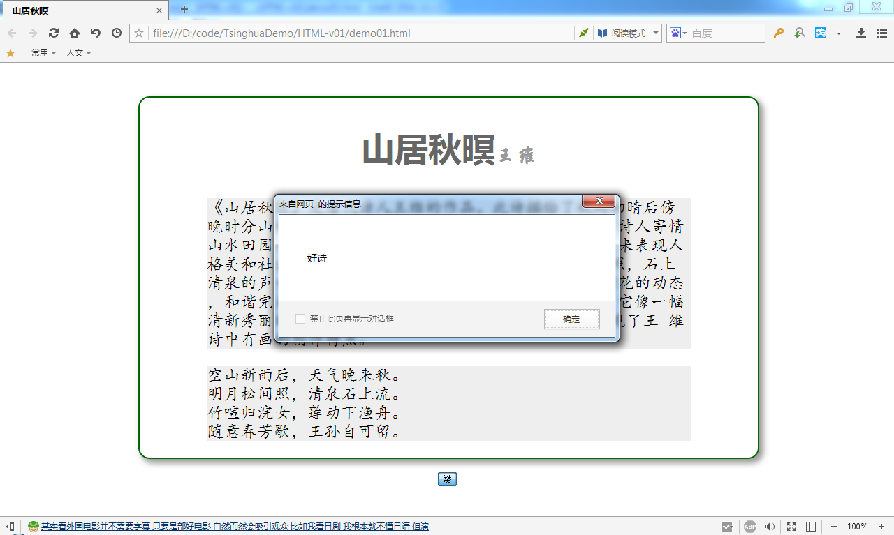

# HTML5简介

## 什么是HTML
HTML是Hypertext Markup Language的缩写，翻译为“超文本标记语言”。其中包含两个概念，即超文本、标记语言。

- 超文本：相对于纯文本，超文本有以下特点
	- 除可以包含文本内容外还可以在超文本中嵌入图片、音频、视频等多种媒体资源
	- 通过超级链接，可以由阅读者决定阅读内容的顺序
- 标记语言：HTML是一种用标签定义文档结构及内容的语言，文档中的所有标记会被浏览器进行顺序解释

## HTML5简介

HTML5是HTML标准的最新版本，经过8年的沉淀，在2014年底发布了HTML5标准的正式版。HTML5旨在为HTML技术定义秩序与条理，并让BS结构软件的前端界面技术进化到一个新的高度。

从狭义上讲，HTML5是HTML标准的最新版本；而从广义上讲HTML5是一系列用于生产富客户端界面的相关技术的总称，常用的技术包含HTML5核心规范、CSS3级联样式表和Javascript脚本技术。

- HTML5核心规范：定义了用于标记文档内容的标签元素，并强化每个标签元素的语义
- CSS级联样式表：用于控制被HTML5标记的内容的呈现外观
- Javascript脚本：可以操作HTML文档中的元素，还可以响应用户操作，增强系统与用户之间的交互；如果要使用HTML5提供的某些新特性，也需要使用Javascript脚本。

### 定义HTML文档结构

**代码1 HTML样例源代码**
```
	<!DOCTYPE html>
	<html>
	<head>
	    <meta charset="UTF-8">
	    <title>山居秋暝</title>
	</head>
	<body>
	    <article>
	        <h2>
	            山居秋暝<small>王维</small>
	        </h2>
	        <section>
	            <p>
	                《山居秋暝》是唐代诗人王维的作品。此诗描绘了秋雨初晴后傍晚时分山村的旖旎风光和
	                山居村民的淳朴风尚，表现了诗人寄情山水田园并对隐居生活怡然自得的满足心情，以自
	                然美来表现人格美和社会美。全诗将空山雨后的秋凉，松间明月的光照，石上清泉的声音
	                以及浣女归来竹林中的喧笑声，渔船穿过荷花的动态，和谐完美地融合在一起，给人一种
	                丰富新鲜的感受。它像一幅清新秀丽的山水画，又像一支恬静优美的抒情乐曲，体现了王
	                维诗中有画的创作特点。
	            </p>
	        </section>
	        <section>
	            <p>
	                空山新雨后，天气晚来秋。<br>
	                明月松间照，清泉石上流。<br>
	                竹喧归浣女，莲动下渔舟。<br>
	                随意春芳歇，王孙自可留。
	            </p>
	        </section>
	    </article>
	</body>
	</html>
```

**图1 代码1在浏览器中被解释的外观**



### 使用CSS样式

**代码2 控制代码1中HTML样式的CSS源代码**

```
@charset "UTF-8";

body{
    margin-top: 3em;
}

article{
    margin-left: 15%;
    border: 2px solid #060;
    width: 70%;
    border-radius: 1em;
    box-shadow: #999999 5px 5px 13px 1px;
}

h2{
    text-align: center;
    font-family: 微软雅黑;
    font-size: 3em;
    color: #666;
}

small{
    font-family: 华文行楷;
    font-size: 0.6em;
    color: #999;
}

p{
    margin: 1em 4em;
    background: #eee;
    font-family: 楷体;
    font-size: 1.5em;
}
```
要使用这个CSS文件来渲染页面，则应该把它引入到相应的HTML文件内，作法是在`<head>`标签内部使用`<link>`标签引用CSS文件。

**代码3 向HTML文件中引入CSS文件的代码片段**
```
<head>
    <!-- 原有代码省略 -->
    <link rel="stylesheet" href="css/demo01.css" />
</head>
```

**图2 引入了CSS样式的HTML页面在浏览器中展示的外观**


### 使用Javascript在页面中加入与用户交互功能

首先我们在`<article>`标签下方加入一个按钮，然后在点击它的时候会调用一行简单的Javasctip脚本程序来为用户弹出一个对象框。

**代码4 为HTML加入用户交互的代码片段**
```
<body>
    <article>
		<!-- 原有代码省略 -->
    </article>
    <div style="text-align: center;margin-top: 1em;"><button onclick="alert('好诗');">赞</button></div>
</body>
```

当在浏览器中点击页面上的按钮后会弹出一个消息框，如图3所示。

**图3 通过Javascript脚本与用户交互**
