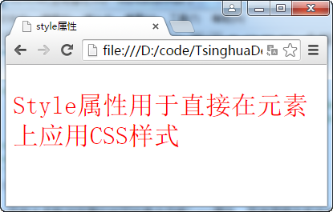

# HTML全局属性

## accesskey属性
此属性可以设置让页面上某个元素获得焦点的快捷键。

**代码1 使用accesskey属性为元素设置快捷键**
```
<!DOCTYPE html>
<html>
<head>
    <meta charset="UTF-8">
    <title>accesskey属性</title>
</head>
<body>
    <form>
        姓名：<input type="text" name="xm" accesskey="n" /><br>
        密码：<input type="password" name="pwd" accesskey="p" /><br>
        <input type="submit" value="提交" accesskey="s" />
    </form>
</body>
</html>
```
触发accesskey机制的快捷键组合因操作系统而异，在windows平台上是使用alt与其它按键的组合。
以windows为例，在浏览器中打开代码1，可以使用alt+n让姓名输入框获得焦点；使用alt+p让密码输入框获得焦点；使用alt+s会提交表单。

## class属性
此属性用于将文档中的多个元素归类。作用是可以通过此属性的取值方便的选取某一类元素。可以为某一类元素设置样式或通过程序脚本进行操作。
一个元素可以归入多个类别（类型于打多个标签）。多个属性值之间用空白分隔。

**代码2 为文档中的元素分类**
```
<!DOCTYPE html>
<html>
<head>
    <meta charset="UTF-8">
    <title>class属性</title>
    <style>
        .book{
            font-style: italic;
        }
        .movie{
            font-weight: bold;
        }
        .top{
            color:red;
        }
    </style>
</head>
<body>
    <div class="book">三国演义</div>
    <div class="movie">功夫熊猫</div>
    <div class="book">水浒传</div>
    <div class="book top">史记</div>
    <div class="movie top">夏洛特烦恼</div>
</body>
</html>
```
在代码2中有五个div元素，使用class属性为它们进行了分类，并为不同的类别定义了各自的样式。其中book类为斜体，movie类为粗体，top类会标红。在浏览器中会显示出不同类别的样式。
因为最后两个元素都使用了两种分类，所以它们会应用定义的两种分类的样式。


## contenteditable属性
此属性的用途是设置元素是否可以被用户编辑。属性取true时用户可以编辑元素内容，设置为false时则禁止编辑。在元素上如果没有设置这个属性，默认是继承父元素的该属性值。

**代码3 使用contenteditable属性设置编辑内容**
```
<!DOCTYPE html>
<html>
<head>
    <meta charset="UTF-8">
    <title>contenteditable属性</title>
</head>
<body>
    <p>大漠孤烟直，长河落日圆。</p>
    <p>萧关逢候骑，<span contenteditable="true">_________</span>。</p>
</body>
</html>
```
当单击span元素时可以进行编辑状态。


>尝试设置父元素的contenteditable属性，查看效果。

## contextmenu属性
此属性用于为元素设置快捷菜单（右键菜单）。尚无浏览器对此属性进行支持。

## dir属性
此属性用于设置元素中的文字的起始方向，有两个有效取值：
- ltr：从左到右
- rtl：从右到左

## draggable和dropzone属性
这两个属性用于设置元素的拖曳动作。高级部分再做讲解。

## hidden属性
这是一个布尔属性，表示元素不需关注，浏览器会隐藏设置有此属性的元素，就像HTML文档中没有这个元素一样。

**代码4 使用hidden属性隐藏元素**
```
<!DOCTYPE html>
<html>
<head>
    <meta charset="UTF-8">
    <title>hidden属性</title>
    <script>
        var toggleHidden = function(){
            var elem = document.getElementById('test-div');
            if(elem.hasAttribute('hidden')){
                elem.removeAttribute('hidden');
            }else{
                elem.setAttribute('hidden','hidden');
            }
        };
    </script>
</head>
<body>
    <button onclick="toggleHidden()">切换</button>
    <div>=======================</div>
    <div id="test-div" hidden>
        空山新雨后，天气晚来秋。<br>
        明月松间照，清泉石上流。<br>
        竹喧归浣女，莲动下渔舟。<br>
        随意春芳歇，王孙自可留。
    </div>
    <div>=======================</div>
</body>
</html>
```
页面在浏览器中加载后是没有诗歌部分的，在单按钮后会把内容显示出来。再次单击会进行隐藏与显示之间的切换。这是通过Javascript脚本对dom对象的操作来完成的。


## id属性
用于为元素分配唯一标识。原则上，在同一文档中元素的id属性取值不可重复。
id属性与class属性的用途很类似，都是为了方便选取元素来进行样式设置或脚本操作的，区别在于class选取的是一批元素，而id选取的是单个元素。

**代码5 使用id属性唯一标识元素**
```
<!DOCTYPE html>
<html>
<head>
    <meta charset="UTF-8">
    <title>id属性</title>
    <style>
        div{
            height: 30em;
            width: 30em;
            border: 1px solid black;
            margin-bottom: 5em;
        }
        #div2{
            background-color: #cccccc;
        }
    </style>
</head>
<body>
    <div id="div1">DIV1</div>
    <div id="div2">DIV2</div>
    <div id="div3">DIV3</div>
</body>
</html>
```
在代码5中每个div都有唯一的id属性取值，通过样式定义选中了第二个div并设置了灰色背景。

>id还有另一个用途，可以在浏览器地址拦的URL后加上“#id值”来进行定位到页面的某个位置上。如http://xxx/index.html#footer会在浏览器上打开index.html并定位到此文档中id是footer的元素位置上。

## lang属性
lang属性用于说明元素使用的语言。取值应该是有效的ISO语言代码。使用它的目的是让浏览器调整其表达元素内容的方式。

## spellcheck属性
此属性用来表明浏览器是否应该对元素内容进行拼写检查。用在可编辑的元素上时才有意义。
此属性的取值为true和false。检查方式因浏览器而异。

**代码6 使用spellcheck属性进行元素内容拼写检查**
```
<!DOCTYPE html>
<html>
<head>
    <meta charset="UTF-8">
    <title></title>
</head>
<body>
    <input spellcheck="true" value="This is an appleee." /><br>
    <p contenteditable="true" spellcheck="true">This is an appleee.</p>
    <p spellcheck="true">This is an appleee.</p>
</body>
</html>
```


>目前大多数浏览器的拼写检查会忽略lang属性，而使用操作系统或浏览器的语言设置进行检查。

## style属性
用于直接在元素上设置CSS样式。

**代码7 使用style属性设置样式**
```
<!DOCTYPE html>
<html>
<head>
    <meta charset="UTF-8">
    <title>style属性</title>
</head>
<body>
    <p style="color:red;font-size: 2em;">Style属性用于直接在元素上应用CSS样式</p>
</body>
</html>
```



## tabindex属性
此属性用于设置键盘Tab键按下后，页面元素获取焦点的顺序。通常取值是自然数，数字越小越先获取焦点。

**代码8 使用tabindex属性设置元素获得焦点顺序**
```
<!DOCTYPE html>
<html>
<head>
    <meta charset="UTF-8">
    <title></title>
</head>
<body>
    姓名：<input tabindex="1" /><br>
    年龄：<input tabindex="2" /><br>
    电话：<input tabindex="5" /><br>
    邮箱：<input tabindex="4" /><br>
    住址：<input tabindex="3" /><br>
    <button tabindex="6">OK</button>
</body>
</html>
```


按下Tab键后，页面中的元素会以图中标号顺序获得焦点。

## title属性
此属性提供了元素的提示信息。浏览器通常以工具提示方式进行这此信息的显示。

**代码9 使用title属性为元素添加提示信息**

```
<!DOCTYPE html>
<html>
<head>
    <meta charset="UTF-8">
    <title></title>
</head>
<body>
    <a title="链接至百度首页" href="http://www.baidu.com">百度</a>
</body>
</html>
```


当鼠标悬停在元素上时会显示title属性设置的提示信息。