# HTML文本元素
## b元素
b元素可以用于标记一段文字，但**不表示强调**。主要用于标记关键字或产品名称。默认样式是粗体字。

## em元素
em元素表示对所标记文本的**强调**语义。默认样式是斜体字。

## i元素
i元素表示文字**与周围内容有本质区别**，通常用于外文语汇或科技术语。默认样式是斜体字。

## strong元素
strong元素表示一段**非常重要**的文字。默认样式是粗体字。

## s元素
s元素表示一段文字不正确或不准确。默认样式是在文字上加了一条删除线。

## u元素
u元素会为所标记的内容添加下划线，但**没有强调语义**，只是为了把内容突出显示出来。
实际上这个元素属于呈现元素，在HTML5规范里已经**不建议使用**。推荐使用CSS来进行呈现方面的修饰。

## small元素
small元素表示小号字体内容，常用于标记声明之类的内容。

## sub和sup
sub元素和sup元素分别表示下标和上标。

**代码1 常用文本元素**
```
<!DOCTYPE html>
<html lang="en">
<head>
    <meta charset="UTF-8">
    <title></title>
</head>
<body>
    <i>3d touch技术</i>是苹果公司在<b>iPhone 6 plus</b>中应用的一项新技术。<br><br>
    您<em>大点儿声</em>,不费电！<br><br>
    手榴弹要是<strong>一块钱六个</strong>，我先扔你一百块钱的。<br><br>
    这也太欺负人了吧！<s>老虎不发猫，你当朕是病危啊！</s><br><br>
    <u>传说中的下划线长的是这个样子的</u>。<br><br>
    同学们太配合了，待会儿下课都别走啊，请大家吃席去。<small>谁去谁掏钱啊</small>。<br><br>
    X1的2次方是这个样子的：X<sub>1</sub><sup>2</sup><br><br>
</body>
</html>
```

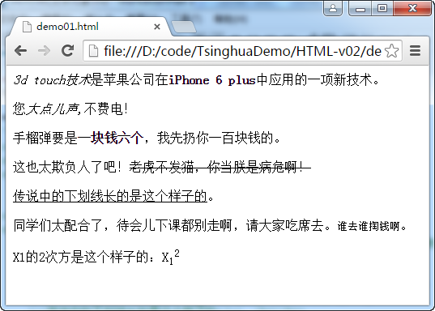

## br元素
br元素表示强制换行。当换行是内容中的一部分时才应该考虑使用此元素，而不应该使用这个元素创建段落或其它与内容组织相关的功能。

## wbr元素
wbr元素用于表示长度超过浏览器窗口的内容应该在哪里进行换行。有助于显示很长的文本内容，如长单词或URL等。

**代码2 使用wbr元素设置建议换行位置**
```
<!DOCTYPE html>
<html>
<head>
    <meta charset="UTF-8">
    <title>wbr元素</title>
</head>
<body>
    HTML5的简介可以参阅此网址http://www.w3school.com.cn/<wbr>html5/html_5_intro.asp
</body>
</html>
```

在不使用wbr元素时，页面在浏览器中如下图方式呈现：
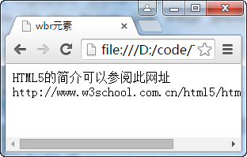

如果使用了wbr元素则当浏览器宽度过窄时，会在相应位置上进行换行。
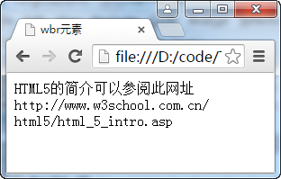

如果浏览器宽度大于内容的长度则不会换行。
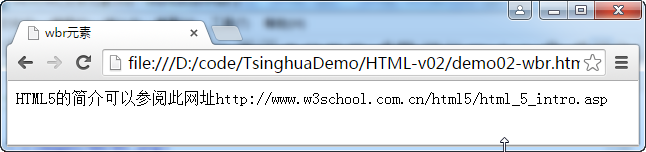

## pre元素
pre元素可以改变浏览器处理内容的方式，保留在pre元素中的文本原始格式。
除了文档中的内容原始格式的意义很重要时才应该考虑使用这个元素，否则会破坏HTML只组织内容，而不用于呈现的原则。

## code元素
表示计算机代码片段。

## var元素
表示程序中的变量。

## samp元素
表示程序或计算机系统的输出内容。

## kbd元素
表示用户的输入内容。

**代码3 计算机代码相关的元素示例**
```
<!DOCTYPE html>
<html>
<head>
    <meta charset="UTF-8">
    <title>计算机代码</title>
</head>
<body>
以下是一段Java代码：
    <pre>
        <code>
    public int add(int x, int y){
        int sum = x + y;
        System.out.println("计算结果是：" + sum);
        return sum;
    }
        </code>
    </pre>
    以上代码中定义了两个参数变量<var>x</var>和<var>y</var>，以及一个局部变量<var>sum</var>。<br>
    当用户输入<samp>10</samp>和<samp>8</samp>的时候，程序会有以下输出，并把结果返回给调用者。<br>
    <kbd>计算结果是：18</kbd>
</body>
</html>
```
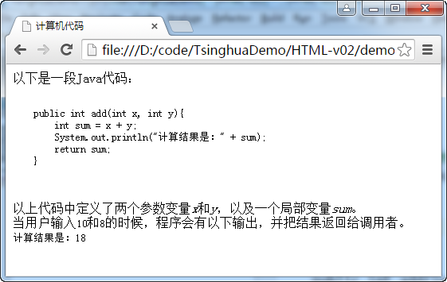

## abbr元素
表示缩写。通常使用此元素的title全局属性来显示缩写的完整含意。

**代码4 abbr元素**
```
<!DOCTYPE html>
<html>
<head>
    <meta charset="UTF-8">
    <title>abbr缩写</title>
</head>
<body>
    <abbr title="Application Program Interface">API</abbr><br><br>
    <abbr title="不明白所以觉得很厉害">不明觉厉</abbr>
</body>
</html>
```
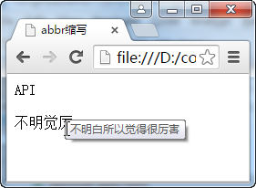

## dfn元素
此元素用于定义术语。如果在dfn元素中包含abbr元素，则缩写词就是要定义的术语。如果元素内容是文本，并且没有title属性，则其文字内容就是要定义的术语。

## q元素
此元素表示引自他处的内容，可以使用它的特有属性cite来指定出处或URL。默认样式是会在内容前后添加引号。

## cite元素
用于表示引用作品的标题。

**代码5 术语定义、引用的元素示例**
```
<!DOCTYPE html>
<html lang="en">
<head>
    <meta charset="UTF-8">
    <title>dfn元素定义术语</title>
</head>
<body>
    <dfn>建安风骨</dfn>是指汉魏之际雄健深沉，慷慨悲凉的文学风格。<br><br>
    下边引用曹操<cite>《观沧海》</cite>中的句子来体悟一下：<q>日月之行，若出其中。星汉灿烂，若出其里。</q>
</body>
</html>
```
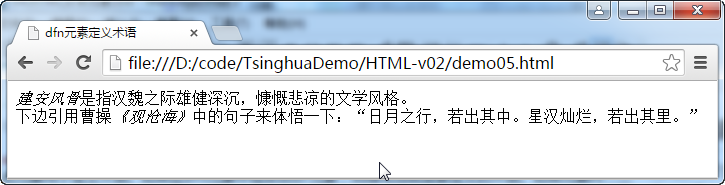

## 注音符号元素
注意符号元素是一组HTML元素，包括：
- ruby：用于定义要被注音的文字
- rt：用于标记注音符号
- rp：在不支持注音符号特性的浏览器下，使用此元素对注音符号进行处理

**代码6 使用注音符号**
```
<!DOCTYPE html>
<html lang="en">
<head>
    <meta charset="UTF-8">
    <title>注音符号</title>
</head>
<body>
    <ruby>魑<rp>(</rp><rt>chī</rt><rp>)</rp></ruby>
    <ruby>魅<rp>(</rp><rt>mèi</rt><rp>)</rp></ruby>
    <ruby>魍<rp>(</rp><rt>wǎng</rt><rp>)</rp></ruby>
    <ruby>魉<rp>(</rp><rt>liǎng</rt><rp>)</rp></ruby>
</body>
</html>
```
在支持注音符号的浏览器中页面如下显式，为明晰起见，放大了字号。
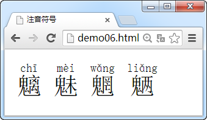

在不支持注音符号的浏览器中页面如下显式，为明晰起见，放大了字号。
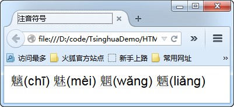

## bdo元素
可以指定所修饰内容的文字方向。必须使用dir全局属性来设置文字方向，取值有rtl和ltr。

**代码7 使用bdo元素设置文字方向**
```
<!DOCTYPE html>
<html lang="en">
<head>
    <meta charset="UTF-8">
    <title>bdo元素</title>
</head>
<body>
    <bdo dir="ltr">吃葡萄不吐葡萄皮儿，不吃葡萄倒吐葡萄皮儿。</bdo>
    <br><br><br>
    <bdo dir="rtl">吃葡萄不吐葡萄皮儿，不吃葡萄倒吐葡萄皮儿。</bdo>
</body>
</html>
```

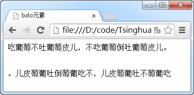

## span元素
此元素本身没有明确语义，可以作用于没有明确语义的内容上，为其进行分类等定义。

## mark元素
此元素用于高亮突出显示文本。用于表示因与某段上下文相关而突出显示的内容。

**代码8 使用mark**
```
<!DOCTYPE html>
<html>
<head>
    <meta charset="UTF-8">
    <title>mark元素</title>
</head>
<body>
    你知道什么叫东施效颦吗？<br>
    谁是<mark>东施</mark>？她为什么<mark>尿频</mark>？
</body>
</html>
```

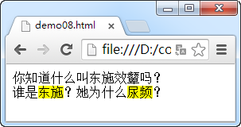

## ins元素和del元素
ins元素表示文档中添加的内容，默认样式是一条下划线。del元素表示文档中删除的内容，默认样式是一条删除线。
它们的cite属性可以指明解释添加或移除内容的原因相关的资源URL。datetime属性可以设置修改时间。

**代码9 ins和del元素**
```
<!DOCTYPE html>
<html>
<head>
    <meta charset="UTF-8">
    <title>ins和del元素</title>
</head>
<body>
    床前明月光，疑是地上霜，举头望明月，<del>我叫郭德纲。</del>
    <br><br>
    床前明月光，疑是地上霜，举头望明月，<ins>低头思故乡。</ins>
</body>
</html>
```

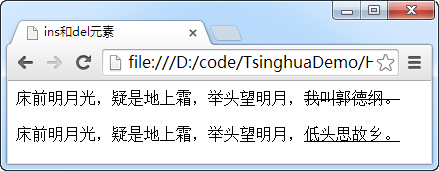

## time元素
time元素用于表示时间或日期。有两个专有属性，一个是pubdate，它是布尔属性，如果标上此属性则time表示整个HTML文档或离此元素最近的article元素的发布日期；另一个是datetime属性，以RFC3339规定的格式指定日期或时间。

`<time datetime="2015-01-01">2015年元旦</time>`