# 组织内容
## 为什么要对内容进行分组
浏览器会将HTML文档中的多个连续空白和换行合并为一个空格。所以使用空白和换行对HTML文档进行排版是不可行的。

**代码1 手动排版的HTML文档**
```
<!DOCTYPE html>
<html>
<head>
    <meta charset="UTF-8">
    <title>山居秋暝</title>
</head>
<body>
    山居秋暝<small>王维</small>

    《山居秋暝》是唐代诗人王维的作品。此诗描绘了秋雨初晴后傍晚时分山村的旖旎风光和
    山居村民的淳朴风尚，表现了诗人寄情山水田园并对隐居生活怡然自得的满足心情，以自
    然美来表现人格美和社会美。全诗将空山雨后的秋凉，松间明月的光照，石上清泉的声音
    以及浣女归来竹林中的喧笑声，渔船穿过荷花的动态，和谐完美地融合在一起，给人一种
    丰富新鲜的感受。它像一幅清新秀丽的山水画，又像一支恬静优美的抒情乐曲，体现了王
    维诗中有画的创作特点。

    空山新雨后，天气晚来秋。
    明月松间照，清泉石上流。
    竹喧归浣女，莲动下渔舟。
    随意春芳歇，王孙自可留。
</body>
</html>
```

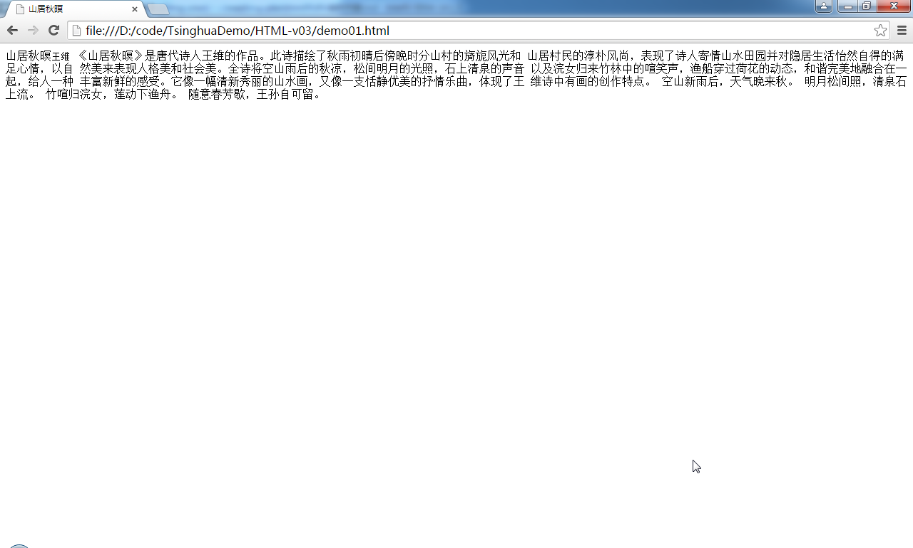

## p元素
此元素用于建立段落。每个段落包含一到多个相关的句子，它们围绕一个观点、论点或主题。

**代码2 使用p元素进行段落的创建**
```
<!DOCTYPE html>
<html>
<head>
    <meta charset="UTF-8">
    <title>山居秋暝</title>
</head>
<body>
    <p>山居秋暝<small>王维</small></p>
    <p>
        《山居秋暝》是唐代诗人王维的作品。此诗描绘了秋雨初晴后傍晚时分山村的旖旎风光和
        山居村民的淳朴风尚，表现了诗人寄情山水田园并对隐居生活怡然自得的满足心情，以自
        然美来表现人格美和社会美。全诗将空山雨后的秋凉，松间明月的光照，石上清泉的声音
        以及浣女归来竹林中的喧笑声，渔船穿过荷花的动态，和谐完美地融合在一起，给人一种
        丰富新鲜的感受。它像一幅清新秀丽的山水画，又像一支恬静优美的抒情乐曲，体现了王
        维诗中有画的创作特点。
    </p>
    <p>
        空山新雨后，天气晚来秋。
        明月松间照，清泉石上流。
        竹喧归浣女，莲动下渔舟。
        随意春芳歇，王孙自可留。
    </p>
</body>
</html>
```
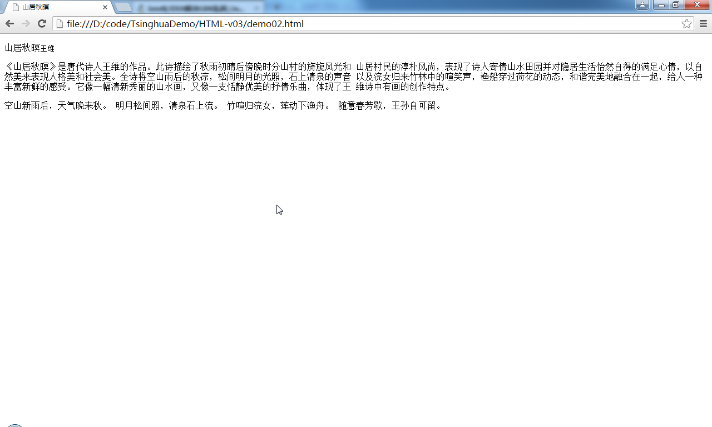

## div元素
此元素没有具体语义。找不到恰当元素修饰内容时可以使用这个元素建立结构并使用class或id属性赋予其含义。类似于span元素，区别在于span是行内元素，div是块级元素。

>只有在万不得已时才考虑使用div和span元素，应该优先使用有具体语义的元素来定义内容。

**代码3 使用div元素进行内容分组**
```
<!DOCTYPE html>
<html>
<head>
    <meta charset="UTF-8">
    <title>山居秋暝</title>
</head>
<body>
    <div>山居秋暝<small>王维</small></div>
    <div>
        《山居秋暝》是唐代诗人王维的作品。此诗描绘了秋雨初晴后傍晚时分山村的旖旎风光和
        山居村民的淳朴风尚，表现了诗人寄情山水田园并对隐居生活怡然自得的满足心情，以自
        然美来表现人格美和社会美。全诗将空山雨后的秋凉，松间明月的光照，石上清泉的声音
        以及浣女归来竹林中的喧笑声，渔船穿过荷花的动态，和谐完美地融合在一起，给人一种
        丰富新鲜的感受。它像一幅清新秀丽的山水画，又像一支恬静优美的抒情乐曲，体现了王
        维诗中有画的创作特点。
    </div>
    <div>
        空山新雨后，天气晚来秋。
        明月松间照，清泉石上流。
        竹喧归浣女，莲动下渔舟。
        随意春芳歇，王孙自可留。
    </div>
</body>
</html>
```
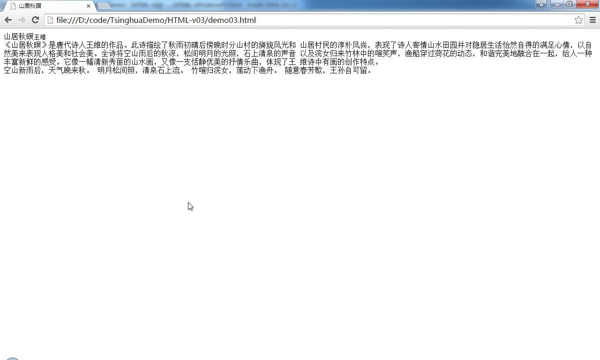

## blockquote元素
此元素表示引自他处的一片内容。与q元素类似。区别在于q元素引用的内容较少，blockquote元素引用的内容较多。cite属性可以用于指定引用内容的出处。

**代码4 使用blockquote元素**
```
<!DOCTYPE html>
<html>
<head>
    <meta charset="UTF-8">
    <title>blockquote元素</title>
</head>
<body>
    以下是百度百科上对山居秋暝这首诗的介绍。
    <blockquote>
        《山居秋暝》是唐代诗人王维的作品。此诗描绘了秋雨初晴后傍晚时分山村的旖旎风光和
        山居村民的淳朴风尚，表现了诗人寄情山水田园并对隐居生活怡然自得的满足心情，以自
        然美来表现人格美和社会美。全诗将空山雨后的秋凉，松间明月的光照，石上清泉的声音
        以及浣女归来竹林中的喧笑声，渔船穿过荷花的动态，和谐完美地融合在一起，给人一种
        丰富新鲜的感受。它像一幅清新秀丽的山水画，又像一支恬静优美的抒情乐曲，体现了王
        维诗中有画的创作特点。
    </blockquote>
</body>
</html>
```
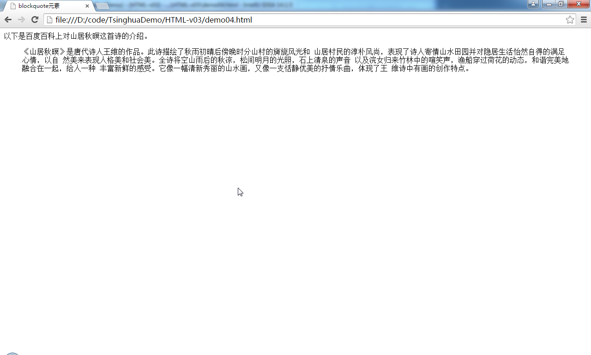

## hr元素
此元素表示段落级别的主题分隔。呈现为一条分隔线。代表向另一相关主题的转换。

**代码5 hr元素分隔主题**
```
<!DOCTYPE html>
<html>
<head>
    <meta charset="UTF-8">
    <title>hr元素</title>
</head>
<body>
    <h2>杜牧生平介绍</h2>
　　<p>杜牧（803-852），字牧之，京兆万年（今陕西西安市）人，宰相杜祐之孙。唐大和二年（828）进士及第，又登贤良方正能直言极谏科，授弘文馆校书郎，江西观察使沈传师召为团练巡官。后为淮南节度使牛僧孺掌书记，居扬州，颇好游宴。大和九年（835），入朝为监察御史，不久即分司东部。后历任宣州团练判官、左补阙、史馆修撰、膳部员外郎等职。会昌二年（842），出为黄州刺史，迁池、睦二州刺史。大中二年（848），入朝为司勋员外郎、史馆修撰。后出任湖州刺史，官终中书舍人。世称杜樊川。</p>
    <hr>
    <h2>过华清宫绝句</h2>
    <p>
        长安回望绣成堆，<br>
        山顶千门次第开。<br>
        一骑红尘妃子笑，<br>
        无人知是荔枝来。<br>
    </p>
    <hr>
    <h2>清明</h2>
    <p>
        清明时节雨纷纷，<br>
        路上行人欲断魂。<br>
        借问酒家何处有？<br>
        牧童遥指杏花村。<br>
    </p>
    <hr>
    <h2>赤壁</h2>
    <p>
        折戟沉沙铁未销，<br>
        自将磨洗认前朝。<br>
        东风不与周郎便，<br>
        铜雀春深锁二乔。<br>
    </p>
</body>
</html>
```
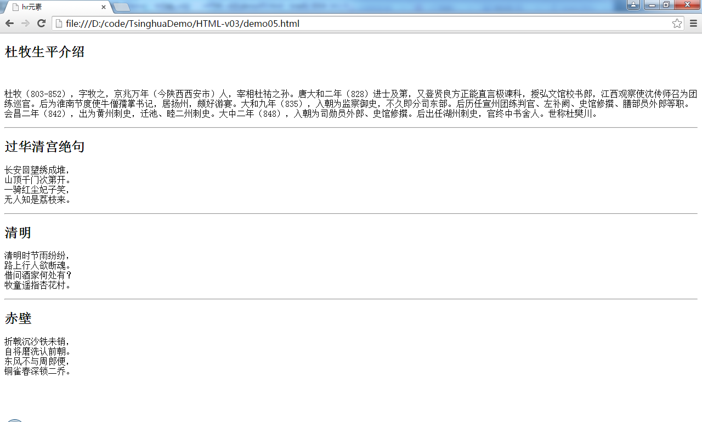

## 有序列表
HTML中使用ol元素组织有序列表，使用li元素向列表中添加条目内容。

**代码6 有序列表**
```
<!DOCTYPE html>
<html lang="en">
<head>
    <meta charset="UTF-8">
    <title>有序列表</title>
</head>
<body>
    以下是朕爱吃的水果，排名分先后：
    <ol>
        <li>西瓜</li>
        <li>苹果</li>
        <li>橙子</li>
        <li>桃</li>
        <li>桔子</li>
        <li>梨</li>
        <li>草莓</li>
    </ol>
</body>
</html>
```
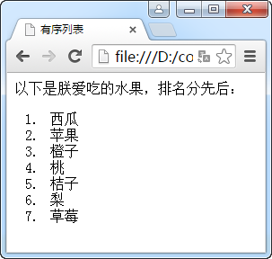

ol元素中的条目默认是以升序进行编号的，也可以在ol元素中使用reversed属性，指定条目使用降序编号。

**代码7 降序序号的有序列表**
```
<!DOCTYPE html>
<html>
<head>
    <meta charset="UTF-8">
    <title>有序列表</title>
</head>
<body>
    以下是朕爱吃的水果，排名分先后：
    <ol reversed>
        <li>西瓜</li>
        <li>苹果</li>
        <li>橙子</li>
        <li>桃</li>
        <li>桔子</li>
        <li>梨</li>
        <li>草莓</li>
    </ol>
</body>
</html>
```
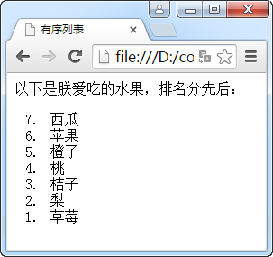

使用start属性可以设置条目的起始序号。

**代码8 降序序号的有序列表**
```
<!DOCTYPE html>
<html>
<head>
    <meta charset="UTF-8">
    <title>有序列表</title>
</head>
<body>
    以下是朕爱吃的水果，排名分先后：
    <ol start="10">
        <li>西瓜</li>
        <li>苹果</li>
        <li>橙子</li>
        <li>桃</li>
        <li>桔子</li>
        <li>梨</li>
        <li>草莓</li>
    </ol>
</body>
</html>
```
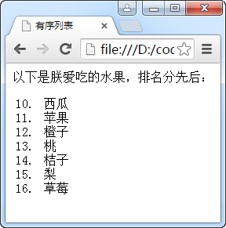

**代码9 同时使用start和reversed属性**
```
<!DOCTYPE html>
<html>
<head>
    <meta charset="UTF-8">
    <title>有序列表</title>
</head>
<body>
    以下是朕爱吃的水果，排名分先后：
    <ol start="10" reversed>
        <li>西瓜</li>
        <li>苹果</li>
        <li>橙子</li>
        <li>桃</li>
        <li>桔子</li>
        <li>梨</li>
        <li>草莓</li>
    </ol>
</body>
</html>
```
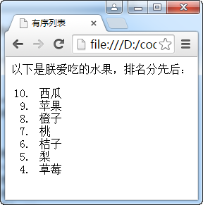

使用type属性可以设置编号的类型，如下表：

|值|说明|示例|
|:---:|:---|:---|
|1|十进制数字（默认）|**1. 2. 3. 4.**|
|a|小写英文字母|**a. b. c. d.**|
|A|大写英文字母|**A. B. C. D.**|
|i|小写罗马数字|**i. ii. iii. iv.**|
|I|大写罗马数字|**I. II. III. IV.**|

**代码10 使用type属性设置编号类型**
```
<!DOCTYPE html>
<html>
<head>
    <meta charset="UTF-8">
    <title>有序列表</title>
</head>
<body>
    以下是朕爱吃的水果，排名分先后：
    <ol type="a">
        <li>西瓜</li>
        <li>苹果</li>
        <li>橙子</li>
        <li>桃</li>
        <li>桔子</li>
        <li>梨</li>
        <li>草莓</li>
    </ol>
</body>
</html>
```
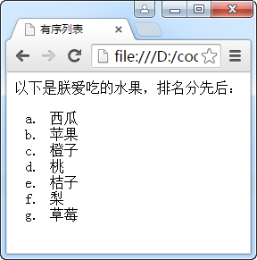

可以使用li元素中的value属性对编号进行调整。

**代码11 使用li元素中的value属性对编号进行调整**
```
<!DOCTYPE html>
<html>
<head>
    <meta charset="UTF-8">
    <title>有序列表</title>
</head>
<body>
    以下是朕爱吃的水果，排名分先后：
    <ol>
        <li>西瓜</li>
        <li>苹果</li>
        <li value="10">橙子</li>
        <li>桃</li>
        <li>桔子</li>
        <li value="5">梨</li>
        <li>草莓</li>
    </ol>
</body>
</html>
```
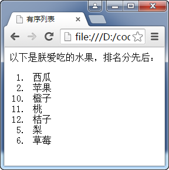

## 无序列表
HTML中使用ul元素组织无序列表，与od元素相同，也是使用li元素向列表中添加条目内容。

**代码12 无序列表**
```
<!DOCTYPE html>
<html>
<head>
    <meta charset="UTF-8">
    <title>无序列表</title>
</head>
<body>
    以下是朕爱吃的水果，排名<em>不分</em>先后：
    <ul>
        <li>西瓜</li>
        <li>苹果</li>
        <li>橙子</li>
        <li>桃</li>
        <li>桔子</li>
        <li>梨</li>
        <li>草莓</li>
    </ul>
</body>
</html>
```

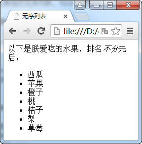

可以使用CSS的list-style-type属性来设置条目的标志样式。甚至可以把无序列表变成有序列表。

**代码13 使用CSS设置条目标志**
```
<!DOCTYPE html>
<html>
<head>
    <meta charset="UTF-8">
    <title>无序列表</title>
</head>
<body>
    以下是朕爱吃的水果，排名<em>不分</em>先后：
    <ul style="list-style-type: circle;">
        <li>西瓜</li>
        <li>苹果</li>
        <li>橙子</li>
        <li>桃</li>
        <li>桔子</li>
        <li>梨</li>
        <li>草莓</li>
    </ul>
</body>
</html>
```
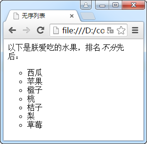

## dl列表
定义一个dl列表要用到dl、dt、dd三个元素。表示包含一组定义列表项的内容。

- dd：表示列表的定义
- dt：表示列表项的标识（分组）
- dd：表示列表项的描述

**代码14 dl列表**
```
<!DOCTYPE html>
<html>
<head>
    <meta charset="UTF-8">
    <title>dl列表</title>
</head>
<body>
    <dl>
        <dt>苹果</dt>
        <dd>落叶乔木，通常树木可高至15米，但栽培树木一般只高3-5米左右。树干呈灰褐色，树皮有一定程度的脱落。苹果树开花期是基于各地气候而定，但一般集中在4-5月份。苹果是异花授粉植物，大部分品种自花不能结成果实。</dd>
        <dd>美国的一家高科技公司。由史蒂夫·乔布斯、斯蒂夫·沃兹尼亚克和罗·韦恩(Ron Wayne)等三人于1976年4月1日创立，并命名为美国苹果电脑公司（Apple Computer Inc. ）， 2007年1月9日更名为苹果公司，总部位于加利福尼亚州的库比蒂诺。</dd>
        <dt>橘子</dt>
        <dd>是芸香科植物的果实，中国也是橘树的主要发源地之一。中国古人食用橘子，并且将野生橘树进行人工栽培，历史悠久。</dd>
        <dd>日本作家芥川龙之介创作后期的短篇小说之一，作品赞颂了普通人之间的温情。</dd>
    </dl>
</body>
</html>
```

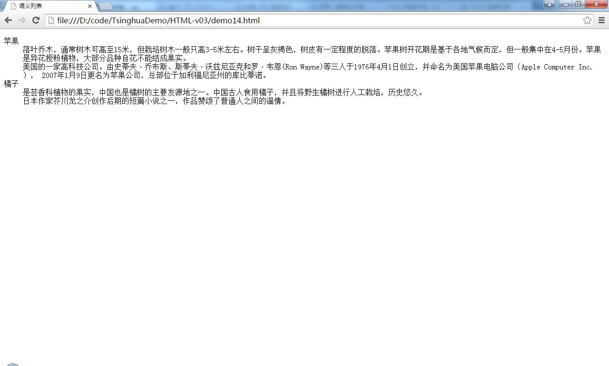

虽然有序列表和无序列表可以嵌套，但这种方式不规范。我们可以使用dl列表嵌套。

**代码15 列表嵌套**

```
<!DOCTYPE html>
<html>
<head>
    <meta charset="UTF-8">
    <title>dl列表嵌套</title>
</head>
<body>
    <dl>
        <dt>书籍</dt>
        <dd>
            <dl>
                <dt>计算机</dt>
                <dd>程序开发</dd>
                <dd>网络管理</dd>
                <dd>平面设计</dd>
                <dt>文学</dt>
                <dd>古典文学</dd>
                <dd>外国文学</dd>
                <dd>纪实文学</dd>
                <dt>生活</dt>
                <dd>育儿</dd>
                <dd>厨艺</dd>
            </dl>
        </dd>

        <dt>电脑</dt>
        <dd>笔记本</dd>
        <dd>台式机</dd>
        <dd>工作站</dd>

        <dt>数码</dt>
        <dd>
            <dl>
                <dt>生活</dt>
                <dd>数码相机</dd>
                <dd>智能家电</dd>
                <dt>外设</dt>
                <dd>U盘</dd>
                <dd>打印机</dd>
                <dd>传真机</dd>
            </dl>
        </dd>
    </dl>
</body>
</html>
```
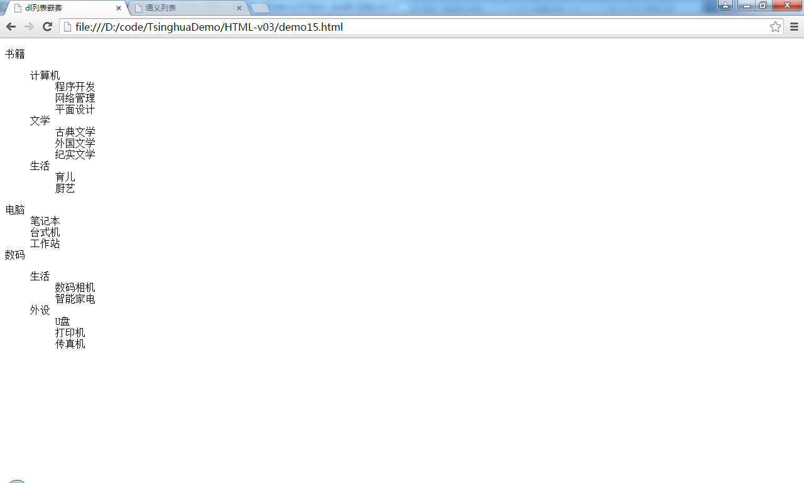

## 插图元素
HTML中可以使用figure元素加入插图。这里的插图概念并不局限于图片，可以是一段说明，一张图表或图示，总的来说就是被文档正文引用的用于说明性的内容，如果文档中不包含插图也不对正文的描述造成影响。

在figure元素中可以使用figcaption元素为其添加标题。

**代码16 插图**

```
<!DOCTYPE html>
<html>
<head>
    <meta charset="UTF-8">
    <title>插图元素</title>
</head>
<body>
    <p>根据百度百科释义，码农是一个依靠写代码为生的群体，表现在：低收入，工作时间长，这种职位只能强化职业者在单方面的技术领域技能。如果按照从业者们将自己自嘲为码农的表现，那么码农的程序员分级中理应只属于初级程序员，是属于依靠复制粘贴将各类代码链接的IT从业者。</p>
    <figure>
        <figcaption>码农</figcaption>
        
    </figure>
    <p>这个群体的数量有多少呢？大学计算机相关专业的同学们、大中专软件专业学习者、毕业不久的程序员、广大编程初级爱好者。这一群体庞大的数量，让码农很难在IT世界中拥有不可替代的价值。</p>

    <p>对于真正的程序员（非初级程序员，也即码农）而言，他们熟悉与客户沟通的技巧，在帮助用户解决问题的时候了解用户的需求，进而迭代产品；他们可以深谙获取用户需求的技巧，也懂得市场分析、技术执行分析、价值分析估算项目的风险；他们能独立完成项目使用文档的能力，更重要的是他们与码农有一个非常显著的差异：码农靠体力为生，真正的程序员靠脑力，靠思维逻辑上的突破、靠团队管理赢得个人魅力。</p>
</body>
</html>
```
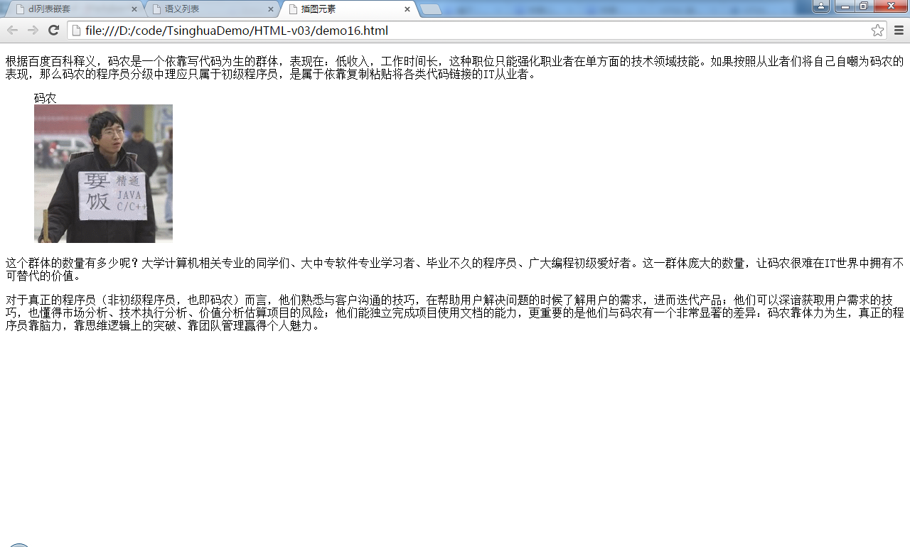