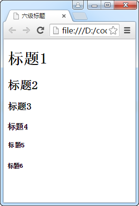
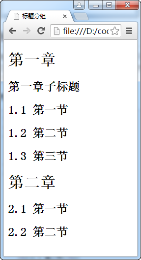
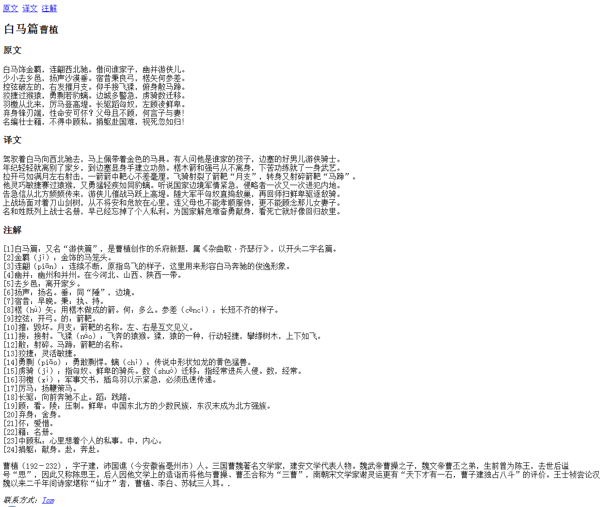
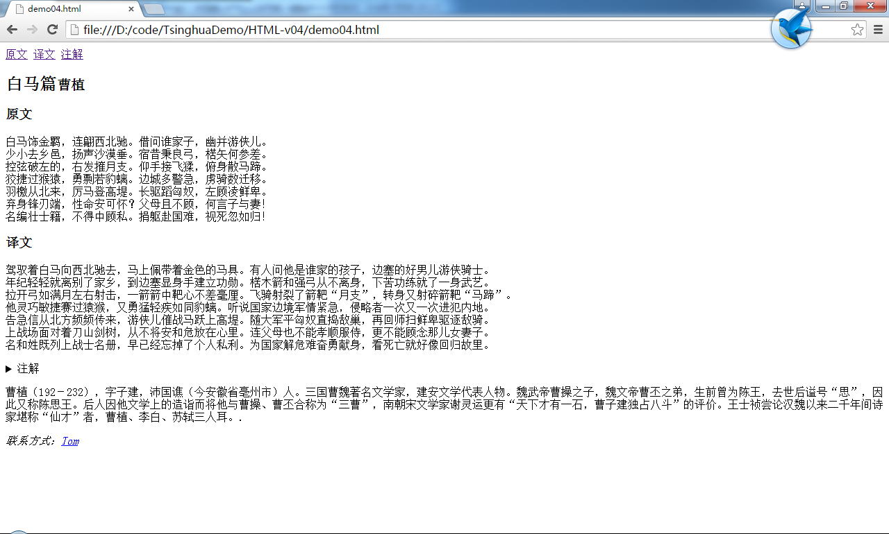
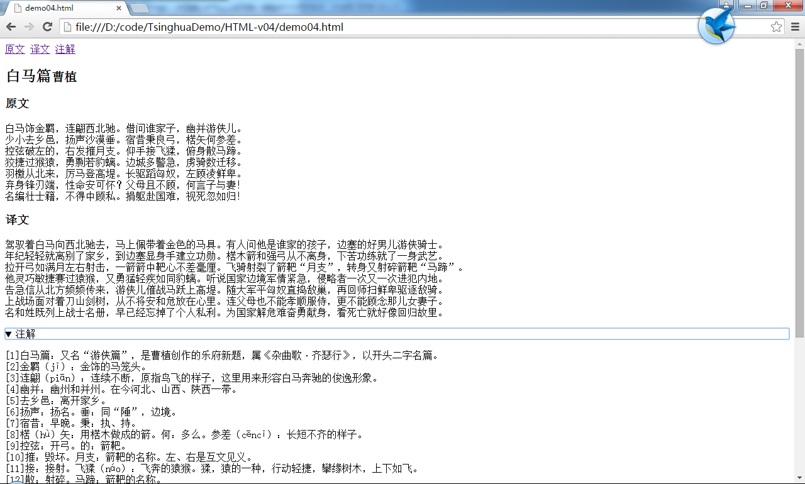

# 文档分节
## 标题
h1到h6元素是HTML定义的六级标题，h1级别最高。

**代码1 各级标题**
```
<!DOCTYPE html>
<html>
<head>
    <meta charset="UTF-8">
    <title>六级标题</title>
</head>
<body>
    <h1>标题1</h1>
    <h2>标题2</h2>
    <h3>标题3</h3>
    <h4>标题4</h4>
    <h5>标题5</h5>
    <h6>标题6</h6>
</body>
</html>
```


## 标题分组
有时标题会拥有子标题。如主标题是h1元素，子标题是h2元素，但作为子标题的h2元素与真正作为二级标题的h2元素很难区分，所以可以使用hgroup元素把作为主标题的h1元素和作为子标题的h2元素进行分组，形成一个整体。

**代码2 标题分组**
```
<!DOCTYPE html>
<html>
<head>
    <meta charset="UTF-8">
    <title>标题分组</title>
</head>
<body>
    <hgroup>
        <h1>第一章</h1>
        <h2>第一章子标题</h2>
    </hgroup>
    <h2>1.1 第一节</h2>
    <h2>1.2 第二节</h2>
    <h2>1.3 第三节</h2>
    <h1>第二章</h1>
    <h2>2.1 第一节</h2>
    <h2>2.2 第二节</h2>
</body>
</html>
```


## section元素
此元素用于文档中小节的定义。通常包含一个标题和一到多个段落。

## header和footer元素
header元素和footer元素分别用于为文档或文档中的某部分设置首部或尾部。
首部通常包括刊头、标题或导航，尾部通常包括总结性文字、作者介绍、版权信息等。

## nav元素
此元素表示文档中用于导航的区域，一般会包含超级链接指向其它资源。

## article元素
此元素表示文档中一段独立成篇的内容。

## aside元素
此元素用于表示与其它内容相关的说明，类似于书籍的侧边栏。这种内容并非是主体内容的一部分，可能是一些背景信息或参考资源的链接。

## address元素
此元素用于表示文档或article元素的联系信息。如果address是article的后代元素，则它提供的联系信息被视为是article的，否则当address是body元素的子元素时，则它提供的联系信息被视为是整个文档的。
此元素不能表示文档或文章联系人之外的联系信息。如用户的联系信息是不能使用此元素的。

**代码3 使用各元素进行文档分节**
```
<!DOCTYPE html>
<html>
<head>
    <meta charset="UTF-8">
    <title></title>
</head>
<body>
    <header>
        <nav>
            <a href="#id1">原文</a>
            <a href="#id2">译文</a>
            <a href="#id3">注解</a>
        </nav>
    </header>
    <article>
        <h1>白马篇<small>曹植</small></h1>
        <section id="id1">
            <h1>原文</h1>
            <p>
                白马饰金羁，连翩西北驰。借问谁家子，幽并游侠儿。<br>
                少小去乡邑，扬声沙漠垂。宿昔秉良弓，楛矢何参差。<br>
                控弦破左的，右发摧月支。仰手接飞猱，俯身散马蹄。<br>
                狡捷过猴猿，勇剽若豹螭。边城多警急，虏骑数迁移。<br>
                羽檄从北来，厉马登高堤。长驱蹈匈奴，左顾凌鲜卑。<br>
                弃身锋刃端，性命安可怀？父母且不顾，何言子与妻！<br>
                名编壮士籍，不得中顾私。捐躯赴国难，视死忽如归！<br>
            </p>
        </section>
        <section id="id2">
            <h1>译文</h1>
            <p>
                驾驭着白马向西北驰去，马上佩带着金色的马具。有人问他是谁家的孩子，边塞的好男儿游侠骑士。<br>
                年纪轻轻就离别了家乡，到边塞显身手建立功勋。楛木箭和强弓从不离身，下苦功练就了一身武艺。<br>
                拉开弓如满月左右射击，一箭箭中靶心不差毫厘。飞骑射裂了箭靶“月支”，转身又射碎箭靶“马蹄”。<br>
                他灵巧敏捷赛过猿猴，又勇猛轻疾如同豹螭。听说国家边境军情紧急，侵略者一次又一次进犯内地。<br>
                告急信从北方频频传来，游侠儿催战马跃上高堤。随大军平匈奴直捣敌巢，再回师扫鲜卑驱逐敌骑。<br>
                上战场面对着刀山剑树，从不将安和危放在心里。连父母也不能孝顺服侍，更不能顾念那儿女妻子。<br>
                名和姓既列上战士名册，早已经忘掉了个人私利。为国家解危难奋勇献身，看死亡就好像回归故里。<br>
            </p>
        </section>
        <section id="id3">
            <h1>注解</h1>
            <p>
                [1]白马篇：又名“游侠篇”，是曹植创作的乐府新题，属《杂曲歌·齐瑟行》，以开头二字名篇。<br>
                [2]金羁（jī）：金饰的马笼头。<br>
                [3]连翩（piān）：连续不断，原指鸟飞的样子，这里用来形容白马奔驰的俊逸形象。<br>
                [4]幽并：幽州和并州。在今河北、山西、陕西一带。<br>
                [5]去乡邑：离开家乡。<br>
                [6]扬声：扬名。垂：同“陲”，边境。<br>
                [7]宿昔：早晚。秉：执、持。<br>
                [8]楛（hù）矢：用楛木做成的箭。何：多么。参差（cēncī）：长短不齐的样子。<br>
                [9]控弦：开弓。的：箭靶。<br>
                [10]摧：毁坏。月支：箭靶的名称。左、右是互文见义。<br>
                [11]接：接射。飞猱（náo）：飞奔的猿猴。猱，猿的一种，行动轻捷，攀缘树木，上下如飞。<br>
                [12]散：射碎。马蹄：箭靶的名称。<br>
                [13]狡捷：灵活敏捷。<br>
                [14]勇剽（piāo）：勇敢剽悍。螭（chī）：传说中形状如龙的黄色猛兽。<br>
                [15]虏骑（jì）：指匈奴、鲜卑的骑兵。数（shuò）迁移：指经常进兵人侵。数，经常。<br>
                [16]羽檄（xí）：军事文书，插鸟羽以示紧急，必须迅速传递。<br>
                [17]厉马：扬鞭策马。<br>
                [18]长驱：向前奔驰不止。蹈：践踏。<br>
                [19]顾：看。陵：压制。鲜卑：中国东北方的少数民族，东汉末成为北方强族。<br>
                [20]弃身：舍身。<br>
                [21]怀：爱惜。<br>
                [22]籍：名册。<br>
                [23]中顾私：心里想着个人的私事。中，内心。<br>
                [24]捐躯：献身。赴：奔赴。<br>
            </p>
        </section>
    </article>
    <footer>
        <aside>
            <p>
                曹植（192－232），字子建，沛国谯（今安徽省亳州市）人。三国曹魏著名文学家，建安文学代表人物。魏武帝曹操之子，魏文帝曹丕之弟，生前曾为陈王，去世后谥号“思”，因此又称陈思王。后人因他文学上的造诣而将他与曹操、曹丕合称为“三曹”，南朝宋文学家谢灵运更有“天下才有一石，曹子建独占八斗”的评价。王士祯尝论汉魏以来二千年间诗家堪称“仙才”者，曹植、李白、苏轼三人耳。.
            </p>
        </aside>
    </footer>
    <address>联系方式：<a href="mailto:tom@tom.com">Tom</a></address>
</body>
</html>
```


## 详细信息元素
可以使用details、summary元素来定义详细信息。
details元素在文档中生成一个区域，可以展开让用户了解其中的更多详情。summary元素为details元素生成一个说明性的概要。

**代码4 详细信息**
```
<!DOCTYPE html>
<html>
<head>
    <meta charset="UTF-8">
    <title></title>
</head>
<body>
<header>
    <nav>
        <a href="#id1">原文</a>
        <a href="#id2">译文</a>
        <a href="#id3">注解</a>
    </nav>
</header>
<article>
    <h1>白马篇<small>曹植</small></h1>
    <section id="id1">
        <h1>原文</h1>
        <p>
            白马饰金羁，连翩西北驰。借问谁家子，幽并游侠儿。<br>
            少小去乡邑，扬声沙漠垂。宿昔秉良弓，楛矢何参差。<br>
            控弦破左的，右发摧月支。仰手接飞猱，俯身散马蹄。<br>
            狡捷过猴猿，勇剽若豹螭。边城多警急，虏骑数迁移。<br>
            羽檄从北来，厉马登高堤。长驱蹈匈奴，左顾凌鲜卑。<br>
            弃身锋刃端，性命安可怀？父母且不顾，何言子与妻！<br>
            名编壮士籍，不得中顾私。捐躯赴国难，视死忽如归！<br>
        </p>
    </section>
    <section id="id2">
        <h1>译文</h1>
        <p>
            驾驭着白马向西北驰去，马上佩带着金色的马具。有人问他是谁家的孩子，边塞的好男儿游侠骑士。<br>
            年纪轻轻就离别了家乡，到边塞显身手建立功勋。楛木箭和强弓从不离身，下苦功练就了一身武艺。<br>
            拉开弓如满月左右射击，一箭箭中靶心不差毫厘。飞骑射裂了箭靶“月支”，转身又射碎箭靶“马蹄”。<br>
            他灵巧敏捷赛过猿猴，又勇猛轻疾如同豹螭。听说国家边境军情紧急，侵略者一次又一次进犯内地。<br>
            告急信从北方频频传来，游侠儿催战马跃上高堤。随大军平匈奴直捣敌巢，再回师扫鲜卑驱逐敌骑。<br>
            上战场面对着刀山剑树，从不将安和危放在心里。连父母也不能孝顺服侍，更不能顾念那儿女妻子。<br>
            名和姓既列上战士名册，早已经忘掉了个人私利。为国家解危难奋勇献身，看死亡就好像回归故里。<br>
        </p>
    </section>
    <section id="id3">
        <details>
            <summary>注解</summary>
            <p>
                [1]白马篇：又名“游侠篇”，是曹植创作的乐府新题，属《杂曲歌·齐瑟行》，以开头二字名篇。<br>
                [2]金羁（jī）：金饰的马笼头。<br>
                [3]连翩（piān）：连续不断，原指鸟飞的样子，这里用来形容白马奔驰的俊逸形象。<br>
                [4]幽并：幽州和并州。在今河北、山西、陕西一带。<br>
                [5]去乡邑：离开家乡。<br>
                [6]扬声：扬名。垂：同“陲”，边境。<br>
                [7]宿昔：早晚。秉：执、持。<br>
                [8]楛（hù）矢：用楛木做成的箭。何：多么。参差（cēncī）：长短不齐的样子。<br>
                [9]控弦：开弓。的：箭靶。<br>
                [10]摧：毁坏。月支：箭靶的名称。左、右是互文见义。<br>
                [11]接：接射。飞猱（náo）：飞奔的猿猴。猱，猿的一种，行动轻捷，攀缘树木，上下如飞。<br>
                [12]散：射碎。马蹄：箭靶的名称。<br>
                [13]狡捷：灵活敏捷。<br>
                [14]勇剽（piāo）：勇敢剽悍。螭（chī）：传说中形状如龙的黄色猛兽。<br>
                [15]虏骑（jì）：指匈奴、鲜卑的骑兵。数（shuò）迁移：指经常进兵人侵。数，经常。<br>
                [16]羽檄（xí）：军事文书，插鸟羽以示紧急，必须迅速传递。<br>
                [17]厉马：扬鞭策马。<br>
                [18]长驱：向前奔驰不止。蹈：践踏。<br>
                [19]顾：看。陵：压制。鲜卑：中国东北方的少数民族，东汉末成为北方强族。<br>
                [20]弃身：舍身。<br>
                [21]怀：爱惜。<br>
                [22]籍：名册。<br>
                [23]中顾私：心里想着个人的私事。中，内心。<br>
                [24]捐躯：献身。赴：奔赴。<br>
            </p>
        </details>
    </section>
</article>
<footer>
    <aside>
        <p>
            曹植（192－232），字子建，沛国谯（今安徽省亳州市）人。三国曹魏著名文学家，建安文学代表人物。魏武帝曹操之子，魏文帝曹丕之弟，生前曾为陈王，去世后谥号“思”，因此又称陈思王。后人因他文学上的造诣而将他与曹操、曹丕合称为“三曹”，南朝宋文学家谢灵运更有“天下才有一石，曹子建独占八斗”的评价。王士祯尝论汉魏以来二千年间诗家堪称“仙才”者，曹植、李白、苏轼三人耳。.
        </p>
    </aside>
</footer>
<address>联系方式：<a href="mailto:tom@tom.com">Tom</a></address>
</body>
</html>
```


