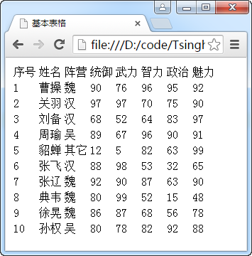
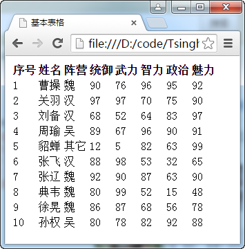
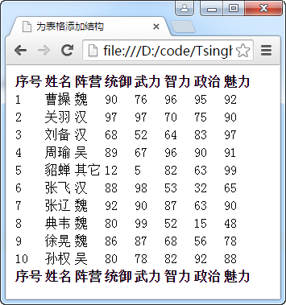
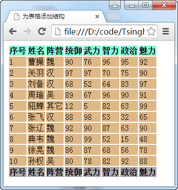
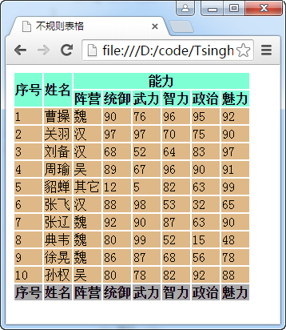
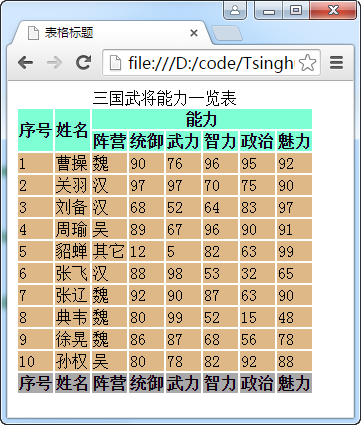
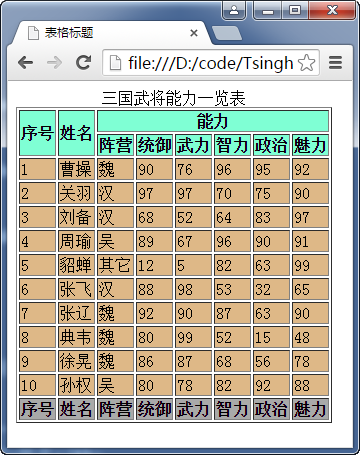

# 表格
在HTML中定义表格的基本元素有table、tr、td、th、thead、tbody、tfoot、caption。

每个表格至少需要table、tr、td三个元素来定义。

- table：用于定义HTML中的表格
- tr：用于定义表格的行
- td：用于定义行中的单元格
- th：用于定义表头或标题类型的单元格
- thead：用于定义表格的标题行
- tbody：用于定义表格的主体
- tfoot：用于定义表格的尾行
- caption：用于定义表格的标题

**代码1 基本表格**
```
<!DOCTYPE html>
<html>
<head>
    <meta charset="UTF-8">
    <title>基本表格</title>
</head>
<body>
    <table>
        <tr>
            <td>序号</td>
            <td>姓名</td>
            <td>阵营</td>
            <td>统御</td>
            <td>武力</td>
            <td>智力</td>
            <td>政治</td>
            <td>魅力</td>
        </tr>
        <tr>
            <td>1</td>
            <td>曹操</td>
            <td>魏</td>
            <td>90</td>
            <td>76</td>
            <td>96</td>
            <td>95</td>
            <td>92</td>
        </tr>
        <tr>
            <td>2</td>
            <td>关羽</td>
            <td>汉</td>
            <td>97</td>
            <td>97</td>
            <td>70</td>
            <td>75</td>
            <td>90</td>
        </tr>
        <tr>
            <td>3</td>
            <td>刘备</td>
            <td>汉</td>
            <td>68</td>
            <td>52</td>
            <td>64</td>
            <td>83</td>
            <td>97</td>
        </tr>
        <tr>
            <td>4</td>
            <td>周瑜</td>
            <td>吴</td>
            <td>89</td>
            <td>67</td>
            <td>96</td>
            <td>90</td>
            <td>91</td>
        </tr>
        <tr>
            <td>5</td>
            <td>貂蝉</td>
            <td>其它</td>
            <td>12</td>
            <td>5</td>
            <td>82</td>
            <td>63</td>
            <td>99</td>
        </tr>
        <tr>
            <td>6</td>
            <td>张飞</td>
            <td>汉</td>
            <td>88</td>
            <td>98</td>
            <td>53</td>
            <td>32</td>
            <td>65</td>
        </tr>
        <tr>
            <td>7</td>
            <td>张辽</td>
            <td>魏</td>
            <td>92</td>
            <td>90</td>
            <td>87</td>
            <td>63</td>
            <td>90</td>
        </tr>
        <tr>
            <td>8</td>
            <td>典韦</td>
            <td>魏</td>
            <td>80</td>
            <td>99</td>
            <td>52</td>
            <td>15</td>
            <td>48</td>
        </tr>
        <tr>
            <td>9</td>
            <td>徐晃</td>
            <td>魏</td>
            <td>86</td>
            <td>87</td>
            <td>68</td>
            <td>56</td>
            <td>78</td>
        </tr>
        <tr>
            <td>10</td>
            <td>孙权</td>
            <td>吴</td>
            <td>80</td>
            <td>78</td>
            <td>82</td>
            <td>92</td>
            <td>88</td>
        </tr>
    </table>
</body>
</html>
```


**代码2 添加标题单元格**
```
<!DOCTYPE html>
<html>
<head>
    <meta charset="UTF-8">
    <title>基本表格</title>
</head>
<body>
    <table>
        <tr>
            <th>序号</th>
            <th>姓名</th>
            <th>阵营</th>
            <th>统御</th>
            <th>武力</th>
            <th>智力</th>
            <th>政治</th>
            <th>魅力</th>
        </tr>
        <!-- 省略以下代码 -->
    </table>
</body>
</html>
```


**代码3 为表格添加结构**
```
<!DOCTYPE html>
<html>
<head>
    <meta charset="UTF-8">
    <title>为表格添加结构</title>
</head>
<body>
    <table>
        <thead>
            <tr>
                <th>序号</th>
                <th>姓名</th>
                <th>阵营</th>
                <th>统御</th>
                <th>武力</th>
                <th>智力</th>
                <th>政治</th>
                <th>魅力</th>
            </tr>
        </thead>
        <tbody>
            <tr>
                <td>1</td>
                <td>曹操</td>
                <td>魏</td>
                <td>90</td>
                <td>76</td>
                <td>96</td>
                <td>95</td>
                <td>92</td>
            </tr>
            <!-- 省略部分元素 -->
        </tbody>
        <tfoot>
            <tr>
                <th>序号</th>
                <th>姓名</th>
                <th>阵营</th>
                <th>统御</th>
                <th>武力</th>
                <th>智力</th>
                <th>政治</th>
                <th>魅力</th>
            </tr>
        </tfoot>
    </table>
</body>
</html>
```


为表格添加结构可以方便CSS对元素的选取。

>如果在HTML文档中table元素中没有加入tbody元素，大多数浏览器也会在处理表格时自动插入tbody元素。因此完全根据文档中的表格结构来设计的CSS选择器有可能无效。由于浏览器在table和tr间插入了tbody，所以table > tr这样的选择器会失效，应该写成table > tbody > tr或table tr或tbody > tr。如果没有thead和tfoot元素，所有tr都会被视为表格的主体部分。

**代码4 为结构化的表格应用样式**
```
<!DOCTYPE html>
<html>
<head>
    <meta charset="UTF-8">
    <title>为表格添加结构</title>
    <style>
        thead > tr{
            background-color: aquamarine;
        }
        tbody > tr{
            background-color: burlywood;
        }
        tfoot > tr{
            background-color: darkgray;
        }
    </style>
</head>
<body>
    <table>
        <thead>
            <tr>
                <th>序号</th>
                <th>姓名</th>
                <th>阵营</th>
                <th>统御</th>
                <th>武力</th>
                <th>智力</th>
                <th>政治</th>
                <th>魅力</th>
            </tr>
        </thead>
        <tbody>
            <!-- 省略部分元素 -->
        </tbody>
        <tfoot>
            <tr>
                <th>序号</th>
                <th>姓名</th>
                <th>阵营</th>
                <th>统御</th>
                <th>武力</th>
                <th>智力</th>
                <th>政治</th>
                <th>魅力</th>
            </tr>
        </tfoot>
    </table>
</body>
</html>
```


## 不规则表格
在td或th中可以使用rowspan和colspan属性来进行跨行跨列的设置，以便生成不规则的表格。

- rowspan：让一个单元格纵跨多行
- colspan：让一个单元格横跨多列

**代码5 不规则表格**
```
<!DOCTYPE html>
<html>
<head>
    <meta charset="UTF-8">
    <title>不规则表格</title>
    <style>
        thead > tr{
            background-color: aquamarine;
        }
        tbody > tr{
            background-color: burlywood;
        }
        tfoot > tr{
            background-color: darkgray;
        }
    </style>
</head>
<body>
    <table>
        <thead>
            <tr>
                <th rowspan="2">序号</th>
                <th rowspan="2">姓名</th>
                <th colspan="6">能力</th>
            </tr>
            <tr>
                <th>阵营</th>
                <th>统御</th>
                <th>武力</th>
                <th>智力</th>
                <th>政治</th>
                <th>魅力</th>
            </tr>
        </thead>
        <!-- 省略部分内容 -->
    </table>
</body>
</html>
```


## 为表格添加标题

**代码6 为表格添加标题**
```
<!DOCTYPE html>
<html>
<head>
    <meta charset="UTF-8">
    <title>表格标题</title>
    <style>
        thead > tr{
            background-color: aquamarine;
        }
        tbody > tr{
            background-color: burlywood;
        }
        tfoot > tr{
            background-color: darkgray;
        }
    </style>
</head>
<body>
    <table>
        <caption>三国武将能力一览表</caption>
        <thead>
            <tr>
                <th rowspan="2">序号</th>
                <th rowspan="2">姓名</th>
                <th colspan="6">能力</th>
            </tr>
            <tr>
                <th>阵营</th>
                <th>统御</th>
                <th>武力</th>
                <th>智力</th>
                <th>政治</th>
                <th>魅力</th>
            </tr>
        </thead>
        <tbody>
            <!-- 省略部分内容 -->
        </tbody>
        <tfoot>
            <tr>
                <th>序号</th>
                <th>姓名</th>
                <th>阵营</th>
                <th>统御</th>
                <th>武力</th>
                <th>智力</th>
                <th>政治</th>
                <th>魅力</th>
            </tr>
        </tfoot>
    </table>
</body>
</html>
```


## 表格边框
可以使用table元素的border属性为表格添加边框，其取值只能是1或空串（""）。

**代码7 表格边框**
```
<!DOCTYPE html>
<html>
<head>
    <meta charset="UTF-8">
    <title>表格标题</title>
    <style>
        thead > tr{
            background-color: aquamarine;
        }
        tbody > tr{
            background-color: burlywood;
        }
        tfoot > tr{
            background-color: darkgray;
        }
    </style>
</head>
<body>
    <table border="1">
        <caption>三国武将能力一览表</caption>
        <thead>
            <tr>
                <th rowspan="2">序号</th>
                <th rowspan="2">姓名</th>
                <th colspan="6">能力</th>
            </tr>
            <tr>
                <th>阵营</th>
                <th>统御</th>
                <th>武力</th>
                <th>智力</th>
                <th>政治</th>
                <th>魅力</th>
            </tr>
        </thead>
        <tbody>
            <!-- 省略部分内容 -->
        </tbody>
        <tfoot>
            <tr>
                <th>序号</th>
                <th>姓名</th>
                <th>阵营</th>
                <th>统御</th>
                <th>武力</th>
                <th>智力</th>
                <th>政治</th>
                <th>魅力</th>
            </tr>
        </tfoot>
    </table>
</body>
</html>
```


可以通过CSS来为表格添加边框，更加美观、灵活。