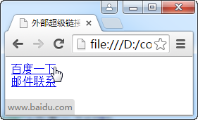
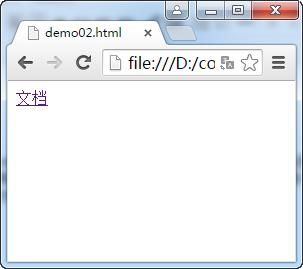
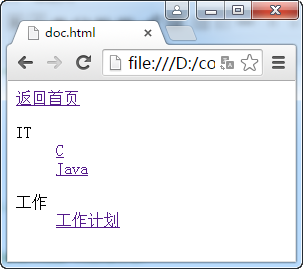
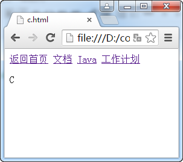
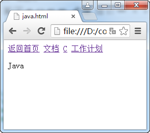
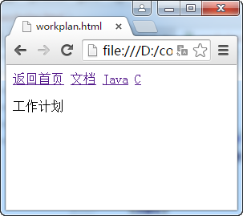
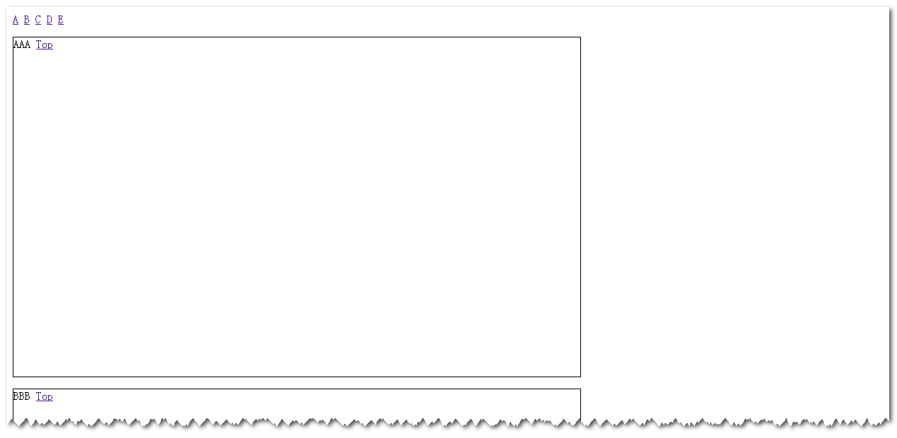
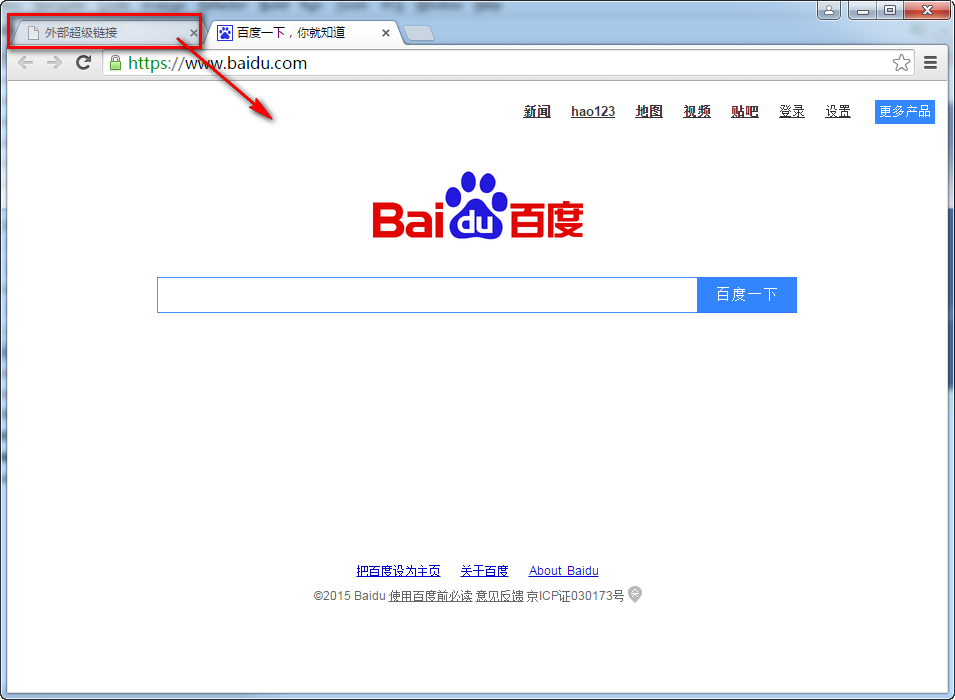

# 超级链接
超级链接是HTML的关键特性，是用户在内容中进行导航的基础技术。使用a元素进行超级链接的定义。

## 指向外部站点资源的超级链接
使用a元素的href属性可以定义要链接的目标资源位置。还可以链接到某个email地址，自动为用户调用其客户端电脑上默认的email软件的邮件撰写界面，来让用户写邮件。

**代码1 链接到外部站点**
```
<!DOCTYPE html>
<html>
<head>
    <meta charset="UTF-8">
    <title>外部超级链接</title>
</head>
<body>
    <a href="http://www.baidu.com">百度一下</a>
    <br>
    <a href="mailto:someone@tom.com">邮件联系</a>
</body>
</html>
```


单击“百度一下”会在浏览器中把页面跳转到百度的首页。


单击“邮件联系”会打开电脑上的编写邮件软件的界面，并把目的email地址填写到收件人栏中。


## 绝对路径和相对路径
在磁盘上通常保存着目录与文件。目录下可以有多级子目录，也可以保存各种文件。最上层的目录被称为根目录，用斜线表示（/）。多级目录下，每层目录与上层或下层目录也是以斜线分隔，如：/doc/it/java表示根目录下的doc目录下的it目录下的java目录。

绝对路径都是从根目录开始进行资源访问的，如要找/doc/it/java目录下的“java编程思想.pdf”文件则需要使用“/doc/it/java/java编程思想.pdf”来访问。如果想找/doc/work下的工作总结.doc文件则需要使用/doc/work/工作总结.doc来访问。

例如小明、小刚和小红住在同一个小区，小明住在10号楼的5层502号，小刚住在10号楼的8层801号，小红住在15号楼18层的1806号。你要到小明家借一张CD，小刚家借100块钱，再到小红家借一本书。使用绝对路径是以下这样的：先要来到小区大门（根目录），走到10号楼门口，上5层，找到502号，再拿CD（/10号楼/5层/502/蜡笔小新的cd）。然后回到小区大门，再来到10号楼门口，上8层，找到801号拿100块钱（/10号楼/8层/801/100块钱）。最后又到小区大门，走到15号楼门口，上18层，找到1806号，再拿书（/15号楼/18层/1806/红楼一梦）。

相对路径需要先明白当前路径与上层路径的表示法。
当前目录可以用“.”表示，也可以省略。如要找当前路径下book目录下的“c++入门.pdf”可以写成“./book/c++入门.pdf”，也可以使用“book/c++入门.pdf”。

上层路径要使用“..”表示，如果要找当前路径的上层路径中的“三国演义.pdf”要写成“../三国演义.pdf”。如果要找当前路径同级目录CD下的“蜡笔小新的cd”则使用“../cd/蜡笔小新的cd”。

以上的例子用相对路径来进行访问：假设目前已经在小明家的位置，当前路径是小区中的10号楼5层502，现在要去小刚家，则先出502号，再出5层，再到8层，再到801号（../../8层/801）。然后去小红家，先出801，再出18层，再出10号楼，再到15号楼，上18层，进1806（../../../15号楼/18层/1806）。

## 使用相对路径进行站点内部的链接

站点内部文件组织如下图所示：


根目录下有demo01.html和demo01.html（这里主要用到demo02.html），还有doc目录；doc目录下有doc.html文件和it与work两个子目录；it目录中有c.html和java.html两个文件；work目录下有workplan.html一个文件。

**代码2 首页**
```
<!DOCTYPE html>
<html lang="en">
<head>
    <meta charset="UTF-8">
    <title></title>
</head>
<body>
    <nav>
        <a href="doc/doc.html">文档</a>
    </nav>
</body>
</html>
```



**代码3 doc/doc.html**
```
<!DOCTYPE html>
<html lang="en">
<head>
    <meta charset="UTF-8">
    <title></title>
</head>
<body>
    <nav>
        <a href="../demo02.html">返回首页</a>
    </nav>
    <nav>
        <dl>
            <dt>
                IT
            </dt>
            <dd>
                <a href="it/c.html">C</a>
            </dd>
            <dd>
                <a href="it/java.html">Java</a>
            </dd>
        </dl>
        <dl>
            <dt>
                工作
            </dt>
            <dd>
                <a href="work/workplan.html">工作计划</a>
            </dd>
        </dl>
    </nav>
</body>
</html>
```


**代码4 doc/it/c.html**
```
<!DOCTYPE html>
<html lang="en">
<head>
    <meta charset="UTF-8">
    <title></title>
</head>
<body>
    <nav>
        <a href="../../demo02.html">返回首页</a>
        <a href="../doc.html">文档</a>
        <a href="java.html">Java</a>
        <a href="../work/workplan.html">工作计划</a>
    </nav>
    <p>C</p>
</body>
</html>
```


**代码5 doc/it/java.html**
```
<!DOCTYPE html>
<html lang="en">
<head>
    <meta charset="UTF-8">
    <title></title>
</head>
<body>
    <nav>
        <a href="../../demo02.html">返回首页</a>
        <a href="../doc.html">文档</a>
        <a href="c.html">C</a>
        <a href="../work/workplan.html">工作计划</a>
    </nav>
    <p>Java</p>
</body>
</html>
```


**代码6 doc/work/workplan.html**
```
<!DOCTYPE html>
<html lang="en">
<head>
    <meta charset="UTF-8">
    <title></title>
</head>
<body>
    <nav>
        <a href="../../demo02.html">返回首页</a>
        <a href="../doc.html">文档</a>
        <a href="../it/java.html">Java</a>
        <a href="../it/c.html">C</a>
    </nav>
    <p>工作计划</p>
</body>
</html>
```


## 生成页面内部的超级链接

配合元素的id属性，可以在页面内部生成超级链接，类似于导航书签。

**代码7 内部超级链接**
```
<!DOCTYPE html>
<html lang="en">
<head>
    <meta charset="UTF-8">
    <title></title>
    <style>
        p{
            border: 1px solid black;
            height: 30em;
            width: 50em;
        }
    </style>
</head>
<body>
    <nav id="top">
        <a href="#a">A</a>
        <a href="#b">B</a>
        <a href="#c">C</a>
        <a href="#d">D</a>
        <a href="#e">E</a>
    </nav>
    <p id="a">AAA <a href="#top">Top</a></p>
    <p id="b">BBB <a href="#top">Top</a></p>
    <p id="c">CCC <a href="#top">Top</a></p>
    <p id="d">DDD <a href="#top">Top</a></p>
    <p id="e">EEE <a href="#top">Top</a></p>
</body>
</html>
```


## target属性
a元素有一个target属性，用于指定所链接资源的打开位置。常用取值见下表：

|值|说明|
|:---:|:---|
|_self|在当前窗口打开（默认）|
|_blank|在新窗口或新标签页中打开|
|_top|在顶层窗口打开|
|_parent|在父框架中打开|
|框架名称|在指定的框架名所对应的框架中打开|

**代码8 在新窗口中打开资源**
```
<!DOCTYPE html>
<html>
<head>
    <meta charset="UTF-8">
    <title>外部超级链接</title>
</head>
<body>
    <a href="http://www.baidu.com">百度一下</a>
    <br>
    <a href="http://www.baidu.com" target="_blank">在新窗口百度一下</a>
    <br>
    <a href="mailto:someone@tom.com">邮件联系</a>
</body>
</html>
```


