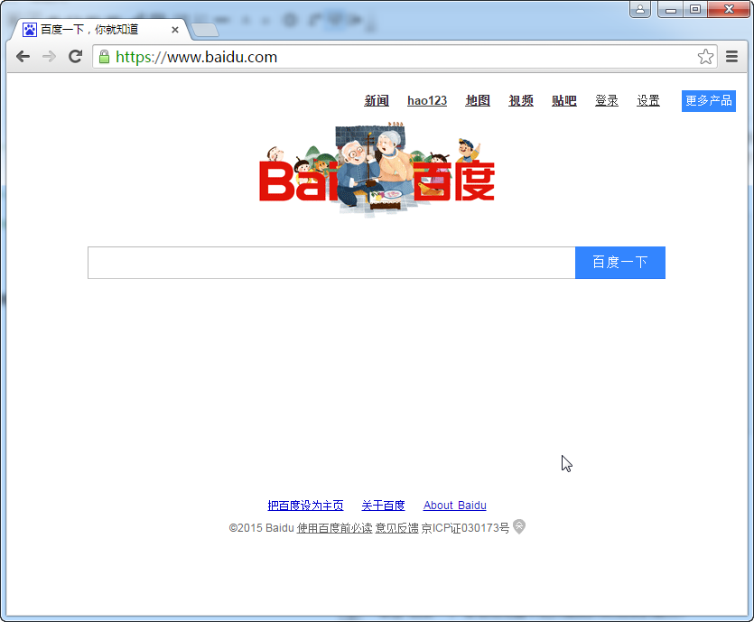
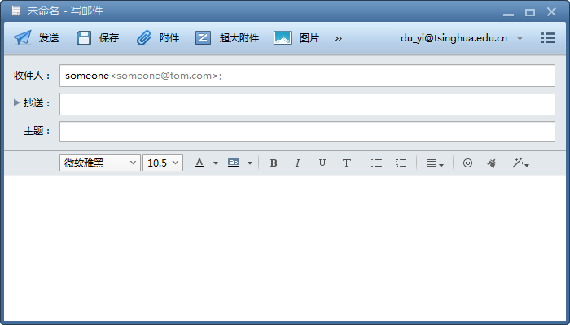

# 超级链接
超级链接是HTML的关键特性，是用户在内容中进行导航的基础技术。使用a元素进行超级链接的定义。

## 指向外部站点资源的超级链接
使用a元素的href属性可以定义要链接的目标资源位置。还可以链接到某个email地址，自动为用户调用其客户端电脑上默认的email软件的邮件撰写界面，来让用户写邮件。

**代码1 链接到外部站点**
```
<!DOCTYPE html>
<html>
<head>
    <meta charset="UTF-8">
    <title>外部超级链接</title>
</head>
<body>
    <a href="http://www.baidu.com">百度一下</a>
    <br>
    <a href="mailto:someone@tom.com">邮件联系</a>
</body>
</html>
```


单击“百度一下”会在浏览器中把页面跳转到百度的首页。


单击“邮件联系”会打开电脑上的编写邮件软件的界面，并把目的email地址填写到收件人栏中。


## 绝对路径和相对路径
在磁盘上通常保存着目录与文件。目录下可以有多级子目录，也可以保存各种文件。最上层的目录被称为根目录，用斜线表示（/）。多级目录下，每层目录与上层或下层目录也是以斜线分隔，如：/doc/it/java表示根目录下的doc目录下的it目录下的java目录。

绝对路径都是从根目录开始进行资源访问的，如要找/doc/it/java目录下的“java编程思想.pdf”文件则需要使用“/doc/it/java/java编程思想.pdf”来访问。如果想找/doc/work下的工作总结.doc文件则需要使用/doc/work/工作总结.doc来访问。

例如小明、小刚和小红住在同一个小区，小明住在10号楼的5层502号，小刚住在10号楼的8层801号，小红住在15号楼18层的1806号。你要到小明家借一张CD，小刚家借100块钱，再到小红家借一本书。使用绝对路径是以下这样的：先要来到小区大门（根目录），走到10号楼门口，上5层，找到502号，再拿CD（/10号楼/5层/502/蜡笔小新的cd）。然后回到小区大门，再来到10号楼门口，上8层，找到801号拿100块钱（/10号楼/8层/801/100块钱）。最后又到小区大门，走到15号楼门口，上18层，找到1806号，再拿书（/15号楼/18层/1806/红楼一梦）。

相对路径需要先明白当前路径与上层路径的表示法。
当前目录可以用“.”表示，也可以省略。如要找当前路径下book目录下的“c++入门.pdf”可以写成“./book/c++入门.pdf”，也可以使用“book/c++入门.pdf”。

上层路径要使用“..”表示，如果要找当前路径的上层路径中的“三国演义.pdf”要写成“../三国演义.pdf”。如果要找当前路径同级目录CD，下的“蜡笔小新的cd”则使用“../cd/蜡笔小新的cd”。