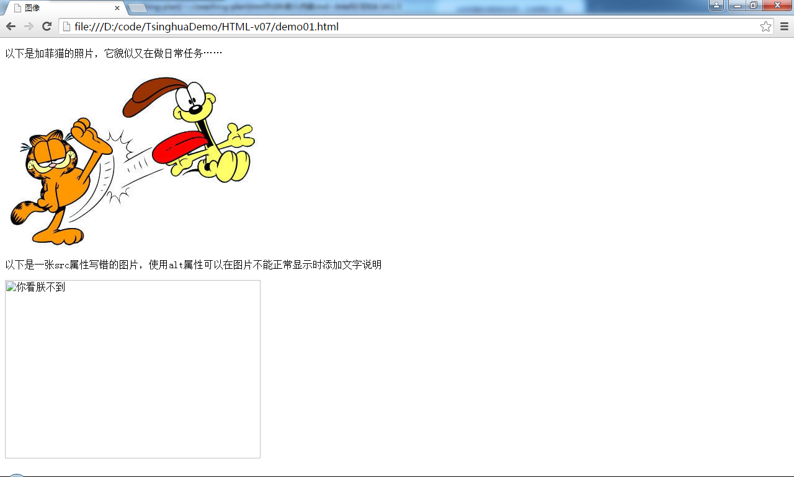
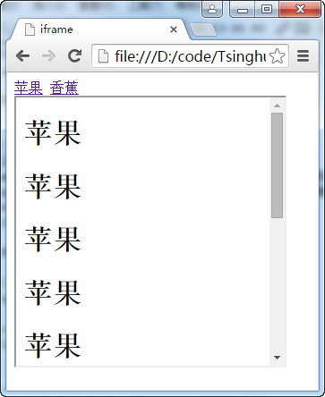

# 嵌入内容

# img元素
此元素用于在HTML文档中嵌入图像。src属性用于定义图片的URL地址，alt属性定义了图像无法显示时要显示的文字。

width和height属性用于指定img元素的宽和高。

图像是在HTML标签处理完毕后才加载的，所以如果省略width和height属性，浏览器就不知道图像要占多大的屏幕空间，必须依赖图像自身来确定尺寸，再重新定位屏幕上的内容来容纳它。所以指定这两个属性可以让浏览器在图像未加载时正确对网页进行布局。

>width和height属性告诉浏览器图像的尺寸，而应不该用于动态缩放图像大小。

**代码1 在HTML文档中加入图片**
```
<!DOCTYPE html>
<html>
<head>
    <meta charset="UTF-8">
    <title>图像</title>
</head>
<body>
    <p>以下是加菲猫的照片，它貌似又在做日常任务……</p>
    
    <p>以下是一张src属性写错的图片，使用alt属性可以在图片不能正常显示时添加文字说明</p>
    
</body>
</html>
```



为图像加超级链接。

# iframe元素
此元素允许在现有的html文档中嵌入另一文档。

- name属性：用于为iframe元素命名，可以与a、form、button、input、base的target属性结合使用
- src属性：用于指定iframe初始化时载入的文档
- width属性：用于指定iframe元素的宽度
- height属性：用于指定iframe元素的高度
- seamless属性：指示浏览器把iframe内容显示的像主文档整体的组成部分
- sandbox属性：对HTML文档进行限制

如果sandbox出现在iframe中，并没有任何取值，则以下元素被禁用：

- 脚本
- 表单
- 插件
- 指向iframe之外的链接

此属性的其它取值见下表：

|值|说明|
|---|---|
|""|应用以下所有的限制。|
|allow-same-origin|允许 iframe 内容被视为与包含文档有相同的来源。|
|allow-top-navigation|允许 iframe 内容从包含文档导航（加载）内容。|
|allow-forms	|允许表单提交。|
|allow-scripts|允许脚本执行。|

**代码2 iframe**
```
<!DOCTYPE html>
<html lang="en">
<head>
    <meta charset="UTF-8">
    <title>iframe</title>
</head>
<body>
    <nav>
        <a href="apple.html" target="if1">苹果</a>
        <a href="banana.html" target="if1">香蕉</a>
    </nav>
    <iframe name="if1" src="apple.html" width="300" height="300"></iframe>
</body>
</html>
```



